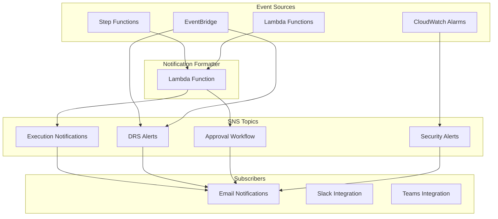

# SNS Notification System Implementation

## Overview

The AWS DRS Orchestration platform implements a comprehensive SNS-based notification system that provides real-time alerts and updates for disaster recovery operations. This system is designed based on patterns from AWS DRS tools, DR orchestration artifacts, and Cloud Migration Factory implementations.

## Architecture

### Notification Categories

1. **Execution Notifications** - Recovery plan execution status updates
2. **DRS Operational Alerts** - AWS DRS service-specific events and failures
3. **Approval Workflow** - Human approval requests for wave-based execution
4. **Security Alerts** - Security monitoring and compliance notifications (existing)

### Components



## Implementation Details

### 1. SNS Topics Configuration

#### Execution Notifications Topic
- **Purpose**: Notify stakeholders of recovery execution status changes
- **Events**: Started, Completed, Failed, Paused, Cancelled
- **Subscribers**: Admin email, optional notification email
- **Format**: Rich HTML email with execution details and console links

#### DRS Operational Alerts Topic
- **Purpose**: Alert on DRS service operational issues
- **Events**: Recovery launch failures, replication stalled, agent issues
- **Integration**: EventBridge rules for DRS service events
- **Format**: Structured alerts with troubleshooting guidance

#### Approval Workflow Topic
- **Purpose**: Request human approval for wave execution
- **Events**: Pre-wave approval requests with approve/reject links
- **Integration**: Step Functions waitForTaskToken pattern
- **Format**: Interactive email with approval buttons

### 2. EventBridge Integration

The system leverages EventBridge to capture native AWS DRS events:

```yaml
# DRS Recovery Failure Rule
EventPattern:
  source: ["aws.drs"]
  detail-type: ["DRS Source Server Launch Result"]
  detail:
    state: ["RECOVERY_LAUNCH_FAILED"]

# DRS Replication Stalled Rule  
EventPattern:
  source: ["aws.drs"]
  detail-type: ["DRS Source Server Data Replication Stalled Change"]
  detail:
    state: ["STALLED"]
```

### 3. Notification Formatter Lambda

The notification formatter Lambda function (`lambda/notification-formatter/index.py`) provides:

- **Message Formatting**: Converts technical events into user-friendly notifications
- **Template System**: Status-specific message templates with rich formatting
- **Console Integration**: Direct links to AWS console for troubleshooting
- **Multi-format Support**: Plain text and HTML email formats

#### Key Features:
- Status-specific emoji and color coding
- Detailed execution summaries with duration and wave information
- Error context with troubleshooting recommendations
- Direct links to AWS console resources
- Environment-aware messaging

### 4. Cross-Account Notification Support

For multi-account DRS deployments:

```yaml
# EventBridge Cross-Account Policy
EventBusPolicy:
  Principal: "*"
  Action: events:PutEvents
  Condition:
    StringEquals:
      aws:PrincipalOrgID: !Ref AwsOrganizationId
```

## Notification Types and Formats

### Execution Notifications

#### Started Notification
```
🚀 DRS Execution Started - Production Recovery Plan

Execution Details:
• Execution ID: exec-abc123def456
• Recovery Plan: Production Recovery Plan
• Status: STARTED
• Type: RECOVERY
• Total Waves: 3
• Started At: 2026-01-11 22:00:00 UTC
```

#### Completed Notification
```
✅ DRS Execution Completed - Production Recovery Plan

Completion Summary:
• Duration: 45 minutes
• Waves Completed: 3/3
• Completed At: 2026-01-11 22:45:00 UTC

All recovery waves have been successfully executed.
```

#### Failed Notification
```
❌ DRS Execution Failed - Production Recovery Plan

Failure Details:
• Failed Wave: Database Tier
• Error: Launch template validation failed
• Failed At: 2026-01-11 22:15:00 UTC

Please review the execution logs and take appropriate action.
```

### DRS Operational Alerts

#### Recovery Launch Failure
```
🚨 DRS Alert: Recovery Failure - s-1234567890abcdef0

Alert Details:
• Type: Recovery Failure
• Source Server: s-1234567890abcdef0
• Region: us-east-1

Recommended Actions:
1. Review DRS job logs in the AWS console
2. Verify launch template configuration
3. Check IAM permissions for DRS operations
```

#### Replication Stalled
```
🚨 DRS Alert: Replication Stalled - s-1234567890abcdef0

Alert Details:
• Type: Replication Stalled
• Source Server: s-1234567890abcdef0
• Region: us-east-1

Recommended Actions:
1. Check network connectivity between source and AWS
2. Verify DRS agent status on the source server
3. Review CloudWatch logs for replication errors
```

### Approval Workflow Notifications

```
⏳ Approval Required: Database Tier - Production Recovery Plan

Execution Details:
• Execution ID: exec-abc123def456
• Recovery Plan: Production Recovery Plan
• Wave: Database Tier
• Servers in this wave: 5

Actions Required:
✅ APPROVE: Continue with the execution
https://api.example.com/approve?token=abc123

❌ REJECT: Cancel the execution  
https://api.example.com/reject?token=abc123
```

## Configuration

### Environment Variables

The notification formatter Lambda requires these environment variables:

```bash
EXECUTION_NOTIFICATIONS_TOPIC_ARN=arn:aws:sns:us-east-1:123456789012:execution-notifications
DRS_ALERTS_TOPIC_ARN=arn:aws:sns:us-east-1:123456789012:drs-alerts
APPROVAL_WORKFLOW_TOPIC_ARN=arn:aws:sns:us-east-1:123456789012:approval-workflow
PROJECT_NAME=aws-elasticdrs-orchestrator
ENVIRONMENT=prod
```

### CloudFormation Parameters

```yaml
Parameters:
  AdminEmail:
    Type: String
    Description: 'Admin email for critical notifications'
  
  NotificationEmail:
    Type: String
    Default: ''
    Description: 'Optional: Additional email for execution notifications'
```

## Integration Points

### Step Functions Integration

```python
# Send execution notification from Step Functions
import boto3

def send_execution_notification(execution_data):
    lambda_client = boto3.client('lambda')
    
    payload = {
        'notificationType': 'execution',
        'executionData': {
            'executionId': execution_data['executionId'],
            'status': 'STARTED',
            'recoveryPlanName': execution_data['recoveryPlanName'],
            'waveCount': len(execution_data['waves']),
            'executionType': execution_data['executionType']
        }
    }
    
    lambda_client.invoke(
        FunctionName='notification-formatter',
        InvocationType='Event',
        Payload=json.dumps(payload)
    )
```

### API Handler Integration

```python
# Send approval notification from API handler
def send_approval_notification(execution_id, wave_name, approve_url, reject_url):
    payload = {
        'notificationType': 'approval',
        'approvalData': {
            'executionId': execution_id,
            'waveName': wave_name,
            'approveUrl': approve_url,
            'rejectUrl': reject_url,
            'recoveryPlanName': get_recovery_plan_name(execution_id)
        }
    }
    
    invoke_notification_formatter(payload)
```

## Monitoring and Troubleshooting

### CloudWatch Metrics

The notification system generates these CloudWatch metrics:

- `NotificationsSent` - Count of notifications sent by type
- `NotificationErrors` - Count of notification failures
- `NotificationLatency` - Time to process and send notifications

### Common Issues

1. **Missing SNS Permissions**
   - Ensure Lambda execution role has `sns:Publish` permissions
   - Verify SNS topic policies allow service principals

2. **EventBridge Rule Failures**
   - Check EventBridge rule patterns match DRS event structure
   - Verify cross-account permissions for multi-account setups

3. **Email Delivery Issues**
   - Confirm email addresses are verified in SNS
   - Check spam filters and email client settings

### Debugging

Enable debug logging in the notification formatter:

```python
import logging
logger = logging.getLogger()
logger.setLevel(logging.DEBUG)
```

View logs in CloudWatch:
```bash
aws logs tail /aws/lambda/notification-formatter --follow
```

## Security Considerations

### IAM Permissions

Minimum required permissions for notification formatter:

```json
{
  "Version": "2012-10-17",
  "Statement": [
    {
      "Effect": "Allow",
      "Action": [
        "sns:Publish"
      ],
      "Resource": [
        "arn:aws:sns:*:*:*-execution-notifications-*",
        "arn:aws:sns:*:*:*-drs-alerts-*",
        "arn:aws:sns:*:*:*-approval-workflow-*"
      ]
    }
  ]
}
```

### Data Privacy

- No sensitive data (passwords, keys) included in notifications
- Server IDs and execution IDs are considered non-sensitive identifiers
- Email addresses are encrypted in transit via SNS

### Access Control

- SNS topics use resource-based policies to restrict access
- EventBridge rules limited to specific AWS service principals
- Lambda functions use least-privilege IAM roles

## Future Enhancements

### Planned Features

1. **Slack Integration** - Direct Slack channel notifications
2. **Microsoft Teams Integration** - Teams webhook notifications  
3. **SMS Notifications** - Critical alert SMS via SNS
4. **Notification Preferences** - User-configurable notification settings
5. **Rich HTML Templates** - Enhanced email formatting with charts
6. **Notification History** - DynamoDB storage of notification history

### Integration Opportunities

1. **ServiceNow Integration** - Automatic incident creation
2. **PagerDuty Integration** - Critical alert escalation
3. **Webhook Support** - Generic webhook notifications for custom integrations
4. **Mobile Push Notifications** - Mobile app integration via SNS

## Cost Optimization

### SNS Pricing Considerations

- Email notifications: $2.00 per 100,000 notifications
- SMS notifications: $0.75 per message (US)
- EventBridge rules: $1.00 per million events

### Optimization Strategies

1. **Notification Filtering** - User preferences to reduce volume
2. **Batching** - Combine multiple events into single notifications
3. **Throttling** - Rate limiting for high-frequency events
4. **Conditional Notifications** - Only send for significant status changes

## Conclusion

The SNS notification system provides comprehensive, real-time visibility into DRS orchestration operations. By leveraging AWS-native services and following established patterns from AWS DRS tools, the system ensures reliable delivery of critical operational information while maintaining security and cost efficiency.

The modular design allows for easy extension with additional notification channels and integration with external systems, making it a robust foundation for enterprise disaster recovery operations.