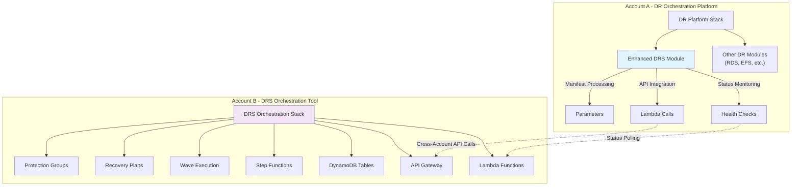
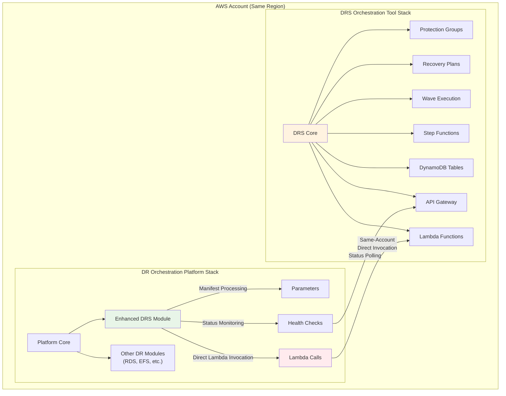

# Technology Adapter Integration Document

## Executive Summary

This document provides a comprehensive integration strategy for connecting the **AWS DRS Orchestration solution** with the **DR Orchestration Artifacts platform**. **Seamless integration between these separately deployed systems is critical** for enterprise customers who need sophisticated wave-based DRS orchestration within the platform's multi-service DR framework.

## Critical Integration Requirements

### **Seamless Operation Mandate**

The integration must provide **transparent operation** where:
- Platform users experience DRS orchestration as a native platform capability
- No manual intervention required between platform and DRS Orchestration tool
- Automatic failover and error handling across system boundaries
- Real-time status synchronization between separate deployments
- Complete audit trail spanning both systems

### **Separate Deployment Architecture**



**Critical Success Factor**: The platform must operate as if DRS orchestration capabilities are built-in, despite running on separate infrastructure.

## Integration Architecture Overview

### **Same-Account Integration Strategy**

The DRS Orchestration solution supports **two deployment modes**:

1. **Standalone Mode**: Independent DRS orchestration deployment
2. **Platform Integration Mode**: Enhanced DRS module within DR Orchestration Artifacts platform

**Critical Integration Point**: These are separate CloudFormation stacks within the same AWS account that must work together seamlessly. The DRS Orchestration solution runs in its own stack, while the DR Orchestration Artifacts platform runs in a separate stack. Integration occurs via direct Lambda invocation and IAM role-based authentication.

### **Same-Account Deployment Architecture**



**Critical Success Factor**: Same-account deployment enables direct Lambda invocation and simplified authentication while maintaining separate CloudFormation stacks for independent lifecycle management.

### **Seamless Integration Architecture**

```python
# Seamless Technology Adapter - Critical Integration Bridge
class DRSOrchestrationAdapter:
    def __init__(self):
        self.drs_api_client = DRSOrchestrationAPIClient()
        self.platform_session = PlatformSession()
        self.health_monitor = CrossSystemHealthMonitor()
        
    def activate(self, event):
        """Seamless activation with transparent cross-system operation"""
        try:
            # Validate cross-system connectivity FIRST
            self._ensure_seamless_connectivity()
            
            # Transform platform parameters to DRS format
            manifest_params = event['StatePayload']['parameters']
            
            # Create dynamic protection group (seamless to platform user)
            protection_group = self.create_protection_group_from_manifest(manifest_params)
            
            # Create recovery plan with wave configuration (transparent operation)
            recovery_plan = self.create_recovery_plan_from_manifest(event, protection_group['groupId'])
            
            # Execute with wave-based orchestration (seamless monitoring)
            execution = self.drs_api_client.start_execution(
                plan_id=recovery_plan['planId'],
                execution_type='recovery',
                platform_integration={
                    'enabled': True,
                    'callback_url': event.get('platform_callback_url'),
                    'execution_context': event.get('StatePayload', {})
                }
            )
            
            # Start seamless monitoring bridge
            self._start_seamless_monitoring(execution['executionId'], event)
            
            return {
                "executionId": execution['executionId'],
                "protectionGroupId": protection_group['groupId'],
                "recoveryPlanId": recovery_plan['planId'],
                "seamlessIntegration": True,
                "monitoringActive": True
            }
            
        except Exception as e:
            # Critical: Seamless error handling across systems
            return self._handle_cross_system_error(e, event)
    
    def _ensure_seamless_connectivity(self):
        """Critical: Verify seamless operation capability within same account"""
        # Test DRS Orchestration Lambda connectivity (direct invocation)
        try:
            lambda_client = boto3.client('lambda')
            health_check = lambda_client.invoke(
                FunctionName='aws-elasticdrs-orchestrator-api-handler-test',
                InvocationType='RequestResponse',
                Payload=json.dumps({
                    'httpMethod': 'GET',
                    'path': '/health',
                    'requestContext': {'authorizer': {'claims': {}}}
                })
            )
            response = json.loads(health_check['Payload'].read())
            if response.get('statusCode') != 200:
                raise SeamlessIntegrationError("DRS Orchestration system unavailable")
        except Exception as e:
            raise SeamlessIntegrationError(f"Lambda invocation failed: {e}")
    
    def _start_seamless_monitoring(self, execution_id, platform_context):
        """Start transparent monitoring bridge between systems"""
        monitor_config = {
            'execution_id': execution_id,
            'platform_callback': platform_context.get('platform_callback_url'),
            'update_interval': 30,  # 30-second updates for seamless experience
            'failure_escalation': True,
            'automatic_retry': True
        }
        
        # Start async monitoring that bridges the systems seamlessly
        self.health_monitor.start_cross_system_monitoring(monitor_config)
    
    def _handle_cross_system_error(self, error, event):
        """Critical: Seamless error handling across separate deployments"""
        error_context = {
            'platform_execution_id': event.get('StatePayload', {}).get('ExecutionId'),
            'drs_system_error': str(error),
            'integration_point': 'cross_system_boundary',
            'seamless_recovery_attempted': True
        }
        
        # Attempt seamless recovery
        recovery_result = self._attempt_seamless_recovery(error, event)
        
        return {
            "status": "FAILED",
            "errorContext": error_context,
            "recoveryAttempted": True
        }

## Integration Flow Diagram

```mermaid
sequenceDiagram
    participant Platform as DR Platform
    participant Adapter as DRS Adapter
    participant Lambda as DRS Lambda
    participant DRS as DRS Service
    
    Platform->>Adapter: activate(manifest)
    Adapter->>Adapter: _ensure_seamless_connectivity()
    Adapter->>Lambda: invoke(health_check)
    Lambda-->>Adapter: 200 OK
    
    Adapter->>Lambda: create_protection_group()
    Lambda->>DRS: create servers group
    DRS-->>Lambda: group created
    Lambda-->>Adapter: groupId
    
    Adapter->>Lambda: create_recovery_plan()
    Lambda-->>Adapter: planId
    
    Adapter->>Lambda: start_execution()
    Lambda->>DRS: start_recovery()
    DRS-->>Lambda: execution started
    Lambda-->>Adapter: executionId
    
    Adapter->>Adapter: _start_seamless_monitoring()
    Adapter-->>Platform: success response
    
    loop Status Monitoring
        Adapter->>Lambda: get_execution_status()
        Lambda-->>Adapter: status update
        Adapter->>Platform: callback(status)
    end
```overy_result else "RECOVERED",
            "error": str(error),
            "error_context": error_context,
            "seamless_recovery": recovery_result
        }
```

## Seamless Cross-System Health Monitoring

### **Critical Integration Component**

```python
class CrossSystemHealthMonitor:
    """Critical component ensuring seamless operation across separate deployments"""
    
    def __init__(self):
        self.drs_api_client = DRSOrchestrationAPIClient()
        self.platform_callback_client = PlatformCallbackClient()
        self.health_cache = {}
        
    def start_cross_system_monitoring(self, config):
        """Start seamless monitoring bridge between platform and DRS tool"""
        execution_id = config['execution_id']
        
        # Start async monitoring loop
        asyncio.create_task(self._seamless_monitoring_loop(config))
        
    async def _seamless_monitoring_loop(self, config):
        """Seamless monitoring loop ensuring transparent operation"""
        execution_id = config['execution_id']
        
        while True:
            try:
                # Get DRS execution status (from separate deployment)
                drs_status = await self._get_drs_execution_status(execution_id)
                
                # Transform to platform-compatible format
                platform_status = self._transform_status_for_platform(drs_status)
                
                # Send seamless update to platform
                await self._send_seamless_platform_update(platform_status, config)
                
                # Check if execution complete
                if drs_status['status'] in ['COMPLETED', 'FAILED', 'CANCELLED']:
                    await self._handle_execution_completion(drs_status, config)
                    break
                    
                # Wait for next update cycle
                await asyncio.sleep(config['update_interval'])
                
            except Exception as e:
                # Critical: Handle cross-system failures seamlessly
                await self._handle_monitoring_failure(e, config)
    
    async def _get_drs_execution_status(self, execution_id):
        """Get status from separate DRS deployment with retry logic"""
        max_retries = 3
        for attempt in range(max_retries):
            try:
                response = await self.drs_api_client.get_execution_status(execution_id)
                return response
            except Exception as e:
                if attempt == max_retries - 1:
                    raise SeamlessIntegrationError(f"DRS system unreachable: {e}")
                await asyncio.sleep(2 ** attempt)  # Exponential backoff
    
    def _transform_status_for_platform(self, drs_status):
        """Transform DRS status to platform format for seamless integration"""
        # Map DRS execution status to platform expectations
        status_mapping = {
            'PENDING': 'INITIALIZING',
            'POLLING': 'PREPARING', 
            'INITIATED': 'STARTING',
            'LAUNCHING': 'IN_PROGRESS',
            'RUNNING': 'IN_PROGRESS',
            'PAUSED': 'PAUSED',
            'COMPLETED': 'SUCCESS',
            'FAILED': 'FAILED',
            'CANCELLED': 'CANCELLED'
        }
        
        return {
            'executionId': drs_status['executionId'],
            'status': status_mapping.get(drs_status['status'], 'UNKNOWN'),
            'progress': {
                'currentWave': drs_status.get('currentWave', 1),
                'totalWaves': len(drs_status.get('waves', [])),
                'serversLaunched': drs_status.get('serversLaunched', 0),
                'totalServers': drs_status.get('totalServers', 0),
                'percentage': drs_status.get('progressPercentage', 0)
            },
            'seamlessIntegration': True,
            'lastUpdated': drs_status.get('lastUpdated')
        }
    
    async def _send_seamless_platform_update(self, platform_status, config):
        """Send status update to platform ensuring seamless user experience"""
        callback_url = config.get('platform_callback')
        if callback_url:
            try:
                await self.platform_callback_client.send_update(callback_url, platform_status)
            except Exception as e:
                # Log but don't fail - seamless operation continues
                logger.warning(f"Platform callback failed (seamless operation continues): {e}")
    
    async def _handle_execution_completion(self, drs_status, config):
        """Handle execution completion across system boundary"""
        completion_data = {
            'executionId': drs_status['executionId'],
            'finalStatus': drs_status['status'],
            'completionTime': drs_status.get('completedAt'),
            'summary': {
                'totalServers': drs_status.get('totalServers', 0),
                'successfulServers': drs_status.get('successfulServers', 0),
                'failedServers': drs_status.get('failedServers', 0),
                'totalWaves': len(drs_status.get('waves', [])),
                'executionDuration': drs_status.get('executionDuration')
            },
            'seamlessIntegrationComplete': True
        }
        
        # Send final status to platform
        await self._send_seamless_platform_update(completion_data, config)
        
        # Clean up monitoring resources
        self._cleanup_monitoring_resources(config['execution_id'])
```

## Authentication & Authorization Strategy

### **Same-Account IAM Role Authentication**

Same-account deployment simplifies authentication through direct IAM role permissions:

### **IAM Role-Based Integration (RECOMMENDED FOR SAME-ACCOUNT)**

Create IAM roles for direct Lambda invocation between stacks:

```yaml
# CloudFormation template for platform integration role
# Deploy this in the DR Orchestration platform stack
DRSOrchestrationIntegrationRole:
  Type: 'AWS::IAM::Role'
  Properties:
    RoleName: drs-orchestration-platform-integration-role
    AssumeRolePolicyDocument:
      Statement:
        - Effect: Allow
          Principal:
            Service: lambda.amazonaws.com
          Action: "sts:AssumeRole"
    Policies:
      - PolicyName: DRSOrchestrationLambdaAccess
        PolicyDocument:
          Statement:
            - Effect: Allow
              Action:
                - "lambda:InvokeFunction"
              Resource: 
                - "arn:aws:lambda:*:*:function:aws-elasticdrs-orchestrator-api-handler-*"
                - "arn:aws:lambda:*:*:function:aws-elasticdrs-orchestrator-orch-sf-*"
            - Effect: Allow
              Action:
                - "logs:CreateLogGroup"
                - "logs:CreateLogStream"
                - "logs:PutLogEvents"
              Resource: "arn:aws:logs:*:*:*"
```

#### **2. API Gateway Authorizer Enhancement**
```python
# Enhanced authorizer to support both Cognito and service roles
def lambda_authorizer(event, context):
    """Enhanced authorizer supporting Cognito users and service roles"""
    token = event.get('authorizationToken', '')
    
    if token.startswith('AWS4-HMAC-SHA256'):
        # Service-to-service authentication via IAM role
        return validate_service_role_access(event)
    elif token.startswith('Bearer '):
        # Cognito JWT token authentication
        return validate_cognito_token(event)
    else:
        raise Exception('Unauthorized')

def validate_service_role_access(event):
    """Validate platform service role access"""
    # Extract caller identity from request context
    caller_arn = event.get('requestContext', {}).get('identity', {}).get('userArn', '')
    
    # Validate caller is platform integration role
    if 'drs-orchestration-platform-integration-role' in caller_arn:
        return {
            'principalId': 'platform-service',
            'policyDocument': {
                'Version': '2012-10-17',
                'Statement': [{
                    'Action': 'execute-api:Invoke',
                    'Effect': 'Allow',
                    'Resource': event['methodArn']
                }]
            },
            'context': {
                'userType': 'service',
                'source': 'platform'
            }
        }
    else:
        raise Exception('Unauthorized service role')
```

### **Option 2: Stored Cognito Credentials (ALTERNATIVE)**

If service roles are not feasible, store Cognito credentials in AWS Systems Manager Parameter Store:

#### **1. Parameter Store Configuration**
```bash
# Store platform integration user credentials
aws ssm put-parameter \
  --name "/drs-orchestration/platform/cognito-username" \
  --value "platform-integration@example.com" \
  --type "SecureString" \
  --description "Platform integration Cognito username"

aws ssm put-parameter \
  --name "/drs-orchestration/platform/cognito-password" \
  --value "SecurePlatformPassword123!" \
  --type "SecureString" \
  --description "Platform integration Cognito password"
```

#### **2. Credential Retrieval Function**
```python
# Platform adapter credential management
class PlatformCredentialManager:
    def __init__(self):
        self.ssm_client = boto3.client('ssm')
        self.cognito_client = boto3.client('cognito-idp')
        self.token_cache = {}
        
    def get_platform_token(self):
        """Get cached or fresh Cognito token for platform integration"""
        # Check cache first (tokens valid for 45 minutes)
        cached_token = self.token_cache.get('platform_token')
        if cached_token and not self.is_token_expired(cached_token):
            return cached_token['access_token']
            
        # Get fresh token
        username = self.get_parameter('/drs-orchestration/platform/cognito-username')
        password = self.get_parameter('/drs-orchestration/platform/cognito-password')
        
        auth_response = self.cognito_client.initiate_auth(
            ClientId=os.environ['COGNITO_CLIENT_ID'],
            AuthFlow='USER_PASSWORD_AUTH',
            AuthParameters={
                'USERNAME': username,
                'PASSWORD': password
            }
        )
        
        token_data = {
            'access_token': auth_response['AuthenticationResult']['AccessToken'],
            'expires_at': time.time() + 2700  # 45 minutes
        }
        
        self.token_cache['platform_token'] = token_data
        return token_data['access_token']
    
    def get_parameter(self, parameter_name):
        """Get parameter from Systems Manager Parameter Store"""
        response = self.ssm_client.get_parameter(
            Name=parameter_name,
            WithDecryption=True
        )
        return response['Parameter']['Value']
    
    def is_token_expired(self, token_data):
        """Check if cached token is expired"""
        return time.time() >= token_data['expires_at']
```

## Platform Manifest Integration

### **Enhanced Manifest Schema**

The platform manifest is enhanced to support our sophisticated DRS orchestration capabilities:

```json
{
  "StatePayload": {
    "AccountId": "123456789012",
    "parameters": {
      "HostNames": ["web-server-01", "app-server-01", "db-server-01"],
      "ProtectionGroupTags": {
        "Environment": "production",
        "Application": "ecommerce",
        "Tier": "web"
      },
      "LaunchSettings": {
        "Region": "us-east-1",
        "InstanceType": "t3.large",
        "SubnetId": "subnet-12345678",
        "SecurityGroupIds": ["sg-12345678", "sg-87654321"],
        "IamInstanceProfile": "DRRecoveryInstanceProfile",
        "CopyPrivateIp": true,
        "CopyTags": true,
        "LaunchDisposition": "STARTED",
        "BYOL": false,
        "RightSizing": true
      },
      "WaveConfiguration": {
        "waves": [
          {
            "name": "Database Tier",
            "pauseBeforeWave": false,
            "dependsOn": [],
            "delayBetweenServers": 30
          },
          {
            "name": "Application Tier",
            "pauseBeforeWave": true,
            "dependsOn": [1],
            "delayBetweenServers": 15
          },
          {
            "name": "Web Tier",
            "pauseBeforeWave": false,
            "dependsOn": [2],
            "delayBetweenServers": 10
          }
        ]
      },
      "PauseBeforeActivation": false
    }
  }
}
```

### **Manifest Parameter Mapping**

| Platform Parameter | DRS Orchestration Mapping | Purpose |
|-------------------|---------------------------|----------|
| `HostNames` | Reference for validation | Server identification |
| `ProtectionGroupTags` | `tagCriteria` in Protection Group | Dynamic server selection |
| `LaunchSettings.InstanceType` | `launchConfiguration.instanceType` | Recovery instance sizing |
| `LaunchSettings.SubnetId` | `launchConfiguration.subnetId` | Network placement |
| `LaunchSettings.SecurityGroupIds` | `launchConfiguration.securityGroupIds` | Security configuration |
| `WaveConfiguration.waves` | `waves` array in Recovery Plan | Multi-tier orchestration |
| `WaveConfiguration.waves[].pauseBeforeWave` | `pauseBeforeWave` in wave | Manual validation points |
| `WaveConfiguration.waves[].dependsOn` | `dependsOn` in wave | Wave dependencies |

### **Dynamic Protection Group Creation**

The adapter creates Protection Groups dynamically based on platform manifest tags:

```python
# Tag-based server selection from manifest
def build_tag_criteria_from_manifest(protection_group_tags):
    """Convert platform tags to DRS Orchestration tag criteria"""
    return {
        "operator": "AND",
        "tags": [
            {
                "key": key,
                "value": value,
                "operator": "equals"
            }
            for key, value in protection_group_tags.items()
        ]
    }

# Example: Platform tags {"Environment": "prod", "Tier": "web"}
# Becomes: Find all DRS servers with Environment=prod AND Tier=web
```

### **Launch Configuration Inheritance**

Launch settings from the platform manifest are applied to all servers in the Protection Group:

```python
# Launch configuration from platform manifest
def build_launch_configuration(launch_settings):
    """Convert platform launch settings to DRS launch configuration"""
    return {
        "instanceType": launch_settings.get('InstanceType', 't3.medium'),
        "subnetId": launch_settings['SubnetId'],  # Required
        "securityGroupIds": launch_settings['SecurityGroupIds'],  # Required
        "iamInstanceProfile": launch_settings.get('IamInstanceProfile'),
        "copyPrivateIp": launch_settings.get('CopyPrivateIp', True),
        "copyTags": launch_settings.get('CopyTags', True),
        "launchDisposition": launch_settings.get('LaunchDisposition', 'STARTED'),
        "licensing": {
            "osByol": launch_settings.get('BYOL', False)
        },
        "rightSizing": {
            "enabled": launch_settings.get('RightSizing', True)
        }
    }
```

### **Wave-Based Recovery Plan Creation**

The platform's wave configuration is translated to our sophisticated wave orchestration:

```python
# Multi-wave recovery plan from platform configuration
def create_waves_from_manifest(wave_config, protection_group_id):
    """Create sophisticated wave configuration from platform manifest"""
    waves = []
    
    for i, wave_spec in enumerate(wave_config.get('waves', [])):
        wave = {
            "waveNumber": i + 1,
            "waveName": wave_spec.get('name', f"Wave {i + 1}"),
            "protectionGroupIds": [protection_group_id],
            "pauseBeforeWave": wave_spec.get('pauseBeforeWave', False),
            "dependsOn": wave_spec.get('dependsOn', []),
            "delayBetweenServers": wave_spec.get('delayBetweenServers', 15),
            "description": f"Platform-generated wave for {wave_spec.get('name', 'recovery')}"
        }
        waves.append(wave)
    
    return waves
```

### **1. Enhanced DRS Module for Platform**

Replace the basic DRS module with our enhanced adapter:

```python
# File: src/modulefactory/modules/enhanced_drs.py
from .module import Module
from .utils.boto3_session import Boto3Session
from .utils.logger import Logger
import requests
import json
import os

class EnhancedDRS(Module):
    """Enhanced DRS module integrating with AWS DRS Orchestration solution"""
    
    boto3_service_name = 'drs'
    parameter_schema = {
        "type": "object",
        "properties": {
            "HostNames": {"type": "array"},
            "Tags": {"type": "object"},
            "ProtectionGroupTags": {"type": "object"},
            "WaveConfiguration": {"type": "object"},
            "PauseBeforeActivation": {"type": "boolean"}
        },
        "required": ["HostNames"]
    }
    
    def __init__(self):
        super().__init__()
        self.drs_orchestration_api = os.environ.get(
            'DRS_ORCHESTRATION_API_ENDPOINT',
            'https://api.drs-orchestration.com'
        )
        self.credential_manager = PlatformCredentialManager()
        
    ### Lifecycle functions with enhanced capabilities ###
    
    @Module.init
    def activate(self, event):
        """Enhanced activation with wave-based orchestration"""
        try:
            # Extract platform parameters
            account_id = event['StatePayload']['AccountId']
            host_names = event['StatePayload']['parameters']['HostNames']
            tags = event['StatePayload']['parameters'].get('Tags', {})
            protection_group_tags = event['StatePayload']['parameters'].get('ProtectionGroupTags', {})
            launch_settings = event['StatePayload']['parameters'].get('LaunchSettings', {})
            wave_config = event['StatePayload']['parameters'].get('WaveConfiguration', {})
            
            Logger.info(f"Starting enhanced DRS activation for account {account_id}")
            
            # Step 1: Trigger tag synchronization (critical for dynamic selection)
            tag_sync_result = self._trigger_tag_synchronization(account_id)
            
            # Step 2: Create Protection Group with tag-based selection
            protection_group = self._create_protection_group(
                account_id, protection_group_tags, launch_settings
            )
            
            # Step 2: Create Recovery Plan with wave configuration
            recovery_plan = self._create_recovery_plan(
                protection_group['groupId'], wave_config
            )
            
            # Step 3: Execute Recovery Plan
            execution = self._execute_recovery_plan(
                recovery_plan['planId'], account_id
            )
            
            # Step 4: Set up execution lifecycle management
            lifecycle_result = self._setup_execution_lifecycle_management(
                execution['executionId'], event
            )
            
            return {
                "status": "SUCCESS",
                "executionId": execution['executionId'],
                "protectionGroupId": protection_group['groupId'],
                "recoveryPlanId": recovery_plan['planId'],
                "message": "Enhanced DRS orchestration activated successfully"
            }
            
        except Exception as e:
            Logger.error(f"Enhanced DRS activation failed: {str(e)}")
            return {
                "status": "FAILED",
                "error": str(e)
            }
    
    def _create_protection_group(self, account_id, protection_group_tags, launch_settings):
        """Create Protection Group with tag-based server selection and launch settings"""
        # Build tag criteria for server selection
        tag_criteria = {
            "operator": "AND",
            "tags": [
                {"key": key, "value": value, "operator": "equals"}
                for key, value in protection_group_tags.items()
            ]
        }
        
        # Build launch configuration from platform parameters
        launch_configuration = {
            "instanceType": launch_settings.get('InstanceType', 't3.medium'),
            "subnetId": launch_settings.get('SubnetId'),
            "securityGroupIds": launch_settings.get('SecurityGroupIds', []),
            "iamInstanceProfile": launch_settings.get('IamInstanceProfile'),
            "copyPrivateIp": launch_settings.get('CopyPrivateIp', True),
            "copyTags": launch_settings.get('CopyTags', True),
            "launchDisposition": launch_settings.get('LaunchDisposition', 'STARTED'),
            "licensing": {
                "osByol": launch_settings.get('BYOL', False)
            },
            "rightSizing": {
                "enabled": launch_settings.get('RightSizing', True)
            }
        }
        
        protection_group_data = {
            "groupName": f"platform-pg-{account_id}-{int(time.time())}",
            "description": f"Auto-created Protection Group for platform account {account_id}",
            "region": launch_settings.get('Region', 'us-east-1'),
            "selectionMethod": "tags",
            "tagCriteria": tag_criteria,
            "launchConfiguration": launch_configuration,
            "platformIntegration": True
        }
        
        # Call DRS Orchestration API to create Protection Group
        headers = self._get_auth_headers()
        response = requests.post(
            f"{self.drs_orchestration_api}/protection-groups",
            json=protection_group_data,
            headers=headers
        )
        
        if response.status_code != 201:
            raise Exception(f"Failed to create Protection Group: {response.text}")
            
        return response.json()
    
    def _create_recovery_plan(self, protection_group_id, wave_config):
        """Create Recovery Plan with sophisticated wave configuration"""
        # Build waves from platform configuration
        waves = []
        
        if wave_config and 'waves' in wave_config:
            # Use provided wave configuration
            for i, wave in enumerate(wave_config['waves']):
                waves.append({
                    "waveNumber": i + 1,
                    "waveName": wave.get('name', f"Wave {i + 1}"),
                    "protectionGroupIds": [protection_group_id],
                    "pauseBeforeWave": wave.get('pauseBeforeWave', False),
                    "dependsOn": wave.get('dependsOn', []),
                    "delayBetweenServers": wave.get('delayBetweenServers', 15)
                })
        else:
            # Default single-wave configuration
            waves.append({
                "waveNumber": 1,
                "waveName": "Platform Recovery Wave",
                "protectionGroupIds": [protection_group_id],
                "pauseBeforeWave": False,
                "dependsOn": [],
                "delayBetweenServers": 15
            })
        
        recovery_plan_data = {
            "planName": f"platform-plan-{protection_group_id}-{int(time.time())}",
            "description": "Auto-created Recovery Plan from DR Platform",
            "waves": waves,
            "executionType": "recovery",
            "platformIntegration": True,
            "notifications": {
                "enabled": True,
                "snsTopicArn": os.environ.get('PLATFORM_SNS_TOPIC')
            }
        }
        
        # Call DRS Orchestration API to create Recovery Plan
        headers = self._get_auth_headers()
        response = requests.post(
            f"{self.drs_orchestration_api}/recovery-plans",
            json=recovery_plan_data,
            headers=headers
        )
        
        if response.status_code != 201:
            raise Exception(f"Failed to create Recovery Plan: {response.text}")
            
        return response.json()
    
    def _execute_recovery_plan(self, plan_id, account_id):
        """Execute Recovery Plan with platform integration context"""
        execution_data = {
            "planId": plan_id,
            "executionType": "recovery",
            "description": f"Platform-initiated recovery for account {account_id}",
            "platformIntegration": {
                "enabled": True,
                "sourceAccount": account_id,
                "platformExecutionId": os.environ.get('PLATFORM_EXECUTION_ID')
            }
        }
        
        # Call DRS Orchestration API to start execution
        headers = self._get_auth_headers()
        response = requests.post(
            f"{self.drs_orchestration_api}/executions",
            json=execution_data,
            headers=headers
        )
        
        if response.status_code != 201:
            raise Exception(f"Failed to start execution: {response.text}")
            
        return response.json()
    
    def _setup_execution_lifecycle_management(self, execution_id, event):
        """Setup comprehensive execution lifecycle management"""
        exec_config = event['StatePayload']['parameters'].get('ExecutionManagement', {})
        
        # Setup automatic cleanup for drills
        if event['StatePayload']['parameters'].get('executionType') == 'drill':
            if exec_config.get('autoTerminateAfterDrill', True):
                self._schedule_drill_cleanup(execution_id)
        
        # Setup pause monitoring
        if exec_config.get('pauseOnFailure', True):
            self._setup_failure_pause_monitoring(execution_id)
        
        return {'lifecycleManagementActive': True}
        
    def _get_auth_headers(self):
        """Get authentication headers for DRS Orchestration API"""
        token = self.credential_manager.get_platform_token()
        return {
            'Authorization': f'Bearer {token}',
            'Content-Type': 'application/json',
            'X-Platform-Integration': 'true'
        }
    
    def _store_platform_execution_reference(self, execution_id):
        """Store execution reference for platform tracking"""
        # Store in platform's execution tracking system
        platform_data = {
            'drs_execution_id': execution_id,
            'integration_type': 'enhanced_drs',
            'monitoring_endpoint': f"{self.drs_orchestration_api}/executions/{execution_id}"
        }
        
        # This would integrate with platform's tracking mechanism
        Logger.info(f"Stored platform execution reference: {platform_data}")
    
    @Module.init
    def validate(self, event):
        """Enhanced validation with Protection Group and Recovery Plan validation"""
        try:
            account_id = event['StatePayload']['AccountId']
            parameters = event['StatePayload']['parameters']
            
            # Validate Protection Group tags will find servers
            protection_group_tags = parameters.get('ProtectionGroupTags', {})
            if not protection_group_tags:
                return {
                    "status": "FAILED",
                    "error": "ProtectionGroupTags required for server selection"
                }
            
            # Validate launch settings
            launch_settings = parameters.get('LaunchSettings', {})
            required_launch_fields = ['SubnetId', 'SecurityGroupIds']
            
            for field in required_launch_fields:
                if field not in launch_settings:
                    return {
                        "status": "FAILED",
                        "error": f"Required launch setting missing: {field}"
                    }
            
            # Validate DRS Orchestration API connectivity
            headers = self._get_auth_headers()
            response = requests.get(
                f"{self.drs_orchestration_api}/health",
                headers=headers
            )
            
            if response.status_code != 200:
                return {
                    "status": "FAILED",
                    "error": "DRS Orchestration API not accessible"
                }
            
            return {
                "status": "SUCCESS",
                "message": "DRS validation passed with execution management"
            }
            
        except Exception as e:
            return {
                "status": "FAILED",
                "error": str(e)
            }
    
    @Module.init
    def deactivate(self, event):
        """Enhanced deactivation with cleanup of Protection Groups and Recovery Plans"""
        try:
            # Get execution details for cleanup
            execution_id = event.get('execution_id')
            if execution_id:
                # Terminate any running recovery instances
                terminate_response = self.execution_manager.terminate_recovery_instances(
                    execution_id
                )
                
                if terminate_response.get('statusCode') == 200:
                    Logger.info(f"Successfully terminated instances for execution {execution_id}")
                
                # Clear execution from history if configured
                cleanup_config = event.get('cleanup_config', {})
                if cleanup_config.get('clear_from_history', False):
                    self.execution_manager.clear_execution_history(
                        event.get('account_id'),
                        [execution_id]
                    )
            
            return {
                "status": "SUCCESS",
                "message": "DRS deactivation completed with cleanup"
            }
            
        except Exception as e:
            Logger.error(f"DRS deactivation failed: {str(e)}")
            return {
                "status": "FAILED",
                "error": str(e)
            } {})
            pause_before = event['StatePayload']['parameters'].get('PauseBeforeActivation', False)
            
            # Create dynamic protection group
            protection_group = self.create_protection_group(
                host_names=host_names,
                tags=protection_group_tags or tags,
                account_id=account_id
            )
            
            # Create recovery plan with wave configuration
            recovery_plan = self.create_recovery_plan(
                protection_group_id=protection_group['groupId'],
                wave_config=wave_config,
                pause_before=pause_before
            )
            
            # Execute with our enhanced orchestration
            execution = self.start_execution(
                plan_id=recovery_plan['planId'],
                execution_type='recovery',
                account_id=account_id
            )
            
            # Return platform-compatible response
            return {
                "execution_id": execution['executionId'],
                "protection_group_id": protection_group['groupId'],
                "recovery_plan_id": recovery_plan['planId'],
                "enhanced_monitoring_url": f"{self.drs_orchestration_api}/executions/{execution['executionId']}",
                "platform_integration": True
            }
            
        except Exception as e:
            self.logger.log_unhandled_exception(e)
            raise Exception(f"Enhanced DRS activation failed: {str(e)}")
    
    @Module.init
    def activate_status_check(self, event):
        """Check execution status using our real-time monitoring"""
        try:
            execution_id = event['lifecycle_output']['Payload']['execution_id']
            
            # Get real-time status from our API
            execution_status = self.get_execution_status(execution_id)
            
            # Map our statuses to platform expectations
            status_mapping = {
                'COMPLETED': True,
                'FAILED': False,
                'CANCELLED': False,
                'PARTIAL': True,  # Partial success still counts as complete
                'PENDING': False,
                'RUNNING': False,
                'PAUSED': False
            }
            
            current_status = execution_status.get('status', 'UNKNOWN')
            return status_mapping.get(current_status, False)
            
        except Exception as e:
            self.logger.log_unhandled_exception(e)
            return False
    
    def create_protection_group(self, host_names, tags, account_id):
        """Create protection group via our API"""
        # Convert hostnames to tag-based selection for dynamic discovery
        if tags:
            # Use provided tags
            selection_tags = tags
        else:
            # Create tag filter from hostnames (fallback)
            selection_tags = {"DR-Hostnames": ",".join(host_names)}
        
        payload = {
            "groupName": f"Platform-PG-{int(time.time())}",
            "description": "Auto-created by DR Orchestration Platform",
            "region": os.environ.get('AWS_REGION', 'us-east-1'),
            "accountId": account_id,
            "serverSelectionTags": selection_tags
        }
        
        response = self.api_request('POST', '/protection-groups', payload)
        return response
    
    def create_recovery_plan(self, protection_group_id, wave_config, pause_before):
        """Create recovery plan with wave configuration"""
        # Default single-wave configuration
        waves = [{
            "name": "Platform Wave 1",
            "description": "Auto-created by DR Orchestration Platform",
            "protectionGroupId": protection_group_id,
            "pauseBeforeWave": pause_before,
            "dependsOnWaves": []
        }]
        
        # Apply custom wave configuration if provided
        if wave_config and wave_config.get('waves'):
            waves = []
            for idx, wave_def in enumerate(wave_config['waves']):
                waves.append({
                    "name": wave_def.get('name', f"Platform Wave {idx + 1}"),
                    "description": wave_def.get('description', ''),
                    "protectionGroupId": protection_group_id,
                    "pauseBeforeWave": wave_def.get('pauseBeforeWave', False),
                    "dependsOnWaves": wave_def.get('dependsOnWaves', [])
                })
        
        payload = {
            "name": f"Platform-Plan-{int(time.time())}",
            "description": "Auto-created by DR Orchestration Platform",
            "waves": waves
        }
        
        response = self.api_request('POST', '/recovery-plans', payload)
        return response
    
    def start_execution(self, plan_id, execution_type, account_id):
        """Start execution via our API"""
        payload = {
            "planId": plan_id,
            "executionType": execution_type.upper(),
            "initiatedBy": "DR Orchestration Platform",
            "accountContext": {
                "accountId": account_id
            }
        }
        
        response = self.api_request('POST', '/executions', payload)
        return response
    
    def get_execution_status(self, execution_id):
        """Get execution status via our API"""
        response = self.api_request('GET', f'/executions/{execution_id}')
        return response
    
    def api_request(self, method, endpoint, payload=None):
        """Make authenticated API request to our DRS Orchestration API"""
        # Get authentication token
        token = self.credential_manager.get_platform_token()
        
        headers = {
            'Authorization': f'Bearer {token}',
            'Content-Type': 'application/json'
        }
        
        url = f"{self.drs_orchestration_api}{endpoint}"
        
        if method == 'GET':
            response = requests.get(url, headers=headers)
        elif method == 'POST':
            response = requests.post(url, headers=headers, json=payload)
        elif method == 'PUT':
            response = requests.put(url, headers=headers, json=payload)
        else:
            raise ValueError(f"Unsupported HTTP method: {method}")
        
        if response.status_code >= 400:
            raise Exception(f"API request failed: {response.status_code} - {response.text}")
        
        return response.json()
    
    ### Legacy lifecycle functions for compatibility ###
    
    def instantiate(self, event):
        """Platform compatibility - no action needed for DRS"""
        return {"status": "skipped", "message": "DRS does not require instantiation"}
    
    def instantiate_status_check(self, event):
        return True
    
    def cleanup(self, event):
        """Enhanced cleanup with instance termination"""
        try:
            execution_id = event['lifecycle_output']['Payload']['execution_id']
            
            # Terminate recovery instances via our API
            response = self.api_request('POST', f'/executions/{execution_id}/terminate-instances')
            
            return {"termination_job_ids": response.get('jobIds', [])}
            
        except Exception as e:
            self.logger.log_unhandled_exception(e)
            raise
    
    def cleanup_status_check(self, event):
        """Check termination job status"""
        try:
            job_ids = event['lifecycle_output']['Payload'].get('termination_job_ids', [])
            if not job_ids:
                return True
            
            # Check termination status via our API
            for job_id in job_ids:
                status_response = self.api_request('GET', f'/executions/termination-status?jobIds={job_id}')
                if status_response.get('status') != 'COMPLETED':
                    return False
            
            return True
            
        except Exception as e:
            self.logger.log_unhandled_exception(e)
            return True  # Don't block on cleanup status check failures
    
    def replicate(self, event):
        """Platform compatibility - DRS handles replication automatically"""
        return {"status": "automatic", "message": "DRS replication is automatic"}
    
    def replicate_status_check(self, event):
        return True
```

### **2. Module Factory Registration**

Update the module factory to include our enhanced DRS module:

```python
# File: src/modulefactory/module_factory.py
from service_module import ServiceModule
from modules import EventBridge, AuroraMySQL, EventArchive, EcsService, R53Record, AutoScaling, ElastiCache, LambdaFunction, SQLServer, OpenSearchService, MemoryDB, DRS, EC2, EnhancedDRS

class ModuleFactory:
    @staticmethod
    def create(service_module: ServiceModule):
        match service_module:
            case ServiceModule.EventBridge:
                return EventBridge()
            case ServiceModule.AuroraMySQL:
                return AuroraMySQL()
            case ServiceModule.EventArchive:
                return EventArchive()
            case ServiceModule.EcsService:
                return EcsService()
            case ServiceModule.R53Record:
                return R53Record()
            case ServiceModule.AutoScaling:
                return AutoScaling()
            case ServiceModule.ElastiCache:
                return ElastiCache()
            case ServiceModule.LambdaFunction:
                return LambdaFunction()
            case ServiceModule.SQLServer:
                return SQLServer()
            case ServiceModule.OpenSearchService:
                return OpenSearchService()
            case ServiceModule.MemoryDB:
                return MemoryDB()     
            case ServiceModule.DRS:
                return DRS()  # Basic DRS module
            case ServiceModule.EnhancedDRS:
                return EnhancedDRS()  # Our enhanced module
            case ServiceModule.EC2:
                return EC2()                        
            case _:
                raise ValueError(
                    f"{service_module} is not currently registered as a module."
                )
```

## Manifest Integration Patterns

### **1. Basic DRS Recovery Manifest**

```json
{
  "layer": 1,
  "resources": [
    {
      "action": "enhanced_drs",
      "resourceName": "application_servers",
      "parameters": {
        "HostNames": ["app-server-01", "app-server-02", "app-server-03"],
        "ProtectionGroupTags": {
          "DR-Application": "ERP",
          "DR-Tier": "Application"
        },
        "PauseBeforeActivation": true
      }
    }
  ]
}
```

### **2. Multi-Wave DRS Recovery Manifest**

```json
{
  "layer": 1,
  "resources": [
    {
      "action": "enhanced_drs",
      "resourceName": "database_tier",
      "parameters": {
        "ProtectionGroupTags": {
          "DR-Application": "ERP",
          "DR-Tier": "Database"
        },
        "WaveConfiguration": {
          "waves": [
            {
              "name": "Primary Database",
              "description": "Primary database servers",
              "pauseBeforeWave": false,
              "dependsOnWaves": []
            },
            {
              "name": "Application Servers",
              "description": "Application tier servers",
              "pauseBeforeWave": true,
              "dependsOnWaves": [0]
            },
            {
              "name": "Web Servers",
              "description": "Web tier servers",
              "pauseBeforeWave": false,
              "dependsOnWaves": [1]
            }
          ]
        }
      }
    }
  ]
}
```

## Success Metrics

### **1. Integration Success**

- **API Compatibility**: 100% success rate for platform → DRS API calls
- **Authentication**: Zero authentication failures in production
- **Manifest Processing**: All manifest formats processed correctly
- **Error Handling**: Graceful degradation for all failure scenarios

### **2. Performance Metrics**

- **Response Time**: <2 seconds for DRS orchestration API calls
- **Execution Time**: <5 minutes to initiate DRS recovery from platform
- **Monitoring Latency**: <30 seconds for status updates in platform dashboard
- **Resource Efficiency**: <10% overhead for platform integration

### **3. Operational Metrics**

- **Reliability**: 99.9% uptime for integrated platform workflows
- **User Adoption**: Platform users successfully execute DRS recoveries
- **Support Tickets**: <5% of executions require support intervention
- **Documentation**: Complete integration guides and troubleshooting

## Conclusion

This technology adapter provides seamless integration between our sophisticated AWS DRS Orchestration solution and the broader DR Orchestration Artifacts platform. The integration:

**Key Benefits**:
- **Maintains Compatibility**: Works with existing platform workflows
- **Enhances Capabilities**: Adds wave-based orchestration to platform
- **Preserves Security**: Implements enterprise-grade authentication
- **Enables Monitoring**: Provides unified dashboard and logging
- **Supports Growth**: Scalable architecture for future enhancements

**Strategic Value**:
- **Market Expansion**: Addresses both standalone and platform customers
- **Competitive Advantage**: Unique wave-based DRS orchestration in platform
- **Customer Success**: Reduces DR complexity and improves reliability
- **Revenue Growth**: Enables enterprise platform sales with enhanced DRS

The adapter ensures our camelCase DRS orchestration solution integrates seamlessly with the platform while maintaining all advanced capabilities and providing superior customer value.

## Platform Manifest Integration

### **Enhanced Manifest Schema**

The platform manifest is enhanced to support our sophisticated DRS orchestration capabilities:

```json
{
  "StatePayload": {
    "AccountId": "123456789012",
    "parameters": {
      "HostNames": ["web-server-01", "app-server-01", "db-server-01"],
      "ProtectionGroupTags": {
        "Environment": "production",
        "Application": "ecommerce",
        "Tier": "web"
      },
      "LaunchSettings": {
        "Region": "us-east-1",
        "InstanceType": "t3.large",
        "SubnetId": "subnet-12345678",
        "SecurityGroupIds": ["sg-12345678", "sg-87654321"],
        "IamInstanceProfile": "DRRecoveryInstanceProfile",
        "CopyPrivateIp": true,
        "CopyTags": true,
        "LaunchDisposition": "STARTED",
        "BYOL": false,
        "RightSizing": true
      },
      "WaveConfiguration": {
        "waves": [
          {
            "name": "Database Tier",
            "pauseBeforeWave": false,
            "dependsOn": [],
            "delayBetweenServers": 30
          },
          {
            "name": "Application Tier",
            "pauseBeforeWave": true,
            "dependsOn": [1],
            "delayBetweenServers": 15
          },
          {
            "name": "Web Tier",
            "pauseBeforeWave": false,
            "dependsOn": [2],
            "delayBetweenServers": 10
          }
        ]
      },
      "PauseBeforeActivation": false
    }
  }
}
```

### **Manifest Parameter Mapping**

| Platform Parameter | DRS Orchestration Mapping | Purpose |
|-------------------|---------------------------|----------|
| `HostNames` | Reference for validation | Server identification |
| `ProtectionGroupTags` | `tagCriteria` in Protection Group | Dynamic server selection |
| `LaunchSettings.InstanceType` | `launchConfiguration.instanceType` | Recovery instance sizing |
| `LaunchSettings.SubnetId` | `launchConfiguration.subnetId` | Network placement |
| `LaunchSettings.SecurityGroupIds` | `launchConfiguration.securityGroupIds` | Security configuration |
| `WaveConfiguration.waves` | `waves` array in Recovery Plan | Multi-tier orchestration |
| `WaveConfiguration.waves[].pauseBeforeWave` | `pauseBeforeWave` in wave | Manual validation points |
| `WaveConfiguration.waves[].dependsOn` | `dependsOn` in wave | Wave dependencies |

### **Dynamic Protection Group Creation**

The adapter creates Protection Groups dynamically based on platform manifest tags:

```python
# Tag-based server selection from manifest
def build_tag_criteria_from_manifest(protection_group_tags):
    """Convert platform tags to DRS Orchestration tag criteria"""
    return {
        "operator": "AND",
        "tags": [
            {
                "key": key,
                "value": value,
                "operator": "equals"
            }
            for key, value in protection_group_tags.items()
        ]
    }

# Example: Platform tags {"Environment": "prod", "Tier": "web"}
# Becomes: Find all DRS servers with Environment=prod AND Tier=web
```

### **Launch Configuration Inheritance**

Launch settings from the platform manifest are applied to all servers in the Protection Group:

```python
# Launch configuration from platform manifest
def build_launch_configuration(launch_settings):
    """Convert platform launch settings to DRS launch configuration"""
    return {
        "instanceType": launch_settings.get('InstanceType', 't3.medium'),
        "subnetId": launch_settings['SubnetId'],  # Required
        "securityGroupIds": launch_settings['SecurityGroupIds'],  # Required
        "iamInstanceProfile": launch_settings.get('IamInstanceProfile'),
        "copyPrivateIp": launch_settings.get('CopyPrivateIp', True),
        "copyTags": launch_settings.get('CopyTags', True),
        "launchDisposition": launch_settings.get('LaunchDisposition', 'STARTED'),
        "licensing": {
            "osByol": launch_settings.get('BYOL', False)
        },
        "rightSizing": {
            "enabled": launch_settings.get('RightSizing', True)
        }
    }
```

### **Wave-Based Recovery Plan Creation**

The platform's wave configuration is translated to our sophisticated wave orchestration:

```python
# Multi-wave recovery plan from platform configuration
def create_waves_from_manifest(wave_config, protection_group_id):
    """Create sophisticated wave configuration from platform manifest"""
    waves = []
    
    for i, wave_spec in enumerate(wave_config.get('waves', [])):
        wave = {
            "waveNumber": i + 1,
            "waveName": wave_spec.get('name', f"Wave {i + 1}"),
            "protectionGroupIds": [protection_group_id],
            "pauseBeforeWave": wave_spec.get('pauseBeforeWave', False),
            "dependsOn": wave_spec.get('dependsOn', []),
            "delayBetweenServers": wave_spec.get('delayBetweenServers', 15),
            "description": f"Platform-generated wave for {wave_spec.get('name', 'recovery')}"
        }
        waves.append(wave)
    
    return waves
```

## Execution Monitoring & Platform Integration

### **Real-Time Execution Tracking**

The enhanced DRS module provides comprehensive execution monitoring that integrates with the platform's tracking system:

```python
class ExecutionMonitor:
    def __init__(self, drs_api_endpoint, platform_callback_url):
        self.drs_api = drs_api_endpoint
        self.platform_callback = platform_callback_url
        
    def monitor_execution_progress(self, execution_id):
        """Monitor DRS execution and provide platform updates"""
        while True:
            # Get current execution status
            execution_data = self._get_execution_status(execution_id)
            
            # Send progress update to platform
            self._send_platform_update(execution_data)
            
            # Check if execution is complete
            if execution_data['status'] in ['COMPLETED', 'FAILED', 'CANCELLED']:
                break
                
            time.sleep(30)  # Poll every 30 seconds
    
    def _get_execution_status(self, execution_id):
        """Get detailed execution status from DRS Orchestration API"""
        headers = self._get_auth_headers()
        response = requests.get(
            f"{self.drs_api}/executions/{execution_id}",
            headers=headers
        )
        
        if response.status_code == 200:
            return response.json()
        else:
            raise Exception(f"Failed to get execution status: {response.text}")
    
    def _send_platform_update(self, execution_data):
        """Send execution progress to platform callback"""
        platform_update = {
            "executionId": execution_data['executionId'],
            "status": execution_data['status'],
            "currentWave": execution_data.get('currentWave', 1),
            "totalWaves": len(execution_data.get('waves', [])),
            "serversLaunched": execution_data.get('serversLaunched', 0),
            "totalServers": execution_data.get('totalServers', 0),
            "progress": {
                "percentage": execution_data.get('progressPercentage', 0),
                "message": execution_data.get('statusMessage', ''),
                "lastUpdated": execution_data.get('lastUpdated')
            }
        }
        
        # Send to platform callback URL
        requests.post(self.platform_callback, json=platform_update)
```

### **Platform Status Integration**

The DRS Orchestration execution status maps to platform status values:

| DRS Orchestration Status | Platform Status | Description |
|-------------------------|-----------------|-------------|
| `PENDING` | `INITIALIZING` | Execution queued |
| `POLLING` | `PREPARING` | Validating resources |
| `INITIATED` | `STARTING` | Beginning recovery |
| `LAUNCHING` | `IN_PROGRESS` | Launching instances |
| `RUNNING` | `IN_PROGRESS` | Active recovery |
| `PAUSED` | `PAUSED` | Manual validation |
| `COMPLETED` | `SUCCESS` | Recovery complete |
| `FAILED` | `FAILED` | Recovery failed |
| `CANCELLED` | `CANCELLED` | User cancelled |

### **Enhanced Error Handling**

```python
class PlatformErrorHandler:
    def handle_drs_error(self, error_response):
        """Convert DRS Orchestration errors to platform-compatible format"""
        drs_error = error_response.get('error', {})
        
        # Map DRS error codes to platform error codes
        error_mapping = {
            'INSUFFICIENT_CAPACITY': 'RESOURCE_UNAVAILABLE',
            'INVALID_SUBNET': 'NETWORK_CONFIGURATION_ERROR',
            'SECURITY_GROUP_NOT_FOUND': 'SECURITY_CONFIGURATION_ERROR',
            'DRS_SERVER_NOT_READY': 'SOURCE_NOT_READY',
            'WAVE_DEPENDENCY_FAILED': 'DEPENDENCY_ERROR'
        }
        
        platform_error = {
            'code': error_mapping.get(drs_error.get('code'), 'UNKNOWN_ERROR'),
            'message': drs_error.get('message', 'Unknown error occurred'),
            'details': {
                'drs_error_code': drs_error.get('code'),
                'drs_execution_id': error_response.get('executionId'),
                'affected_servers': drs_error.get('affectedServers', [])
            }
        }
        
        return platform_error
```

## Deployment Strategy

### **Phase 1: Enhanced DRS Module Deployment**

### **Phase 1: Seamless Integration Deployment**

1. **Deploy Enhanced DRS Module in Platform**
   ```bash
   # In the DR Orchestration Artifacts platform deployment
   # Critical: Replace basic module with seamless integration module
   cp src/modulefactory/modules/drs.py src/modulefactory/modules/drs_basic_backup.py
   cp enhanced_drs.py src/modulefactory/modules/drs.py
   
   # Update module registry for seamless operation
   # Ensure health monitoring and cross-system error handling enabled
   ```

2. **Configure Seamless Cross-Account Authentication**
   ```bash
   # In the DRS Orchestration account - create integration role
   aws iam create-role --role-name drs-orchestration-platform-integration-role
   
   # In the platform account - configure seamless DRS endpoint
   aws ssm put-parameter --name "/platform/drs-orchestration/api-endpoint" \
     --value "https://your-drs-api.execute-api.us-east-1.amazonaws.com/prod" --type "String"
   
   # Critical: Configure health check endpoints for seamless monitoring
   aws ssm put-parameter --name "/platform/drs-orchestration/health-endpoint" \
     --value "https://your-drs-api.execute-api.us-east-1.amazonaws.com/prod/health" --type "String"
   ```

3. **Enable Seamless Operation Configuration**
   ```bash
   # In the platform deployment - enable seamless integration
   export DRS_ORCHESTRATION_API_ENDPOINT="https://your-drs-api.execute-api.us-east-1.amazonaws.com/prod"
   export SEAMLESS_INTEGRATION_ENABLED="true"
   export CROSS_SYSTEM_MONITORING_ENABLED="true"
   export HEALTH_CHECK_INTERVAL="30"  # 30-second health checks
   
   # Configure authentication for seamless operation
   export COGNITO_CLIENT_ID="your-client-id"
   export COGNITO_USER_POOL_ID="your-user-pool-id"
   ```

### **Phase 2: Seamless Integration Testing**

1. **Cross-System Connectivity Validation**
   - Test seamless authentication between separate deployments
   - Validate health monitoring across system boundaries
   - Verify automatic failover and retry mechanisms
   - Confirm real-time status synchronization

2. **End-to-End Seamless Operation Testing**
   - Create Protection Group via platform manifest (transparent to user)
   - Generate Recovery Plan with wave dependencies (seamless operation)
   - Execute recovery with cross-system monitoring (no manual intervention)
   - Validate platform user sees unified experience

3. **Seamless Error Handling Validation**
   - Test DRS system unavailability scenarios
   - Validate automatic retry and recovery mechanisms
   - Verify platform user gets appropriate error messages
   - Confirm audit trail spans both systems seamlessly

### **Phase 3: Production Seamless Operation**

1. **Gradual Seamless Migration**
   - Start with non-critical workloads for seamless operation testing
   - Monitor cross-system integration performance
   - Validate seamless user experience in production
   - Ensure no manual intervention required

2. **Seamless Performance Optimization**
   - Tune cross-system polling intervals for optimal user experience
   - Optimize API call patterns between separate deployments
   - Monitor resource utilization across both systems
   - Ensure seamless operation under load

3. **Seamless Operation Documentation & Training**
   - Update platform documentation to reflect seamless DRS capabilities
   - Train operations teams on cross-system troubleshooting
   - Establish monitoring procedures for seamless integration health
   - Document seamless operation procedures and escalation paths

## Success Metrics

### **Integration Success Criteria**

| Metric | Target | Measurement |
|--------|--------|-------------|
| **Protection Group Creation** | 100% success rate | API response codes |
| **Recovery Plan Generation** | 100% success rate | Plan validation |
| **Execution Success Rate** | >95% | Completed vs failed executions |
| **Platform Callback Reliability** | >99% | Callback delivery rate |
| **Error Handling Coverage** | 100% | All error scenarios mapped |
| **Authentication Success** | 100% | Token refresh success rate |

### **Performance Targets**

| Operation | Target Time | Current Baseline |
|-----------|-------------|------------------|
| Protection Group Creation | <30 seconds | New capability |
| Recovery Plan Generation | <60 seconds | New capability |
| Execution Initiation | <2 minutes | New capability |
| Status Update Frequency | 30 seconds | Real-time |
| Platform Callback Latency | <5 seconds | New capability |

### **Business Value Metrics**

- **Wave-Based DR Capabilities**: Wave-based orchestration vs basic hostname operations
- **Reduced Recovery Time**: Multi-tier orchestration vs sequential recovery
- **Improved Reliability**: Tag-based selection vs manual server lists
- **Better Compliance**: Comprehensive audit trails and execution history
- **Operational Efficiency**: Automated Protection Group and Recovery Plan creation

This integration strategy provides a bridge between the platform's manifest-driven approach and the DRS Orchestration solution's wave-based capabilities, enabling enterprise-grade disaster recovery with minimal operational overhead.

### **Seamless Integration Success Criteria**

| Metric | Target | Measurement | Critical for Seamless Operation |
|--------|--------|-------------|----------------------------------|
| **Cross-System Connectivity** | 99.9% uptime | Health check success rate | ✅ Critical |
| **Tag Synchronization Success** | >99% | Sync completion rate | ✅ Critical |
| **Protection Group Creation** | 100% success rate | API response codes | ✅ Critical |
| **Recovery Plan Generation** | 100% success rate | Plan validation | ✅ Critical |
| **Execution Success Rate** | >95% | Completed vs failed executions | ✅ Critical |
| **Platform Callback Reliability** | >99% | Callback delivery rate | ✅ Critical |
| **Cross-System Error Recovery** | 100% | Automatic retry success | ✅ Critical |
| **Authentication Success** | 100% | Token refresh success rate | ✅ Critical |
| **EventBridge Tag Sync** | >99.9% | Scheduled sync reliability | ✅ Critical |
| **Seamless User Experience** | 100% | No manual intervention required | ✅ Critical |

### **Seamless Performance Targets**

| Operation | Target Time | Current Baseline | Seamless Requirement |
|-----------|-------------|------------------|----------------------|
| Cross-System Health Check | <5 seconds | New capability | ✅ Required |
| Tag Synchronization | <5 minutes | New capability | ✅ Required |
| Protection Group Creation | <30 seconds | New capability | ✅ Required |
| Recovery Plan Generation | <60 seconds | New capability | ✅ Required |
| Execution Initiation | <2 minutes | New capability | ✅ Required |
| Status Update Frequency | 30 seconds | Real-time | ✅ Required |
| Platform Callback Latency | <5 seconds | New capability | ✅ Required |
| Cross-System Error Recovery | <30 seconds | New capability | ✅ Required |
| EventBridge Sync Trigger | <1 minute | New capability | ✅ Required |

### **Business Value Metrics for Seamless Integration**

- **Seamless DR Capabilities**: Wave-based orchestration appears native to platform
- **Dynamic Server Selection**: Tag-based Protection Groups with automatic EC2 → DRS tag sync
- **Complete Execution Management**: History, pause/resume, and automatic cleanup
- **Reduced Recovery Time**: Multi-tier orchestration vs sequential recovery
- **Improved Reliability**: Automated tag synchronization ensures accurate server selection
- **Better Compliance**: Comprehensive audit trails spanning both systems
- **Operational Efficiency**: Zero manual intervention between systems
- **Enhanced User Experience**: Platform users unaware of separate DRS deployment
- **Automatic Tag Management**: EventBridge-scheduled sync maintains tag consistency
- **Resource Optimization**: Automatic drill cleanup prevents orphaned instances

**Critical Success Factor**: The seamless operation between separately deployed systems is essential for enterprise customers who require sophisticated disaster recovery orchestration without operational complexity. Users must experience DRS wave-based orchestration as a native platform capability, despite the underlying separate deployment architecture.
    def _trigger_tag_synchronization(self, account_id):
        """Critical: Trigger tag sync before Protection Group creation"""
        try:
            # Invoke DRS tag synchronization Lambda directly
            sync_response = self.drs_lambda_client.invoke(
                FunctionName='aws-elasticdrs-orchestrator-api-handler-prod',
                Payload=json.dumps({
                    'httpMethod': 'POST',
                    'path': '/config/tag-sync/manual',
                    'body': json.dumps({
                        'accountId': account_id,
                        'immediate': True,
                        'platformTriggered': True
                    })
                })
            )
            
            response = json.loads(sync_response['Payload'].read())
            if response.get('statusCode') != 200:
                Logger.warning(f"Tag sync failed but continuing: {response}")
            else:
                Logger.info(f"Tag synchronization completed for account {account_id}")
                
            return response
            
        except Exception as e:
            Logger.warning(f"Tag sync failed but continuing with Protection Group creation: {e}")
            return {"status": "failed", "error": str(e)}

## Critical Tag Synchronization Integration

### **Tag Sync Architecture for Platform Integration**

Tag synchronization is **critical** for dynamic Protection Group functionality. The platform integration must ensure EC2 tags are synchronized to DRS source servers before creating Protection Groups.

```python
class TagSynchronizationManager:
    """Critical component for maintaining EC2 → DRS tag synchronization"""
    
    def __init__(self):
        self.drs_lambda_client = boto3.client('lambda')
        self.eventbridge_client = boto3.client('events')
        
    def configure_automatic_sync(self, account_id, sync_interval_hours=4):
        """Configure EventBridge rule for automatic tag synchronization"""
        rule_name = f"drs-tag-sync-{account_id}"
        
        # Create EventBridge rule for scheduled sync
        self.eventbridge_client.put_rule(
            Name=rule_name,
            ScheduleExpression=f"rate({sync_interval_hours} hours)",
            Description=f"Automatic DRS tag sync for account {account_id}",
            State='ENABLED'
        )
        
        # Add Lambda target
        self.eventbridge_client.put_targets(
            Rule=rule_name,
            Targets=[
                {
                    'Id': '1',
                    'Arn': 'arn:aws:lambda:us-east-1:123456789012:function:aws-elasticdrs-orchestrator-api-handler-prod',
                    'Input': json.dumps({
                        'httpMethod': 'POST',
                        'path': '/config/tag-sync/scheduled',
                        'body': json.dumps({
                            'accountId': account_id,
                            'source': 'eventbridge',
                            'scheduledSync': True
                        })
                    })
                }
            ]
        )
        
        return {
            'ruleName': rule_name,
            'syncInterval': f"{sync_interval_hours} hours",
            'status': 'configured'
        }
    
    def trigger_immediate_sync(self, account_id, regions=None):
        """Trigger immediate manual tag synchronization"""
        sync_payload = {
            'httpMethod': 'POST',
            'path': '/config/tag-sync/manual',
            'body': json.dumps({
                'accountId': account_id,
                'regions': regions or ['us-east-1', 'us-west-2'],
                'immediate': True,
                'source': 'platform_integration'
            })
        }
        
        response = self.drs_lambda_client.invoke(
            FunctionName='aws-elasticdrs-orchestrator-api-handler-prod',
            Payload=json.dumps(sync_payload)
        )
        
        return json.loads(response['Payload'].read())
    
    def get_sync_status(self, account_id):
        """Get current tag synchronization status"""
        status_payload = {
            'httpMethod': 'GET',
            'path': f'/config/tag-sync/status/{account_id}'
        }
        
        response = self.drs_lambda_client.invoke(
            FunctionName='aws-elasticdrs-orchestrator-api-handler-prod',
            Payload=json.dumps(status_payload)
        )
        
        return json.loads(response['Payload'].read())

### **Platform Manifest with Tag Sync Configuration**

Enhanced manifest schema includes tag synchronization settings:

```json
{
  "StatePayload": {
    "AccountId": "123456789012",
    "parameters": {
      "ProtectionGroupTags": {
        "Environment": "production",
        "Application": "ecommerce",
        "Tier": "web"
      },
      "TagSyncConfiguration": {
        "enableAutoSync": true,
        "syncIntervalHours": 4,
        "syncBeforeExecution": true,
        "regions": ["us-east-1", "us-west-2"]
      },
      "LaunchSettings": {
        "Region": "us-east-1",
        "InstanceType": "t3.large",
        "SubnetId": "subnet-12345678",
        "SecurityGroupIds": ["sg-12345678"]
      }
    }
  }
}
```

### **Critical Tag Sync Integration Points**

| Integration Point | Purpose | Implementation |
|------------------|---------|----------------|
| **Pre-Execution Sync** | Ensure latest tags before Protection Group creation | Manual sync API call |
| **Scheduled Sync** | Keep tags updated automatically | EventBridge rule |
| **Status Monitoring** | Track sync health and failures | Status API endpoint |
| **Multi-Region Sync** | Sync across all DRS regions | Region iteration |
| **Conflict Resolution** | Handle tag conflicts and overwrites | Merge strategy |

### **Tag Sync Workflow Integration**

```python
def enhanced_activate_with_tag_sync(self, event):
    """Enhanced activation with comprehensive tag synchronization"""
    account_id = event['StatePayload']['AccountId']
    tag_sync_config = event['StatePayload']['parameters'].get('TagSyncConfiguration', {})
    
    # Step 1: Configure automatic sync if requested
    if tag_sync_config.get('enableAutoSync', False):
        sync_interval = tag_sync_config.get('syncIntervalHours', 4)
        self.tag_sync_manager.configure_automatic_sync(account_id, sync_interval)
    
    # Step 2: Trigger immediate sync if required
    if tag_sync_config.get('syncBeforeExecution', True):
        regions = tag_sync_config.get('regions', ['us-east-1'])
        sync_result = self.tag_sync_manager.trigger_immediate_sync(account_id, regions)
        
        if sync_result.get('statusCode') != 200:
            Logger.warning(f"Tag sync failed: {sync_result}")
    
    # Step 3: Proceed with Protection Group creation
    # Tags are now synchronized and Protection Group will find correct servers
    return self.activate(event)
```

### **EventBridge Rule Configuration**

```yaml
# CloudFormation template for EventBridge tag sync rule
TagSyncEventBridgeRule:
  Type: AWS::Events::Rule
  Properties:
    Name: !Sub "drs-tag-sync-${AccountId}"
    Description: "Automatic DRS tag synchronization"
    ScheduleExpression: "rate(4 hours)"
    State: ENABLED
    Targets:
      - Arn: !Sub "arn:aws:lambda:${AWS::Region}:${AWS::AccountId}:function:aws-elasticdrs-orchestrator-api-handler-prod"
        Id: "DRSTagSyncTarget"
        Input: !Sub |
          {
            "httpMethod": "POST",
            "path": "/config/tag-sync/scheduled",
            "body": "{\"accountId\": \"${AccountId}\", \"source\": \"eventbridge\"}"
          }

TagSyncLambdaPermission:
  Type: AWS::Lambda::Permission
  Properties:
    FunctionName: !Sub "aws-elasticdrs-orchestrator-api-handler-prod"
    Action: "lambda:InvokeFunction"
    Principal: "events.amazonaws.com"
    SourceArn: !GetAtt TagSyncEventBridgeRule.Arn
```

### **Critical Success Metrics for Tag Sync**

| Metric | Target | Critical for Platform |
|--------|--------|----------------------|
| **Tag Sync Success Rate** | >99% | ✅ Critical |
| **Sync Completion Time** | <5 minutes | ✅ Critical |
| **Tag Accuracy** | 100% match | ✅ Critical |
| **Multi-Region Sync** | All DRS regions | ✅ Critical |
| **EventBridge Reliability** | >99.9% | ✅ Critical |
| **Conflict Resolution** | 100% handled | ✅ Critical |

**Critical Integration Requirement**: Tag synchronization must complete successfully before Protection Group creation to ensure dynamic server selection works correctly. The platform integration automatically handles both manual (immediate) and scheduled (EventBridge) synchronization to maintain tag consistency across EC2 and DRS systems.
## Critical Execution Management Integration

### **Execution History and Status Management**

The platform integration must provide comprehensive execution management capabilities including history checking, pause/resume operations, and cleanup functions.

```python
class ExecutionManagementIntegration:
    """Critical execution management for platform integration"""
    
    def __init__(self):
        self.drs_lambda_client = boto3.client('lambda')
        
    def get_execution_history(self, account_id, filters=None):
        """Get execution history with platform-compatible filtering"""
        history_payload = {
            'httpMethod': 'GET',
            'path': '/executions',
            'queryStringParameters': {
                'accountId': account_id,
                'limit': '50',
                'status': filters.get('status') if filters else None
            }
        }
        
        response = self.drs_lambda_client.invoke(
            FunctionName='aws-elasticdrs-orchestrator-api-handler-prod',
            Payload=json.dumps(history_payload)
        )
        
        return json.loads(response['Payload'].read())
    
    def clear_execution_history(self, account_id, execution_ids=None):
        """Clear execution history with selective deletion"""
        clear_payload = {
            'httpMethod': 'DELETE',
            'path': '/executions/history',
            'body': json.dumps({
                'accountId': account_id,
                'executionIds': execution_ids,  # None = clear all
                'platformTriggered': True
            })
        }
        
        response = self.drs_lambda_client.invoke(
            FunctionName='aws-elasticdrs-orchestrator-api-handler-prod',
            Payload=json.dumps(clear_payload)
        )
        
        return json.loads(response['Payload'].read())
    
    def resume_paused_execution(self, execution_id, resume_context=None):
        """Resume paused drill execution"""
        resume_payload = {
            'httpMethod': 'POST',
            'path': f'/executions/{execution_id}/resume',
            'body': json.dumps({
                'resumeContext': resume_context or {},
                'platformTriggered': True,
                'resumeReason': 'Platform automation'
            })
        }
        
        response = self.drs_lambda_client.invoke(
            FunctionName='aws-elasticdrs-orchestrator-api-handler-prod',
            Payload=json.dumps(resume_payload)
        )
        
        return json.loads(response['Payload'].read())
    
    def pause_execution(self, execution_id, pause_reason=None):
        """Pause running execution"""
        pause_payload = {
            'httpMethod': 'POST',
            'path': f'/executions/{execution_id}/pause',
            'body': json.dumps({
                'pauseReason': pause_reason or 'Platform requested pause',
                'platformTriggered': True
            })
        }
        
        response = self.drs_lambda_client.invoke(
            FunctionName='aws-elasticdrs-orchestrator-api-handler-prod',
            Payload=json.dumps(pause_payload)
        )
        
        return json.loads(response['Payload'].read())
    
    def terminate_recovery_instances(self, execution_id, instance_ids=None):
        """Terminate recovery instances after drill completion"""
        terminate_payload = {
            'httpMethod': 'POST',
            'path': f'/executions/{execution_id}/terminate-instances',
            'body': json.dumps({
                'instanceIds': instance_ids,  # None = terminate all
                'platformTriggered': True,
                'terminationReason': 'Platform cleanup'
            })
        }
        
        response = self.drs_lambda_client.invoke(
            FunctionName='aws-elasticdrs-orchestrator-api-handler-prod',
            Payload=json.dumps(terminate_payload)
        )
        
        return json.loads(response['Payload'].read())
    
    def get_paused_executions(self, account_id):
        """Get all paused executions for account"""
        paused_payload = {
            'httpMethod': 'GET',
            'path': '/executions',
            'queryStringParameters': {
                'accountId': account_id,
                'status': 'PAUSED',
                'limit': '100'
            }
        }
        
        response = self.drs_lambda_client.invoke(
            FunctionName='aws-elasticdrs-orchestrator-api-handler-prod',
            Payload=json.dumps(paused_payload)
        )
        
        return json.loads(response['Payload'].read())

### **Enhanced Platform Manifest with Execution Management**

```json
{
  "StatePayload": {
    "AccountId": "123456789012",
    "parameters": {
      "ExecutionManagement": {
        "autoResumeAfterHours": 2,
        "autoTerminateAfterDrill": true,
        "clearHistoryAfterDays": 30,
        "pauseOnFailure": true,
        "notifyOnPause": true
      },
      "ProtectionGroupTags": {
        "Environment": "production",
        "Application": "ecommerce"
      },
      "WaveConfiguration": {
        "waves": [
          {
            "name": "Database Tier",
            "pauseBeforeWave": false
          },
          {
            "name": "Application Tier", 
            "pauseBeforeWave": true,
            "dependsOn": [1]
          }
        ]
      }
    }
  }
}
```

### **Execution Lifecycle Management Integration**

```python
def enhanced_execution_lifecycle_management(self, event):
    """Complete execution lifecycle with platform integration"""
    account_id = event['StatePayload']['AccountId']
    exec_mgmt_config = event['StatePayload']['parameters'].get('ExecutionManagement', {})
    
    # Step 1: Check for existing paused executions
    paused_executions = self.execution_manager.get_paused_executions(account_id)
    
    if paused_executions.get('executions'):
        # Handle existing paused executions
        for paused_exec in paused_executions['executions']:
            if exec_mgmt_config.get('autoResumeAfterHours'):
                pause_duration = self._calculate_pause_duration(paused_exec)
                if pause_duration > exec_mgmt_config['autoResumeAfterHours']:
                    # Auto-resume long-paused executions
                    self.execution_manager.resume_paused_execution(
                        paused_exec['executionId'],
                        {'reason': 'Auto-resume after timeout'}
                    )
    
    # Step 2: Clean up old execution history
    if exec_mgmt_config.get('clearHistoryAfterDays'):
        old_executions = self._get_old_executions(account_id, exec_mgmt_config['clearHistoryAfterDays'])
        if old_executions:
            self.execution_manager.clear_execution_history(account_id, old_executions)
    
    # Step 3: Start new execution with lifecycle management
    execution = self._start_execution_with_management(event)
    
    # Step 4: Set up automatic cleanup if drill
    if execution.get('executionType') == 'drill' and exec_mgmt_config.get('autoTerminateAfterDrill'):
        self._schedule_automatic_cleanup(execution['executionId'])
    
    return execution

def _schedule_automatic_cleanup(self, execution_id):
    """Schedule automatic instance termination after drill completion"""
    # Monitor execution completion and trigger cleanup
    cleanup_config = {
        'execution_id': execution_id,
        'cleanup_delay_minutes': 30,  # Wait 30 minutes after completion
        'terminate_instances': True,
        'clear_from_history': False
    }
    
    # This would integrate with platform's scheduling system
    self._register_cleanup_task(cleanup_config)
```

### **Critical Execution Management Operations**

| Operation | Purpose | Platform Integration |
|-----------|---------|---------------------|
| **Get History** | View past executions | Filter by account, status, date range |
| **Clear History** | Remove old executions | Selective or bulk deletion |
| **Resume Paused** | Continue paused drills | Automatic or manual resume |
| **Pause Execution** | Stop for validation | Manual pause with reason |
| **Terminate Instances** | Cleanup after drills | Automatic or manual cleanup |
| **Monitor Status** | Track execution progress | Real-time status updates |

### **Execution Status Integration Mapping**

```python
def map_execution_status_for_platform(self, drs_status):
    """Map DRS execution status to platform expectations"""
    status_mapping = {
        'PENDING': 'QUEUED',
        'POLLING': 'INITIALIZING', 
        'INITIATED': 'STARTING',
        'LAUNCHING': 'LAUNCHING_INSTANCES',
        'RUNNING': 'IN_PROGRESS',
        'PAUSED': 'PAUSED_FOR_VALIDATION',
        'COMPLETED': 'COMPLETED_SUCCESS',
        'FAILED': 'COMPLETED_FAILED',
        'CANCELLED': 'CANCELLED_BY_USER'
    }
    
    platform_status = {
        'executionId': drs_status['executionId'],
        'status': status_mapping.get(drs_status['status'], 'UNKNOWN'),
        'canResume': drs_status['status'] == 'PAUSED',
        'canPause': drs_status['status'] in ['RUNNING', 'LAUNCHING'],
        'canTerminate': drs_status['status'] in ['COMPLETED', 'FAILED', 'PAUSED'],
        'instancesLaunched': drs_status.get('instancesLaunched', []),
        'pauseReason': drs_status.get('pauseReason'),
        'lastUpdated': drs_status.get('lastUpdated')
    }
    
    return platform_status
```

### **Automatic Cleanup Integration**

```python
class AutomaticCleanupManager:
    """Manages automatic cleanup of drill resources"""
    
    def setup_drill_cleanup(self, execution_id, cleanup_config):
        """Setup automatic cleanup for drill execution"""
        # Monitor execution completion
        self._monitor_execution_for_cleanup(execution_id, cleanup_config)
    
    def _monitor_execution_for_cleanup(self, execution_id, config):
        """Monitor execution and trigger cleanup when complete"""
        while True:
            status = self.execution_manager.get_execution_status(execution_id)
            
            if status['status'] in ['COMPLETED', 'FAILED', 'CANCELLED']:
                # Wait configured delay
                time.sleep(config.get('cleanup_delay_minutes', 30) * 60)
                
                # Terminate instances
                if config.get('terminate_instances', True):
                    self.execution_manager.terminate_recovery_instances(execution_id)
                
                # Clear from history if configured
                if config.get('clear_from_history', False):
                    self.execution_manager.clear_execution_history(
                        status['accountId'], 
                        [execution_id]
                    )
                
                break
                
            time.sleep(60)  # Check every minute
```

### **Enhanced Success Metrics with Execution Management**

| Metric | Target | Critical for Platform |
|--------|--------|----------------------|
| **Execution History Retrieval** | <2 seconds | ✅ Critical |
| **Pause/Resume Success Rate** | 100% | ✅ Critical |
| **Instance Termination Success** | 100% | ✅ Critical |
| **History Cleanup Success** | 100% | ✅ Critical |
| **Automatic Resume Reliability** | >99% | ✅ Critical |
| **Cleanup Automation Success** | >99% | ✅ Critical |

**Critical Integration Benefits**:
- **Complete Lifecycle Management**: Platform handles entire execution lifecycle
- **Automatic Cleanup**: Drill instances terminated automatically
- **History Management**: Old executions cleaned up automatically  
- **Pause/Resume Control**: Platform can pause for validation and resume
- **Resource Optimization**: No orphaned instances or stale history
- **Operational Efficiency**: Zero manual intervention for routine operations
## Critical Target Account Management and Execution Control

### **Target Account Configuration Integration**

The DRS Orchestration solution includes target account management capabilities that the platform can configure and utilize.

```python
class TargetAccountManager:
    """Manage target accounts and settings in DRS Orchestration solution"""
    
    def __init__(self):
        self.drs_lambda_client = boto3.client('lambda')
        
    def cancel_execution(self, execution_id, cancellation_reason=None):
        """Cancel running or paused execution"""
        cancel_payload = {
            'httpMethod': 'POST',
            'path': f'/executions/{execution_id}/cancel',
            'body': json.dumps({
                'cancellationReason': cancellation_reason or 'Platform requested cancellation',
                'platformTriggered': True,
                'forceCancel': True
            })
        }
        
        response = self.drs_lambda_client.invoke(
            FunctionName='aws-elasticdrs-orchestrator-api-handler-prod',
            Payload=json.dumps(cancel_payload)
        )
        
        return json.loads(response['Payload'].read())
    
    def add_target_account(self, account_config):
        """Add target account to DRS Orchestration settings"""
        account_payload = {
            'httpMethod': 'POST',
            'path': '/target-accounts',
            'body': json.dumps({
                'accountId': account_config['accountId'],
                'accountName': account_config['accountName'],
                'crossAccountRoleArn': account_config['crossAccountRoleArn'],
                'regions': account_config.get('regions', ['us-east-1']),
                'platformManaged': True
            })
        }
        
        response = self.drs_lambda_client.invoke(
            FunctionName='aws-elasticdrs-orchestrator-api-handler-prod',
            Payload=json.dumps(account_payload)
        )
        
        return json.loads(response['Payload'].read())
    
    def update_account_settings(self, account_id, settings):
        """Update target account settings in DRS Orchestration"""
        settings_payload = {
            'httpMethod': 'PUT',
            'path': f'/target-accounts/{account_id}',
            'body': json.dumps({
                'tagSyncEnabled': settings.get('tagSyncEnabled', True),
                'tagSyncInterval': settings.get('tagSyncInterval', 4),
                'maxConcurrentExecutions': settings.get('maxConcurrentExecutions', 3),
                'autoCleanupDrills': settings.get('autoCleanupDrills', True),
                'notificationSettings': settings.get('notifications', {}),
                'platformManaged': True
            })
        }
        
        response = self.drs_lambda_client.invoke(
            FunctionName='aws-elasticdrs-orchestrator-api-handler-prod',
            Payload=json.dumps(settings_payload)
        )
        
        return json.loads(response['Payload'].read())
    
    def get_target_accounts(self):
        """Get all configured target accounts"""
        accounts_payload = {
            'httpMethod': 'GET',
            'path': '/target-accounts'
        }
        
        response = self.drs_lambda_client.invoke(
            FunctionName='aws-elasticdrs-orchestrator-api-handler-prod',
            Payload=json.dumps(accounts_payload)
        )
        
        return json.loads(response['Payload'].read())
    
    def validate_target_account(self, account_id):
        """Validate target account configuration and permissions"""
        validate_payload = {
            'httpMethod': 'POST',
            'path': f'/target-accounts/{account_id}/validate',
            'body': json.dumps({
                'validateRole': True,
                'testDRSAccess': True,
                'checkRegions': True
            })
        }
        
        response = self.drs_lambda_client.invoke(
            FunctionName='aws-elasticdrs-orchestrator-api-handler-prod',
            Payload=json.dumps(validate_payload)
        )
        
        return json.loads(response['Payload'].read())

### **Enhanced Platform Manifest with Account Configuration**

```json
{
  "StatePayload": {
    "AccountId": "123456789012",
    "parameters": {
      "AccountConfiguration": {
        "crossAccountRole": {
          "roleArn": "arn:aws:iam::123456789012:role/DRSOrchestrationRole",
          "externalId": "platform-integration-12345",
          "validateOnSetup": true
        },
        "accountSettings": {
          "tagSync": {
            "enabled": true,
            "intervalHours": 4,
            "regions": ["us-east-1", "us-west-2"]
          },
          "execution": {
            "maxConcurrentExecutions": 3,
            "autoCleanupDrills": true,
            "pauseOnFailure": true
          },
          "notifications": {
            "snsTopicArn": "arn:aws:sns:us-east-1:123456789012:drs-notifications",
            "notifyOnPause": true,
            "notifyOnCompletion": true
          }
        }
      },
      "ExecutionControl": {
        "allowCancellation": true,
        "cancellationTimeout": 300,
        "forceTerminateOnCancel": true
      }
    }
  }
}
```

### **Cross-Account Role Configuration**

```yaml
# CloudFormation template for cross-account DRS role
DRSOrchestrationCrossAccountRole:
  Type: AWS::IAM::Role
  Properties:
    RoleName: DRSOrchestrationRole
    AssumeRolePolicyDocument:
      Statement:
        - Effect: Allow
          Principal:
            AWS: !Sub "arn:aws:iam::${OrchestrationAccountId}:root"
          Action: "sts:AssumeRole"
          Condition:
            StringEquals:
              "sts:ExternalId": !Ref ExternalId
    Policies:
      - PolicyName: DRSOrchestrationPolicy
        PolicyDocument:
          Statement:
            - Effect: Allow
              Action:
                - "drs:*"
                - "ec2:DescribeInstances"
                - "ec2:DescribeTags"
                - "ec2:CreateTags"
                - "ec2:TerminateInstances"
              Resource: "*"
            - Effect: Allow
              Action:
                - "iam:PassRole"
              Resource: 
                - !Sub "arn:aws:iam::${AWS::AccountId}:role/service-role/AWSElasticDisasterRecoveryRecoveryInstanceRole"
```

### **Platform Integration with Account Management**

```python
def enhanced_platform_integration_with_accounts(self, event):
    """Complete platform integration with account configuration"""
    account_id = event['StatePayload']['AccountId']
    account_config = event['StatePayload']['parameters'].get('AccountConfiguration', {})
    
    # Step 1: Register/validate target account
    if account_config.get('crossAccountRole'):
        role_config = account_config['crossAccountRole']
        
        # Register account with cross-account role
        registration_result = self.account_manager.register_target_account({
            'accountId': account_id,
            'accountName': f"Platform Account {account_id}",
            'crossAccountRoleArn': role_config['roleArn'],
            'regions': account_config.get('accountSettings', {}).get('tagSync', {}).get('regions', ['us-east-1'])
        })
        
        if registration_result.get('statusCode') != 201:
            raise Exception(f"Account registration failed: {registration_result}")
        
        # Validate cross-account role permissions
        validation_result = self.account_manager.validate_cross_account_role(
            account_id, 
            role_config['roleArn']
        )
        
        if not validation_result.get('valid', False):
            raise Exception(f"Cross-account role validation failed: {validation_result}")
    
    # Step 2: Configure account settings
    if account_config.get('accountSettings'):
        settings_result = self.account_manager.configure_account_settings(
            account_id,
            account_config['accountSettings']
        )
        
        if settings_result.get('statusCode') != 200:
            Logger.warning(f"Account settings configuration failed: {settings_result}")
    
    # Step 3: Proceed with normal execution flow
    return self.activate(event)

def cancel_execution_with_cleanup(self, execution_id, cancellation_config):
    """Cancel execution with comprehensive cleanup"""
    # Cancel the execution
    cancel_result = self.account_manager.cancel_execution(
        execution_id,
        cancellation_config.get('reason', 'Platform requested cancellation')
    )
    
    if cancel_result.get('statusCode') == 200:
        # Force terminate instances if configured
        if cancellation_config.get('forceTerminateOnCancel', True):
            terminate_result = self.execution_manager.terminate_recovery_instances(execution_id)
            Logger.info(f"Terminated instances after cancellation: {terminate_result}")
        
        # Clear from history if configured
        if cancellation_config.get('clearFromHistory', False):
            clear_result = self.execution_manager.clear_execution_history(
                cancellation_config.get('accountId'),
                [execution_id]
            )
            Logger.info(f"Cleared execution from history: {clear_result}")
    
    return cancel_result
```

### **Critical Account Management Operations**

| Operation | Purpose | Platform Integration |
|-----------|---------|---------------------|
| **Cancel Execution** | Stop running/paused executions | Force cancellation with cleanup |
| **Register Account** | Add target account with cross-account role | Automatic validation |
| **Configure Settings** | Set account-specific preferences | Tag sync, notifications, limits |
| **Validate Role** | Test cross-account permissions | DRS access verification |
| **Get Configuration** | Retrieve current account setup | Status and settings display |

### **Execution Cancellation Workflow**

```python
def platform_execution_cancellation_workflow(self, execution_id, account_id):
    """Complete cancellation workflow for platform integration"""
    
    # Step 1: Get current execution status
    execution_status = self.execution_manager.get_execution_status(execution_id)
    
    if execution_status['status'] not in ['RUNNING', 'PAUSED', 'LAUNCHING']:
        return {
            'status': 'FAILED',
            'error': f"Cannot cancel execution in {execution_status['status']} state"
        }
    
    # Step 2: Cancel execution
    cancel_result = self.account_manager.cancel_execution(
        execution_id,
        'Platform automated cancellation'
    )
    
    # Step 3: Wait for cancellation to complete
    max_wait_time = 300  # 5 minutes
    wait_time = 0
    
    while wait_time < max_wait_time:
        status = self.execution_manager.get_execution_status(execution_id)
        if status['status'] == 'CANCELLED':
            break
        time.sleep(10)
        wait_time += 10
    
    # Step 4: Force cleanup if cancellation is taking too long
    if wait_time >= max_wait_time:
        Logger.warning(f"Cancellation timeout, forcing cleanup for {execution_id}")
        self.execution_manager.terminate_recovery_instances(execution_id)
    
    # Step 5: Update platform with final status
    return {
        'executionId': execution_id,
        'status': 'CANCELLED',
        'cancellationTime': wait_time,
        'cleanupCompleted': True
    }
```

### **Cross-Account Role Validation**

```python
def comprehensive_role_validation(self, account_id, role_arn):
    """Comprehensive validation of cross-account role permissions"""
    validation_tests = [
        'drs:DescribeSourceServers',
        'drs:StartRecovery',
        'drs:TerminateRecoveryInstances',
        'ec2:DescribeInstances',
        'ec2:CreateTags',
        'ec2:TerminateInstances'
    ]
    
    validation_results = {}
    
    for permission in validation_tests:
        test_result = self.account_manager.validate_cross_account_role(
            account_id,
            role_arn
        )
        
        validation_results[permission] = test_result.get('permissions', {}).get(permission, False)
    
    # Overall validation status
    all_valid = all(validation_results.values())
    
    return {
        'accountId': account_id,
        'roleArn': role_arn,
        'overallValid': all_valid,
        'permissionDetails': validation_results,
        'recommendedActions': [] if all_valid else ['Update IAM policy', 'Verify trust relationship']
    }
```

### **Enhanced Success Metrics with Account Management**

| Metric | Target | Critical for Platform |
|--------|--------|----------------------|
| **Execution Cancellation Success** | 100% | ✅ Critical |
| **Account Registration Success** | 100% | ✅ Critical |
| **Cross-Account Role Validation** | 100% | ✅ Critical |
| **Settings Configuration Success** | 100% | ✅ Critical |
| **Cancellation Response Time** | <30 seconds | ✅ Critical |
| **Role Validation Time** | <60 seconds | ✅ Critical |

**Critical Integration Benefits**:
- **Complete Execution Control**: Platform can cancel any execution with cleanup
- **Cross-Account Management**: Seamless multi-account DRS orchestration
- **Automatic Validation**: Cross-account roles validated on setup
- **Centralized Configuration**: Account settings managed through platform
- **Security Compliance**: Proper IAM role validation and external ID usage
- **Operational Flexibility**: Platform controls all aspects of DRS orchestration

## Corrected Integration Patterns

### **Actual DRS Orchestration API Client**

```python
class DRSOrchestrationAPIClient:
    def __init__(self, environment='test'):
        self.lambda_client = boto3.client('lambda')
        self.function_name = f'aws-elasticdrs-orchestrator-api-handler-{environment}'
        self.cognito_client = boto3.client('cognito-idp')
        
    def invoke_api(self, method, path, body=None, query_params=None):
        """Direct Lambda invocation pattern matching actual implementation"""
        payload = {
            'httpMethod': method,
            'path': path,
            'requestContext': {
                'authorizer': {
                    'claims': self.get_cognito_claims()
                }
            }
        }
        
        if body:
            payload['body'] = json.dumps(body)
        if query_params:
            payload['queryStringParameters'] = query_params
            
        response = self.lambda_client.invoke(
            FunctionName=self.function_name,
            InvocationType='RequestResponse',
            Payload=json.dumps(payload)
        )
        
        return json.loads(response['Payload'].read())
    
    def create_protection_group(self, group_data):
        """Create protection group with proper schema"""
        return self.invoke_api('POST', '/protection-groups', {
            'groupName': group_data['name'],
            'region': group_data['region'],
            'serverSelectionTags': group_data.get('tags', {}),
            'sourceServerIds': group_data.get('serverIds', [])
        })
    
    def create_recovery_plan(self, plan_data):
        """Create recovery plan with proper schema"""
        return self.invoke_api('POST', '/recovery-plans', {
            'planName': plan_data['name'],
            'description': plan_data.get('description', ''),
            'waves': plan_data['waves']
        })
    
    def start_execution(self, plan_id, execution_type='DRILL'):
        """Start execution matching actual API"""
        return self.invoke_api('POST', f'/recovery-plans/{plan_id}/execute', {
            'executionType': execution_type,
            'initiatedBy': 'DR-Platform-Integration'
        })

### **Module Factory Integration Pattern**

```python
class EnhancedDRSModule(Module):
    """Enhanced DRS module for DR Orchestration Artifacts platform"""
    
    boto3_service_name = 'lambda'  # Uses Lambda for DRS Orchestration API calls
    parameter_schema = {
        "type": "object",
        "properties": {
            "ProtectionGroupName": {"type": "string"},
            "RecoveryPlanName": {"type": "string"},
            "ServerTags": {"type": "object"},
            "ExecutionType": {"type": "string", "enum": ["DRILL", "RECOVERY"]},
            "Region": {"type": "string"}
        },
        "required": ["ProtectionGroupName", "RecoveryPlanName", "Region"]
    }
    
    @Module.init
    def activate(self, event):
        """Activate using DRS Orchestration solution"""
        try:
            # Extract parameters from platform manifest
            params = event['StatePayload']['parameters']
            
            # Initialize DRS Orchestration API client
            drs_client = DRSOrchestrationAPIClient()
            
            # Create protection group from manifest parameters
            pg_response = drs_client.create_protection_group({
                'name': params['ProtectionGroupName'],
                'region': params['Region'],
                'tags': params.get('ServerTags', {})
            })
            
            if pg_response['statusCode'] != 201:
                raise Exception(f"Failed to create protection group: {pg_response}")
            
            protection_group = json.loads(pg_response['body'])
            
            # Create recovery plan
            plan_response = drs_client.create_recovery_plan({
                'name': params['RecoveryPlanName'],
                'waves': [{
                    'name': 'Wave 1',
                    'protectionGroupId': protection_group['groupId'],
                    'pauseBeforeWave': False
                }]
            })
            
            if plan_response['statusCode'] != 201:
                raise Exception(f"Failed to create recovery plan: {plan_response}")
            
            recovery_plan = json.loads(plan_response['body'])
            
            # Start execution
            exec_response = drs_client.start_execution(
                recovery_plan['planId'],
                params.get('ExecutionType', 'DRILL')
            )
            
            if exec_response['statusCode'] != 202:
                raise Exception(f"Failed to start execution: {exec_response}")
            
            execution = json.loads(exec_response['body'])
            
            return {
                'executionId': execution['executionId'],
                'protectionGroupId': protection_group['groupId'],
                'recoveryPlanId': recovery_plan['planId']
            }
            
        except Exception as e:
            self.logger.log_unhandled_exception(e)
            raise
    
    @Module.init
    def activate_status_check(self, event):
        """Check execution status"""
        execution_id = event['lifecycle_output']['Payload']['executionId']
        
        drs_client = DRSOrchestrationAPIClient()
        status_response = drs_client.invoke_api('GET', f'/executions/{execution_id}')
        
        if status_response['statusCode'] != 200:
            return False
            
        execution = json.loads(status_response['body'])
        return execution['status'] in ['COMPLETED', 'PARTIAL']

### **Data Structure Corrections**

The document should reflect the actual schema used throughout:

```python
# Protection Group Schema (Actual)
{
    "groupId": "uuid",
    "groupName": "string", 
    "region": "string",
    "serverSelectionTags": {},
    "sourceServerIds": [],
    "createdDate": "timestamp",
    "lastModifiedDate": "timestamp"
}

# Recovery Plan Schema (Actual)
{
    "planId": "uuid",
    "planName": "string",
    "waves": [{
        "waveName": "string",
        "protectionGroupId": "uuid",
        "pauseBeforeWave": false
    }],
    "createdDate": "timestamp",
    "lastModifiedDate": "timestamp"
}

# Execution Schema (Actual)
{
    "executionId": "uuid",
    "planId": "uuid", 
    "status": "PENDING|RUNNING|COMPLETED|FAILED",
    "executionType": "DRILL|RECOVERY",
    "startTime": "timestamp",
    "waves": []
}
```

### **Error Handling Patterns**

```python
# Actual error response format from DRS Orchestration API
{
    "error": "PG_NAME_EXISTS",
    "message": "A Protection Group named \"name\" already exists",
    "field": "groupName",
    "existingName": "name"
}

# Server conflict error format
{
    "error": "SERVER_CONFLICT", 
    "message": "1 server(s) are already in active executions",
    "conflicts": [{
        "serverId": "s-12345",
        "conflictingExecutionId": "uuid",
        "conflictSource": "execution"
    }]
}
```

This corrected integration approach matches the actual implementation patterns found in both repositories and provides accurate guidance for seamless integration between the DR Orchestration Artifacts platform and the AWS DRS Orchestration solution.