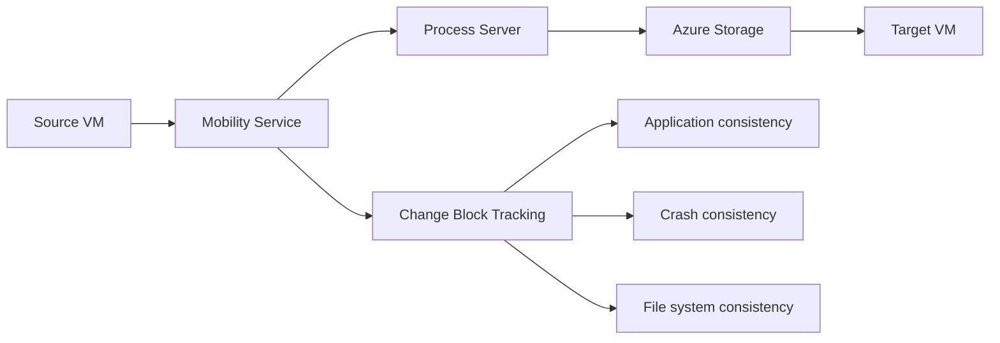
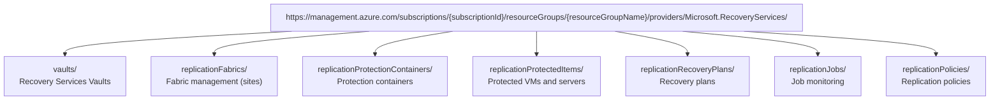

# Azure Site Recovery (ASR) Research and REST API Analysis

**Research Date**: November 22, 2025  
**Purpose**: Deep analysis of Azure Site Recovery platform and REST APIs for comparison with AWS DRS Orchestration solution  
**Scope**: Architecture, APIs, features, integration patterns, and competitive analysis

---

## Executive Summary

**Azure Site Recovery (ASR)** is Microsoft's native disaster recovery service that provides business continuity and disaster recovery (BCDR) capabilities for Azure, on-premises, and multi-cloud environments. ASR offers automated replication, failover, and failback for virtual machines and physical servers across Azure regions and from on-premises to Azure.

### Key Differentiators vs AWS DRS
- **Native Azure integration**: Deep integration with Azure services and ARM templates
- **Multi-source support**: VMware, Hyper-V, physical servers, and Azure VMs
- **Azure-to-Azure replication**: Native cross-region DR within Azure
- **Hybrid cloud focus**: Strong on-premises to Azure migration capabilities
- **ARM template automation**: Infrastructure as Code with Azure Resource Manager

---

## Azure Site Recovery Architecture

### Core Components

#### 1. Recovery Services Vault
- **Purpose**: Central management and storage container for ASR
- **Responsibilities**:
  - Backup and replication data storage
  - Policy management and configuration
  - Recovery point management
  - Monitoring and reporting
  - Cross-region replication orchestration

#### 2. Configuration Server (On-premises)
- **Purpose**: Coordinates communication between on-premises and Azure
- **Deployment**: On-premises VM or physical server
- **Responsibilities**:
  - Discover on-premises VMs and physical servers
  - Coordinate replication with Process Server
  - Manage Mobility Service deployment
  - Handle failback operations

#### 3. Process Server
- **Purpose**: Replication gateway and data optimization
- **Deployment**: Co-located with Configuration Server or separate
- **Responsibilities**:
  - Receive replication data from protected machines
  - Data compression, encryption, and caching
  - Send data to Azure Storage
  - Handle Mobility Service push installation

#### 4. Master Target Server
- **Purpose**: Handle failback replication data
- **Deployment**: Azure VM for failback operations
- **Responsibilities**:
  - Receive failback replication data from Azure
  - Store data during failback process
  - Coordinate with on-premises infrastructure

#### 5. Mobility Service
- **Purpose**: Agent installed on protected machines
- **Deployment**: Automatic push or manual installation
- **Responsibilities**:
  - Capture disk changes and send to Process Server
  - Ensure application consistency
  - Handle VSS snapshots for Windows
  - Coordinate with file system for Linux

### Replication Technology

#### Block-Level Replication


**Key Features**:
- **RPO**: 30 seconds to 24 hours (configurable)
- **Multi-point recovery**: Multiple recovery points with retention
- **Application consistency**: VSS snapshots for Windows, script-based for Linux
- **Bandwidth optimization**: Compression, encryption, and throttling

---

## Azure Site Recovery REST API Architecture

### API Overview

Azure Site Recovery provides comprehensive REST APIs through Azure Resource Manager (ARM) for all platform operations.

#### Base API Structure


### Authentication and Authorization

#### 1. Azure AD Authentication
```http
POST https://login.microsoftonline.com/{tenantId}/oauth2/v2.0/token
Content-Type: application/x-www-form-urlencoded

grant_type=client_credentials
&client_id={clientId}
&client_secret={clientSecret}
&scope=https://management.azure.com/.default

Response:
{
  "access_token": "eyJ0eXAiOiJKV1QiLCJhbGciOiJSUzI1NiIs...",
  "token_type": "Bearer",
  "expires_in": 3599
}
```

#### 2. Service Principal Authentication
```http
Authorization: Bearer {access_token}
Content-Type: application/json
```

### Core API Categories

#### 1. Recovery Services Vaults API

##### List Recovery Services Vaults
```http
GET https://management.azure.com/subscriptions/{subscriptionId}/resourceGroups/{resourceGroupName}/providers/Microsoft.RecoveryServices/vaults
Authorization: Bearer {access_token}
api-version: 2023-06-01

Response:
{
  "value": [
    {
      "id": "/subscriptions/12345678-1234-1234-1234-123456789012/resourceGroups/rg-dr/providers/Microsoft.RecoveryServices/vaults/vault-dr-primary",
      "name": "vault-dr-primary",
      "type": "Microsoft.RecoveryServices/vaults",
      "location": "East US",
      "properties": {
        "provisioningState": "Succeeded",
        "upgradeDetails": {},
        "privateEndpointConnections": [],
        "privateEndpointStateForBackup": "None",
        "privateEndpointStateForSiteRecovery": "None"
      },
      "sku": {
        "name": "Standard"
      },
      "systemData": {
        "createdAt": "2025-01-15T10:30:00Z",
        "lastModifiedAt": "2025-11-22T16:45:00Z"
      }
    }
  ]
}
```

##### Create Recovery Services Vault
```http
PUT https://management.azure.com/subscriptions/{subscriptionId}/resourceGroups/{resourceGroupName}/providers/Microsoft.RecoveryServices/vaults/{vaultName}
Authorization: Bearer {access_token}
Content-Type: application/json
api-version: 2023-06-01

{
  "location": "East US",
  "sku": {
    "name": "Standard"
  },
  "properties": {
    "publicNetworkAccess": "Enabled"
  },
  "identity": {
    "type": "SystemAssigned"
  }
}
```

#### 2. Replication Protected Items API

##### List Protected Items
```http
GET https://management.azure.com/subscriptions/{subscriptionId}/resourceGroups/{resourceGroupName}/providers/Microsoft.RecoveryServices/vaults/{vaultName}/replicationProtectedItems
Authorization: Bearer {access_token}
api-version: 2023-08-01

Response:
{
  "value": [
    {
      "id": "/subscriptions/12345678-1234-1234-1234-123456789012/resourceGroups/rg-dr/providers/Microsoft.RecoveryServices/vaults/vault-dr-primary/replicationFabrics/fabric-onprem/replicationProtectionContainers/container-vmware/replicationProtectedItems/vm-web-01",
      "name": "vm-web-01",
      "type": "Microsoft.RecoveryServices/vaults/replicationFabrics/replicationProtectionContainers/replicationProtectedItems",
      "properties": {
        "friendlyName": "Web Server 01",
        "protectedItemType": "VMwareVirtualMachine",
        "replicationHealth": "Normal",
        "healthErrors": [],
        "currentScenario": {
          "scenarioName": "None"
        },
        "allowedOperations": [
          "DisableProtection",
          "Failover",
          "TestFailover",
          "PlannedFailover"
        ],
        "replicationState": "Protected",
        "activeLocation": "Primary",
        "testFailoverState": "None",
        "switchProviderState": "None",
        "providerSpecificDetails": {
          "instanceType": "InMageAzureV2",
          "masterTargetId": "mt-server-01",
          "processServerId": "ps-server-01",
          "runAsAccountId": "account-vmware",
          "multiVmGroupId": "group-web-tier",
          "multiVmGroupName": "Web-Tier-Group",
          "multiVmSyncStatus": "Enabled",
          "agentVersion": "9.44.0.1",
          "discoveryType": "vCenter",
          "ipAddress": "192.168.1.100",
          "osType": "Windows",
          "vhdName": "vm-web-01.vhd",
          "osDiskId": "disk-os-001",
          "azureVMDiskDetails": [
            {
              "diskId": "disk-os-001",
              "diskName": "vm-web-01-os",
              "maxSizeMB": 127000,
              "targetDiskLocation": "Premium_LRS",
              "targetDiskName": "vm-web-01-os-dr"
            }
          ],
          "recoveryAzureVMName": "vm-web-01-dr",
          "recoveryAzureVMSize": "Standard_D2s_v3",
          "recoveryAzureStorageAccount": "storageaccountdr",
          "recoveryAzureLogStorageAccountId": "/subscriptions/12345678-1234-1234-1234-123456789012/resourceGroups/rg-dr/providers/Microsoft.Storage/storageAccounts/logstoragedr",
          "lastRpoCalculatedTime": "2025-11-22T16:30:00Z",
          "rpoInSeconds": 900,
          "lastHeartbeat": "2025-11-22T16:45:00Z",
          "compressionStatus": "Enabled",
          "sourceVmCpuCount": 2,
          "sourceVmRamSizeInMB": 8192,
          "targetAvailabilityZone": "1",
          "targetProximityPlacementGroupId": "/subscriptions/12345678-1234-1234-1234-123456789012/resourceGroups/rg-dr/providers/Microsoft.Compute/proximityPlacementGroups/ppg-dr",
          "useManagedDisks": "Yes",
          "licenseType": "WindowsServer",
          "sqlServerLicenseType": "PAYG",
          "targetVmTags": {
            "Environment": "DR",
            "Application": "WebServer",
            "CostCenter": "IT-001"
          },
          "seedManagedDiskTags": {
            "ReplicationType": "ASR",
            "SourceVM": "vm-web-01"
          }
        }
      }
    }
  ]
}
```

##### Enable Protection for VM
```http
PUT https://management.azure.com/subscriptions/{subscriptionId}/resourceGroups/{resourceGroupName}/providers/Microsoft.RecoveryServices/vaults/{vaultName}/replicationFabrics/{fabricName}/replicationProtectionContainers/{containerName}/replicationProtectedItems/{protectedItemName}
Authorization: Bearer {access_token}
Content-Type: application/json
api-version: 2023-08-01

{
  "properties": {
    "policyId": "/subscriptions/12345678-1234-1234-1234-123456789012/resourceGroups/rg-dr/providers/Microsoft.RecoveryServices/vaults/vault-dr-primary/replicationPolicies/policy-vmware-24hr",
    "protectableItemId": "/subscriptions/12345678-1234-1234-1234-123456789012/resourceGroups/rg-dr/providers/Microsoft.RecoveryServices/vaults/vault-dr-primary/replicationFabrics/fabric-onprem/replicationProtectionContainers/container-vmware/replicationProtectableItems/vm-web-01",
    "providerSpecificDetails": {
      "instanceType": "InMageAzureV2",
      "masterTargetId": "mt-server-01",
      "processServerId": "ps-server-01",
      "runAsAccountId": "account-vmware",
      "multiVmGroupName": "Web-Tier-Group",
      "disksToInclude": [
        {
          "diskId": "disk-os-001",
          "logStorageAccountId": "/subscriptions/12345678-1234-1234-1234-123456789012/resourceGroups/rg-dr/providers/Microsoft.Storage/storageAccounts/logstoragedr",
          "diskType": "Premium_LRS"
        }
      ],
      "targetAzureNetworkId": "/subscriptions/12345678-1234-1234-1234-123456789012/resourceGroups/rg-dr/providers/Microsoft.Network/virtualNetworks/vnet-dr",
      "targetAzureSubnetId": "/subscriptions/12345678-1234-1234-1234-123456789012/resourceGroups/rg-dr/providers/Microsoft.Network/virtualNetworks/vnet-dr/subnets/subnet-web",
      "enableRdpOnTargetOption": "Never",
      "targetAzureVmName": "vm-web-01-dr",
      "targetAzureVmSize": "Standard_D2s_v3",
      "targetResourceGroupId": "/subscriptions/12345678-1234-1234-1234-123456789012/resourceGroups/rg-dr-vms",
      "targetAvailabilitySetId": "/subscriptions/12345678-1234-1234-1234-123456789012/resourceGroups/rg-dr-vms/providers/Microsoft.Compute/availabilitySets/as-web-tier",
      "targetAvailabilityZone": "1",
      "licenseType": "WindowsServer",
      "sqlServerLicenseType": "PAYG",
      "targetVmTags": {
        "Environment": "DR",
        "Application": "WebServer",
        "RecoveryPlan": "WebTier-RP"
      }
    }
  }
}
```

#### 3. Recovery Plans API

##### List Recovery Plans
```http
GET https://management.azure.com/subscriptions/{subscriptionId}/resourceGroups/{resourceGroupName}/providers/Microsoft.RecoveryServices/vaults/{vaultName}/replicationRecoveryPlans
Authorization: Bearer {access_token}
api-version: 2023-08-01

Response:
{
  "value": [
    {
      "id": "/subscriptions/12345678-1234-1234-1234-123456789012/resourceGroups/rg-dr/providers/Microsoft.RecoveryServices/vaults/vault-dr-primary/replicationRecoveryPlans/rp-web-tier",
      "name": "rp-web-tier",
      "type": "Microsoft.RecoveryServices/vaults/replicationRecoveryPlans",
      "properties": {
        "friendlyName": "Web Tier Recovery Plan",
        "primaryFabricId": "/subscriptions/12345678-1234-1234-1234-123456789012/resourceGroups/rg-dr/providers/Microsoft.RecoveryServices/vaults/vault-dr-primary/replicationFabrics/fabric-onprem",
        "primaryFabricFriendlyName": "On-Premises VMware",
        "recoveryFabricId": "/subscriptions/12345678-1234-1234-1234-123456789012/resourceGroups/rg-dr/providers/Microsoft.RecoveryServices/vaults/vault-dr-primary/replicationFabrics/fabric-azure",
        "recoveryFabricFriendlyName": "Microsoft Azure",
        "failoverDeploymentModel": "ResourceManager",
        "replicationProviders": [
          "InMageAzureV2"
        ],
        "allowedOperations": [
          "PlannedFailover",
          "UnplannedFailover",
          "TestFailover"
        ],
        "lastPlannedFailoverTime": "2025-11-20T14:30:00Z",
        "lastUnplannedFailoverTime": null,
        "lastTestFailoverTime": "2025-11-22T10:00:00Z",
        "currentScenario": {
          "scenarioName": "None"
        },
        "currentScenarioStatus": "Succeeded",
        "groups": [
          {
            "groupType": "Boot",
            "replicationProtectedItems": [],
            "startGroupActions": [
              {
                "actionName": "Pre-Boot-Health-Check",
                "failoverTypes": [
                  "TestFailover",
                  "PlannedFailover",
                  "UnplannedFailover"
                ],
                "failoverDirections": [
                  "PrimaryToRecovery"
                ],
                "customDetails": {
                  "instanceType": "ScriptActionDetails",
                  "path": "https://storageaccount.blob.core.windows.net/scripts/pre-boot-check.ps1",
                  "timeout": "PT10M"
                }
              }
            ],
            "endGroupActions": []
          },
          {
            "groupType": "Failover",
            "replicationProtectedItems": [
              {
                "id": "/subscriptions/12345678-1234-1234-1234-123456789012/resourceGroups/rg-dr/providers/Microsoft.RecoveryServices/vaults/vault-dr-primary/replicationFabrics/fabric-onprem/replicationProtectionContainers/container-vmware/replicationProtectedItems/vm-web-01",
                "virtualMachineId": "vm-web-01"
              },
              {
                "id": "/subscriptions/12345678-1234-1234-1234-123456789012/resourceGroups/rg-dr/providers/Microsoft.RecoveryServices/vaults/vault-dr-primary/replicationFabrics/fabric-onprem/replicationProtectionContainers/container-vmware/replicationProtectedItems/vm-web-02",
                "virtualMachineId": "vm-web-02"
              }
            ],
            "startGroupActions": [
              {
                "actionName": "Start-Load-Balancer",
                "failoverTypes": [
                  "PlannedFailover",
                  "UnplannedFailover"
                ],
                "failoverDirections": [
                  "PrimaryToRecovery"
                ],
                "customDetails": {
                  "instanceType": "AutomationRunbookActionDetails",
                  "automationAccountId": "/subscriptions/12345678-1234-1234-1234-123456789012/resourceGroups/rg-automation/providers/Microsoft.Automation/automationAccounts/aa-dr",
                  "runbookId": "Start-LoadBalancer",
                  "fabricLocation": "Primary"
                }
              }
            ],
            "endGroupActions": [
              {
                "actionName": "Configure-DNS",
                "failoverTypes": [
                  "PlannedFailover",
                  "UnplannedFailover"
                ],
                "failoverDirections": [
                  "PrimaryToRecovery"
                ],
                "customDetails": {
                  "instanceType": "ManualActionDetails",
                  "description": "Update DNS records to point to DR environment"
                }
              }
            ]
          },
          {
            "groupType": "Shutdown",
            "replicationProtectedItems": [],
            "startGroupActions": [],
            "endGroupActions": [
              {
                "actionName": "Post-Recovery-Validation",
                "failoverTypes": [
                  "TestFailover",
                  "PlannedFailover",
                  "UnplannedFailover"
                ],
                "failoverDirections": [
                  "PrimaryToRecovery"
                ],
                "customDetails": {
                  "instanceType": "ScriptActionDetails",
                  "path": "https://storageaccount.blob.core.windows.net/scripts/post-recovery-validation.ps1",
                  "timeout": "PT15M"
                }
              }
            ]
          }
        ]
      }
    }
  ]
}
```

##### Create Recovery Plan
```http
PUT https://management.azure.com/subscriptions/{subscriptionId}/resourceGroups/{resourceGroupName}/providers/Microsoft.RecoveryServices/vaults/{vaultName}/replicationRecoveryPlans/{recoveryPlanName}
Authorization: Bearer {access_token}
Content-Type: application/json
api-version: 2023-08-01

{
  "properties": {
    "friendlyName": "Database Tier Recovery Plan",
    "primaryFabricId": "/subscriptions/12345678-1234-1234-1234-123456789012/resourceGroups/rg-dr/providers/Microsoft.RecoveryServices/vaults/vault-dr-primary/replicationFabrics/fabric-onprem",
    "recoveryFabricId": "/subscriptions/12345678-1234-1234-1234-123456789012/resourceGroups/rg-dr/providers/Microsoft.RecoveryServices/vaults/vault-dr-primary/replicationFabrics/fabric-azure",
    "failoverDeploymentModel": "ResourceManager",
    "groups": [
      {
        "groupType": "Boot",
        "replicationProtectedItems": [],
        "startGroupActions": [
          {
            "actionName": "Pre-Recovery-Health-Check",
            "failoverTypes": [
              "TestFailover",
              "PlannedFailover",
              "UnplannedFailover"
            ],
            "failoverDirections": [
              "PrimaryToRecovery"
            ],
            "customDetails": {
              "instanceType": "ScriptActionDetails",
              "path": "https://storageaccount.blob.core.windows.net/scripts/db-pre-recovery.ps1",
              "timeout": "PT10M"
            }
          }
        ]
      },
      {
        "groupType": "Failover",
        "replicationProtectedItems": [
          {
            "id": "/subscriptions/12345678-1234-1234-1234-123456789012/resourceGroups/rg-dr/providers/Microsoft.RecoveryServices/vaults/vault-dr-primary/replicationFabrics/fabric-onprem/replicationProtectionContainers/container-vmware/replicationProtectedItems/vm-sql-01",
            "virtualMachineId": "vm-sql-01"
          },
          {
            "id": "/subscriptions/12345678-1234-1234-1234-123456789012/resourceGroups/rg-dr/providers/Microsoft.RecoveryServices/vaults/vault-dr-primary/replicationFabrics/fabric-onprem/replicationProtectionContainers/container-vmware/replicationProtectedItems/vm-sql-02",
            "virtualMachineId": "vm-sql-02"
          }
        ],
        "endGroupActions": [
          {
            "actionName": "Start-SQL-Cluster",
            "failoverTypes": [
              "PlannedFailover",
              "UnplannedFailover"
            ],
            "failoverDirections": [
              "PrimaryToRecovery"
            ],
            "customDetails": {
              "instanceType": "AutomationRunbookActionDetails",
              "automationAccountId": "/subscriptions/12345678-1234-1234-1234-123456789012/resourceGroups/rg-automation/providers/Microsoft.Automation/automationAccounts/aa-dr",
              "runbookId": "Start-SQLCluster",
              "fabricLocation": "Recovery"
            }
          }
        ]
      }
    ]
  }
}
```

#### 4. Failover Operations API

##### Start Test Failover
```http
POST https://management.azure.com/subscriptions/{subscriptionId}/resourceGroups/{resourceGroupName}/providers/Microsoft.RecoveryServices/vaults/{vaultName}/replicationRecoveryPlans/{recoveryPlanName}/testFailover
Authorization: Bearer {access_token}
Content-Type: application/json
api-version: 2023-08-01

{
  "properties": {
    "failoverDirection": "PrimaryToRecovery",
    "networkType": "VmNetworkAsInput",
    "networkId": "/subscriptions/12345678-1234-1234-1234-123456789012/resourceGroups/rg-dr/providers/Microsoft.Network/virtualNetworks/vnet-dr-test",
    "skipTestFailoverCleanup": "False",
    "providerSpecificDetails": [
      {
        "instanceType": "HyperVReplicaAzureFailoverProviderInput"
      }
    ]
  }
}

Response:
{
  "id": "/subscriptions/12345678-1234-1234-1234-123456789012/resourceGroups/rg-dr/providers/Microsoft.RecoveryServices/vaults/vault-dr-primary/replicationJobs/job-test-failover-001",
  "name": "job-test-failover-001",
  "type": "Microsoft.RecoveryServices/vaults/replicationJobs",
  "properties": {
    "activityId": "activity-12345",
    "scenarioName": "TestFailover",
    "friendlyName": "Test failover of recovery plan 'Database Tier Recovery Plan'",
    "state": "InProgress",
    "stateDescription": "InProgress",
    "startTime": "2025-11-22T16:45:00Z",
    "endTime": null,
    "allowedActions": [
      "Cancel"
    ],
    "tasks": [
      {
        "taskId": "task-001",
        "name": "PreFailoverWorkflow",
        "friendlyName": "Pre-failover workflow",
        "state": "Succeeded",
        "stateDescription": "Succeeded",
        "taskType": "AutomationRunbookTask",
        "startTime": "2025-11-22T16:45:00Z",
        "endTime": "2025-11-22T16:46:30Z"
      },
      {
        "taskId": "task-002",
        "name": "VirtualMachineFailoverTask",
        "friendlyName": "Failover virtual machine",
        "state": "InProgress",
        "stateDescription": "InProgress",
        "taskType": "VirtualMachineFailoverTask",
        "startTime": "2025-11-22T16:46:30Z",
        "endTime": null
      }
    ]
  }
}
```

##### Start Planned Failover
```http
POST https://management.azure.com/subscriptions/{subscriptionId}/resourceGroups/{resourceGroupName}/providers/Microsoft.RecoveryServices/vaults/{vaultName}/replicationRecoveryPlans/{recoveryPlanName}/plannedFailover
Authorization: Bearer {access_token}
Content-Type: application/json
api-version: 2023-08-01

{
  "properties": {
    "failoverDirection": "PrimaryToRecovery",
    "providerSpecificDetails": [
      {
        "instanceType": "HyperVReplicaAzureFailoverProviderInput"
      }
    ]
  }
}
```

##### Start Unplanned Failover
```http
POST https://management.azure.com/subscriptions/{subscriptionId}/resourceGroups/{resourceGroupName}/providers/Microsoft.RecoveryServices/vaults/{vaultName}/replicationRecoveryPlans/{recoveryPlanName}/unplannedFailover
Authorization: Bearer {access_token}
Content-Type: application/json
api-version: 2023-08-01

{
  "properties": {
    "failoverDirection": "PrimaryToRecovery",
    "sourceSiteOperations": "NotRequired",
    "providerSpecificDetails": [
      {
        "instanceType": "HyperVReplicaAzureFailoverProviderInput"
      }
    ]
  }
}
```

#### 5. Job Monitoring API

##### Get Job Status
```http
GET https://management.azure.com/subscriptions/{subscriptionId}/resourceGroups/{resourceGroupName}/providers/Microsoft.RecoveryServices/vaults/{vaultName}/replicationJobs/{jobName}
Authorization: Bearer {access_token}
api-version: 2023-08-01

Response:
{
  "id": "/subscriptions/12345678-1234-1234-1234-123456789012/resourceGroups/rg-dr/providers/Microsoft.RecoveryServices/vaults/vault-dr-primary/replicationJobs/job-test-failover-001",
  "name": "job-test-failover-001",
  "type": "Microsoft.RecoveryServices/vaults/replicationJobs",
  "properties": {
    "activityId": "activity-12345",
    "scenarioName": "TestFailover",
    "friendlyName": "Test failover of recovery plan 'Database Tier Recovery Plan'",
    "state": "Succeeded",
    "stateDescription": "Succeeded",
    "startTime": "2025-11-22T16:45:00Z",
    "endTime": "2025-11-22T16:52:30Z",
    "allowedActions": [],
    "targetObjectId": "/subscriptions/12345678-1234-1234-1234-123456789012/resourceGroups/rg-dr/providers/Microsoft.RecoveryServices/vaults/vault-dr-primary/replicationRecoveryPlans/rp-database-tier",
    "targetObjectName": "rp-database-tier",
    "targetInstanceType": "RecoveryPlan",
    "tasks": [
      {
        "taskId": "task-001",
        "name": "PreFailoverWorkflow",
        "friendlyName": "Pre-failover workflow",
        "state": "Succeeded",
        "stateDescription": "Succeeded",
        "taskType": "AutomationRunbookTask",
        "startTime": "2025-11-22T16:45:00Z",
        "endTime": "2025-11-22T16:46:30Z",
        "customDetails": {
          "instanceType": "AutomationRunbookTaskDetails",
          "automationAccountName": "aa-dr",
          "runbookId": "Pre-Recovery-Health-Check",
          "jobId": "job-automation-001",
          "jobOutput": "Health check completed successfully. All systems ready for failover."
        }
      },
      {
        "taskId": "task-002",
        "name": "VirtualMachineFailoverTask",
        "friendlyName": "Failover virtual machine vm-sql-01",
        "state": "Succeeded",
        "stateDescription": "Succeeded",
        "taskType": "VirtualMachineFailoverTask",
        "startTime": "2025-11-22T16:46:30Z",
        "endTime": "2025-11-22T16:50:00Z",
        "customDetails": {
          "instanceType": "VirtualMachineTaskDetails",
          "skippedReason": null,
          "skippedReasonString": null,
          "jobTask": {
            "jobId": "job-vm-failover-001",
            "startTime": "2025-11-22T16:46:30Z",
            "endTime": "2025-11-22T16:50:00Z",
            "jobFriendlyName": "Failover vm-sql-01"
          }
        }
      },
      {
        "taskId": "task-003",
        "name": "PostFailoverWorkflow",
        "friendlyName": "Post-failover workflow",
        "state": "Succeeded",
        "stateDescription": "Succeeded",
        "taskType": "AutomationRunbookTask",
        "startTime": "2025-11-22T16:50:00Z",
        "endTime": "2025-11-22T16:52:30Z",
        "customDetails": {
          "instanceType": "AutomationRunbookTaskDetails",
          "automationAccountName": "aa-dr",
          "runbookId": "Start-SQLCluster",
          "jobId": "job-automation-002",
          "jobOutput": "SQL Server cluster started successfully. Database services are online."
        }
      }
    ],
    "errors": [],
    "customDetails": {
      "instanceType": "TestFailoverJobDetails",
      "testFailoverStatus": "Succeeded",
      "comments": "Test failover completed successfully. All VMs started and applications are responding.",
      "networkName": "vnet-dr-test",
      "networkType": "VmNetworkAsInput"
    }
  }
}
```

##### List Jobs
```http
GET https://management.azure.com/subscriptions/{subscriptionId}/resourceGroups/{resourceGroupName}/providers/Microsoft.RecoveryServices/vaults/{vaultName}/replicationJobs?$filter=startTime ge 2025-11-22T00:00:00Z
Authorization: Bearer {access_token}
api-version: 2023-08-01

Response:
{
  "value": [
    {
      "id": "/subscriptions/12345678-1234-1234-1234-123456789012/resourceGroups/rg-dr/providers/Microsoft.RecoveryServices/vaults/vault-dr-primary/replicationJobs/job-test-failover-001",
      "name": "job-test-failover-001",
      "properties": {
        "scenarioName": "TestFailover",
        "friendlyName": "Test failover of recovery plan 'Database Tier Recovery Plan'",
        "state": "Succeeded",
        "startTime": "2025-11-22T16:45:00Z",
        "endTime": "2025-11-22T16:52:30Z",
        "targetObjectName": "rp-database-tier"
      }
    },
    {
      "id": "/subscriptions/12345678-1234-1234-1234-123456789012/resourceGroups/rg-dr/providers/Microsoft.RecoveryServices/vaults/vault-dr-primary/replicationJobs/job-enable-protection-001",
      "name": "job-enable-protection-001",
      "properties": {
        "scenarioName": "EnableProtection",
        "friendlyName": "Enable protection for vm-web-03",
        "state": "InProgress",
        "startTime": "2025-11-22T17:00:00Z",
        "endTime": null,
        "targetObjectName": "vm-web-03"
      }
    }
  ]
}
```

#### 6. Replication Policies API

##### List Replication Policies
```http
GET https://management.azure.com/subscriptions/{subscriptionId}/resourceGroups/{resourceGroupName}/providers/Microsoft.RecoveryServices/vaults/{vaultName}/replicationPolicies
Authorization: Bearer {access_token}
api-version: 2023-08-01

Response:
{
  "value": [
    {
      "id": "/subscriptions/12345678-1234-1234-1234-123456789012/resourceGroups/rg-dr/providers/Microsoft.RecoveryServices/vaults/vault-dr-primary/replicationPolicies/policy-vmware-24hr",
      "name": "policy-vmware-24hr",
      "type": "Microsoft.RecoveryServices/vaults/replicationPolicies",
      "properties": {
        "friendlyName": "VMware 24 Hour Retention Policy",
        "providerSpecificDetails": {
          "instanceType": "InMageAzureV2PolicyDetails",
          "crashConsistentFrequencyInMinutes": 5,
          "recoveryPointThresholdInMinutes": 1440,
          "recoveryPointHistory": 1440,
          "appConsistentFrequencyInMinutes": 60,
          "multiVmSyncStatus": "Enable"
        }
      }
    },
    {
      "id": "/subscriptions/12345678-1234-1234-1234-123456789012/resourceGroups/rg-dr/providers/Microsoft.RecoveryServices/vaults/vault-dr-primary/replicationPolicies/policy-hyperv-72hr",
      "name": "policy-hyperv-72hr",
      "type": "Microsoft.RecoveryServices/vaults/replicationPolicies",
      "properties": {
        "friendlyName": "Hyper-V 72 Hour Retention Policy",
        "providerSpecificDetails": {
          "instanceType": "HyperVReplicaAzurePolicyDetails",
          "recoveryPointHistoryDurationInHours": 72,
          "applicationConsistentSnapshotFrequencyInHours": 4,
          "replicationInterval": 300,
          "onlineReplicationStartTime": null,
          "encryption": "Disable",
          "activeStorageAccountId": "/subscriptions/12345678-1234-1234-1234-123456789012/resourceGroups/rg-dr/providers/Microsoft.Storage/storageAccounts/storageaccountdr"
        }
      }
    }
  ]
}
```

##### Create Replication Policy
```http
PUT https://management.azure.com/subscriptions/{subscriptionId}/resourceGroups/{resourceGroupName}/providers/Microsoft.RecoveryServices/vaults/{vaultName}/replicationPolicies/{policyName}
Authorization: Bearer {access_token}
Content-Type: application/json
api-version: 2023-08-01

{
  "properties": {
    "friendlyName": "VMware Production Policy",
    "providerSpecificInput": {
      "instanceType": "InMageAzureV2PolicyInput",
      "crashConsistentFrequencyInMinutes": 5,
      "recoveryPointThresholdInMinutes": 2880,
      "recoveryPointHistory": 2880,
      "appConsistentFrequencyInMinutes": 240,
      "multiVmSyncStatus": "Enable"
    }
  }
}
```

---

## Advanced Azure Site Recovery Features

### 1. Azure-to-Azure Replication

#### Enable Azure VM Protection
```http
PUT https://management.azure.com/subscriptions/{subscriptionId}/resourceGroups/{resourceGroupName}/providers/Microsoft.RecoveryServices/vaults/{vaultName}/replicationFabrics/{fabricName}/replicationProtectionContainers/{containerName}/replicationProtectedItems/{protectedItemName}
Authorization: Bearer {access_token}
Content-Type: application/json
api-version: 2023-08-01

{
  "properties": {
    "policyId": "/subscriptions/12345678-1234-1234-1234-123456789012/resourceGroups/rg-dr/providers/Microsoft.RecoveryServices/vaults/vault-dr-primary/replicationPolicies/policy-azure-vm",
    "protectableItemId": "/subscriptions/12345678-1234-1234-1234-123456789012/resourceGroups/rg-prod/providers/Microsoft.Compute/virtualMachines/vm-prod-web-01",
    "providerSpecificDetails": {
      "instanceType": "A2A",
      "fabricObjectId": "/subscriptions/12345678-1234-1234-1234-123456789012/resourceGroups/rg-prod/providers/Microsoft.Compute/virtualMachines/vm-prod-web-01",
      "recoveryResourceGroupId": "/subscriptions/12345678-1234-1234-1234-123456789012/resourceGroups/rg-dr-vms",
      "recoveryCloudServiceId": null,
      "recoveryAvailabilitySetId": "/subscriptions/12345678-1234-1234-1234-123456789012/resourceGroups/rg-dr-vms/providers/Microsoft.Compute/availabilitySets/as-web-tier-dr",
      "vmDisks": [
        {
          "diskUri": "/subscriptions/12345678-1234-1234-1234-123456789012/resourceGroups/rg-prod/providers/Microsoft.Compute/disks/vm-prod-web-01-os",
          "recoveryAzureStorageAccountId": "/subscriptions/12345678-1234-1234-1234-123456789012/resourceGroups/rg-dr/providers/Microsoft.Storage/storageAccounts/storageaccountdr",
          "primaryStagingAzureStorageAccountId": "/subscriptions/12345678-1234-1234-1234-123456789012/resourceGroups/rg-prod/providers/Microsoft.Storage/storageAccounts/cachestorageaccount"
        }
      ],
      "recoveryVirtualNetworkId": "/subscriptions/12345678-1234-1234-1234-123456789012/resourceGroups/rg-dr/providers/Microsoft.Network/virtualNetworks/vnet-dr",
      "recoverySubnetName": "subnet-web-dr",
      "recoveryBootDiagStorageAccountId": "/subscriptions/12345678-1234-1234-1234-123456789012/resourceGroups/rg-dr/providers/Microsoft.Storage/storageAccounts/bootdiagstorage",
      "diskEncryptionInfo": {
        "diskEncryptionKeyInfo": {
          "secretIdentifier": "https://keyvault-dr.vault.azure.net/secrets/disk-encryption-key/version",
          "keyVaultResourceArmId": "/subscriptions/12345678-1234-1234-1234-123456789012/resourceGroups/rg-dr/providers/Microsoft.KeyVault/vaults/keyvault-dr"
        },
        "keyEncryptionKeyInfo": {
          "keyIdentifier": "https://keyvault-dr.vault.azure.net/keys/key-encryption-key/version",
          "keyVaultResourceArmId": "/subscriptions/12345678-1234-1234-1234-123456789012/resourceGroups/rg-dr/providers/Microsoft.KeyVault/vaults/keyvault-dr"
        }
      },
      "recoveryProximityPlacementGroupId": "/subscriptions/12345678-1234-1234-1234-123456789012/resourceGroups/rg-dr-vms/providers/Microsoft.Compute/proximityPlacementGroups/ppg-dr",
      "recoveryAvailabilityZone": "2",
      "recoveryVirtualMachineScaleSetId": null,
      "recoveryCapacityReservationGroupId": null
    }
  }
}
```

### 2. Multi-VM Consistency Groups

#### Configure Multi-VM Group
```http
PUT https://management.azure.com/subscriptions/{subscriptionId}/resourceGroups/{resourceGroupName}/providers/Microsoft.RecoveryServices/vaults/{vaultName}/replicationFabrics/{fabricName}/replicationProtectionContainers/{containerName}/replicationProtectedItems/{protectedItemName}
Authorization: Bearer {access_token}
Content-Type: application/json
api-version: 2023-08-01

{
  "properties": {
    "providerSpecificDetails": {
      "instanceType": "InMageAzureV2",
      "multiVmGroupName": "SQL-Cluster-Group",
      "multiVmSyncStatus": "Enable"
    }
  }
}
```

### 3. Automation Integration

#### Azure Automation Runbook Action
```http
{
  "actionName": "Start-Application-Services",
  "failoverTypes": [
    "PlannedFailover",
    "UnplannedFailover"
  ],
  "failoverDirections": [
    "PrimaryToRecovery"
  ],
  "customDetails": {
    "instanceType": "AutomationRunbookActionDetails",
    "automationAccountId": "/subscriptions/12345678-1234-1234-1234-123456789012/resourceGroups/rg-automation/providers/Microsoft.Automation/automationAccounts/aa-dr",
    "runbookId": "Start-ApplicationServices",
    "fabricLocation": "Recovery",
    "runbookParameters": {
      "EnvironmentType": "DR",
      "ApplicationTier": "Web",
      "NotificationEmail": "admin@company.com"
    }
  }
}
```

### 4. Network Mapping and Configuration

#### Configure Network Mapping
```http
PUT https://management.azure.com/subscriptions/{subscriptionId}/resourceGroups/{resourceGroupName}/providers/Microsoft.RecoveryServices/vaults/{vaultName}/replicationFabrics/{fabricName}/replicationNetworks/{networkName}/replicationNetworkMappings/{networkMappingName}
Authorization: Bearer {access_token}
Content-Type: application/json
api-version: 2023-08-01

{
  "properties": {
    "recoveryFabricName": "fabric-azure",
    "recoveryNetworkId": "/subscriptions/12345678-1234-1234-1234-123456789012/resourceGroups/rg-dr/providers/Microsoft.Network/virtualNetworks/vnet-dr",
    "fabricSpecificDetails": {
      "instanceType": "VmmToAzureNetworkMappingSettings",
      "vmmNetworkName": "VM Network Production",
      "vmmNetworkDescription": "Production VM Network"
    }
  }
}
```

---

## Azure Site Recovery vs AWS DRS Comparison

### Feature Comparison Matrix

| Feature | Azure Site Recovery | AWS DRS | AWS DRS Orchestration |
|---------|-------------------|---------|----------------------|
| **Multi-cloud Support** | ✅ Azure, VMware, Hyper-V, Physical | ❌ VMware to AWS only | ❌ AWS DRS only |
| **Azure-native Integration** | ✅ ARM templates, Azure services | ❌ N/A | ❌ N/A |
| **Cross-region Replication** | ✅ Azure-to-Azure built-in | ✅ Cross-region support | ✅ Cross-region support |
| **Recovery Plans** | ✅ Multi-group with automation | ⚠️ Basic recovery plans | ✅ Wave-based orchestration |
| **Automation Integration** | ✅ Azure Automation runbooks | ⚠️ SSM documents | ✅ SSM + Lambda automation |
| **Multi-VM Consistency** | ✅ Application consistency groups | ❌ VM-level only | ✅ Wave dependencies |
| **Network Configuration** | ✅ Network mapping and IP config | ⚠️ Basic network settings | ✅ Subnet and security group config |
| **Monitoring and Reporting** | ✅ Azure Monitor integration | ⚠️ CloudWatch integration | ✅ Real-time execution tracking |
| **Cost Model** | 💰 Per-protected instance | 💰 Per-server replication cost | 💰 Serverless pay-per-use |
| **API Coverage** | ✅ Comprehensive ARM APIs | ⚠️ Limited DRS APIs | ✅ Full CRUD + execution APIs |

### API Comparison

| API Category | Azure Site Recovery | AWS DRS | AWS DRS Orchestration |
|--------------|-------------------|---------|----------------------|
| **Authentication** | Azure AD + ARM tokens | AWS IAM + SigV4 | Cognito + JWT |
| **Protection Management** | Protected Items API | Limited DRS APIs | Protection Groups API |
| **Recovery Execution** | Recovery Plans + Failover APIs | StartRecovery API | Wave-based execution API |
| **Job Monitoring** | Jobs API with detailed tasks | DescribeJobs API | Execution tracking + polling |
| **Policy Management** | Replication Policies API | DRS Console only | Recovery Plans API |
| **Automation** | Runbook Actions API | SSM integration | Lambda + SSM integration |

---

## Integration Opportunities

### 1. Azure Site Recovery as Source for Multi-Cloud DR

**Scenario**: Organizations using ASR for Azure DR wanting to extend to AWS

```python
class AzureASRAWSDRSBridge:
    def __init__(self, asr_client, aws_drs_client):
        self.asr = asr_client
        self.aws_drs = aws_drs_client
    
    def sync_recovery_plans(self):
        """Sync ASR Recovery Plans to AWS DRS Recovery Plans"""
        asr_plans = self.asr.list_recovery_plans()
        
        for plan in asr_plans:
            # Map ASR groups to AWS DRS waves
            waves = []
            for group in plan['properties']['groups']:
                if group['groupType'] == 'Failover':
                    wave = {
                        'WaveNumber': len(waves) + 1,
                        'ProtectionGroupIds': self.map_asr_items_to_drs_groups(
                            group['replicationProtectedItems']
                        ),
                        'PreWaveActions': self.map_asr_actions(group['startGroupActions']),
                        'PostWaveActions': self.map_asr_actions(group['endGroupActions'])
                    }
                    waves.append(wave)
            
            aws_plan = {
                'PlanName': f"asr-{plan['name']}",
                'Waves': waves,
                'RPO': 300,  # Default from ASR policy
                'RTO': 3600  # Estimated from ASR plan complexity
            }
            self.aws_drs.create_recovery_plan(aws_plan)
    
    def execute_coordinated_failover(self, recovery_plan_id, failover_type='test'):
        """Execute failover in both ASR and AWS DRS"""
        # Start ASR failover
        asr_job = self.asr.start_failover(
            recovery_plan_id=recovery_plan_id,
            failover_type=failover_type,
            failover_direction='PrimaryToRecovery'
        )
        
        # Start AWS DRS recovery
        aws_execution = self.aws_drs.execute_recovery_plan(
            plan_id=self.get_mapped_plan_id(recovery_plan_id),
            execution_type=failover_type
        )
        
        return {
            'asr_job_id': asr_job['name'],
            'aws_execution_id': aws_execution['ExecutionId']
        }
```

### 2. ARM Template Integration

**Scenario**: Leverage ASR ARM template patterns for AWS CloudFormation

```python
class ARMToCloudFormationConverter:
    def convert_asr_template_to_cfn(self, arm_template):
        """Convert ASR ARM template to CloudFormation"""
        cfn_template = {
            'AWSTemplateFormatVersion': '2010-09-09',
            'Description': f"Converted from ASR ARM template: {arm_template['metadata']['description']}",
            'Resources': {}
        }
        
        for resource_name, resource in arm_template['resources'].items():
            if resource['type'] == 'Microsoft.RecoveryServices/vaults':
                # Convert to DynamoDB table for configuration storage
                cfn_template['Resources'][f"{resource_name}Table"] = {
                    'Type': 'AWS::DynamoDB::Table',
                    'Properties': {
                        'TableName': f"drs-{resource['name']}-config",
                        'BillingMode': 'PAY_PER_REQUEST',
                        'AttributeDefinitions': [
                            {'AttributeName': 'ConfigId', 'AttributeType': 'S'}
                        ],
                        'KeySchema': [
                            {'AttributeName': 'ConfigId', 'KeyType': 'HASH'}
                        ]
                    }
                }
            
            elif resource['type'] == 'Microsoft.RecoveryServices/vaults/replicationRecoveryPlans':
                # Convert to Lambda function for recovery plan execution
                cfn_template['Resources'][f"{resource_name}Function"] = {
                    'Type': 'AWS::Lambda::Function',
                    'Properties': {
                        'FunctionName': f"drs-{resource['name']}-executor",
                        'Runtime': 'python3.12',
                        'Handler': 'index.lambda_handler',
                        'Code': {
                            'ZipFile': self.generate_recovery_plan_code(resource['properties'])
                        }
                    }
                }
        
        return cfn_template
```

### 3. Hybrid Monitoring Dashboard

**Scenario**: Unified monitoring for ASR and AWS DRS operations

```typescript
interface HybridDRDashboard {
  asrJobs: ASRJob[];
  awsDrsExecutions: DRSExecution[];
  crossCloudStatus: CrossCloudStatus;
}

class HybridDRMonitor {
  async getUnifiedStatus(): Promise<HybridDRDashboard> {
    const [asrJobs, drsExecutions] = await Promise.all([
      this.asrClient.listJobs({ state: 'InProgress' }),
      this.drsClient.listExecutions({ status: 'IN_PROGRESS' })
    ]);
    
    return {
      asrJobs: asrJobs.map(job => ({
        id: job.name,
        type: job.properties.scenarioName,
        status: job.properties.state,
        progress: this.calculateProgress(job.properties.tasks),
        startTime: job.properties.startTime,
        targetPlatform: 'Azure'
      })),
      awsDrsExecutions: drsExecutions.map(execution => ({
        id: execution.ExecutionId,
        type: 'DRS Recovery',
        status: execution.Status,
        progress: this.calculateDRSProgress(execution.Waves),
        startTime: execution.StartTime,
        targetPlatform: 'AWS'
      })),
      crossCloudStatus: await this.getCrossCloudStatus()
    };
  }
}
```

---

## Implementation Recommendations

### 1. Short-term Enhancements (Next 2-3 Sessions)

#### Add ASR-inspired Features to AWS DRS Orchestration

1. **Multi-VM Consistency Groups**
   ```python
   # Add consistency group configuration to Protection Groups
   protection_group_config = {
       'GroupName': 'SQL-Cluster-Group',
       'ConsistencySettings': {
           'EnableMultiVMConsistency': True,
           'ConsistencyGroupName': 'sql-cluster',
           'CrashConsistentFrequencyMinutes': 5,
           'AppConsistentFrequencyMinutes': 60
       }
   }
   ```

2. **Advanced Network Configuration**
   ```python
   # Enhanced network mapping similar to ASR
   wave_config = {
       'WaveNumber': 1,
       'NetworkConfiguration': {
           'SubnetMappings': [
               {
                   'SourceSubnet': 'subnet-prod-web',
                   'TargetSubnet': 'subnet-dr-web',
                   'IPConfiguration': 'Static'
               }
           ],
           'SecurityGroupMappings': [
               {
                   'SourceSG': 'sg-prod-web',
                   'TargetSG': 'sg-dr-web'
               }
           ]
       }
   }
   ```

3. **Detailed Task Tracking**
   ```typescript
   // ASR-style detailed task tracking
   interface ExecutionTask {
     taskId: string;
     name: string;
     friendlyName: string;
     state: 'InProgress' | 'Succeeded' | 'Failed';
     taskType: 'PreRecoveryScript' | 'VMFailover' | 'PostRecoveryScript';
     startTime: string;
     endTime?: string;
     customDetails: {
       instanceType: string;
       jobOutput?: string;
       errorDetails?: string;
     };
   }
   ```

### 2. Medium-term Integration (Future Phases)

#### Azure Site Recovery Integration Module

```python
class AzureSiteRecoveryIntegration:
    """Integration module for Azure Site Recovery REST APIs"""
    
    def __init__(self, tenant_id, client_id, client_secret, subscription_id):
        self.base_url = "https://management.azure.com"
        self.subscription_id = subscription_id
        self.access_token = self.authenticate(tenant_id, client_id, client_secret)
    
    def list_recovery_plans(self, resource_group: str, vault_name: str) -> List[Dict]:
        """Get all Recovery Plans from ASR vault"""
        url = f"{self.base_url}/subscriptions/{self.subscription_id}/resourceGroups/{resource_group}/providers/Microsoft.RecoveryServices/vaults/{vault_name}/replicationRecoveryPlans"
        
        response = requests.get(
            url,
            headers={
                'Authorization': f'Bearer {self.access_token}',
                'Content-Type': 'application/json'
            },
            params={'api-version': '2023-08-01'}
        )
        return response.json()['value']
    
    def start_test_failover(self, resource_group: str, vault_name: str, 
                           recovery_plan_name: str, network_id: str):
        """Start test failover for Recovery Plan"""
        url = f"{self.base_url}/subscriptions/{self.subscription_id}/resourceGroups/{resource_group}/providers/Microsoft.RecoveryServices/vaults/{vault_name}/replicationRecoveryPlans/{recovery_plan_name}/testFailover"
        
        payload = {
            'properties': {
                'failoverDirection': 'PrimaryToRecovery',
                'networkType': 'VmNetworkAsInput',
                'networkId': network_id,
                'skipTestFailoverCleanup': 'False'
            }
        }
        
        response = requests.post(
            url,
            json=payload,
            headers={
                'Authorization': f'Bearer {self.access_token}',
                'Content-Type': 'application/json'
            },
            params={'api-version': '2023-08-01'}
        )
        return response.json()
    
    def get_job_status(self, resource_group: str, vault_name: str, job_name: str):
        """Monitor job execution status"""
        url = f"{self.base_url}/subscriptions/{self.subscription_id}/resourceGroups/{resource_group}/providers/Microsoft.RecoveryServices/vaults/{vault_name}/replicationJobs/{job_name}"
        
        response = requests.get(
            url,
            headers={
                'Authorization': f'Bearer {self.access_token}',
                'Content-Type': 'application/json'
            },
            params={'api-version': '2023-08-01'}
        )
        return response.json()
```

### 3. Long-term Strategic Integration

#### Multi-Cloud DR Orchestration Platform

1. **Unified Management Interface**
   - Single dashboard for ASR + AWS DRS + Zerto
   - Cross-platform recovery plan coordination
   - Unified compliance and audit reporting

2. **ARM Template to CloudFormation Conversion**
   - Automated conversion of ASR ARM templates
   - CloudFormation deployment of equivalent AWS resources
   - Infrastructure as Code consistency across clouds

3. **Hybrid Cloud Failover Strategies**
   - ASR for Azure-to-Azure DR
   - AWS DRS for VMware-to-AWS DR
   - Cross-cloud failover coordination

---

## Competitive Analysis Summary

### Azure Site Recovery Strengths
- **Native Azure integration** with ARM templates and Azure services
- **Comprehensive automation** with Azure Automation runbooks
- **Multi-VM consistency** with application-aware recovery
- **Detailed job tracking** with task-level monitoring
- **Network configuration** with IP and security group mapping
- **Azure-to-Azure replication** for cloud-native workloads

### AWS DRS Orchestration Advantages
- **Serverless architecture** with lower operational overhead
- **Wave-based orchestration** for complex dependency management
- **Modern React UI** with superior user experience
- **Real-time polling** for execution status updates
- **Cross-account support** with IAM integration
- **Cost-effective** pay-per-use pricing model

### Market Positioning
- **Azure Site Recovery**: Azure-native, enterprise-focused, comprehensive automation
- **AWS DRS Orchestration**: AWS-native, developer-friendly, wave-based orchestration

---

## Conclusion and Next Steps

### Key Insights
1. **ASR provides comprehensive Azure-native DR** with deep ARM integration
2. **REST API patterns from ASR** can enhance AWS DRS Orchestration capabilities
3. **Multi-cloud integration opportunities** exist for hybrid scenarios
4. **Task-level monitoring** from ASR can improve execution visibility

### Recommended Actions

#### Immediate (Session 48-50)
1. **Implement ASR-inspired features**:
   - Multi-VM consistency groups
   - Advanced network configuration
   - Detailed task tracking
   - ARM template patterns for CloudFormation

2. **Add enterprise automation**:
   - Pre/post recovery script execution
   - Custom automation runbook integration
   - Advanced error handling and rollback

#### Short-term (Next Quarter)
1. **Develop ASR integration module** for hybrid scenarios
2. **Implement ARM template conversion** to CloudFormation
3. **Add Azure Monitor-style** detailed job tracking
4. **Create cross-cloud** recovery coordination

#### Long-term (Next 6 months)
1. **Build multi-cloud DR platform** with ASR + AWS DRS + Zerto
2. **Develop unified management** interface
3. **Implement cross-cloud** failover strategies
4. **Create enterprise compliance** and audit capabilities

This research provides comprehensive insights into Azure Site Recovery's capabilities and API patterns that can significantly enhance the AWS DRS Orchestration solution while maintaining its serverless, AWS-native advantages.