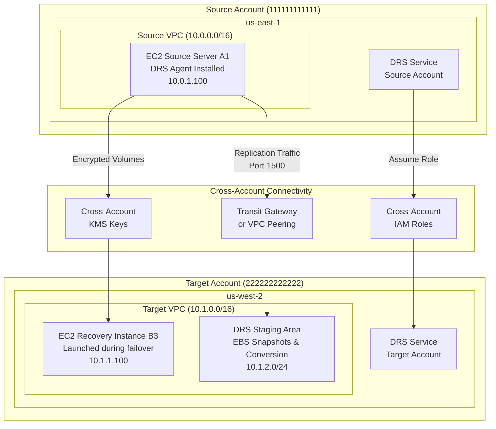

# DRS Cross-Account Operations Reference

**Version**: 2.1 (January 1, 2026)  
**Purpose**: Comprehensive guide to AWS DRS cross-account disaster recovery setup and operations  
**Scope**: Architecture, configuration, networking, and troubleshooting

---

## Overview

AWS Elastic Disaster Recovery (DRS) enables cross-account disaster recovery scenarios where source servers in one AWS account can be replicated and recovered to a different AWS account. This setup provides additional isolation and security for disaster recovery operations.

### Key Benefits
- **Account Isolation**: Separate billing, security boundaries, and administrative control
- **Compliance**: Meet regulatory requirements for data segregation
- **Security**: Reduced blast radius in case of account compromise
- **Operational Flexibility**: Different teams can manage source and target environments

### Supported Scenarios
- Cross-account within same region
- Cross-account cross-region
- Hybrid (on-premises to AWS cross-account)
- AWS to AWS cross-account

## Cross-Account Architecture



## Cross-Account IAM Configuration

### 1. Source Account Setup

#### DRS Service Role Configuration
The source account needs the standard DRS service role with additional cross-account permissions:

**Role Name**: `AWSElasticDisasterRecoveryServiceRole`

**Trust Policy**:
```json
{
    "Version": "2012-10-17",
    "Statement": [
        {
            "Effect": "Allow",
            "Principal": {
                "Service": "drs.amazonaws.com"
            },
            "Action": "sts:AssumeRole"
        }
    ]
}
```

**Additional Permissions Policy**:
```json
{
    "Version": "2012-10-17",
    "Statement": [
        {
            "Sid": "CrossAccountAssumeRole",
            "Effect": "Allow",
            "Action": "sts:AssumeRole",
            "Resource": "arn:aws:iam::TARGET-ACCOUNT-ID:role/DRSCrossAccountRole"
        }
    ]
}
```

### 2. Target Account Setup

#### Cross-Account DRS Role
Create a dedicated role in the target account for DRS operations:

**Role Name**: `DRSCrossAccountRole`

**Trust Policy**:
```json
{
    "Version": "2012-10-17",
    "Statement": [
        {
            "Effect": "Allow",
            "Principal": {
                "AWS": "arn:aws:iam::SOURCE-ACCOUNT-ID:role/service-role/AWSElasticDisasterRecoveryServiceRole"
            },
            "Action": "sts:AssumeRole",
            "Condition": {
                "StringEquals": {
                    "sts:ExternalId": "unique-external-id-12345"
                }
            }
        }
    ]
}
```

**Permissions Policy**:
```json
{
    "Version": "2012-10-17",
    "Statement": [
        {
            "Sid": "EC2FullAccess",
            "Effect": "Allow",
            "Action": [
                "ec2:*"
            ],
            "Resource": "*"
        },
        {
            "Sid": "IAMPassRole",
            "Effect": "Allow",
            "Action": "iam:PassRole",
            "Resource": [
                "arn:aws:iam::*:role/AWSElasticDisasterRecovery*"
            ]
        },
        {
            "Sid": "DRSServiceAccess",
            "Effect": "Allow",
            "Action": [
                "drs:*"
            ],
            "Resource": "*"
        }
    ]
}
```

### 3. External ID Management

**Generate Unique External ID**:
```bash
# Generate cryptographically secure external ID
EXTERNAL_ID=$(openssl rand -hex 16)
echo "External ID: $EXTERNAL_ID"
```

**Configure in DRS**:
```bash
# Set external ID in DRS configuration
aws drs put-replication-configuration \
    --source-server-id s-1234567890abcdef0 \
    --target-account-id 222222222222 \
    --external-id $EXTERNAL_ID
```

## KMS Key Requirements for Cross-Account Encryption

### Source Account KMS Configuration

**Key Policy for Source Account**:
```json
{
    "Version": "2012-10-17",
    "Statement": [
        {
            "Sid": "EnableRootAccess",
            "Effect": "Allow",
            "Principal": {
                "AWS": "arn:aws:iam::SOURCE-ACCOUNT-ID:root"
            },
            "Action": "kms:*",
            "Resource": "*"
        },
        {
            "Sid": "AllowCrossAccountDRSAccess",
            "Effect": "Allow",
            "Principal": {
                "AWS": "arn:aws:iam::TARGET-ACCOUNT-ID:role/DRSCrossAccountRole"
            },
            "Action": [
                "kms:Decrypt",
                "kms:DescribeKey",
                "kms:GenerateDataKey"
            ],
            "Resource": "*"
        },
        {
            "Sid": "AllowDRSServiceAccess",
            "Effect": "Allow",
            "Principal": {
                "Service": "drs.amazonaws.com"
            },
            "Action": [
                "kms:Decrypt",
                "kms:DescribeKey",
                "kms:GenerateDataKey",
                "kms:CreateGrant"
            ],
            "Resource": "*"
        }
    ]
}
```

### Target Account KMS Configuration

**Key Policy for Target Account**:
```json
{
    "Version": "2012-10-17",
    "Statement": [
        {
            "Sid": "EnableRootAccess",
            "Effect": "Allow",
            "Principal": {
                "AWS": "arn:aws:iam::TARGET-ACCOUNT-ID:root"
            },
            "Action": "kms:*",
            "Resource": "*"
        },
        {
            "Sid": "AllowDRSServiceAccess",
            "Effect": "Allow",
            "Principal": {
                "Service": "drs.amazonaws.com"
            },
            "Action": [
                "kms:Encrypt",
                "kms:Decrypt",
                "kms:ReEncrypt*",
                "kms:GenerateDataKey*",
                "kms:DescribeKey",
                "kms:CreateGrant"
            ],
            "Resource": "*"
        },
        {
            "Sid": "AllowCrossAccountSourceAccess",
            "Effect": "Allow",
            "Principal": {
                "AWS": "arn:aws:iam::SOURCE-ACCOUNT-ID:role/service-role/AWSElasticDisasterRecoveryServiceRole"
            },
            "Action": [
                "kms:Encrypt",
                "kms:GenerateDataKey"
            ],
            "Resource": "*"
        }
    ]
}
```

## Network Configuration

### VPC Connectivity Options

#### Option 1: VPC Peering
```bash
# Create VPC peering connection
aws ec2 create-vpc-peering-connection \
    --vpc-id vpc-source123 \
    --peer-vpc-id vpc-target456 \
    --peer-region us-west-2 \
    --peer-owner-id 222222222222

# Accept peering connection (in target account)
aws ec2 accept-vpc-peering-connection \
    --vpc-peering-connection-id pcx-12345678
```

#### Option 2: Transit Gateway
```bash
# Share Transit Gateway with target account
aws ec2 create-resource-share \
    --name "DRS-TGW-Share" \
    --resource-arns arn:aws:ec2:us-east-1:111111111111:transit-gateway/tgw-12345678 \
    --principals 222222222222
```

### Security Group Configuration

#### Source Account Security Groups
```yaml
# DRS Source Security Group
Name: drs-source-sg
Rules:
  Outbound:
    - Protocol: TCP
      Port: 443
      Destination: 0.0.0.0/0
      Description: "HTTPS to DRS service"
    - Protocol: TCP
      Port: 1500
      Destination: 10.1.0.0/16
      Description: "DRS replication to target VPC"
    - Protocol: UDP
      Port: 53
      Destination: 0.0.0.0/0
      Description: "DNS resolution"
```

#### Target Account Security Groups
```yaml
# DRS Target Security Group
Name: drs-target-sg
Rules:
  Inbound:
    - Protocol: TCP
      Port: 1500
      Source: 10.0.0.0/16
      Description: "DRS replication from source VPC"
  Outbound:
    - Protocol: TCP
      Port: 443
      Destination: 0.0.0.0/0
      Description: "HTTPS to AWS services"
```

### Route Table Configuration

#### Source Account Routes
```bash
# Add route to target VPC via peering connection
aws ec2 create-route \
    --route-table-id rtb-source123 \
    --destination-cidr-block 10.1.0.0/16 \
    --vpc-peering-connection-id pcx-12345678
```

#### Target Account Routes
```bash
# Add route to source VPC via peering connection
aws ec2 create-route \
    --route-table-id rtb-target456 \
    --destination-cidr-block 10.0.0.0/16 \
    --vpc-peering-connection-id pcx-12345678
```

## DRS Agent Installation for Cross-Account

### Agent Configuration
The DRS agent on source servers needs additional configuration for cross-account scenarios:

**Agent Configuration File** (`/etc/aws-replication-agent/agent_config.json`):
```json
{
    "region": "us-east-1",
    "target_account_id": "222222222222",
    "target_region": "us-west-2",
    "external_id": "unique-external-id-12345",
    "staging_area_subnet_id": "subnet-target789",
    "replication_server_instance_type": "m5.large",
    "use_dedicated_replication_server": false,
    "bandwidth_throttling": 0,
    "create_public_ip": false,
    "data_plane_routing": "PRIVATE_IP",
    "default_large_staging_disk_type": "GP3",
    "ebs_encryption": "ENABLED",
    "ebs_encryption_key_arn": "arn:aws:kms:us-west-2:222222222222:key/target-key-id",
    "replicated_disks": [
        {
            "device_name": "/dev/sda1",
            "is_boot_disk": true,
            "staging_disk_type": "GP3"
        }
    ]
}
```

### Installation Command
```bash
# Install DRS agent with cross-account configuration
sudo ./aws-replication-installer-init.py \
    --region us-east-1 \
    --target-account-id 222222222222 \
    --external-id unique-external-id-12345 \
    --no-prompt
```

## Failover Process

### Cross-Account Recovery Execution

#### 1. Pre-Failover Validation
```bash
# Validate cross-account connectivity
aws drs describe-source-servers \
    --filters '{"name":"sourceServerID","values":["s-1234567890abcdef0"]}'

# Check replication status
aws drs describe-replication-configuration-templates \
    --replication-configuration-template-ids rct-12345678
```

#### 2. Initiate Cross-Account Recovery
```bash
# Start recovery job with cross-account parameters
aws drs start-recovery \
    --source-servers '[{
        "sourceServerID": "s-1234567890abcdef0",
        "recoveryInstanceType": "m5.large"
    }]' \
    --target-account-id 222222222222 \
    --is-drill false \
    --tags '{"Environment":"DR","Account":"Cross"}'
```

#### 3. Monitor Recovery Progress
```bash
# Monitor job status
aws drs describe-jobs \
    --filters '{"jobIDs":["drsjob-12345678"]}'

# Check recovery instances in target account
aws ec2 describe-instances \
    --filters 'Name=tag:AWSElasticDisasterRecoveryManaged,Values=*' \
    --region us-west-2 \
    --profile target-account
```

## Failback Process

### Cross-Account Failback Configuration

#### 1. Reverse Replication Setup
```bash
# Configure reverse replication from target to source
aws drs create-replication-configuration-template \
    --associate-default-security-group \
    --bandwidth-throttling 0 \
    --create-public-ip false \
    --data-plane-routing PRIVATE_IP \
    --default-large-staging-disk-type GP3 \
    --ebs-encryption ENABLED \
    --replication-server-instance-type m5.large \
    --staging-area-subnet-id subnet-source123 \
    --staging-area-tags '{"Purpose":"DRS-Failback"}'
```

#### 2. Initiate Failback
```bash
# Start failback process
aws drs start-failback-launch \
    --recovery-instance-ids i-target789 \
    --tags '{"Operation":"Failback","Direction":"Target-to-Source"}'
```

## Troubleshooting Cross-Account Issues

### Common Issues and Solutions

#### 1. Role Assumption Failures
**Symptoms**:
- Error: "Cannot assume role in target account"
- Cross-account recovery fails immediately

**Diagnosis**:
```bash
# Test role assumption
aws sts assume-role \
    --role-arn arn:aws:iam::TARGET-ACCOUNT:role/DRSCrossAccountRole \
    --role-session-name test-session \
    --external-id unique-external-id-12345
```

**Solutions**:
- Verify trust relationship includes correct source account
- Check external ID matches exactly
- Ensure role has necessary permissions

#### 2. Network Connectivity Issues
**Symptoms**:
- Replication fails or is slow
- Agent cannot connect to DRS service

**Diagnosis**:
```bash
# Test connectivity from source to target
telnet 10.1.2.100 1500

# Check route tables
aws ec2 describe-route-tables \
    --filters 'Name=vpc-id,Values=vpc-source123'
```

**Solutions**:
- Verify VPC peering or Transit Gateway configuration
- Check security group rules allow port 1500
- Validate route tables include cross-VPC routes

#### 3. KMS Key Access Issues
**Symptoms**:
- Encrypted volume replication fails
- Recovery instances cannot decrypt volumes

**Diagnosis**:
```bash
# Test KMS key access
aws kms describe-key \
    --key-id arn:aws:kms:region:account:key/key-id

# Check key policy
aws kms get-key-policy \
    --key-id key-id \
    --policy-name default
```

**Solutions**:
- Update KMS key policies for cross-account access
- Ensure DRS service has necessary KMS permissions
- Verify key is available in target region

#### 4. Staging Area Issues
**Symptoms**:
- Staging area creation fails
- Insufficient subnet capacity

**Diagnosis**:
```bash
# Check staging area configuration
aws drs describe-replication-configuration-templates

# Verify subnet capacity
aws ec2 describe-subnets \
    --subnet-ids subnet-target789
```

**Solutions**:
- Ensure staging subnet has sufficient IP addresses
- Verify subnet is in correct availability zone
- Check subnet route table configuration

### Monitoring and Alerting

#### CloudWatch Metrics
```bash
# Create custom metric for cross-account replication lag
aws cloudwatch put-metric-data \
    --namespace "DRS/CrossAccount" \
    --metric-data MetricName=ReplicationLag,Value=30,Unit=Seconds,Dimensions=[{Name=SourceAccount,Value=111111111111},{Name=TargetAccount,Value=222222222222}]
```

#### CloudTrail Monitoring
```bash
# Monitor cross-account DRS API calls
aws logs filter-log-events \
    --log-group-name CloudTrail/DRSCrossAccount \
    --filter-pattern "{ $.eventSource = drs.amazonaws.com && $.recipientAccountId = 222222222222 }"
```

## Security Best Practices

### 1. Least Privilege Access
- Use condition-based policies with specific resource ARNs
- Limit cross-account access to DRS-specific operations
- Regular audit of cross-account permissions

### 2. External ID Management
- Generate cryptographically secure external IDs
- Rotate external IDs periodically
- Store external IDs securely (AWS Secrets Manager)

### 3. Network Security
- Use private subnets for staging areas
- Implement VPC Flow Logs for monitoring
- Regular security group audits

### 4. Encryption
- Use customer-managed KMS keys
- Implement key rotation policies
- Separate encryption keys per account/environment

### 5. Monitoring and Auditing
- Enable CloudTrail in both accounts
- Monitor cross-account role assumptions
- Set up alerts for failed operations
- Regular compliance audits

This comprehensive reference provides all necessary information for implementing and troubleshooting DRS cross-account operations.