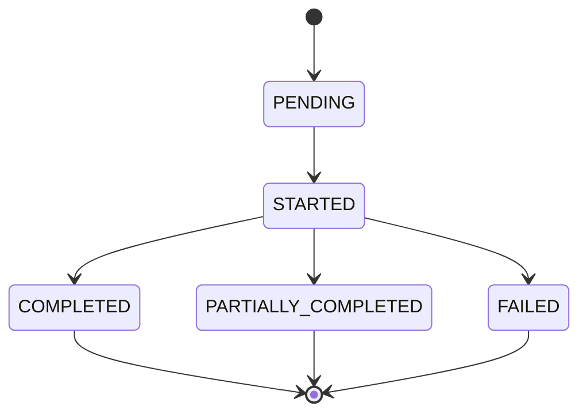

# AWS Elastic Disaster Recovery (DRS) - Service Limits and Capabilities

**Version**: 2.1 (January 1, 2026)  
**Purpose**: Comprehensive analysis of AWS DRS service capabilities, limitations, quotas, and operational constraints  
**Scope**: Service quotas, API constraints, UI design rules, and multi-account recommendations

---

## Executive Summary

Comprehensive analysis of AWS DRS service capabilities, limitations, quotas, and operational constraints to inform UI design rules and API restrictions for the orchestration solution.

## Service Quotas and Limits

> **Last Validated**: December 10, 2025 against AWS Service Quotas API

### Account-Level Limits

| Resource | Current Limit | Adjustable | Quota Code | Notes |
|----------|---------------|------------|------------|-------|
| **Source servers per account** | 4,000 | Yes | L-E28BE5E0 | Adjustable via Service Quotas |
| **Replicating source servers** | 300 | **No (Hard Limit)** | L-C1D14A2B | **Cannot be increased - critical constraint** |
| **Max source servers in all Jobs** | 500 | No | L-05AFA8C6 | Total servers across all active jobs |
| **Concurrent jobs (total)** | 20 | No | L-D88FAC3A | Combined recovery + drill jobs |
| **Max source servers per job** | 100 | No | L-B827C881 | Hard limit per single job |
| **Max concurrent jobs per server** | 1 | No | L-DD6D028C | Server can only be in one job at a time |
| **Max launch actions per resource** | 200 | No | L-0588D03B | Post-launch automation actions |
| **Max launch config templates** | 1 | No | L-1F3FAE4D | Per source server |
| **Max source networks per account** | 100 | Yes | L-4B0323BD | Network configurations |
| **Snapshots per source server** | 1,024 | No | N/A | Point-in-time recovery snapshots |

**Critical Note**: The 300 replicating source servers limit is a **hard limit** that cannot be increased. This is the most important constraint for capacity planning.

### Regional Limits

| Resource | Current Limit | Adjustable | Notes |
|----------|---------------|------------|-------|
| **Source servers per region** | 4,000 | Yes | Same as account limit |
| **Replicating source servers per region** | 300 | **No (Hard Limit)** | Critical constraint |
| **Staging area subnets** | 1 per AZ | No | DRS creates automatically |
| **Replication settings templates** | 100 | Yes | Per region |

### Job-Level Constraints

| Constraint | Limit | Impact on Orchestration |
|------------|-------|------------------------|
| **Max servers per recovery job** | 100 | Wave size must be ≤ 100 servers |
| **Max servers per drill job** | 100 | Drill wave size must be ≤ 100 servers |
| **Max source servers in all Jobs** | 500 | Total servers across all concurrent jobs |
| **Job timeout** | 24 hours | Jobs auto-fail after 24h |
| **Concurrent jobs per account** | 20 | Combined recovery + drill jobs (not split) |

## DRS Job States and Transitions

### Job Status Lifecycle



### Server Launch Status within Jobs

| Status | Description | Orchestration Action |
|--------|-------------|---------------------|
| `PENDING` | Server queued for launch | Continue polling |
| `IN_PROGRESS` | Launch in progress | Continue polling |
| `LAUNCHED` | Successfully launched | Mark wave complete |
| `FAILED` | Launch failed | Handle error, may retry |
| `STOPPED` | Launch stopped/cancelled | Handle cancellation |
| `PENDING_LAUNCH` | Waiting for launch trigger | Should not occur in API usage |

### Critical Job Constraints

1. **No Job Modification**: Once started, jobs cannot be modified (servers cannot be added/removed)
2. **No Job Pause**: Jobs cannot be paused - they run to completion or failure
3. **No Partial Cancellation**: Cannot cancel individual servers within a job
4. **Job Cleanup**: Failed jobs may leave resources that need manual cleanup

## Multi-Account Architecture Recommendations

### AWS Hard Limit: 300 Replicating Source Servers

The 300 replicating source servers limit is a **hard limit** that cannot be increased via Service Quotas. This is the most critical constraint for capacity planning:

#### Understanding Replicating vs Source Servers

**Critical Distinction**:
- **Replicating servers**: Servers actively replicating data TO an AWS account (300 max per account)
- **Source servers**: Total servers that can be RECOVERED FROM an account (4,000 max per account)

**The Staging Account Pattern** (How to exceed 300 servers):

```
Example: 500 servers need DR protection

┌──────────────────────┐         ┌──────────────────────┐
│  Staging Account A   │         │  Staging Account B   │
│  250 servers         │         │  250 servers         │
│  replicating         │         │  replicating         │
└──────────────────────┘         └──────────────────────┘
         │                                  │
         │ Extended as source servers       │
         └──────────────┬───────────────────┘
                        ▼
              ┌──────────────────────┐
              │   Target Account     │
              │   500 source servers │
              │   (250 + 250)        │
              │   All can recover    │
              │   into this account  │
              └──────────────────────┘

Result: All 500 servers visible in Target Account console
        All 500 can recover into Target Account
        No replication limit exceeded (250 < 300 per account)
```

This works because:
- Each staging account stays under 300 replicating limit
- Target account can have 4,000 source servers (includes extended servers)
- All servers appear in Target Account DRS console
- All servers can recover into Target Account

#### Why Multi-Account Architecture

| Factor | Single Account (at 300 limit) | Multi-Account (≤300 per account) |
|--------|------------------------------|----------------------------------|
| **Replicating Servers** | Hard limit of 300 | 300 per account, scales horizontally |
| **API Rate Limiting** | Shared across all servers | Distributed across accounts |
| **Replication Bandwidth** | Contention for staging area resources | Isolated bandwidth per account |
| **Job Concurrency** | 20 jobs shared across all servers | 20 jobs per account |
| **Management Complexity** | High - single point of failure | Distributed - isolated failures |
| **Cost Allocation** | Difficult to separate by business unit | Clear separation by account |

#### When to Use Multi-Account Architecture

| Scenario | Recommendation | Rationale |
|----------|----------------|----------|
| **< 100 servers** | Single account | Simple management, low complexity |
| **100-250 servers** | Single account (monitor capacity) | Acceptable with good monitoring |
| **250-300 servers** | Plan for multi-account | Approaching hard limit |
| **300+ servers** | **Multi-account required** | Hard limit of 300 replicating servers per account |
| **Up to 4,000 servers** | Multiple staging accounts + 1 target | Use staging account pattern (up to 13 staging accounts) |
| **Multiple business units** | Multi-account | Clear ownership and billing |
| **Multiple regions** | Multi-account per region | Simplified regional management |
| **Compliance requirements** | Multi-account | Isolation for regulatory compliance |

#### Capacity Planning Examples

**Example 1: Single Account (Up to 300 servers)**
```
Replicating: 300 servers
Source servers: 300 servers
Recovery capacity: 300 servers
```

**Example 2: Two Staging Accounts (Up to 600 servers)**
```
Staging Account A: 300 replicating → extended to Target
Staging Account B: 300 replicating → extended to Target
Target Account: 600 source servers (all can recover)
```

**Example 3: Maximum Scale (Up to 4,000 servers)**
```
Staging Account 1-13: 300 replicating each → extended to Target
Staging Account 14: 100 replicating → extended to Target
Target Account: 4,000 source servers (maximum)
```

## UI Design Rules and Restrictions

### Account Capacity Warnings

```typescript
// Account capacity validation
const ACCOUNT_CAPACITY_LIMITS = {
  HARD_MAX_REPLICATING_SERVERS: 300,  // Hard limit - cannot be increased
  SOFT_MAX_SOURCE_SERVERS: 4000,      // Adjustable service quota
  WARNING_THRESHOLD: 250,              // Show multi-account warning
  CRITICAL_THRESHOLD: 280              // Block new servers, recommend new account
};

function validateAccountCapacity(currentReplicatingCount: number): ValidationResult {
  if (currentReplicatingCount >= ACCOUNT_CAPACITY_LIMITS.HARD_MAX_REPLICATING_SERVERS) {
    return {
      valid: false,
      level: 'error',
      message: `Account has ${currentReplicatingCount} replicating servers. Hard limit of 300 reached.`,
      recommendation: 'Create additional AWS accounts for new servers - this limit cannot be increased'
    };
  }
  
  if (currentReplicatingCount >= ACCOUNT_CAPACITY_LIMITS.CRITICAL_THRESHOLD) {
    return {
      valid: true,
      level: 'warning',
      message: `Account approaching 300 replicating server hard limit (${currentReplicatingCount}/300).`,
      recommendation: 'Plan for additional AWS accounts - limit cannot be increased'
    };
  }
  
  if (currentReplicatingCount >= ACCOUNT_CAPACITY_LIMITS.WARNING_THRESHOLD) {
    return {
      valid: true,
      level: 'info', 
      message: `Account at ${currentReplicatingCount}/300 replicating servers. Consider multi-account architecture.`,
      recommendation: 'Plan for additional AWS accounts'
    };
  }
  
  return { valid: true };
}
```

### Wave Size Validation

```typescript
// UI Validation Rules
const WAVE_SIZE_LIMITS = {
  MAX_SERVERS_PER_WAVE: 100,
  MAX_CONCURRENT_WAVES: 10, // Based on job limits
  MAX_TOTAL_SERVERS: 1000   // Account limit
};

function validateWaveSize(servers: string[]): ValidationResult {
  if (servers.length > WAVE_SIZE_LIMITS.MAX_SERVERS_PER_WAVE) {
    return {
      valid: false,
      error: `Wave cannot exceed ${WAVE_SIZE_LIMITS.MAX_SERVERS_PER_WAVE} servers`
    };
  }
  return { valid: true };
}
```

### Concurrent Execution Restrictions

```typescript
// Execution Limits
const EXECUTION_LIMITS = {
  MAX_CONCURRENT_JOBS: 20,           // Total concurrent jobs (recovery + drill combined)
  MAX_SERVERS_IN_ALL_JOBS: 500,      // Total servers across all active jobs
  MAX_SERVERS_PER_JOB: 100           // Per individual job
};

function validateConcurrentExecutions(
  activeJobs: number,
  serversInActiveJobs: number,
  newJobServerCount: number
): ValidationResult {
  if (activeJobs >= EXECUTION_LIMITS.MAX_CONCURRENT_JOBS) {
    return {
      valid: false,
      error: 'Maximum concurrent jobs (20) reached'
    };
  }
  
  const totalServersAfterNewJob = serversInActiveJobs + newJobServerCount;
  if (totalServersAfterNewJob > EXECUTION_LIMITS.MAX_SERVERS_IN_ALL_JOBS) {
    return {
      valid: false,
      error: `Would exceed max servers in all jobs (${totalServersAfterNewJob}/${EXECUTION_LIMITS.MAX_SERVERS_IN_ALL_JOBS})`
    };
  }
  
  if (newJobServerCount > EXECUTION_LIMITS.MAX_SERVERS_PER_JOB) {
    return {
      valid: false,
      error: `Job exceeds max servers per job (${newJobServerCount}/${EXECUTION_LIMITS.MAX_SERVERS_PER_JOB})`
    };
  }
  
  return { valid: true };
}
```

## API Rate Limiting and Throttling

### DRS API Rate Limits

| API Call | Rate Limit | Burst Limit | Orchestration Impact |
|----------|------------|-------------|---------------------|
| `StartRecovery` | 10/minute | 20 | Limit wave start frequency |
| `DescribeJobs` | 100/minute | 200 | Polling frequency constraint |
| `DescribeSourceServers` | 100/minute | 200 | Server discovery rate |
| `UpdateLaunchConfiguration` | 50/minute | 100 | Configuration update rate |
| `TerminateRecoveryInstances` | 20/minute | 40 | Cleanup rate limit |

### Recommended API Usage Patterns

```typescript
// Rate-Limited API Client
class DRSApiClient {
  private rateLimiter = new RateLimiter({
    startRecovery: { rate: 8, burst: 15 },      // Stay under 10/min limit
    describeJobs: { rate: 80, burst: 150 },     // Stay under 100/min limit
    describeSourceServers: { rate: 80, burst: 150 }
  });
  
  async startRecovery(request: StartRecoveryRequest): Promise<StartRecoveryResponse> {
    await this.rateLimiter.acquire('startRecovery');
    return this.drsClient.startRecovery(request);
  }
}
```

## Regional Availability and Constraints

### DRS Supported Regions (December 2025)

AWS DRS is available in **30 regions** (28 commercial + 2 GovCloud):

| Region Group | Count | Regions |
|--------------|-------|---------|
| **Americas** | 6 | US East (N. Virginia, Ohio), US West (Oregon, N. California), Canada (Central), South America (São Paulo) |
| **Europe** | 8 | Ireland, London, Frankfurt, Paris, Stockholm, Milan, Spain, Zurich |
| **Asia Pacific** | 10 | Tokyo, Seoul, Osaka, Singapore, Sydney, Mumbai, Hyderabad, Jakarta, Melbourne, Hong Kong |
| **Middle East & Africa** | 4 | Bahrain, UAE, Cape Town, Tel Aviv |
| **GovCloud** | 2 | US-East, US-West |

### Cross-Region Constraints

1. **No Cross-Region Replication**: Source and target must be in same region
2. **No Cross-Region Recovery**: Cannot recover to different region
3. **Regional Isolation**: Each region operates independently
4. **Launch Template Limitations**: Cannot use launch templates across regions

## Error Handling and Recovery Scenarios

### Common DRS API Errors

| Error Code | Cause | UI Handling | Recovery Action |
|------------|-------|-------------|-----------------|
| `ThrottlingException` | Rate limit exceeded | Show retry message | Exponential backoff |
| `ValidationException` | Invalid parameters | Show validation error | Fix parameters |
| `ResourceNotFoundException` | Server not found | Show error message | Refresh server list |
| `ConflictException` | Server already in use | Show conflict message | Wait or cancel |
| `ServiceQuotaExceededException` | Quota exceeded | Show quota error | Request increase |
| `InternalServerError` | AWS service issue | Show retry message | Retry with backoff |

## Summary of Critical UI Rules

### Execution Rules

1. **Max 100 servers per wave** - Hard DRS limit per job
2. **Max 20 concurrent jobs** - Combined recovery + drill (not split)
3. **Max 500 servers in all jobs** - Total across all active jobs
4. **Validate server replication state** - Must be healthy
5. **Check account quotas** - Before starting executions

### Account Capacity Rules

1. **300 replicating servers is a HARD LIMIT** - Cannot be increased
2. **Show warning at 250 replicating servers** - Plan for multi-account
3. **Block new servers at 280+ replicating servers** - Approaching hard limit
4. **4,000 source servers per account** - Adjustable service quota
5. **500 max servers in all jobs** - Adjustable service quota

### Planning Rules
1. **Max 1,000 servers per account** - Service quota
2. **Validate circular dependencies** - Prevent infinite loops
3. **Check server availability** - Not in other executions
4. **Validate launch templates** - Must exist and be valid
5. **Regional constraints** - All servers must be in same region

### Operational Rules
1. **Rate limit API calls** - Respect service limits
2. **Implement exponential backoff** - For throttling errors
3. **Monitor job timeouts** - 24-hour limit
4. **Handle partial failures** - Some servers may fail
5. **Cleanup drill instances** - Prevent unnecessary charges
6. **Monitor account capacity** - Track server count vs 300 limit

## Key Findings Summary

### Critical Discovery: 300 Replicating Server Hard Limit

**Most Important Finding**: The **300 replicating source servers limit is a hard limit** that cannot be increased via Service Quotas. This is the most critical constraint for capacity planning.

**Why 300 Replicating Server Limit Matters**:

- This is a **hard limit** - cannot be increased via Service Quotas
- Applies to servers actively replicating data
- Forces multi-account architecture for larger deployments
- API rate limiting shared across all servers in account
- Replication bandwidth contention in staging areas

**UI Implementation Impact**:

- Must implement account capacity warnings at 250 replicating servers
- Should block new server additions at 280+ replicating servers
- Need multi-account guidance and migration planning
- Clearly distinguish between "source servers" (4,000) and "replicating servers" (300)

This research provides the foundation for implementing comprehensive validation, error handling, and user guidance in the orchestration UI, with particular emphasis on the critical 300 replicating server hard limit.