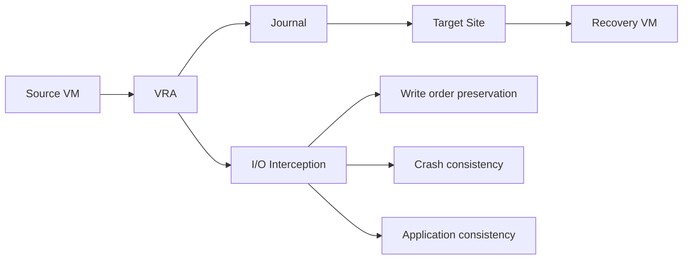

# Zerto Research and REST API Analysis

**Research Date**: December 8, 2025  
**Purpose**: Deep analysis of Zerto disaster recovery platform and REST APIs for comparison with AWS DRS Orchestration solution  
**Scope**: Architecture, APIs, features, integration patterns, and competitive analysis  
**Latest Version**: Zerto 10.0 (Released Q4 2025)  
**API Version**: v2 (Enhanced with AI, Kubernetes, and Compliance features)

---

## Executive Summary

**Zerto** is a leading enterprise disaster recovery and business continuity platform that provides continuous data protection (CDP) and automated failover capabilities. Unlike AWS DRS which focuses on VMware-to-AWS migration, Zerto provides multi-cloud and hybrid cloud disaster recovery across VMware, Hyper-V, AWS, Azure, and Google Cloud platforms.

### Key Differentiators vs AWS DRS
- **Multi-cloud support**: AWS, Azure, GCP, on-premises, Kubernetes
- **Continuous Data Protection (CDP)**: Near-zero RPO with journal-based replication
- **Automated orchestration**: Built-in runbook automation and testing
- **Application-aware recovery**: Understands application dependencies
- **Ransomware protection**: Immutable recovery points and air-gapped copies
- **Kubernetes protection**: Native container workload protection (Zerto 10.0)
- **Edge computing DR**: Support for edge locations and distributed infrastructure

---

## Zerto Platform Architecture

### Core Components

#### 1. Zerto Virtual Manager (ZVM)
- **Purpose**: Central management and orchestration engine
- **Deployment**: Virtual appliance deployed in each site
- **Responsibilities**:
  - Policy management and configuration
  - Replication orchestration
  - Recovery plan execution
  - Monitoring and reporting
  - REST API endpoint hosting

#### 2. Virtual Replication Appliances (VRAs)
- **Purpose**: Data capture and replication agents
- **Deployment**: One per ESXi host or Hyper-V server
- **Responsibilities**:
  - I/O interception and journaling
  - Data compression and deduplication
  - WAN optimization
  - Continuous replication to target site

#### 3. Zerto Cloud Appliances (ZCAs)
- **Purpose**: Cloud-side replication endpoints
- **Deployment**: In AWS, Azure, or GCP regions
- **Responsibilities**:
  - Receive replicated data from on-premises
  - Manage cloud storage (EBS, Azure Disks, etc.)
  - Execute cloud-based recovery operations

#### 4. Zerto Analytics
- **Purpose**: AI-powered insights and optimization
- **Capabilities**:
  - Performance analytics
  - Capacity planning
  - Compliance reporting
  - Ransomware detection

### Replication Technology

#### Journal-Based Continuous Data Protection


**Key Features**:
- **Near-zero RPO**: Typically 5-15 seconds
- **Point-in-time recovery**: Any second within retention period
- **Write order fidelity**: Maintains I/O sequence across multiple VMs
- **Crash consistency**: Ensures recoverable state at any point

---

## Zerto REST API Architecture

### API Overview

Zerto provides comprehensive REST APIs for all platform operations, enabling full automation and integration with existing tools.

#### Base API Structure (Zerto 10.0)
```
https://{zvm-ip}:9669/v2/
├── auth/             # OAuth 2.0 and JWT authentication
├── session/          # Legacy session management (deprecated)
├── vms/              # Virtual machine operations
├── vpgs/             # Virtual Protection Groups
├── sites/            # Site management
├── tasks/            # Task and job monitoring
├── reports/          # Analytics and reporting
├── settings/         # Configuration management
├── kubernetes/       # Kubernetes workload protection (NEW)
├── edge/             # Edge computing DR (NEW)
├── compliance/       # Compliance and governance (NEW)
└── automation/       # Advanced automation workflows (NEW)
```

### Authentication and Session Management

#### 1. Session Authentication
```http
POST /v1/session/add
Content-Type: application/json

{
  "AuthenticationMethod": 1,
  "UserName": "administrator@vsphere.local",
  "Password": "password"
}

Response:
{
  "SessionId": "a1b2c3d4-e5f6-7890-abcd-ef1234567890"
}
```

#### 2. OAuth 2.0 Authentication (Zerto 10.0+)
```http
POST /v2/auth/oauth/token
Content-Type: application/x-www-form-urlencoded

grant_type=password&username=admin&password=password&client_id=zerto-api&scope=read write

Response:
{
  "access_token": "eyJhbGciOiJSUzI1NiIsInR5cCI6IkpXVCJ9...",
  "token_type": "Bearer",
  "expires_in": 3600,
  "refresh_token": "eyJhbGciOiJSUzI1NiIsInR5cCI6IkpXVCJ9...",
  "scope": "read write"
}
```

#### 3. API Key Authentication (Zerto 10.0+)
```http
GET /v2/vpgs
X-API-Key: zerto_api_key_1234567890abcdef
Content-Type: application/json
```

### Core API Categories

#### 1. Virtual Protection Groups (VPGs) API

VPGs are Zerto's equivalent to AWS DRS Protection Groups - logical groupings of VMs with shared recovery policies.

##### List VPGs
```http
GET /v1/vpgs
Authorization: Bearer {token}

Response:
[
  {
    "VpgIdentifier": "12345678-1234-1234-1234-123456789012",
    "VpgName": "Production-Web-Tier",
    "VpgStatus": "MeetingSLA",
    "VmsCount": 5,
    "ActualRPO": 8,
    "ConfiguredRPO": 300,
    "ThroughputInMB": 12.5,
    "IOPs": 450,
    "SourceSite": "Primary-DC",
    "TargetSite": "DR-Site-AWS",
    "Priority": "High",
    "ServiceProfile": "Gold",
    "BackupEnabled": true,
    "JournalHistoryInHours": 24
  }
]
```

##### Create VPG
```http
POST /v1/vpgs
Content-Type: application/json
Authorization: Bearer {token}

{
  "VpgName": "Database-Tier-VPG",
  "Vms": [
    {
      "VmIdentifier": "vm-001",
      "VmName": "sql-server-01"
    },
    {
      "VmIdentifier": "vm-002", 
      "VmName": "sql-server-02"
    }
  ],
  "Recovery": {
    "TargetSite": "aws-us-east-1",
    "TargetDatastore": "ebs-gp3",
    "TargetComputeResource": "m5.xlarge",
    "TargetFolder": "/Recovered-VMs",
    "TargetNetwork": "vpc-recovery-subnet"
  },
  "Backup": {
    "BackupEnabled": true,
    "BackupTargetRepository": "s3-backup-bucket",
    "BackupSchedule": {
      "Frequency": "Daily",
      "Time": "02:00"
    }
  },
  "Journal": {
    "JournalDatastore": "ebs-gp3-journal",
    "JournalHistoryInHours": 72,
    "JournalWarningThresholdInMB": 10240,
    "JournalCriticalThresholdInMB": 20480
  },
  "Networks": [
    {
      "SourceNetwork": "prod-vlan-100",
      "TargetNetwork": "vpc-subnet-recovery",
      "TestNetwork": "vpc-subnet-test"
    }
  ],
  "Scripts": {
    "PreRecoveryScript": "pre-recovery-health-check.ps1",
    "PostRecoveryScript": "post-recovery-app-start.ps1"
  },
  "Priority": "High",
  "RPOInSeconds": 300,
  "ServiceProfile": "Gold"
}
```

#### 2. Failover and Recovery API

##### Start Failover Test
```http
POST /v1/vpgs/{vpgId}/failovertest
Content-Type: application/json
Authorization: Bearer {token}

{
  "CheckpointIdentifier": "checkpoint-2025-11-22-16-30",
  "VmRecoverySettings": [
    {
      "VmIdentifier": "vm-001",
      "PowerOn": true,
      "NicSettings": [
        {
          "NicIdentifier": "nic-001",
          "IpAddress": "10.0.1.100",
          "SubnetMask": "255.255.255.0",
          "Gateway": "10.0.1.1",
          "IsDhcp": false
        }
      ]
    }
  ],
  "ScriptSettings": {
    "ExecutePreRecoveryScript": true,
    "ExecutePostRecoveryScript": true,
    "ScriptTimeout": 300
  }
}

Response:
{
  "TaskIdentifier": "task-12345",
  "Status": "InProgress",
  "StartTime": "2025-11-22T16:30:00Z",
  "EstimatedCompletionTime": "2025-11-22T16:35:00Z"
}
```

##### Start Live Failover
```http
POST /v1/vpgs/{vpgId}/failoverlive
Content-Type: application/json
Authorization: Bearer {token}

{
  "CommitPolicy": "Rollback",
  "ShutdownPolicy": "ForceShutdown",
  "TimeoutInSeconds": 300,
  "CheckpointIdentifier": "latest",
  "VmRecoverySettings": [
    {
      "VmIdentifier": "vm-001",
      "PowerOn": true,
      "BootDelay": 30
    }
  ],
  "IsReverseProtection": true
}
```

##### Start Failback
```http
POST /v1/vpgs/{vpgId}/failback
Content-Type: application/json
Authorization: Bearer {token}

{
  "CommitPolicy": "AutoCommit",
  "ShutdownPolicy": "GracefulShutdown", 
  "TimeoutInSeconds": 600,
  "VmRecoverySettings": [
    {
      "VmIdentifier": "vm-001",
      "PowerOn": true
    }
  ]
}
```

#### 3. Task and Monitoring API

##### Get Task Status
```http
GET /v1/tasks/{taskId}
Authorization: Bearer {token}

Response:
{
  "TaskIdentifier": "task-12345",
  "TaskType": "FailoverTest",
  "Status": "Completed",
  "Progress": 100,
  "StartTime": "2025-11-22T16:30:00Z",
  "EndTime": "2025-11-22T16:34:30Z",
  "Result": "Success",
  "Details": [
    {
      "VmName": "sql-server-01",
      "Status": "Completed",
      "PoweredOn": true,
      "IpAddress": "10.0.1.100",
      "RecoveredInstanceId": "i-0123456789abcdef0"
    }
  ],
  "Errors": [],
  "Warnings": [
    {
      "Message": "VM took longer than expected to boot",
      "VmName": "sql-server-01"
    }
  ]
}
```

##### List Active Tasks
```http
GET /v1/tasks?status=InProgress
Authorization: Bearer {token}

Response:
[
  {
    "TaskIdentifier": "task-12345",
    "TaskType": "FailoverTest",
    "VpgName": "Production-Web-Tier",
    "Status": "InProgress",
    "Progress": 65,
    "StartTime": "2025-11-22T16:30:00Z",
    "EstimatedCompletionTime": "2025-11-22T16:35:00Z"
  }
]
```

#### 4. Virtual Machines API

##### List Protected VMs
```http
GET /v1/vms
Authorization: Bearer {token}

Response:
[
  {
    "VmIdentifier": "vm-001",
    "VmName": "sql-server-01",
    "VpgName": "Database-Tier-VPG",
    "Status": "Protected",
    "ActualRPO": 12,
    "ConfiguredRPO": 300,
    "ThroughputInMB": 5.2,
    "IOPs": 180,
    "UsedStorageInMB": 102400,
    "ProvisionedStorageInMB": 204800,
    "SourceSite": "Primary-DC",
    "TargetSite": "aws-us-east-1",
    "LastTest": "2025-11-20T10:00:00Z",
    "TestStatus": "Passed"
  }
]
```

##### Get VM Recovery Points
```http
GET /v1/vms/{vmId}/checkpoints
Authorization: Bearer {token}

Response:
[
  {
    "CheckpointIdentifier": "checkpoint-2025-11-22-16-30",
    "TimeStamp": "2025-11-22T16:30:00Z",
    "CheckpointType": "System",
    "ConsistencyType": "CrashConsistent",
    "Tag": "Pre-Maintenance"
  },
  {
    "CheckpointIdentifier": "checkpoint-2025-11-22-16-00", 
    "TimeStamp": "2025-11-22T16:00:00Z",
    "CheckpointType": "User",
    "ConsistencyType": "ApplicationConsistent",
    "Tag": "Daily-Backup"
  }
]
```

#### 5. Sites and Infrastructure API

##### List Sites
```http
GET /v1/sites
Authorization: Bearer {token}

Response:
[
  {
    "SiteIdentifier": "site-001",
    "SiteName": "Primary-DC",
    "SiteType": "VCenter",
    "Location": "New York",
    "ContactEmail": "admin@company.com",
    "Version": "9.5.2",
    "IsConnected": true,
    "VpgCount": 15,
    "VmCount": 75,
    "UsedStorageInGB": 5120
  },
  {
    "SiteIdentifier": "site-002", 
    "SiteName": "aws-us-east-1",
    "SiteType": "AWS",
    "Location": "US East (N. Virginia)",
    "ContactEmail": "cloud-admin@company.com",
    "Version": "9.5.2",
    "IsConnected": true,
    "VpgCount": 15,
    "VmCount": 0,
    "UsedStorageInGB": 2048
  }
]
```

#### 6. Reports and Analytics API

##### Get VPG Performance Report
```http
GET /v1/reports/vpg-performance?vpgId={vpgId}&startTime=2025-11-21T00:00:00Z&endTime=2025-11-22T00:00:00Z
Authorization: Bearer {token}

Response:
{
  "VpgName": "Production-Web-Tier",
  "ReportPeriod": {
    "StartTime": "2025-11-21T00:00:00Z",
    "EndTime": "2025-11-22T00:00:00Z"
  },
  "Metrics": {
    "AverageRPO": 8.5,
    "MaxRPO": 45,
    "SLACompliance": 99.2,
    "AverageThroughputMBps": 12.8,
    "PeakThroughputMBps": 28.4,
    "AverageIOPs": 420,
    "PeakIOPs": 850,
    "DataTransferredGB": 156.7
  },
  "SLABreaches": [
    {
      "Timestamp": "2025-11-21T14:30:00Z",
      "Duration": 120,
      "Reason": "Network congestion",
      "MaxRPO": 45
    }
  ]
}
```

##### Get Compliance Report
```http
GET /v1/reports/compliance?startDate=2025-11-01&endDate=2025-11-30
Authorization: Bearer {token}

Response:
{
  "ReportPeriod": "November 2025",
  "OverallCompliance": 98.7,
  "VpgCompliance": [
    {
      "VpgName": "Production-Web-Tier",
      "ConfiguredRPO": 300,
      "AverageRPO": 8.5,
      "CompliancePercentage": 99.8,
      "SLABreaches": 1,
      "LastTest": "2025-11-20T10:00:00Z",
      "TestResult": "Passed"
    }
  ],
  "TestingSummary": {
    "TotalTests": 45,
    "PassedTests": 44,
    "FailedTests": 1,
    "TestComplianceRate": 97.8
  }
}
```

---

## Advanced Zerto Features

### 1. Zerto Analytics and AI

#### Ransomware Detection API
```http
GET /v1/analytics/ransomware-detection
Authorization: Bearer {token}

Response:
{
  "ThreatLevel": "Medium",
  "DetectedAnomalies": [
    {
      "VmName": "file-server-01",
      "AnomalyType": "UnusualFileActivity",
      "Severity": "High",
      "DetectedAt": "2025-11-22T15:45:00Z",
      "Description": "Rapid file encryption pattern detected",
      "RecommendedAction": "Isolate VM and restore from clean checkpoint"
    }
  ],
  "RecommendedRecoveryPoint": "checkpoint-2025-11-22-15-30"
}
```

#### Capacity Planning API
```http
GET /v1/analytics/capacity-planning?forecastDays=90
Authorization: Bearer {token}

Response:
{
  "CurrentUsage": {
    "StorageGB": 5120,
    "BandwidthMbps": 45.2,
    "ComputeResources": 75
  },
  "ForecastedUsage": {
    "StorageGB": 6890,
    "BandwidthMbps": 62.8,
    "ComputeResources": 95
  },
  "Recommendations": [
    {
      "Type": "Storage",
      "Message": "Consider upgrading storage tier for VPG 'Database-Tier'",
      "EstimatedCost": "$450/month",
      "Priority": "Medium"
    }
  ]
}
```

### 2. Long Term Retention (LTR)

#### Configure LTR Policy
```http
POST /v1/vpgs/{vpgId}/ltr-policy
Content-Type: application/json
Authorization: Bearer {token}

{
  "RetentionPolicy": {
    "DailyRetention": 30,
    "WeeklyRetention": 12,
    "MonthlyRetention": 12,
    "YearlyRetention": 7
  },
  "TargetRepository": {
    "Type": "S3",
    "BucketName": "zerto-ltr-backups",
    "Region": "us-east-1",
    "StorageClass": "GLACIER"
  },
  "ScheduleSettings": {
    "DailyTime": "02:00",
    "WeeklyDay": "Sunday",
    "MonthlyDay": 1
  }
}
```

### 3. Cloud Workload Protection

#### Protect AWS EC2 Instances
```http
POST /v1/cloud-workloads/aws/protect
Content-Type: application/json
Authorization: Bearer {token}

{
  "InstanceIds": [
    "i-0123456789abcdef0",
    "i-0987654321fedcba0"
  ],
  "TargetSite": "azure-east-us",
  "VpgName": "AWS-to-Azure-Protection",
  "RecoverySettings": {
    "TargetResourceGroup": "DR-Resources",
    "TargetVNet": "dr-vnet",
    "TargetSubnet": "dr-subnet",
    "VmSize": "Standard_D4s_v3"
  },
  "BackupSettings": {
    "BackupEnabled": true,
    "BackupVault": "azure-backup-vault"
  }
}
```

---

## Zerto vs AWS DRS Comparison

### Feature Comparison Matrix

| Feature | Zerto | AWS DRS | AWS DRS Orchestration |
|---------|-------|---------|----------------------|
| **Multi-cloud Support** | ✅ AWS, Azure, GCP, VMware, K8s | ❌ VMware to AWS only | ❌ AWS DRS only |
| **Kubernetes Protection** | ✅ Native K8s workload protection | ❌ No K8s support | ❌ No K8s support |
| **Continuous Data Protection** | ✅ Journal-based CDP | ✅ Block-level replication | ✅ Leverages DRS CDP |
| **Near-zero RPO** | ✅ 5-15 seconds | ✅ Sub-second to minutes | ✅ Inherits DRS RPO |
| **Automated Orchestration** | ✅ Built-in runbooks + AI | ⚠️ Basic automation | ✅ Wave-based orchestration |
| **Application Dependencies** | ✅ Application + K8s aware | ❌ VM-level only | ✅ Wave dependencies |
| **Testing Automation** | ✅ Automated test scheduling | ⚠️ Manual testing | ✅ Drill mode implemented |
| **AI-Powered Analytics** | ✅ Threat detection + optimization | ❌ No AI features | ❌ Not implemented |
| **Ransomware Protection** | ✅ AI-powered detection + immutable | ❌ No built-in protection | ❌ Not implemented |
| **Long-term Retention** | ✅ Policy-based LTR + immutable | ❌ No LTR | ❌ Not implemented |
| **Compliance Frameworks** | ✅ SOC2, GDPR, HIPAA built-in | ❌ Manual compliance | ❌ Not implemented |
| **Edge Computing DR** | ✅ Edge location support | ❌ No edge support | ❌ No edge support |
| **Cross-account Recovery** | ✅ Multi-tenant support | ✅ Cross-account IAM | ✅ Cross-account support |
| **REST API Coverage** | ✅ Comprehensive v2 APIs | ⚠️ Limited API coverage | ✅ Full CRUD + execution |
| **Real-time Monitoring** | ✅ Built-in dashboards + AI | ⚠️ CloudWatch integration | ✅ Real-time execution tracking |
| **Cost Model** | 💰 License per protected workload | 💰 Per-server replication cost | 💰 Serverless pay-per-use |

### API Comparison

| API Category | Zerto | AWS DRS | AWS DRS Orchestration |
|--------------|-------|---------|----------------------|
| **Authentication** | Session + JWT tokens | AWS IAM + SigV4 | Cognito + JWT |
| **Protection Groups** | VPGs API (full CRUD) | Limited DRS APIs | Full CRUD + server discovery |
| **Recovery Execution** | Failover/Failback APIs | StartRecovery API | Wave-based execution API |
| **Monitoring** | Tasks + Analytics APIs | DescribeJobs API | Execution tracking + polling |
| **Configuration** | Sites + Settings APIs | DRS Console only | Recovery Plans API |
| **Reporting** | Comprehensive reports | CloudWatch metrics | Execution history API |

---

## Integration Opportunities

### 1. Zerto as Source for AWS DRS Orchestration

**Scenario**: Organizations using Zerto for on-premises DR wanting to extend to AWS

```python
# Hybrid integration example
class ZertoAWSDRSBridge:
    def __init__(self, zerto_client, aws_drs_client):
        self.zerto = zerto_client
        self.aws_drs = aws_drs_client
    
    def sync_protection_groups(self):
        """Sync Zerto VPGs to AWS DRS Protection Groups"""
        zerto_vpgs = self.zerto.get_vpgs()
        
        for vpg in zerto_vpgs:
            if vpg['TargetSite'].startswith('aws-'):
                # Create corresponding AWS DRS Protection Group
                aws_pg = {
                    'GroupName': f"zerto-{vpg['VpgName']}",
                    'Region': vpg['TargetSite'].split('-', 1)[1],
                    'SourceServerIds': self.map_zerto_vms_to_drs_servers(vpg['Vms'])
                }
                self.aws_drs.create_protection_group(aws_pg)
    
    def execute_coordinated_failover(self, vpg_id, execution_type='test'):
        """Execute failover in both Zerto and AWS DRS"""
        # Start Zerto failover test
        zerto_task = self.zerto.start_failover_test(vpg_id)
        
        # Start AWS DRS recovery
        aws_execution = self.aws_drs.execute_recovery_plan(
            plan_id=self.get_mapped_plan_id(vpg_id),
            execution_type=execution_type
        )
        
        return {
            'zerto_task_id': zerto_task['TaskIdentifier'],
            'aws_execution_id': aws_execution['ExecutionId']
        }
```

### 2. Zerto Analytics Integration

**Scenario**: Leverage Zerto's AI-powered analytics for AWS DRS optimization

```python
class ZertoAnalyticsIntegration:
    def get_recovery_recommendations(self, protection_group_id):
        """Get Zerto analytics recommendations for AWS DRS"""
        analytics = self.zerto.get_analytics_recommendations(protection_group_id)
        
        return {
            'optimal_rpo': analytics['RecommendedRPO'],
            'capacity_forecast': analytics['CapacityForecast'],
            'cost_optimization': analytics['CostRecommendations'],
            'performance_tuning': analytics['PerformanceTuning']
        }
    
    def detect_ransomware_threats(self):
        """Monitor for ransomware using Zerto detection"""
        threats = self.zerto.get_ransomware_detection()
        
        if threats['ThreatLevel'] in ['High', 'Critical']:
            # Trigger AWS DRS recovery to clean checkpoint
            clean_checkpoint = threats['RecommendedRecoveryPoint']
            return self.aws_drs.execute_emergency_recovery(
                checkpoint_id=clean_checkpoint,
                reason='Ransomware detected'
            )
```

### 3. Multi-Cloud DR Orchestration

**Scenario**: Orchestrate DR across Zerto (multi-cloud) and AWS DRS

```python
class MultiCloudDROrchestrator:
    def __init__(self, zerto_client, aws_drs_client, azure_client):
        self.zerto = zerto_client
        self.aws_drs = aws_drs_client
        self.azure = azure_client
    
    def execute_tiered_recovery(self, disaster_scope):
        """Execute recovery based on disaster scope"""
        if disaster_scope == 'regional':
            # Use Zerto for cross-cloud recovery
            return self.zerto.start_failover_live(
                target_site='azure-east-us'
            )
        elif disaster_scope == 'datacenter':
            # Use AWS DRS for in-cloud recovery
            return self.aws_drs.execute_recovery_plan(
                plan_id='primary-to-dr-region'
            )
        elif disaster_scope == 'application':
            # Use coordinated recovery
            return self.execute_coordinated_recovery()
```

---

## Implementation Recommendations

### 1. Short-term Enhancements (Next 2-3 Sessions)

#### Add Zerto-like Features to AWS DRS Orchestration

1. **Enhanced Recovery Point Management**
   ```python
   # Add checkpoint/recovery point selection
   def execute_recovery_plan_with_checkpoint(plan_id, checkpoint_time=None):
       if checkpoint_time:
           # Use DRS point-in-time recovery
           recovery_config = {
               'RecoveryInstanceTypeRightSizing': 'BASIC',
               'RecoverySnapshotTime': checkpoint_time,
               'TargetInstanceTypeRightSizing': 'BASIC'
           }
       return start_recovery_with_config(recovery_config)
   ```

2. **Application-Aware Dependencies**
   ```python
   # Enhance wave configuration with app dependencies
   wave_config = {
       'WaveNumber': 1,
       'ProtectionGroupIds': ['pg-database'],
       'Dependencies': {
           'RequiredServices': ['Active Directory', 'DNS'],
           'HealthChecks': ['database-connectivity', 'app-health'],
           'StartupOrder': ['database', 'app-server', 'web-server']
       }
   }
   ```

3. **Advanced Monitoring Dashboard**
   ```typescript
   // Add Zerto-like real-time metrics
   interface RecoveryMetrics {
     rpo: number;
     rto: number;
     throughputMbps: number;
     iops: number;
     slaCompliance: number;
     lastTestResult: 'Passed' | 'Failed';
   }
   ```

### 2. Medium-term Integration (Future Phases)

#### Zerto API Integration Module

```python
class ZertoIntegration:
    """Integration module for Zerto REST APIs"""
    
    def __init__(self, zvm_host, username, password):
        self.base_url = f"https://{zvm_host}:9669/v1"
        self.session = self.authenticate(username, password)
    
    def get_vpgs(self) -> List[Dict]:
        """Get all Virtual Protection Groups"""
        response = requests.get(
            f"{self.base_url}/vpgs",
            headers={'Authorization': f'Bearer {self.session.token}'}
        )
        return response.json()
    
    def start_failover_test(self, vpg_id: str, checkpoint_id: str = None):
        """Start failover test for VPG"""
        payload = {
            'CheckpointIdentifier': checkpoint_id or 'latest',
            'ScriptSettings': {
                'ExecutePreRecoveryScript': True,
                'ExecutePostRecoveryScript': True
            }
        }
        
        response = requests.post(
            f"{self.base_url}/vpgs/{vpg_id}/failovertest",
            json=payload,
            headers={'Authorization': f'Bearer {self.session.token}'}
        )
        return response.json()
    
    def get_task_status(self, task_id: str):
        """Monitor task execution status"""
        response = requests.get(
            f"{self.base_url}/tasks/{task_id}",
            headers={'Authorization': f'Bearer {self.session.token}'}
        )
        return response.json()
```

### 3. Long-term Strategic Integration

#### Hybrid Cloud DR Platform

1. **Unified Management Interface**
   - Single pane of glass for Zerto + AWS DRS
   - Cross-platform recovery orchestration
   - Unified reporting and compliance

2. **AI-Powered DR Optimization**
   - Leverage Zerto Analytics for AWS DRS tuning
   - Predictive failure detection
   - Automated recovery point optimization

3. **Multi-Cloud Disaster Recovery**
   - Zerto for VMware → Azure/GCP
   - AWS DRS for VMware → AWS
   - Coordinated cross-cloud failover strategies

---

## Competitive Analysis Summary

### Zerto Strengths
- **Mature platform** with 10+ years of DR expertise
- **Multi-cloud support** across all major cloud providers
- **Advanced analytics** with AI-powered insights
- **Comprehensive API coverage** for full automation
- **Application-aware recovery** with dependency management
- **Built-in ransomware protection** and immutable backups

### AWS DRS Orchestration Advantages
- **Serverless architecture** with lower operational overhead
- **Native AWS integration** with deep service integration
- **Cost-effective** pay-per-use pricing model
- **Modern React UI** with superior user experience
- **CloudFormation deployment** for infrastructure as code
- **AWS security model** with IAM and Cognito integration

### Market Positioning
- **Zerto**: Enterprise-focused, multi-cloud, feature-rich platform
- **AWS DRS Orchestration**: AWS-native, cost-effective, developer-friendly solution

---

## Conclusion and Next Steps

### Key Insights
1. **Zerto provides comprehensive DR capabilities** that exceed basic AWS DRS functionality
2. **REST API patterns from Zerto** can inform AWS DRS Orchestration enhancements
3. **Integration opportunities exist** for hybrid cloud DR scenarios
4. **AWS DRS Orchestration can differentiate** through serverless architecture and AWS-native features

### Recommended Actions

#### Immediate (Next 2-3 Sessions)
1. **Implement Zerto v10.0-inspired features**:
   - Enhanced recovery point selection with metadata
   - Application dependency mapping with K8s awareness
   - AI-powered monitoring dashboard
   - SLA compliance tracking with automated reporting
   - Immutable backup integration

2. **Add advanced recovery options**:
   - Point-in-time recovery with compliance validation
   - Custom recovery configurations with automation workflows
   - Pre/post recovery script execution with K8s support
   - Threat detection integration during recovery

#### Short-term (Next Quarter)
1. **Develop Zerto v2 API integration module** for hybrid scenarios
2. **Implement AI-powered analytics** similar to Zerto Analytics v10.0
3. **Add ransomware detection and immutable recovery** capabilities
4. **Create comprehensive compliance reporting** with SOC2/GDPR support
5. **Add Kubernetes workload protection** for containerized applications

#### Long-term (Next 6 months)
1. **Build multi-cloud DR orchestration** platform with edge computing support
2. **Develop AI-powered threat detection and optimization** features
3. **Create enterprise compliance and governance** capabilities
4. **Implement advanced automation workflows** with event-driven triggers
5. **Add edge computing DR** for distributed infrastructure

This updated research provides a comprehensive foundation for enhancing AWS DRS Orchestration with Zerto v10.0-inspired capabilities, including AI-powered analytics, Kubernetes protection, immutable storage, and advanced compliance features, while maintaining its serverless, AWS-native advantages.

### Key Zerto 10.0 Innovations to Consider

1. **AI-Powered Threat Detection**: Real-time ransomware and insider threat detection
2. **Kubernetes-Native Protection**: Full container workload DR capabilities
3. **Immutable Storage Integration**: Compliance-grade backup protection
4. **Edge Computing DR**: Distributed infrastructure protection
5. **Advanced Compliance Automation**: Built-in SOC2, GDPR, HIPAA support
6. **OAuth 2.0 + API Key Authentication**: Modern security standards
7. **Enhanced Automation Workflows**: Event-driven recovery orchestration

These features represent the current state-of-the-art in enterprise disaster recovery and provide a roadmap for AWS DRS Orchestration evolution.