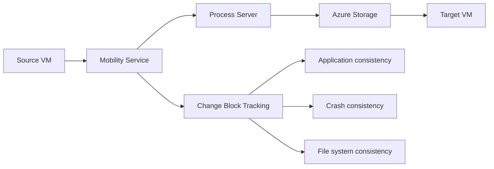

# Azure Site Recovery (ASR) Competitive Analysis

**Research Date**: November 22, 2025  
**Purpose**: Deep analysis of Azure Site Recovery platform and REST APIs for comparison with AWS DRS Orchestration solution  
**Scope**: Architecture, APIs, features, integration patterns, and competitive analysis

---

## Executive Summary

**Azure Site Recovery (ASR)** is Microsoft's native disaster recovery service that provides business continuity and disaster recovery (BCDR) capabilities for Azure, on-premises, and multi-cloud environments. ASR offers automated replication, failover, and failback for virtual machines and physical servers across Azure regions and from on-premises to Azure.

### Key Differentiators vs AWS DRS

- **Native Azure integration**: Deep integration with Azure services and ARM templates
- **Multi-source support**: VMware, Hyper-V, physical servers, and Azure VMs
- **Azure-to-Azure replication**: Native cross-region DR within Azure
- **Hybrid cloud focus**: Strong on-premises to Azure migration capabilities
- **ARM template automation**: Infrastructure as Code with Azure Resource Manager

---

## Azure Site Recovery Architecture

### Core Components

#### 1. Recovery Services Vault
- **Purpose**: Central management and storage container for ASR
- **Responsibilities**: Backup and replication data storage, policy management, recovery point management, monitoring and reporting, cross-region replication orchestration

#### 2. Configuration Server (On-premises)
- **Purpose**: Coordinates communication between on-premises and Azure
- **Deployment**: On-premises VM or physical server
- **Responsibilities**: Discover on-premises VMs, coordinate replication, manage Mobility Service deployment, handle failback operations

#### 3. Process Server
- **Purpose**: Replication gateway and data optimization
- **Deployment**: Co-located with Configuration Server or separate
- **Responsibilities**: Receive replication data, data compression/encryption/caching, send data to Azure Storage, handle Mobility Service push installation

#### 4. Master Target Server
- **Purpose**: Handle failback replication data
- **Deployment**: Azure VM for failback operations
- **Responsibilities**: Receive failback replication data from Azure, store data during failback process, coordinate with on-premises infrastructure

#### 5. Mobility Service
- **Purpose**: Agent installed on protected machines
- **Deployment**: Automatic push or manual installation
- **Responsibilities**: Capture disk changes, ensure application consistency, handle VSS snapshots, coordinate with file system

### Replication Technology

#### Block-Level Replication

**Key Features**:
- **RPO**: 30 seconds to 24 hours (configurable)
- **Multi-point recovery**: Multiple recovery points with retention
- **Application consistency**: VSS snapshots for Windows, script-based for Linux
- **Bandwidth optimization**: Compression, encryption, and throttling

## Competitive Comparison vs AWS DRS Orchestration

### Feature Comparison Matrix

| Feature | Azure Site Recovery | AWS DRS Orchestration | Winner |
|---------|-------------------|---------------------|--------|
| **Multi-Cloud Support** | ✅ Azure, VMware, Hyper-V | ❌ AWS only | Azure |
| **Cross-Region DR** | ✅ Native Azure regions | ✅ AWS regions | Tie |
| **Orchestration** | ⚠️ Basic runbooks | ✅ Advanced wave-based | AWS |
| **API Completeness** | ✅ Comprehensive REST API | ✅ 42+ endpoints | Tie |
| **Infrastructure as Code** | ✅ ARM templates | ✅ CloudFormation | Tie |
| **Cost Model** | ❌ Complex pricing | ✅ Simple serverless | AWS |
| **Setup Complexity** | ❌ High (multiple components) | ✅ Low (serverless) | AWS |
| **Enterprise RBAC** | ⚠️ Basic Azure RBAC | ✅ Custom DRS roles | AWS |
| **Real-time Monitoring** | ⚠️ Basic dashboards | ✅ Advanced real-time UI | AWS |

### Architecture Comparison

#### Azure ASR Architecture
- **Complex multi-component**: Configuration Server, Process Server, Master Target Server
- **Agent-based**: Mobility Service on every protected machine
- **Storage-centric**: Recovery Services Vault as central component
- **Network-intensive**: Multiple replication streams and components

#### AWS DRS Orchestration Architecture
- **Serverless simplicity**: Lambda, Step Functions, API Gateway
- **Agent-minimal**: DRS service handles most agent functionality
- **API-first**: Complete REST API for all operations
- **Event-driven**: EventBridge and Step Functions orchestration

### Strengths and Weaknesses

#### Azure Site Recovery Strengths
1. **Multi-platform support**: VMware, Hyper-V, physical servers
2. **Mature product**: Long history and extensive feature set
3. **Native Azure integration**: Deep integration with Azure services
4. **Hybrid cloud focus**: Strong on-premises to cloud capabilities
5. **Enterprise features**: Advanced networking and security options

#### Azure Site Recovery Weaknesses
1. **Complexity**: Multiple components and complex setup
2. **Cost**: Complex pricing model with multiple charges
3. **Vendor lock-in**: Primarily Azure-focused
4. **Limited orchestration**: Basic runbook capabilities
5. **Management overhead**: Requires significant operational expertise

#### AWS DRS Orchestration Strengths
1. **Simplicity**: Serverless architecture with minimal components
2. **Advanced orchestration**: Wave-based execution with dependencies
3. **Cost-effective**: Simple serverless pricing model
4. **API-first design**: Complete automation capabilities
5. **Real-time monitoring**: Advanced UI with live updates
6. **Enterprise RBAC**: Granular role-based access control

#### AWS DRS Orchestration Weaknesses
1. **AWS-only**: Limited to AWS ecosystem
2. **Newer product**: Less mature than established competitors
3. **Single-cloud**: No multi-cloud disaster recovery
4. **Learning curve**: New concepts for traditional DR teams

## Market Positioning

### Target Markets

#### Azure Site Recovery
- **Enterprise hybrid cloud**: Organizations with significant on-premises infrastructure
- **Microsoft shops**: Organizations heavily invested in Microsoft ecosystem
- **Multi-cloud environments**: Organizations using multiple cloud providers
- **Complex environments**: Large enterprises with diverse infrastructure

#### AWS DRS Orchestration
- **AWS-native organizations**: Companies fully committed to AWS
- **DevOps-focused teams**: Organizations prioritizing automation and APIs
- **Cost-conscious enterprises**: Organizations seeking simple, predictable pricing
- **Modern architectures**: Companies building cloud-native applications

### Competitive Advantages

#### When to Choose Azure Site Recovery
- Existing Microsoft/Azure investment
- Multi-platform source environments (VMware, Hyper-V)
- Complex hybrid cloud requirements
- Need for extensive customization options

#### When to Choose AWS DRS Orchestration
- AWS-native infrastructure
- Need for advanced orchestration capabilities
- Preference for serverless, API-first architecture
- Requirement for cost-effective, simple pricing
- Teams focused on automation and DevOps practices

This competitive analysis provides strategic insights for positioning AWS DRS Orchestration against Azure Site Recovery in the enterprise disaster recovery market.