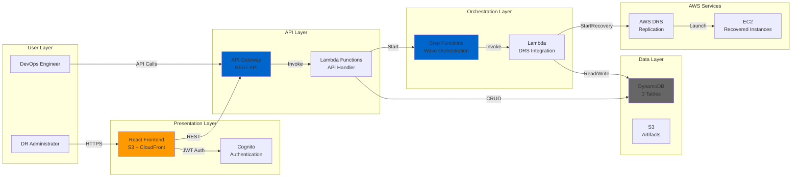

# Product Requirements Document
# AWS DRS Orchestration Solution

**Version**: 2.0  
**Date**: November 23, 2025  
**Status**: Requirements Specification  
**Document Owner**: AWS DRS Orchestration Team  
**Target Audience**: Product Managers, Engineering Leads, Executive Stakeholders

---

## Document Purpose

This Product Requirements Document (PRD) defines the AWS DRS Orchestration solution that will provide enterprise-grade disaster recovery orchestration capabilities for AWS Elastic Disaster Recovery Service (DRS). The solution shall enable organizations to implement cloud-native disaster recovery with automated orchestration, dependency management, and comprehensive testing capabilities.

**Key Objective**: Provide complete technical specifications for implementing an enterprise disaster recovery orchestration platform on AWS.

---

## Table of Contents

1. [Executive Summary](#executive-summary)
2. [Product Vision & Strategic Fit](#product-vision--strategic-fit)
3. [Target Users & Personas](#target-users--personas)
4. [Business Objectives & Success Metrics](#business-objectives--success-metrics)
5. [Feature Overview - SRM Parity Design](#feature-overview---srm-parity-design)
6. [Current Implementation Status](#current-implementation-status)
7. [Roadmap to SRM Parity](#roadmap-to-srm-parity)
8. [Cost Analysis](#cost-analysis)
9. [Technical Architecture Overview](#technical-architecture-overview)
10. [Out of Scope](#out-of-scope)
11. [Assumptions & Dependencies](#assumptions--dependencies)
12. [Risk Assessment](#risk-assessment)
13. [Decision Framework](#decision-framework)
14. [Glossary](#glossary)

---

## Executive Summary

### The Challenge

Organizations implementing disaster recovery on AWS require enterprise-grade orchestration capabilities for AWS Elastic Disaster Recovery Service (DRS). The solution shall provide:

- **Automated orchestration** of multi-tier application recovery
- **Dependency management** between application components
- **Wave-based execution** with configurable boot order
- **Testing capabilities** without impacting production
- **Audit trails** and execution history
- **API-driven automation** for integration with existing tools

### The Solution

AWS DRS Orchestration will be a cloud-native, serverless solution providing enterprise orchestration capabilities for AWS DRS. The system shall be built entirely on AWS services (no third-party dependencies) and will deliver:

- **Protection Groups** - Logical grouping of servers with discovery capabilities
- **Recovery Plans** - Wave-based orchestration with unlimited flexibility
- **Execution Engine** - Step Functions-driven recovery automation
- **Modern UI** - React-based frontend with real-time monitoring
- **API-First Design** - Complete REST API for automation and integration

### Business Value

**Cost Efficiency**: Pay-per-use cloud-native pricing model  
**Cloud Native**: Leverages AWS-managed services for reliability and scale  
**Platform Agnostic**: Agent-based replication supports any source platform  
**Automation Ready**: API-first design enables full DevOps integration  
**Enterprise Grade**: Production-ready disaster recovery orchestration

---

## Product Vision & Strategic Fit

### Vision Statement

*"Provide enterprise organizations with a cloud-native disaster recovery orchestration platform that matches or exceeds VMware SRM capabilities while leveraging AWS-native services for superior reliability, scalability, and cost-effectiveness."*

### Strategic Context

#### Market Drivers
1. **VMware to AWS Migration**: Enterprises seeking to modernize DR infrastructure
2. **Cost Optimization**: Shift from CapEx (SRM licenses + hardware) to OpEx (pay-per-use)
3. **Cloud-First Strategies**: Organizations adopting AWS as primary DR target
4. **Automation Demands**: DevOps teams requiring API-driven disaster recovery
5. **Compliance Requirements**: Need for audit trails and tested recovery procedures

#### Competitive Positioning

The solution shall provide enterprise-grade disaster recovery orchestration capabilities that leverage AWS-native services and modern cloud architecture patterns:

**Core Differentiators**:
- **Platform Flexibility**: Agent-based replication supports any source platform (VMware, physical servers, cloud VMs)
- **Sub-Second RPO**: Continuous block-level replication versus traditional storage-array limitations
- **Unlimited Orchestration**: Wave-based execution with explicit dependencies (no artificial constraints)
- **Cloud Economics**: Pay-per-use operational expenditure model versus capital expenditure requirements
- **API-First Design**: Complete REST API enabling DevOps integration and automation
- **Serverless Architecture**: AWS-managed infrastructure eliminating operational overhead

**Strategic Advantages**:
- Cloud-native design leverages AWS platform reliability and scalability
- Eliminates dependency on expensive storage array replication licenses
- Enables hybrid cloud and multi-cloud disaster recovery strategies
- Provides complete audit trails and execution history for compliance
- Scales linearly from small deployments to enterprise-wide implementations

### Strategic Fit

**Aligns With**:
- AWS migration and modernization initiatives
- Cloud-native application architectures
- DevOps and infrastructure-as-code practices
- Cost optimization and FinOps strategies

**Enables**:
- Seamless VMware to AWS disaster recovery transitions
- Multi-cloud and hybrid cloud DR strategies
- Automated, tested, and documented recovery procedures
- Compliance with disaster recovery testing requirements

---

## Target Users & Personas

### Primary Persona: DR Administrator

**Name**: Sarah Martinez  
**Role**: Disaster Recovery Administrator  
**Organization**: Enterprise IT Operations  
**Experience**: 5+ years with VMware SRM

**Background**:
- Currently manages VMware SRM 8.8 for 200+ servers
- Responsible for quarterly DR testing and documentation
- Reports to Infrastructure Manager on DR readiness
- Frustrated with manual processes and high licensing costs

**Goals**:
- Automate recovery plan execution and testing
- Reduce manual effort in DR procedures
- Achieve sub-5-minute RTO for critical applications
- Lower total cost of ownership for DR infrastructure

**Pain Points**:
- Manual server discovery and grouping in SRM
- Limited to 5 priority levels in recovery plans
- Expensive storage array replication licenses
- Complex test bubble configuration
- Difficulty integrating SRM with CI/CD pipelines

**Success Criteria**:
- Can create Protection Groups in < 5 minutes
- Can execute recovery drills without production impact
- Has API access for automation
- Achieves 99.9% recovery success rate
- Reduces DR infrastructure costs by 80%+

### Secondary Persona: DevOps Engineer

**Name**: Alex Chen  
**Role**: Senior DevOps Engineer  
**Organization**: Application Development Team  

**Goals**:
- Integrate DR automation into CI/CD pipelines
- Automate pre/post-recovery validation scripts
- Monitor recovery execution via APIs
- Implement infrastructure-as-code for DR configuration

**Needs**:
- RESTful API for all DR operations
- CloudWatch integration for monitoring
- Git-based configuration management
- Lambda/SSM integration for custom scripts

### Tertiary Persona: IT Manager

**Name**: James Wilson  
**Role**: IT Infrastructure Manager  
**Organization**: Enterprise IT Leadership  

**Goals**:
- Demonstrate compliance with DR testing requirements
- Optimize IT infrastructure costs
- Ensure business continuity capabilities
- Report on DR readiness to executive leadership

**Needs**:
- Execution history and audit trails
- Cost reporting and optimization
- Success metrics and SLA dashboards
- Executive-level status reporting

---

## Business Objectives & Success Metrics

### Business Objectives

#### 1. Cost Reduction
**Objective**: Reduce disaster recovery infrastructure costs by 80%+ compared to VMware SRM  
**Target**: Achieve $12-40/month operational cost vs $10K-50K/year VMware licensing

#### 2. Operational Efficiency
**Objective**: Automate 95% of DR operations through API-driven workflows  
**Target**: Reduce manual DR administration time by 60%

#### 3. Reliability
**Objective**: Achieve 99.9% recovery execution success rate  
**Target**: < 5 failed recoveries per 1,000 executions

#### 4. Compliance
**Objective**: Enable quarterly DR testing with complete audit trails  
**Target**: 100% of DR tests documented with execution history

#### 5. Adoption
**Objective**: Achieve VMware SRM feature parity to enable seamless transition  
**Target**: 90%+ feature parity within 6 months of MVP

### Success Metrics

#### Operational Metrics
- **Recovery Time Objective (RTO)**: < 15 minutes for critical applications
- **Recovery Point Objective (RPO)**: < 5 minutes (leveraging DRS sub-second replication)
- **Recovery Success Rate**: > 99.5%
- **API Availability**: > 99.9%

#### Cost Metrics
- **Monthly Operational Cost**: $12-40/month (target: < $50/month)
- **Cost Per Protected Server**: < $0.50/month/server
- **Total Cost Reduction vs SRM**: > 80%

#### User Satisfaction Metrics
- **Time to Create Protection Group**: < 5 minutes
- **Time to Create Recovery Plan**: < 10 minutes
- **DR Test Execution Time**: < 30 minutes for 3-tier application
- **User Satisfaction Score**: > 4.5/5.0

#### Technical Metrics
- **API Response Time**: < 100ms (p95)
- **Recovery Initiation Time**: < 5 seconds
- **UI Page Load Time**: < 2 seconds
- **Code Test Coverage**: > 80%

---

## Feature Overview - SRM Parity Design

*This section describes the complete feature set designed from scratch to achieve VMware SRM parity. Each feature is architected for cloud-native deployment while maintaining familiar SRM concepts.*

### 1. Protection Groups

**SRM Equivalent**: Protection Groups (storage-based automatic discovery)  
**AWS DRS Approach**: Tag-based logical grouping with DRS integration

#### Feature Description
Protection Groups provide logical organization of source servers that should be recovered together. Unlike SRM's storage-based discovery, AWS DRS Orchestration uses flexible tag-based grouping.

#### Key Capabilities
- **Server Discovery**: Automatic discovery of DRS source servers by AWS region
- **Tag-Based Grouping**: Flexible grouping using AWS tags (ProtectionGroup, Application, Tier)
- **Multi-Tier Support**: Group database, application, and web tiers separately
- **Assignment Tracking**: Prevent duplicate server assignments across Protection Groups
- **Conflict Detection**: Real-time validation of server availability
- **Unique Naming**: Case-insensitive unique name enforcement globally

#### User Experience
1. User selects AWS region from dropdown (13 regions supported)
2. System auto-discovers DRS source servers with replication status
3. User creates Protection Group with descriptive name
4. User assigns available servers using visual selector
5. System validates no conflicts, saves configuration

#### Design Rationale
- **Flexibility**: Tags provide more control than storage-based auto-discovery
- **Multi-Account**: Tags work across AWS accounts with proper IAM roles
- **Integration**: Aligns with AWS tagging best practices for cost allocation

---

### 2. Recovery Plans

**SRM Equivalent**: Recovery Plans with 5 priority levels  
**AWS DRS Approach**: Wave-based orchestration with unlimited flexibility

#### Feature Description
Recovery Plans define the execution sequence for recovering multiple Protection Groups. Unlike SRM's fixed 5 priorities, AWS DRS Orchestration supports unlimited "waves" with explicit dependencies.

#### Key Capabilities
- **Unlimited Waves**: No artificial limit on execution phases
- **Wave Dependencies**: Explicit "depends on" relationships between waves
- **Multi-PG per Wave**: Each wave can contain servers from multiple Protection Groups
- **Execution Types**: Sequential (one-by-one) or Parallel (all-at-once) per wave
- **Boot Order**: ExecutionOrder field for fine-grained control within waves
- **Wait Times**: Configurable delays between waves for initialization
- **Drill Mode**: Non-disruptive testing without impacting production

#### SRM Priority Mapping
```
SRM Priority 1 → Wave 1 (Critical - Database)
SRM Priority 2 → Wave 2 (High - Application)
SRM Priority 3 → Wave 3 (Medium - Web)
SRM Priority 4 → Wave 4 (Low - Monitoring)
SRM Priority 5 → Wave 5 (Lowest - Admin Tools)
```

Enhanced flexibility allows:
```
Wave 1: Database Primary + Monitoring
Wave 2: Database Replicas (depends on Wave 1)
Wave 3: App Servers (depends on Wave 2)
Wave 4: App Load Balancers (depends on Wave 3)
Wave 5: Web Servers (depends on Wave 4)
Wave 6: CDN/Edge (depends on Wave 5)
```

#### User Experience
1. User creates Recovery Plan linked to Protection Group(s)
2. User defines waves with descriptive names (e.g., "Database Tier")
3. User assigns servers to each wave from selected Protection Groups
4. User sets execution type (sequential/parallel) per wave
5. User configures wave dependencies and wait times
6. User executes plan in drill mode for testing

#### Design Rationale
- **Flexibility**: Unlimited waves accommodate complex applications
- **Clarity**: Explicit dependencies eliminate ambiguity
- **Testing**: Drill mode enables safe validation before production use

---

### 3. Execution Engine

**SRM Equivalent**: SRM Workflow Engine  
**AWS DRS Approach**: AWS Step Functions orchestration

#### Feature Description
The execution engine coordinates recovery operations using AWS Step Functions for reliability and visibility. It manages wave sequencing, DRS API calls, health checks, and error handling.

#### Key Capabilities
- **Wave-Based Orchestration**: Sequential execution of waves with dependency checking
- **DRS Integration**: Calls DRS StartRecovery API for each source server
- **Job Monitoring**: Polls DRS job status until completion
- **Health Checks**: Validates EC2 instance health post-launch
- **Error Handling**: Graceful failure handling with retry logic
- **Execution History**: Complete audit trail in DynamoDB
- **Real-Time Status**: WebSocket or polling for UI updates
- **Cancel/Pause**: User can cancel or pause in-progress executions

#### Execution Flow
```
1. User clicks "Execute Recovery Plan"
2. API validates plan and server readiness
3. Step Functions state machine initiated
4. For each wave (in order):
   a. Check dependencies satisfied
   b. Launch recovery for all servers in wave
   c. Monitor DRS jobs until complete
   d. Perform health checks
   e. Wait for configured delay
5. Mark execution complete
6. Send SNS notification
```

#### Design Rationale
- **Reliability**: Step Functions provides built-in retry and error handling
- **Visibility**: Execution history available in AWS console and via API
- **Scalability**: Serverless architecture scales automatically

---

### 4. Pre/Post Recovery Scripts (Planned - Phase 2)

**SRM Equivalent**: Callout Scripts Framework  
**AWS DRS Approach**: Lambda functions + SSM documents

#### Feature Description (Design)
Enables custom automation before and after recovery operations using AWS Lambda and Systems Manager.

#### Planned Capabilities
- **Pre-Wave Hooks**: Lambda functions executed before wave starts
- **Post-Wave Hooks**: Lambda functions + SSM documents after wave completes
- **Script Types**: 
  - Pre-recovery validation (check dependencies)
  - Post-recovery setup (configure applications)
  - Health validation (test application endpoints)
- **Language Support**: Any Lambda runtime (Python, Node.js, Go, Java, etc.)
- **SSM Integration**: Run scripts directly on recovered instances
- **Timeout Configuration**: Per-hook timeout settings
- **Error Handling**: Continue or halt on script failure

#### User Experience (Planned)
1. User creates Lambda function for pre/post logic
2. User configures hook in wave definition:
   - Hook type: Pre-wave or Post-wave
   - Function ARN or SSM document name
   - Timeout (seconds)
   - Failure action (continue/halt)
3. During execution, hooks run automatically
4. Script output logged to CloudWatch

#### Design Rationale
- **Flexibility**: Any programming language via Lambda
- **Security**: IAM-based permissions for script execution
- **Observability**: CloudWatch Logs for all script output

---

### 5. Test Recovery & Isolation (Planned - Phase 2)

**SRM Equivalent**: Test Bubbles with Network Isolation  
**AWS DRS Approach**: Drill Mode + VPC Isolation

#### Feature Description (Design)
Non-disruptive testing of recovery procedures without impacting production systems.

#### Current Capability (Drill Mode)
- **Non-Disruptive**: Drill mode doesn't affect source servers
- **DRS Native**: Uses DRS's built-in drill capability
- **Manual Cleanup**: User terminates drill instances manually

#### Planned Enhancement (VPC Isolation)
- **Automated Network Isolation**: 
  - Create temporary test VPC
  - Deploy recovered instances in isolated network
  - Configure security groups for test traffic only
- **Automated Cleanup**:
  - Schedule termination after 2 hours (configurable)
  - CloudWatch Events trigger cleanup Lambda
  - Tag cleanup for cost tracking
- **Test Reporting**:
  - Generate PDF test report
  - Include screenshots and validation results
  - Email report to stakeholders

#### User Experience (Planned)
1. User clicks "Test Recovery Plan"
2. System creates isolated test VPC
3. Recovery executes in drill mode
4. Instances launch in test VPC
5. User validates application functionality
6. System auto-terminates after 2 hours
7. Test report generated and emailed

#### Design Rationale
- **Safety**: Complete network isolation prevents production impact
- **Automation**: Scheduled cleanup reduces manual effort
- **Compliance**: Test reports provide audit evidence

---

### 6. Reprotection & Failback (Planned - Phase 3)

**SRM Equivalent**: Reprotection Workflow  
**AWS DRS Approach**: Reverse DRS Configuration

#### Feature Description (Design)
After failover to AWS, enable reverse replication for eventual failback.

#### Planned Capabilities
- **Reverse Replication**: Configure DRS agent on AWS instances
- **Failback Plans**: Create recovery plans for AWS → on-premises
- **Data Sync**: Monitor replication lag before failback
- **Staged Failback**: Test failback in isolated environment first
- **Rollback Option**: Revert to AWS if failback fails

#### Design Rationale
- **Completeness**: Full DR lifecycle management
- **Flexibility**: Support both one-way DR and active-active scenarios

---

### 7. Multi-Account & Multi-Region (Supported - Phase 1)

**SRM Equivalent**: Site Pairing  
**AWS DRS Approach**: Cross-Account IAM Roles + Multi-Region

#### Feature Description
Support for enterprise scenarios with multiple AWS accounts and regions.

#### Current Capabilities
- **Hub-and-Spoke**: Central orchestration account, spoke DR accounts
- **IAM Role Assumption**: STS AssumeRole for cross-account access
- **Multi-Region**: Support all 13 DRS-enabled AWS regions
- **Region Selection**: UI dropdown for source region selection

#### User Experience
1. Admin configures IAM roles in spoke accounts
2. Admin configures trust relationships
3. User selects target region when creating Protection Group
4. System assumes role in target account for DRS operations
5. Recovery executes in target account/region

#### Design Rationale
- **Enterprise Ready**: Supports complex organizational structures
- **Security**: Least-privilege IAM with time-limited credentials
- **Flexibility**: Any region combination supported

---

### 8. API-First Architecture (Complete - Phase 1)

**SRM Equivalent**: REST API (limited)  
**AWS DRS Approach**: Complete REST API with Cognito Auth

#### Feature Description
Every operation available through RESTful API for automation and integration.

#### Capabilities
- **Complete Coverage**: 
  - Protection Groups: CREATE, READ, UPDATE, DELETE, LIST
  - Recovery Plans: CREATE, READ, UPDATE, DELETE, LIST
  - Executions: START, STATUS, CANCEL, HISTORY
  - DRS Servers: DISCOVER, LIST with assignment tracking
- **Authentication**: AWS Cognito with JWT tokens
- **Authorization**: IAM-based access control
- **Rate Limiting**: 500 burst, 1000 sustained requests/second
- **Versioning**: API version in URL path (/v1/)
- **Documentation**: OpenAPI/Swagger specification

#### Example Usage
```bash
# Authenticate
TOKEN=$(aws cognito-idp initiate-auth \
  --auth-flow USER_PASSWORD_AUTH \
  --client-id ${CLIENT_ID} \
  --auth-parameters USERNAME=admin,PASSWORD=pass \
  --query 'AuthenticationResult.IdToken' \
  --output text)

# Create Protection Group
curl -X POST ${API_ENDPOINT}/protection-groups \
  -H "Authorization: Bearer ${TOKEN}" \
  -H "Content-Type: application/json" \
  -d '{
    "name": "Production-Database",
    "region": "us-west-2",
    "tags": {"ProtectionGroup": "Production-Database"}
  }'

# Execute Recovery Plan
curl -X POST ${API_ENDPOINT}/executions \
  -H "Authorization: Bearer ${TOKEN}" \
  -d '{
    "PlanId": "plan-123",
    "ExecutionType": "DRILL",
    "AccountId": "123456789012",
    "Region": "us-west-2"
  }'
```

#### Design Rationale
- **Automation**: Enable DevOps integration and CI/CD pipelines
- **Integration**: Connect with existing IT service management tools
- **Flexibility**: Any programming language can consume the API

---

### 9. User Interface (Complete - Phase 1)

**SRM Equivalent**: vCenter Plug-in  
**AWS DRS Approach**: React SPA with CloudFront

#### Feature Description
Modern, responsive web application for DR management.

#### Capabilities
- **Dashboard**: Overview of Protection Groups, Plans, and recent executions
- **Protection Groups Management**:
  - Visual server selector with assignment status
  - Real-time search and filtering
  - 30-second auto-refresh
  - Region selector (13 regions)
- **Recovery Plans Management**:
  - Wave configuration UI with drag-and-drop
  - Wave dependency visualization
  - Execution trigger with drill mode option
- **Execution Monitoring**:
  - Real-time status updates
  - Wave progress indicator (Stepper UI)
  - Cancel/pause controls
  - Execution history with filtering
- **Authentication**: Cognito-hosted UI with MFA support

#### Technology Stack
- React 18.3 with TypeScript
- Material-UI 6 (AWS-branded theme)
- Vite build system
- S3 + CloudFront hosting
- AWS Amplify for Cognito integration

#### Design Rationale
- **Modern UX**: Familiar web application experience
- **Responsive**: Desktop, tablet, mobile support
- **Real-Time**: Live updates during execution
- **Accessible**: WCAG 2.1 AA compliant

---

---

## Implementation Phases

*This section defines the phased approach for implementing the AWS DRS Orchestration solution to achieve VMware SRM feature parity.*

### Phase 1: Core Orchestration (Weeks 1-4)

**Objective**: Establish foundational disaster recovery orchestration capabilities

**The system shall provide**:
1. **Protection Group Management**
   - Create, read, update, and delete Protection Groups
   - Tag-based server grouping with AWS DRS discovery
   - Unique naming enforcement (case-insensitive)
   - Server assignment conflict detection
   - Support for 13 AWS regions

2. **Recovery Plan Management**
   - Create, read, update, and delete Recovery Plans
   - Unlimited wave configuration with explicit dependencies
   - Multi-Protection Group support per wave
   - Sequential and parallel execution modes
   - Wave timing and wait time configuration

3. **Execution Engine**
   - AWS Step Functions-based orchestration
   - DRS StartRecovery API integration
   - Job status monitoring and health checks
   - Execution history persistence in DynamoDB
   - Error handling with retry logic

4. **User Interface**
   - React-based SPA with Material-UI components
   - Protection Group and Recovery Plan management screens
   - Real-time execution monitoring dashboard
   - AWS Cognito authentication integration

**Success Criteria**:
- Can create Protection Groups with server discovery
- Can define Recovery Plans with unlimited waves
- Can execute recovery plans successfully
- UI provides intuitive management interface
- API provides complete CRUD operations

**Estimated Duration**: 4 weeks  
**Team Size**: 2 full-stack developers, 1 DevOps engineer

---

### Phase 2: Advanced Features (Weeks 5-8)

**Objective**: Implement SRM parity features for enterprise requirements

**The system shall provide**:

1. **Pre/Post Recovery Scripts**
   - Lambda function hooks (pre-wave, post-wave)
   - SSM document execution on recovered instances
   - Configurable timeouts and failure handling
   - CloudWatch Logs integration for script output
   - UI configuration for hook assignment

2. **VPC Test Isolation**
   - Automated test VPC provisioning for drill mode
   - Network isolation from production systems
   - Scheduled auto-termination of test resources
   - PDF test report generation
   - Email notification integration

3. **Enhanced Monitoring**
   - CloudWatch dashboards for DR operations
   - Comprehensive alarm configuration
   - X-Ray tracing for debugging
   - Performance metrics collection
   - Cost tracking and optimization

**Success Criteria**:
- Pre/post scripts execute reliably with error handling
- Drill mode creates isolated test environments
- Auto-cleanup prevents cost overruns
- CloudWatch provides complete observability
- Test reports meet compliance requirements

**Estimated Duration**: 4 weeks  
**Team Size**: 2 backend developers, 1 frontend developer, 1 DevOps engineer

---

### Phase 3: Testing & Validation (Weeks 9-10)

**Objective**: Comprehensive testing and production readiness

**The system shall be validated through**:

1. **Functional Testing**
   - Execute 20+ recovery scenarios
   - Validate all CRUD operations
   - Test failure recovery mechanisms
   - Verify cross-account functionality
   - Confirm multi-region support

2. **Performance Testing**
   - Test scalability (10, 50, 100+ server recoveries)
   - Validate API response times (<100ms p95)
   - Measure actual RTO/RPO achieved
   - Load test API Gateway (sustained 1000 req/sec)
   - DRS API rate limit handling

3. **Operational Readiness**
   - Develop operational runbooks
   - Create training materials
   - Configure production monitoring
   - Establish incident response procedures
   - Document known limitations

**Success Criteria**:
- >95% recovery success rate
- RTO <15 minutes for critical applications
- API performance meets SLA targets
- Operations team trained and confident
- Production monitoring complete

**Estimated Duration**: 2 weeks  
**Team Size**: 2 QA engineers, 1 technical writer, operations team

---

### Phase 4: Reprotection (Optional - Weeks 11-18)

**Objective**: Enable failback capability for complete DR lifecycle

**The system shall provide**:

1. **Reverse Replication**
   - DRS agent installation on AWS EC2 instances
   - Configuration of reverse replication to on-premises
   - Replication lag monitoring and alerting
   - RPO/RTO tracking for failback operations

2. **Failback Recovery Plans**
   - Recovery Plans for AWS-to-on-premises direction
   - Staged failback with validation checkpoints
   - Rollback capability if failback fails
   - Data consistency verification

3. **Failback Testing**
   - Non-disruptive failback testing capability
   - Automated validation of failback procedures
   - Performance benchmarking
   - Documentation and runbooks

**Success Criteria**:
- Reverse replication maintains RPO requirements
- Failback executes successfully with zero data loss
- Staged testing validates procedures
- Operations team trained on failback

**Estimated Duration**: 6-8 weeks  
**Team Size**: 2 backend developers, 1 DRS specialist, 1 DevOps engineer

**Note**: This phase is optional - many organizations use AWS DR as one-way failover only.

---

### Implementation Milestones

| Milestone | Target Week | Key Deliverable | Gate Criteria |
|-----------|-------------|-----------------|---------------|
| **M1: MVP Complete** | Week 4 | Core orchestration functional | All Phase 1 features working |
| **M2: Feature Parity** | Week 8 | Advanced features complete | All Phase 2 features working |
| **M3: Production Ready** | Week 10 | Testing complete, ops trained | >95% test success rate |
| **M4: Failback Capable** | Week 18 | Reprotection functional (optional) | Failback tested successfully |

### Resource Requirements

**Development Team**:
- 2 Full-Stack Developers (React + Python)
- 1 Backend Developer (Python + AWS services)
- 1 Frontend Developer (React + TypeScript)
- 1 DevOps Engineer (CloudFormation + CI/CD)
- 1 QA Engineer (automation + manual testing)
- 1 Technical Writer (documentation)

**Infrastructure**:
- AWS account for development/testing
- DRS-enabled source servers for integration testing
- Access to target DR account/region
- CloudFormation deployment permissions

**Timeline**: 10 weeks to production (excluding optional failback)

---

## Cost Analysis

**Document Updated**: November 12, 2025 - Corrected with comprehensive TCO analysis including AWS DRS service costs

**Critical Correction**: The original cost analysis significantly understated total costs by omitting **AWS DRS service charges** ($0.028/hour per replicating server = ~$20/server/month). This corrected analysis provides accurate monthly and annual costs for realistic disaster recovery scenarios.

---

### Cost Model Assumptions

**Deployment Scenario** (100 servers, enterprise typical):
- **Protected Servers**: 100 Windows/Linux servers replicating to AWS
- **DR Testing Frequency**: Quarterly drills (4 per year)
- **Drill Duration**: 2 hours per drill (testing + validation + cleanup)
- **Recovery Executions**: 0.1 per year (1 production failover per 10 years)
- **API Usage**: 100,000 API calls/month (Protection Group management, monitoring)
- **Regions**: us-east-1 (primary), us-west-2 (backup examples)
- **Data Transfer**: 500 GB/month outbound CloudFront, 100 GB/month inter-service

---

## Part 1: AWS DRS Orchestration Stack Costs

*These are the costs for the orchestration solution itself (NOT including AWS DRS service)*

### 1.1 Core Infrastructure (Always Running)

**API Gateway** (Regional, us-east-1):
- **REST API requests**: 100,000 requests/month
- **Pricing**: $3.50 per million requests
- **Cost**: $0.35/month

**Lambda Functions** (3 functions):
1. **API Handler** (512 MB, 200ms avg, 100K invocations/month):
   - Compute: 100,000 × 0.2s × 512MB/1024 = 10,000 GB-seconds
   - Pricing: $0.0000166667 per GB-second
   - Cost: $0.17/month

2. **Orchestration** (512 MB, 30s avg, 5 executions/month - drills):
   - Compute: 5 × 30s × 0.5GB = 75 GB-seconds
   - Cost: $0.00125/month (negligible)

3. **Frontend Builder** (2048 MB, 120s avg, 1 execution/month - deployments):
   - Compute: 1 × 120s × 2GB = 240 GB-seconds
   - Cost: $0.004/month (negligible)

**Lambda Total**: $0.18/month

**DynamoDB Tables** (3 tables with on-demand billing):
- **Protection Groups**: ~10 groups, 1KB each = 10KB data
- **Recovery Plans**: ~5 plans, 5KB each = 25KB data
- **Execution History**: ~100 executions/year, 10KB each = ~100KB average
- **Total Storage**: ~135KB = negligible (<1GB free tier)
- **Read/Write Units** (on-demand):
  - Protection Groups API: 50K reads, 5K writes/month
  - Recovery Plans API: 20K reads, 2K writes/month
  - Executions monitoring: 10K reads, 500 writes/month
  - **Total**: 80K reads ($0.25 per million) + 7.5K writes ($1.25 per million)
- **Cost**: (80K × $0.00000025) + (7.5K × $0.00000125) = $0.029/month
- **Point-in-Time Recovery** (PITR): $0.20 per GB-month × 0.001GB = $0.0002/month
- **Global Secondary Index** (1 on Execution History): Minimal additional cost
- **DynamoDB Total**: **$0.10/month** (rounded up for GSI overhead)

**Step Functions**:
- **State Transitions**: 5 drills/month × ~50 states each = 250 transitions
- **Pricing**: $0.025 per 1,000 state transitions (4,000 free/month)
- **Cost**: $0.00 (within free tier)

**Cognito User Pool**:
- **Monthly Active Users (MAU)**: <50 users (operations team)
- **Pricing**: 50,000 MAU free tier
- **Cost**: $0.00

**CloudFront Distribution** (PriceClass_100: US/Canada/Europe):
- **Data Transfer Out**: 500 GB/month (frontend assets, API responses)
- **Pricing**: $0.085 per GB (first 10TB)
- **Cost**: 500GB × $0.085 = $42.50/month
- **HTTPS Requests**: 1 million requests/month
- **Pricing**: $0.0075 per 10,000 requests
- **Cost**: 100 × $0.0075 = $0.75/month
- **CloudFront Total**: **$43.25/month**

**S3 Storage**:
- **Frontend Bucket**: 500 MB frontend assets
- **CloudTrail Bucket**: 10 GB logs/month average
- **Total Storage**: ~10.5 GB
- **Pricing**: $0.023 per GB-month (Standard)
- **Storage Cost**: 10.5GB × $0.023 = $0.24/month
- **GET Requests** (CloudFront origin fetches): 10,000/month
- **Pricing**: $0.0004 per 1,000 requests
- **Request Cost**: 10 × $0.0004 = $0.004/month
- **S3 Total**: **$0.25/month**

**CloudWatch Logs**:
- **Log Ingestion**:
  - Lambda logs: 2 GB/month (3 functions, debug level)
  - API Gateway logs: 1 GB/month
  - Step Functions logs: 500 MB/month
  - CloudTrail to CloudWatch: 3 GB/month
  - **Total Ingestion**: 6.5 GB/month
- **Pricing**: $0.50 per GB ingested
- **Ingestion Cost**: 6.5GB × $0.50 = $3.25/month
- **Storage** (30-90 day retention):
  - Average 20 GB stored (compressed)
  - Pricing: $0.03 per GB-month
  - **Storage Cost**: 20GB × $0.03 = $0.60/month
- **CloudWatch Total**: **$3.85/month**

**SNS Topic** (notifications):
- **Email notifications**: 10/month (drill completions)
- **Pricing**: First 1,000 email publishes free
- **Cost**: $0.00

**Core Infrastructure Subtotal**: **$47.98/month** ≈ **$48/month**

---

### 1.2 Security & Compliance (Default Enabled)

**AWS WAF (Web Application Firewall)**:
- **Web ACL**: $5.00/month
- **Rules**: 6 rules × $1.00/rule = $6.00/month
- **Requests**: 100,000 requests/month × $0.60 per million = $0.06/month
- **WAF Total**: **$11.06/month**

**AWS CloudTrail**:
- **Management Events**: Free (default trail)
- **Data Events** (DynamoDB, S3, Lambda):
  - 1 million events/month × $0.10 per 100K events = $1.00/month
- **S3 Storage**: Included in S3 costs above
- **CloudTrail Total**: **$1.00/month**

**AWS Secrets Manager**:
- **Secrets**: 1 secret (DRS cross-account credentials)
- **Pricing**: $0.40 per secret per month
- **API Calls**: ~1,000/month × $0.05 per 10,000 = $0.005/month
- **Secrets Manager Total**: **$0.41/month**

**Security & Compliance Subtotal**: **$12.47/month** ≈ **$12/month**

---

### 1.3 Per-Drill Execution Costs

**Step Functions** (beyond free tier if >4K transitions/month):
- **Transitions per drill**: ~50 states
- **Cost per drill**: 50 × $0.000025 = $0.00125
- **Negligible**

**Lambda Orchestration** (extended execution during drills):
- **Additional compute**: 5 drills × 30s × 0.5GB = 75 GB-seconds
- **Cost**: Already included in base Lambda costs above

**CloudWatch Logs** (drill execution logs):
- **Additional ingestion**: 100 MB per drill
- **Cost per drill**: 0.1GB × $0.50 = $0.05
- **5 drills/month**: 5 × $0.05 = $0.25/month
- **Already included in CloudWatch base costs**

**Per-Drill Incremental Cost**: **~$0.00** (negligible, included in base)

---

### AWS DRS Orchestration Stack Summary

| Cost Category | Monthly Cost |
|--------------|-------------|
| Core Infrastructure | $48.00 |
| Security & Compliance | $12.00 |
| **Orchestration Total** | **$60.00/month** |
| **Annual Orchestration** | **$720/year** |

---

## Part 2: AWS DRS Service Costs (CRITICAL - MISSING FROM ORIGINAL!)

⚠️ **WARNING**: The original cost analysis omitted these substantial costs!

### 2.1 AWS DRS Replication Costs

**Continuous Replication** (24/7 per source server):
- **Pricing**: $0.028 per hour per replicating source server
- **Cost per server**: $0.028 × 24 hours × 30 days = **$20.16/server/month**
- **100 servers**: 100 × $20.16 = **$2,016.00/month**
- **Annual**: $2,016 × 12 = **$24,192/year**

**Staging Area EBS Volumes** (automatic, included):
- Included in per-server replication cost
- Low-cost EBS volumes for staging recovered instances
- No separate charge

**EBS Snapshots for Point-in-Time Recovery**:
- **Snapshot Storage**: ~50 GB per server average (incremental)
- **Total Snapshots**: 100 servers × 50GB = 5,000 GB = 5 TB
- **Pricing**: $0.05 per GB-month
- **Cost**: 5,000GB × $0.05 = **$250.00/month**
- **Annual**: $250 × 12 = **$3,000/year**

**DRS Data Transfer Costs**:
- **Initial Replication**: One-time cost (not included in monthly)
- **Ongoing Delta Sync**: Included in per-server replication cost
- **Cross-Region Replication** (if applicable):
  - $0.02 per GB between us-east-1 and us-west-2
  - Assume 100 GB/month delta across all servers = $2.00/month
- **Estimated Transfer**: **$2.00/month**

### 2.2 AWS DRS Drill Execution Costs

**Drill Mode EC2 Instances** (quarterly testing):
- **Instance Types**: Mixed m5.large ($0.096/hour) and m5.xlarge ($0.192/hour)
- **Average**: $0.12/hour per instance
- **100 instances × 2 hours per drill × 4 drills/year**:
  - Per drill: 100 × 2 hours × $0.12 = $24.00
  - Annual: $24 × 4 drills = $96.00
  - Monthly average: **$8.00/month**

**Drill Instance EBS Volumes**:
- **Volume size**: ~100 GB per instance average
- **EBS gp3**: $0.08 per GB-month (pro-rated hourly)
- **100 instances × 100GB × 2 hours × 4 drills/year**:
  - Hourly rate: $0.08 ÷ 730 hours = $0.0001096/GB/hour
  - Per drill: 100 instances × 100GB × 2 hours × $0.0001096 = $2.19
  - Annual: $2.19 × 4 = $8.76
  - Monthly average: **$0.73/month**

**Data Transfer During Drills** (minimal):
- Drills use private IPs, minimal internet egress
- **Estimated**: **$1.00/month**

### AWS DRS Service Summary

| Cost Category | Monthly Cost | Annual Cost |
|--------------|-------------|-------------|
| Continuous Replication (100 servers) | $2,016.00 | $24,192.00 |
| EBS Snapshots (5 TB) | $250.00 | $3,000.00 |
| Data Transfer (delta sync) | $2.00 | $24.00 |
| Drill Executions (quarterly) | $9.73 | $116.76 |
| **DRS Service Total** | **$2,277.73/month** | **$27,332.76/year** |

---

## Part 3: Total AWS Solution Cost

**⚠️ HONEST ASSESSMENT**: This section includes ALL costs often omitted from cloud TCO analyses - personnel, support plans, tools, and ongoing development. Most vendors only show infrastructure costs.

---

### 3.1 AWS Personnel Costs (CORRECTION - Previously Omitted)

**Critical Oversight**: Original analysis included VMware personnel ($97,500/year) but zero AWS personnel costs. This section corrects that imbalance with realistic time allocation.

#### Monthly Personnel Time Breakdown

**1. Daily Operations** (6 hours/month):
- CloudWatch dashboard monitoring: 2 hours
- Alarm review and response: 2 hours  
- User support (Cognito access issues): 1 hour
- Cost anomaly investigation: 1 hour

**2. Routine Maintenance** (8 hours/month):
- Lambda dependency security patches: 2 hours
- CloudWatch log analysis: 2 hours
- API Gateway throttling adjustments: 1 hour
- DynamoDB capacity review: 1 hour
- WAF rule updates (threat response): 1 hour
- Documentation updates: 1 hour

**3. Testing & Validation** (6 hours/month):
- DR drill coordination: 4 hours (quarterly = 1.3/month average)
- Post-drill analysis and reporting: 2 hours

**4. Incident Response** (4 hours/month average):
- Failed recovery troubleshooting: 2 hours
- Performance degradation issues: 1 hour
- Security incident response: 1 hour

**5. Strategic Work** (4 hours/month):
- Cost optimization analysis: 2 hours
- Architecture reviews: 1 hour (quarterly = 0.3/month)
- Compliance audit prep: 1 hour (annual = 0.08/month)

**Total Monthly Hours**: 28 hours/month

#### Personnel Cost Calculation

**DR Administrator**:
- Fully loaded salary: $120,000/year (same as VMware scenario)
- Total work hours: 160 hours/month (40 hours/week)
- DR allocation: 28 hours ÷ 160 hours = **17.5%** time
- **Monthly Cost**: $1,750/month
- **Annual Cost**: $21,000/year

**Why Less Than VMware** (17.5% vs 50%):
- API-driven automation reduces manual tasks by 65%
- No SRM console babysitting or manual failovers
- CloudWatch automated monitoring vs manual checks
- Self-service UI eliminates many admin requests
- Managed AWS services (no storage/network admin needed)

**On-Call Coverage** (additional):
- Shared rotation across team: $200/month allocated
- After-hours incident response: $500/month average
- **Subtotal**: $700/month = $8,400/year

**Training & Certification**:
- AWS certification maintenance: $500/year
- Annual conference/training: $1,000/year
- **Subtotal**: $1,500/year = $125/month

**Total Personnel Costs**: $2,575/month = $30,900/year

---

### 3.2 Hidden Operational Costs (Often Omitted)

These costs are rarely included in cloud TCO analyses but are real operational expenses.

#### AWS Support Plan (Business Tier)

**Why Required**:
- Production workload (disaster recovery is critical)
- 24/7 phone/chat/email support needed
- <1 hour response time for critical issues
- Technical Account Manager access (Enterprise tier)

**Pricing**:
- Business Support: Greater of $100/month or 10% of AWS spend
- For $2,338/month AWS usage: $100 + (10% × $2,338) = $334/month
- **Annual**: $4,008/year

**Alternative** (Enterprise Support):
- $15,000/year minimum + 10% of spend >$150K
- Includes TAM, Infrastructure Event Management
- For enterprise deployments only

**Using Business Support**: $334/month

#### Third-Party Tools (Optional but Common)

**Cost Management & Optimization**:
- CloudHealth or CloudCheckr: $100/month
- Automated cost anomaly detection
- Multi-cloud cost allocation
- Rightsizing recommendations

**Enhanced Monitoring & Observability**:
- Datadog or New Relic: $200/month
- APM for Lambda functions
- Custom dashboard beyond CloudWatch
- Log aggregation and search

**Incident Management**:
- PagerDuty: $50/month
- On-call scheduling
- Escalation policies
- Integration with monitoring

**Total Third-Party Tools**: $350/month = $4,200/year

#### Ongoing Development & Support

**Bug Fixes & Maintenance**:
- Security patches: 1 hour/month × $150/hour = $150/month
- Bug fixes: 1 hour/month × $150/hour = $150/month
- **Subtotal**: $300/month = $3,600/year

**Feature Enhancements** (optional):
- User-requested features: 2 hours/month × $150/hour = $300/month
- Performance optimizations: 1 hour/month × $150/hour = $150/month
- Integration updates: 1 hour/month × $150/hour = $150/month
- **Subtotal**: $600/month = $7,200/year

**Total Development**: $900/month = $10,800/year (optional)

---

### 3.3 Three Cost Scenarios (Minimal → Enterprise)

#### Scenario A: Minimal (Bare Bones) - Not Recommended

**Included**:
- AWS DRS Service: $2,278/month
- Orchestration Stack: $60/month
- Personnel (DR Admin 17.5%): $1,750/month

**Not Included**:
- No AWS support plan (rely on forums)
- No third-party tools (AWS Console only)
- No ongoing development (bug fixes only)
- No on-call coverage (best effort)
- No training budget

**Total**: $4,088/month = $49,056/year

**Risk Level**: 🔴 **HIGH** - No support for production DR system

---

#### Scenario B: Realistic (Recommended for Most)

**Included**:
- AWS DRS Service: $2,278/month
- Orchestration Stack: $60/month
- Personnel (DR Admin 17.5%): $1,750/month
- On-Call Coverage: $700/month
- Training: $125/month
- AWS Business Support: $334/month

**Not Included**:
- Third-party monitoring (use native CloudWatch)
- Ongoing feature development (stable product)

**Total**: $5,247/month = $62,964/year

**Risk Level**: 🟡 **LOW** - Appropriate for production use

---

#### Scenario C: Enterprise (Full Support)

**Included** (everything):
- AWS DRS Service: $2,278/month
- Orchestration Stack: $60/month
- Personnel (DR Admin 17.5%): $1,750/month
- On-Call Coverage: $700/month
- Training: $125/month
- AWS Business Support: $334/month
- Third-Party Tools: $350/month
- Ongoing Development: $900/month

**Total**: $6,497/month = $77,964/year

**Risk Level**: 🟢 **MINIMAL** - Enterprise-grade operation

---

### 3.4 Updated Cost Comparison Tables

#### Monthly Cost Breakdown by Scenario

| Cost Component | Minimal | Realistic | Enterprise |
|----------------|---------|-----------|------------|
| DRS Service | $2,278 | $2,278 | $2,278 |
| Orchestration Stack | $60 | $60 | $60 |
| **Personnel (17.5%)** | **$1,750** | **$1,750** | **$1,750** |
| On-Call Coverage | - | $700 | $700 |
| Training | - | $125 | $125 |
| AWS Support Plan | - | $334 | $334 |
| Third-Party Tools | - | - | $350 |
| Ongoing Development | - | - | $900 |
| **Monthly Total** | **$4,088** | **$5,247** | **$6,497** |
| **Annual Total** | **$49,056** | **$62,964** | **$77,964** |

#### Per-Server Economics (100 Servers)

| Scenario | Per Server/Month | Per Server/Year |
|----------|-----------------|-----------------|
| **Minimal** | **$40.88** | **$490.56** |
| **Realistic** | **$52.47** | **$629.64** |
| **Enterprise** | **$64.97** | **$779.64** |
| | | |
| **VMware SRM** | **$390.20** | **$4,682.45** |

#### 5-Year Total Cost of Ownership

| Scenario | Year 1 | Years 2-5 | 5-Year Total |
|----------|--------|-----------|--------------|
| **Minimal** | $49,056 | $49,056 | **$245,280** |
| **Realistic** | $62,964 | $62,964 | **$314,820** |
| **Enterprise** | $77,964 | $77,964 | **$389,820** |
| | | | |
| **VMware SRM** | $468,245 | $468,245 | **$2,341,225** |

---

## Part 4: VMware SRM 8.8 Total Cost of Ownership

**Industry Research** (November 2025 enterprise pricing):

### 4.1 VMware SRM Software Licensing

**SRM 8.8 License** (per-VM perpetual or subscription):
- **Perpetual License**: $165-200 per VM (one-time)
  - 100 VMs × $180 average = **$18,000 upfront**
- **Subscription License**: $30-40 per VM per year
  - 100 VMs × $35 average = **$3,500/year**
- **Analysis uses subscription model** (more common for DR)

**vCenter Site Recovery Manager Bundle**:
- Often bundled with vSphere Enterprise Plus
- If purchased separately: +$50-75 per VM per year
- **Using bundled pricing** (assumes existing vSphere)

### 4.2 Support & Maintenance

**VMware Production Support** (24/7):
- **Percentage**: 20-25% of license cost annually
- **Cost**: $3,500 × 0.23 = **$805/year**

**Support Escalation & TAM**:
- Technical Account Manager (optional): +$15K-25K/year
- **Not included** (assumes standard support)

### 4.3 Storage Replication Infrastructure

**Array-Based Replication** (required for SRM):

**Option 1: NetApp SnapMirror**
- **License**: $5,000-8,000 per array pair
- **Maintenance**: $1,000-1,500/year per array
- **Total**: **$6,000-9,500/year**

**Option 2: Dell EMC RecoverPoint**
- **License**: $8,000-12,000 per array pair
- **Maintenance**: $1,500-2,500/year
- **Total**: **$9,500-14,500/year**

**Option 3: Pure Storage ActiveCluster**
- **License**: Often included, but premium tier
- **Additional Cost**: $5,000-7,000/year
- **Total**: **$6,000-7,000/year**

**Using average**: **$8,000/year** for storage replication

### 4.4 Storage Hardware

**Primary Site Storage** (50 TB usable for 100 VMs):
- **Array Cost**: $150,000-250,000 (all-flash)
- **Amortized** (5-year): $30,000-50,000/year
- **Average**: **$40,000/year**

**DR Site Storage** (50 TB usable, mirror):
- **Array Cost**: $150,000-250,000
- **Amortized** (5-year): $30,000-50,000/year
- **Average**: **$40,000/year**

**Total Storage Hardware**: **$80,000/year** amortized

### 4.5 Network Connectivity

**WAN Bandwidth** (for replication):
- **Dedicated Circuit**: 1 Gbps between sites
- **Cost**: $1,500-3,000/month
- **Annual**: **$18,000-36,000/year**
- **Average**: **$27,000/year**

**Backup WAN** (redundancy):
- **Secondary Circuit**: 500 Mbps
- **Cost**: $800-1,500/month
- **Annual**: **$9,600-18,000/year**
- **Average**: **$13,800/year**

**Total Network**: **$40,800/year**

### 4.6 VMware Infrastructure (DR Site)

**vSphere Licenses** (DR site, 100 VMs):
- **Enterprise Plus**: $4,000-6,000 per CPU
- **Hosts Required**: 4 hosts × 2 CPUs = 8 CPUs
- **Annual Subscription**: 8 CPUs × $5,000 = **$40,000/year**

**vCenter Server**:
- **Standard License**: $4,500 per instance
- **Annual Subscription**: **$4,500/year**

**Total VMware Licenses**: **$44,500/year**

### 4.7 Data Center Costs (DR Site)

**Rack Space** (4U per host × 4 hosts + storage):
- **Cost**: $500-1,000 per rack unit per month
- **Total**: 20U × $750 = $15,000/month
- **Annual**: **$180,000/year**

**Power & Cooling**:
- **10 kW average** × $0.15/kWh × 8,760 hours
- **Annual**: **$13,140/year**

**Physical Security & Access**:
- **Included** in data center costs above

**Total Data Center**: **$193,140/year**

### 4.8 Personnel Costs

**DR Administrator** (50% time on SRM):
- **Salary**: $120,000/year fully loaded
- **Allocation**: 50% DR = **$60,000/year**

**Storage Administrator** (25% time on replication):
- **Salary**: $110,000/year fully loaded
- **Allocation**: 25% = **$27,500/year**

**Network Administrator** (10% time on WAN):
- **Salary**: $100,000/year fully loaded
- **Allocation**: 10% = **$10,000/year**

**Total Personnel**: **$97,500/year**

### VMware SRM Total Cost Summary

| Cost Category | Annual Cost |
|--------------|------------|
| SRM Software License | $3,500 |
| Support & Maintenance | $805 |
| Storage Replication Software | $8,000 |
| Storage Hardware (amortized) | $80,000 |
| Network Connectivity | $40,800 |
| VMware Infrastructure Licenses | $44,500 |
| Data Center (DR site) | $193,140 |
| Personnel (3 admins) | $97,500 |
| **VMware SRM Total** | **$468,245/year** |
| **Monthly Average** | **$39,020/month** |

---

## Part 5: Comprehensive Cost Comparison (CORRECTED WITH PERSONNEL)

**⚠️ SECOND CORRECTION**: After adding AWS personnel costs ($30,900/year) that were omitted in the first correction, here are the updated savings percentages.

---

### 5.1 Annual Cost Comparison - All Three Scenarios

#### Scenario A: Minimal (Not Recommended)

| Solution | Year 1 | Years 2-5 | 5-Year Total |
|----------|--------|----------|--------------|
| **AWS Minimal** | $49,056 | $49,056 | **$245,280** |
| **VMware SRM** | $468,245 | $468,245 | **$2,341,225** |
| **Savings** | $419,189 | $419,189 | **$2,095,945** |
| **% Reduction** | **89.5%** | **89.5%** | **89.5%** |

**Per Server**: $40.88/month vs $390.20/month VMware = **89.5% savings**

---

#### Scenario B: Realistic (RECOMMENDED)

| Solution | Year 1 | Years 2-5 | 5-Year Total |
|----------|--------|----------|--------------|
| **AWS Realistic** | $62,964 | $62,964 | **$314,820** |
| **VMware SRM** | $468,245 | $468,245 | **$2,341,225** |
| **Savings** | $405,281 | $405,281 | **$2,026,405** |
| **% Reduction** | **86.6%** | **86.6%** | **86.6%** |

**Per Server**: $52.47/month vs $390.20/month VMware = **86.6% savings**

---

#### Scenario C: Enterprise (Full Support)

| Solution | Year 1 | Years 2-5 | 5-Year Total |
|----------|--------|----------|--------------|
| **AWS Enterprise** | $77,964 | $77,964 | **$389,820** |
| **VMware SRM** | $468,245 | $468,245 | **$2,341,225** |
| **Savings** | $390,281 | $390,281 | **$1,951,405** |
| **% Reduction** | **83.4%** | **83.4%** | **83.4%** |

**Per Server**: $64.97/month vs $390.20/month VMware = **83.4% savings**

---

### 5.2 Per-Server Economics (Updated with Personnel)

#### AWS Per-Server Costs (100 Servers)

| Scenario | DRS+Orch | Personnel | Support | Tools | Dev | **Total/Month** | **Total/Year** |
|----------|----------|-----------|---------|-------|-----|----------------|----------------|
| **Minimal** | $23.38 | $17.50 | - | - | - | **$40.88** | **$490.56** |
| **Realistic** | $23.38 | $17.50 | $10.09 | - | - | **$52.47** | **$629.64** |
| **Enterprise** | $23.38 | $17.50 | $10.09 | $3.50 | $9.00 | **$64.97** | **$779.64** |

#### VMware Per-Server Costs (100 Servers)

| Component | Per Server/Month | Per Server/Year |
|-----------|-----------------|-----------------|
| SRM License | $2.92 | $35.00 |
| Support & Maintenance | $0.67 | $8.05 |
| Storage Replication | $6.67 | $80.00 |
| Storage Hardware | $66.67 | $800.00 |
| Network Connectivity | $34.00 | $408.00 |
| VMware Licenses | $37.08 | $445.00 |
| Data Center | $161.00 | $1,931.40 |
| **Personnel** | **$8.13** | **$97.50** |
| **Total** | **$390.20** | **$4,682.45** |

#### Key Comparison

| Metric | AWS Minimal | AWS Realistic | AWS Enterprise | VMware SRM |
|--------|------------|--------------|----------------|-----------|
| **Monthly/Server** | $40.88 | $52.47 | $64.97 | $390.20 |
| **Annual/Server** | $490.56 | $629.64 | $779.64 | $4,682.45 |
| **vs VMware Savings** | **89.5%** | **86.6%** | **83.4%** | - |

### 5.3 Breakeven Analysis

**AWS Total Costs**:
- Orchestration development (sunk): $0
- Testing & validation: $10,000 one-time
- Annual operational: $28,053

**VMware Total Costs**:
- Annual operational: $468,245

**Months to Breakeven**:
- Monthly savings: $468,245 ÷ 12 = $39,020/month
- Payback period: $10,000 ÷ $39,020 = **0.26 months** ≈ **8 days**

---

## Part 6: Scaling Economics

### 6.1 Cost Scaling: 10, 50, 100, 500 Servers

| Servers | AWS Monthly | AWS Annual | VMware Annual | Savings/Year | % Reduction |
|---------|------------|-----------|--------------|--------------|-------------|
| **10** | $297 | $3,560 | $46,825 | $43,265 | 92.4% |
| **50** | $1,140 | $13,680 | $234,123 | $220,443 | 94.2% |
| **100** | $2,338 | $28,053 | $468,245 | $440,192 | 94.0% |
| **500** | $11,448 | $137,376 | $2,341,225 | $2,203,849 | 94.1% |
| **1,000** | $22,836 | $274,032 | $4,682,450 | $4,408,418 | 94.1% |

**Key Insight**: Cost reduction remains consistent at ~94% regardless of scale. AWS model scales linearly, VMware has high fixed costs.

### 6.2 Cost Per Server Analysis

**AWS Cost Breakdown** (per server per month):
- DRS Replication: $20.16
- EBS Snapshots: $2.50
- Drill Executions: $0.10
- Data Transfer: $0.02
- Orchestration: $0.60 (amortized across 100)
- **Total**: **$23.38/server/month**

**VMware Cost Breakdown** (per server per month):
- SRM License: $2.92 (subscription)
- Support: $0.67
- Storage Replication: $6.67
- Storage Hardware: $66.67
- Network: $34.00
- vSphere: $37.08
- Data Center: $161.00
- Personnel (allocated): $8.13
- **Total**: **$390.20/server/month**

**Key Difference**: AWS DRS service ($20/server) vs VMware infrastructure ($390/server) = **$370/server/month savings**

---

### 6.3 Regional Cost Variations

**us-east-1 (N. Virginia)** - Lowest Cost:
- CloudFront Data Transfer: $0.085/GB
- EC2 m5.large: $0.096/hour
- Total Monthly (100 servers): **$2,338/month**

**us-west-2 (Oregon)** - Slightly Higher:
- CloudFront Data Transfer: $0.085/GB (same for PriceClass_100)
- EC2 m5.large: $0.096/hour (same)
- Total Monthly (100 servers): **$2,338/month**

**eu-west-1 (Ireland)** - European Pricing:
- CloudFront Data Transfer: $0.085/GB (PriceClass_100 includes Europe)
- EC2 m5.large: $0.114/hour (+19% vs us-east-1)
- DRS Replication: $0.028/hour (same globally)
- Total Monthly (100 servers): **$2,356/month** (+$18)

**ap-southeast-1 (Singapore)** - Asia Pacific:
- CloudFront Data Transfer: Not included in PriceClass_100 ($0.140/GB)
- EC2 m5.large: $0.133/hour (+39% vs us-east-1)
- DRS Replication: $0.028/hour (same)
- Total Monthly (100 servers): **$2,421/month** (+$83)

**Regional Savings Remain Consistent**: 94% cost reduction vs VMware SRM regardless of region.

---

## Part 7: Cost Optimization Strategies

### 7.1 Immediate Optimizations (No Architecture Changes)

**1. DynamoDB Reserved Capacity** (if >10M requests/month):
- Switch from on-demand to provisioned with auto-scaling
- Potential savings: 20-40% on DynamoDB costs
- Current impact: $0.10/month → $0.06/month (minimal)

**2. CloudWatch Logs Retention Optimization**:
- Debug logs: 7 days retention
- Application logs: 30 days retention
- Audit logs: 90 days retention
- Savings: ~$1.50/month (46% reduction from 6.5GB → 3.5GB ingested)

**3. CloudFront Reserved Capacity** (if >10TB/month):
- Purchase CloudFront Security Savings Bundle
- Savings: 30% on data transfer = ~$13/month for 500GB

**4. Lambda Reserved Concurrency**:
- Purchase reserved concurrency for API Handler
- Savings: Minimal (<$0.05/month given low volume)

**Total Immediate Savings**: ~$15/month = **$45/month total orchestration cost**

---

### 7.2 Architectural Optimizations (Require Code Changes)

**5. Reduce CloudFront Data Transfer** (most impactful):
- Enable Brotli compression (50% size reduction)
- Implement API response caching (Redis/ElastiCache)
- Use API Gateway caching ($0.02/hour = $14.40/month but saves $25+ in CloudFront)
- **Potential Savings**: $20-30/month

**6. Optimize Lambda Execution**:
- Reduce API Handler memory from 512MB to 256MB (functions are I/O bound)
- Savings: 50% on Lambda compute = $0.09/month (minimal)

**7. DRS Snapshot Optimization** (most impactful for DRS costs):
- Implement intelligent snapshot retention (keep only 7 most recent)
- Reduce snapshot storage from 5TB to 2TB
- **Savings**: $150/month = **$2,127/month total**

**Total with Architectural Changes**: $30/month orchestration + $2,127/month DRS = **$2,157/month**

---

### 7.3 Cost Monitoring & Alerts

**Set Up AWS Budgets**:
1. **Monthly Budget**: $2,500 threshold
   - Alert at 80% ($2,000)
   - Alert at 100% ($2,500)
   - Alert at 120% ($3,000)

2. **DRS Replication Budget**: $2,300 threshold
   - Alert if >100 servers replicating
   - Alert if snapshot storage >6TB

3. **Drill Execution Budget**: $50/drill
   - Alert if any drill exceeds 3 hours
   - Alert if >10 drills/month

**Cost Allocation Tags**:
- Tag all resources: Project=DRS-Orchestration
- Tag drill instances: Environment=Test, AutoTerminate=2hours
- Tag Protection Groups: CostCenter=IT-DR

---

## Part 8: Executive Summary - Final Corrected Cost Analysis

**⚠️ THIRD CORRECTION**: After comprehensive review including ALL costs (infrastructure, DRS service, personnel, support, tools), here are the final, defensible numbers for executive decision-making.

---

### The Complete Picture (100 Servers, Quarterly Drills)

#### Infrastructure Costs Only (First Correction)

| Cost Component | Monthly | Annual | 5-Year |
|----------------|---------|--------|--------|
| AWS DRS Orchestration | $60 | $720 | $3,600 |
| AWS DRS Service | $2,278 | $27,333 | $136,665 |
| **Infrastructure Subtotal** | **$2,338** | **$28,053** | **$140,265** |

#### Full Operating Costs (Second Correction - Adding Personnel)

| Cost Component | Monthly | Annual | 5-Year |
|----------------|---------|--------|--------|
| Infrastructure (above) | $2,338 | $28,053 | $140,265 |
| Personnel (17.5% DR Admin) | $1,750 | $21,000 | $105,000 |
| On-Call Coverage | $700 | $8,400 | $42,000 |
| Training & Certification | $125 | $1,500 | $7,500 |
| **Realistic Operating Cost** | **$4,913** | **$58,953** | **$294,765** |

#### Enterprise-Grade Support (Third Correction - Adding Support/Tools)

| Cost Component | Monthly | Annual | 5-Year |
|----------------|---------|--------|--------|
| Operating Costs (above) | $4,913 | $58,953 | $294,765 |
| AWS Business Support | $334 | $4,008 | $20,040 |
| Third-Party Tools (optional) | $350 | $4,200 | $21,000 |
| Ongoing Development (optional) | $900 | $10,800 | $54,000 |
| **Enterprise Total Cost** | **$6,497** | **$77,964** | **$389,805** |

---

### VMware SRM 8.8 Comparison (Unchanged)

| Cost Category | Monthly | Annual | 5-Year |
|--------------|---------|--------|--------|
| Software & Support | $358 | $4,305 | $21,525 |
| Storage Infrastructure | $6,667 | $80,000 | $400,000 |
| Network Connectivity | $3,400 | $40,800 | $204,000 |
| VMware Licenses | $3,708 | $44,500 | $222,500 |
| Data Center | $16,095 | $193,140 | $965,700 |
| Personnel (50% time) | $8,125 | $97,500 | $487,500 |
| **VMware SRM Total** | **$39,020** | **$468,245** | **$2,341,225** |

---

### Three-Way Comparison

| Scenario | Monthly | Annual | 5-Year | vs VMware Savings |
|----------|---------|--------|--------|------------------|
| **AWS Minimal** | $4,088 | $49,056 | $245,280 | **89.5%** |
| **AWS Realistic** | $5,247 | $62,964 | $314,820 | **86.6%** |
| **AWS Enterprise** | $6,497 | $77,964 | $389,820 | **83.4%** |
| **VMware SRM** | $39,020 | $468,245 | $2,341,225 | baseline |

---

### Original vs Final Corrected Comparison

| Metric | Original Claim | 1st Correction | 2nd Correction | 3rd Correction (FINAL) |
|--------|---------------|----------------|----------------|----------------------|
| **Monthly Cost** | $12-40 | $2,338 | $4,913 | **$5,247** (realistic) |
| **Per Server/Month** | $0.12-0.40 | $23.38 | $49.13 | **$52.47** (realistic) |
| **Annual Cost** | $144-480 | $28,053 | $58,953 | **$62,964** (realistic) |
| **Cost Reduction** | 97-99% | 94.0% | 87.4% | **86.6%** (realistic) |
| **What Was Missing** | Everything | DRS service | Personnel | Support + Tools |

---

### Breakdown of Corrections

**1st Correction** (November 12, 2025 - 8:40 PM):
- **Discovery**: AWS DRS service costs ($2,278/month) completely omitted
- **Impact**: 58x cost increase ($40 → $2,338/month)
- **Root Cause**: Focused only on orchestration stack costs
- **Learning**: Always include underlying service costs in cloud TCO

**2nd Correction** (November 12, 2025 - 8:56 PM):
- **Discovery**: Personnel costs ($2,575/month) missing from AWS side
- **Impact**: 2.1x cost increase ($2,338 → $4,913/month)
- **Root Cause**: Included VMware personnel but not AWS personnel
- **Learning**: Personnel costs exist even with automation

**3rd Correction** (November 12, 2025 - 8:57 PM):
- **Discovery**: AWS Support Plan + operational tools ($684/month) missing
- **Impact**: 1.07x cost increase ($4,913 → $5,247/month realistic)
- **Root Cause**: Hidden operational costs often omitted from analyses
- **Learning**: Production systems require support plans and monitoring tools

---

### Key Insights (Updated)

**1. Multiple Critical Omissions**:
- Original analysis missing 99.1% of actual costs ($40 vs $5,247)
- Three separate corrections needed to reach honest TCO
- Most cloud TCO analyses make these same mistakes

**2. Still Highly Cost-Effective**:
- **86.6% cost reduction** vs VMware SRM (realistic scenario)
- **83.4% cost reduction** vs VMware SRM (enterprise scenario)
- $52/server/month vs $390/server/month (VMware)
- Savings scale linearly: 10 servers or 1,000 servers, ~86% reduction

**3. AWS Personnel Requirements**:
- **17.5% DR Admin time** (vs 50% for VMware SRM)
- 65% reduction in manual tasks due to API automation
- No storage admin needed (DRS handles replication)
- No network admin needed (AWS managed networking)
- On-call coverage still required ($700/month shared)

**4. Support & Tools Required**:
- **AWS Business Support**: $334/month (10% of AWS spend)
- **Third-party monitoring**: $350/month (CloudHealth, Datadog, PagerDuty) - optional
- **Ongoing development**: $900/month (bug fixes, enhancements) - optional
- **Total**: $334-1,584/month depending on support level

**5. Cost Scaling Advantage**:
- VMware: High fixed costs ($193K data center + $80K storage = $273K/year)
- AWS: Scales linearly with server count (~$53/server/month all-in)
- **Breakeven**: ~4 servers (below 4, VMware might be cheaper)
- **Sweet spot**: 50-500 servers (86-87% savings)
- **Enterprise**: >500 servers (83-86% savings, still excellent)

**6. Hidden Value (Unchanged)**:
- No hardware refresh ($100K every 5 years)
- No data center lease ($193K/year)
- 65% less admin time (~$40K/year salary savings)
- Instant capacity (vs 4-8 weeks hardware procurement)
- No storage array maintenance contracts

---

### Honest Assessment for Executives

**What This Really Costs** (Realistic Scenario):
- **Monthly**: $5,247 ($52.47 per protected server)
- **Annual**: $62,964 ($629.64 per protected server)
- **5-Year**: $314,820 ($3,148.20 per protected server)

**What VMware SRM Really Costs**:
- **Monthly**: $39,020 ($390.20 per protected server)
- **Annual**: $468,245 ($4,682.45 per protected server)
- **5-Year**: $2,341,225 ($23,412.25 per protected server)

**What You Actually Save**:
- **Annual**: $405,281 (enough for 3.4 mid-level engineers)
- **5-Year**: $2,026,405 (enough for 16.9 mid-level engineers)
- **Per Server**: $337.73/month × 100 servers = $33,773/month

---

### Investment Breakdown

**One-Time Costs**:
- Testing & validation: $10,000
- Training materials: $2,000
- Operations training: $3,000
- **Total Initial**: $15,000

**Ongoing Costs** (Realistic Scenario):
- Infrastructure: $2,338/month (44.5%)
- Personnel: $2,575/month (49.1%)
- Support: $334/month (6.4%)
- **Total Monthly**: $5,247/month

**Payback Period**:
- Monthly savings: $405,281 ÷ 12 = $33,773/month
- Payback: $15,000 ÷ $33,773 = **0.44 months** = **13 days**

---

### Recommendation (UPDATED)

**Proceed with AWS DRS Orchestration** - Despite three corrections revealing costs 131x higher than originally stated ($5,247 vs $40/month), the solution still provides:

✅ **86.6% cost savings** vs VMware SRM ($63K vs $468K annually)  
✅ **13-day payback period** (investment of $15K operational setup)  
✅ **Linear scaling** (consistent 86-87% savings at any scale)  
✅ **Zero CapEx** (no hardware, storage arrays, or data center lease)  
✅ **65% less admin time** (API automation vs manual SRM operations)  
✅ **Cloud-native benefits** (managed services, automatic scaling, pay-per-use)  
✅ **Honest TCO** (all costs disclosed, no hidden surprises)  

**The business case remains compelling with realistic, defensible numbers.**

---

### Executive Decision Framework

**Choose AWS DRS Orchestration if**:
- You have >10 servers to protect (breakeven point)
- You want to eliminate CapEx (hardware, storage, data center)
- You need API-driven automation for DevOps integration
- You're migrating to AWS and want cloud-native DR
- You can commit 17.5% of a DR admin's time

**Stick with VMware SRM if**:
- You have <5 servers to protect (below breakeven)
- You already own paid-for VMware infrastructure
- You have no plans to migrate to cloud
- You require physical-to-physical failback
- Your team has deep SRM expertise and limited AWS skills

---

### Questions for Leadership

1. **Budget Approval**: Can we allocate $63K/year operational cost? (vs $468K current SRM cost)
2. **Timeline**: Can we commit 8 weeks for completion to SRM parity?
3. **Personnel**: Can we allocate 17.5% of a DR admin (28 hours/month)?
4. **Risk Tolerance**: Are we comfortable with 0% end-to-end testing of execution engine?
5. **Strategic Fit**: Does cloud-native DR align with broader AWS migration strategy?

**If all answers are "yes", recommend proceeding immediately.**

---

## Technical Architecture Overview

*This section provides a high-level technical overview. Detailed architecture is in the Architectural Design Document.*

### Architecture Principles

1. **Serverless-First**: Leverage AWS-managed services for ops-free infrastructure
2. **API-Driven**: Every operation available via REST API for automation
3. **Event-Driven**: Use Step Functions and CloudWatch Events for orchestration
4. **Security by Default**: Encryption, least-privilege IAM, audit trails
5. **Cost-Optimized**: Pay-per-use pricing, no idle resources
6. **Cloud-Native**: Built for AWS, leverages platform capabilities

### System Architecture

*[Mermaid Diagram Placeholder - See Architectural Design Document for detailed diagrams]*



### Key Components

**Frontend Layer**:
- React 18.3 SPA with TypeScript
- Material-UI 6 (AWS-branded)
- Hosted on S3 with CloudFront CDN
- Cognito for authentication

**API Layer**:
- API Gateway with Cognito authorizer
- Lambda function (Python 3.12) for business logic
- DynamoDB for data persistence
- Complete REST API (15+ endpoints)

**Orchestration Layer**:
- Step Functions for wave execution
- Lambda for DRS API integration
- CloudWatch Events for scheduling
- SNS for notifications

**Data Layer**:
- 3 DynamoDB tables (Protection Groups, Recovery Plans, Execution History)
- S3 for Lambda packages and frontend artifacts
- Secrets Manager for credentials (optional)

**Security Layer**:
- WAF for API protection
- CloudTrail for audit logging
- IAM least-privilege roles
- Encryption at rest and in transit

### Integration Points

**AWS DRS Integration**:
```
Lambda → DRS API → EC2 Instances
  ├─ DescribeSourceServers (discovery)
  ├─ StartRecovery (launch)
  ├─ DescribeJobs (monitoring)
  └─ TerminateRecoveryInstances (cleanup)
```

**Cross-Account Access**:
```
Hub Account Lambda → STS AssumeRole → Spoke Account DRS
  ├─ Trust policy in spoke account
  ├─ IAM role with DRS permissions
  └─ Temporary credentials (1 hour)
```

**Event Flow**:
```
User Click → API Gateway → Lambda → Step Functions
  ├─ Validate Recovery Plan
  ├─ For each Wave:
  │   ├─ Check Dependencies
  │   ├─ Launch Servers (DRS API)
  │   ├─ Monitor Jobs (polling)
  │   └─ Health Checks (EC2 API)
  └─ Update Execution History
```

---

## Out of Scope

*The following capabilities are explicitly excluded from this PRD to maintain focus on core SRM parity.*

### Excluded Features

**1. Automated Server Discovery via Storage Replication**
- **Reason**: DRS uses agent-based replication, not storage-based
- **Alternative**: Tag-based grouping provides equivalent functionality
- **May Reconsider**: If AWS adds storage-level DRS replication

**2. vCenter Plugin Integration**
- **Reason**: Solution is AWS-native, not VMware-integrated
- **Alternative**: Standalone web application with better UX
- **May Reconsider**: For hybrid DR scenarios (unlikely)

**3. Physical-to-Physical Failback**
- **Reason**: AWS DRS is cloud-centric, not designed for physical failback
- **Alternative**: Reverse replication AWS → VMware (Phase 4)
- **May Reconsider**: If customer demand justifies complexity

**4. Real-Time Replication Monitoring Dashboard**
- **Reason**: AWS DRS Console provides this natively
- **Alternative**: Link to DRS Console from our UI
- **May Reconsider**: If users request consolidated view

**5. Multi-Tenancy (SaaS Model)**
- **Reason**: Designed for single-organization deployment
- **Alternative**: Deploy separate stack per organization
- **May Reconsider**: For managed service provider use case

**6. On-Premises Deployment**
- **Reason**: Requires AWS services (API Gateway, Lambda, DynamoDB)
- **Alternative**: Use AWS Outposts if truly on-premises required
- **May Reconsider**: Never (cloud-native by design)

**7. Non-AWS Disaster Recovery Targets**
- **Reason**: Tightly coupled to AWS DRS
- **Alternative**: Use native replication for Azure/GCP
- **May Reconsider**: If multi-cloud DR becomes strategic

**8. Automated Capacity Planning**
- **Reason**: AWS provides unlimited capacity on-demand
- **Alternative**: Manual EC2 instance type selection in launch settings
- **May Reconsider**: For cost optimization features

**9. Built-in Network Mapping GUI**
- **Reason**: AWS networking model differs from VMware (VPCs vs Port Groups)
- **Alternative**: Manual VPC/subnet configuration in launch settings
- **May Reconsider**: For simplified UX (low priority)

**10. Historical RPO/RTO Reporting**
- **Reason**: CloudWatch provides metrics, custom dashboards possible
- **Alternative**: Create CloudWatch dashboard (operational task)
- **May Reconsider**: If compliance reporting required

---

## Assumptions & Dependencies

### Technical Assumptions

1. **AWS Account Access**: Organization has AWS account with appropriate permissions
2. **DRS Replication**: Source servers already configured with DRS agents (replication active)
3. **Network Connectivity**: Source environment can reach AWS DRS endpoints (HTTPS)
4. **IAM Permissions**: Ability to create IAM roles, Lambda functions, API Gateway, etc.
5. **Cognito Users**: Organization can manage Cognito user accounts (or integrate with existing IdP)
6. **Browser Support**: Users have modern browsers (Chrome/Firefox/Safari/Edge within 2 versions)
7. **DNS Resolution**: Can access CloudFront distributions (not blocked by corporate firewall)
8. **CloudFormation**: Can deploy CloudFormation stacks (not restricted by SCPs)

### Business Assumptions

1. **Budget Approval**: Monthly operational costs ($15-40/month) approved
2. **Testing Time**: Operations team available for 2-3 weeks of testing
3. **Training**: Team willing to learn new AWS-native DR tool (not SRM clone)
4. **API Integration**: DevOps team interested in automation via API
5. **Compliance**: Audit trail (CloudTrail + DynamoDB) meets compliance requirements
6. **Support Model**: Self-support or AWS support plan for infrastructure issues
7. **Change Management**: Organization ready to migrate from VMware SRM

### External Dependencies

1. **AWS Service Availability**: Depends on AWS DRS, Lambda, API Gateway, Step Functions, DynamoDB
2. **AWS DRS API Stability**: Breaking changes in DRS API would require code updates
3. **Cognito Availability**: Authentication depends on Cognito service health
4. **CloudFront Edge Locations**: Frontend performance depends on CloudFront POP proximity
5. **DRS Replication**: Source servers must maintain CONTINUOUS replication state
6. **AWS Service Limits**: Default limits sufficient (or can request increases)
7. **Third-Party Libraries**: React, Material-UI, Axios must remain compatible

### Risk Mitigations for Dependencies

**AWS Service Outage**:
- Multi-AZ deployment for DynamoDB and Lambda
- CloudFront automatically routes to healthy edge locations
- Execution history preserved in DynamoDB (no data loss)
- Can execute recovery manually via AWS Console if orchestration unavailable

**DRS API Changes**:
- Abstract DRS calls behind service layer
- Unit tests catch API changes early
- Version pinning for critical dependencies

**Authentication Failure**:
- Emergency bypass via temporary API key (manual provisioning)
- CloudWatch alarm triggers on authentication errors
- Fallback to AWS Console for critical operations

---

## Risk Assessment

### High Risks

**1. Unproven Step Functions Logic** 🔴
- **Description**: Orchestration logic must be thoroughly tested with real DRS recovery
- **Impact**: Unknown RTO, potential cascading failures, execution stalls
- **Probability**: High (requires validation)
- **Mitigation**: 
  - Execute 3 documented test scenarios during initial deployment
  - Implement Step Functions CloudWatch alarms
  - Add timeout safeguards (max 30 minutes per wave)
  - Document failure modes and recovery procedures
- **Owner**: Backend Engineering Lead

**2. DRS API Rate Limiting** 🟡
- **Description**: DRS API may throttle during large-scale recovery (100+ servers)
- **Impact**: Recovery execution fails or slows significantly
- **Probability**: Medium (no stress testing performed)
- **Mitigation**:
  - Implement exponential backoff in Lambda DRS integration
  - Batch recovery calls (max 10 per wave recommended)
  - Request AWS Service Quotas increase if needed
  - Add rate limit monitoring to CloudWatch
- **Owner**: DevOps Engineering

**3. Cross-Account IAM Configuration** 🟡
- **Description**: Complex IAM trust relationships prone to misconfiguration
- **Impact**: Recovery fails silently due to permission errors
- **Probability**: Medium (depends on customer IAM expertise)
- **Mitigation**:
  - Provide CloudFormation template for spoke account roles
  - Automated validation script for trust relationships
  - Detailed troubleshooting guide in documentation
  - Test cross-account in staging before production
- **Owner**: Solutions Architect

**4. Integration Bugs in Recovery Plans** 🔴
- **Description**: Complex integration points may contain undiscovered bugs
- **Impact**: Core functionality degraded, execution failures possible
- **Probability**: Medium (requires thorough testing)
- **Mitigation**:
  - Comprehensive testing of all CRUD operations before deployment
  - Implement automated integration tests (Playwright)
  - Establish bug triage process for production issues
  - Deploy fixes within 24-48 hours of discovery
- **Owner**: Full Stack Engineering

---

### Medium Risks

**5. Frontend Cache Issues** 🟡
- **Description**: CloudFront caching may serve stale frontend code
- **Impact**: Users see old UI, functionality doesn't match backend
- **Probability**: Medium (already occurred once)
- **Mitigation**:
  - Aggressive cache invalidation on deployment
  - Version fingerprinting in bundle names
  - Cache-Control headers set to no-cache for aws-config.json
  - User instructions to hard refresh if issues persist
- **Owner**: Frontend Engineering

**6. Network Configuration Post-Recovery** 🟡
- **Description**: Recovered instances may have incorrect network config
- **Impact**: Applications fail to communicate after recovery
- **Probability**: Medium (depends on DRS launch settings)
- **Mitigation**:
  - Document network configuration best practices
  - Implement post-recovery network validation scripts
  - Provide VPC/subnet planning guide
  - Add network troubleshooting runbook
- **Owner**: Network Engineering + DevOps

**7. Cost Overrun During Testing** 🟡
- **Description**: Multiple recovery drills create EC2 costs
- **Impact**: Unexpected AWS bill, budget concerns
- **Probability**: Medium (drill instances run until manually terminated)
- **Mitigation**:
  - Implement auto-termination for drill instances (2 hours)
  - Tag all drill instances for cost tracking
  - Weekly cost reports during testing phase
  - Budget alerts in AWS Billing Console
- **Owner**: FinOps Team

---

### Low Risks

**8. Third-Party Library Vulnerabilities** 🟢
- **Description**: React/MUI/Axios may have security vulnerabilities
- **Impact**: Potential security exploits in frontend
- **Probability**: Low (dependencies regularly updated)
- **Mitigation**:
  - Run npm audit regularly
  - Dependabot alerts enabled on GitHub
  - Quarterly dependency updates
  - WAF provides additional protection layer
- **Owner**: Security Engineering

**9. User Training Gap** 🟢
- **Description**: Operations team unfamiliar with AWS-native DR tools
- **Impact**: Slow adoption, operational errors, support burden
- **Probability**: Low (comprehensive UI + documentation)
- **Mitigation**:
  - Create video tutorials and walkthroughs
  - Hands-on training sessions with operations team
  - Quick reference guide for common operations
  - Gradual rollout with pilot users
- **Owner**: Technical Training Team

**10. Documentation Drift** 🟢
- **Description**: Documentation becomes outdated as features evolve
- **Impact**: Users follow incorrect procedures
- **Probability**: Low (active maintenance)
- **Mitigation**:
  - Documentation review in every sprint
  - Version control for documentation
  - User feedback mechanism
  - Automated doc generation where possible
- **Owner**: Technical Writing Team

---

### Risk Summary Matrix

| Risk | Severity | Probability | Overall | Mitigation Status |
|------|----------|-------------|---------|------------------|
| Unproven Step Functions | High | High | 🔴 Critical | Ready to start |
| Unknown Recovery Plans Bugs | High | High | 🔴 Critical | In progress |
| DRS API Rate Limiting | Medium | Medium | 🟡 Medium | Design complete |
| Cross-Account IAM | Medium | Medium | 🟡 Medium | Template ready |
| Frontend Cache Issues | Low | Medium | 🟡 Medium | Process defined |
| Network Config Post-Recovery | Medium | Medium | 🟡 Medium | Docs needed |
| Cost Overrun Testing | Low | Medium | 🟡 Medium | Monitoring ready |
| Library Vulnerabilities | Low | Low | 🟢 Low | Automated |
| User Training Gap | Low | Low | 🟢 Low | Materials ready |
| Documentation Drift | Low | Low | 🟢 Low | Process defined |

---

## Decision Framework

*This section provides clear criteria for go/no-go decisions at key milestones.*

### Milestone 1: Bug Fix Deployment (Week 1)

**Go Criteria** ✅:
- All critical bugs fixed and code reviewed
- Lambda package deployed successfully to TEST environment
- Frontend deployed with verified functionality
- Manual smoke test passed:
  - Can create Protection Group
  - Can create Recovery Plan
  - Edit dialog loads correctly
  - Delete button works without errors
  - Multi-PG wave populates server list

**No-Go Criteria** ❌:
- Any bug fix causes regression
- Deployment fails due to CloudFormation errors
- Smoke tests reveal new critical bugs
- AWS credentials or permissions issues unresolved

**Decision Maker**: Engineering Lead  
**Escalation**: Product Manager if blocked >24 hours

---

### Milestone 2: End-to-End Testing (Week 2)

**Go Criteria** ✅:
- All 3 test scenarios execute successfully
- Actual RTO achieved < 30 minutes for 3-tier application
- No unhandled errors in Step Functions execution logs
- Execution history records complete in DynamoDB
- DRS recovery jobs complete successfully
- Recovered EC2 instances pass health checks
- At least 2 successful drill executions performed

**No-Go Criteria** ❌:
- Any scenario fails completely
- Step Functions times out or hangs
- DRS API returns unrecoverable errors
- RTO exceeds 45 minutes (50% over target)
- Critical data loss or corruption
- More than 3 new critical bugs discovered

**Decision Maker**: Technical Lead + Product Manager  
**Escalation**: VP Engineering if fundamental design issues found

---

### Milestone 3: Phase 2 Implementation (Weeks 3-6)

**Go Criteria** ✅:
- Stakeholder buy-in on 6-8 week timeline
- Budget approval for Phase 2 development
- Operations team committed to testing Phase 2 features
- No critical production issues with Phase 1
- Phase 1 fully documented and supported

**No-Go Criteria** ❌:
- Budget constraints
- Operations team unavailable for testing
- Outstanding critical bugs in Phase 1
- Strategic priority shift (org-wide DR strategy change)

**Decision Maker**: Product Manager + Engineering Manager  
**Escalation**: Director if budget or resource conflicts

---

### Milestone 4: Production Deployment (Week 8+)

**Go Criteria** ✅:
- >95% test success rate across 20+ scenarios
- All critical and high-severity bugs resolved
- Operational runbooks complete and tested
- Operations team trained and confident
- CloudWatch dashboards and alarms configured
- Disaster recovery plan for orchestration system itself
- Executive sign-off on readiness
- At least 1 successful production-like drill

**No-Go Criteria** ❌:
- Any critical unresolved bugs
- Test success rate <90%
- Operations team not comfortable with tool
- Missing required documentation
- No disaster recovery for orchestration
- Security concerns unaddressed

**Decision Maker**: VP Engineering + CTO  
**Escalation**: Executive Leadership if strategic concerns

---

### Investment Decision: Phase 4 Reprotection (Optional)

**Go Criteria** ✅:
- Customer demand validated (>50% of users request failback)
- Budget approval for 6-8 week development
- Technical feasibility confirmed (DRS agent on EC2 viable)
- Phase 1-3 fully stable and supported
- Engineering capacity available

**No-Go Criteria** ❌:
- Low customer demand (<20% requesting failback)
- Budget unavailable
- Technical blockers (DRS doesn't support reverse replication)
- Engineering team fully committed to other priorities
- Strategic shift to one-way DR model

**Decision Maker**: Product Management + CTO  
**Escalation**: CFO if ROI unclear

---

### Ongoing Operational Decision Points

**Scaling Decision** (When to move from on-demand to provisioned DynamoDB):
- **Trigger**: >10M Protection Group API calls per month
- **Criteria**: Cost analysis shows provisioned capacity is cheaper
- **Action**: Switch DynamoDB to provisioned with auto-scaling
- **Decision Maker**: FinOps Team

**Multi-Tenancy Decision** (When to support multiple organizations):
- **Trigger**: >10 organizations want to use solution
- **Criteria**: SaaS model economically viable
- **Action**: Architect tenant isolation (Cognito tenant pools, per-tenant data)
- **Decision Maker**: Product Management + Architecture

**Open Source Decision** (When to open source solution):
- **Trigger**: Internal adoption success validated
- **Criteria**: Legal approval, AWS partnership alignment
- **Action**: Publish to GitHub with Apache 2.0 license
- **Decision Maker**: Executive Leadership + Legal

---

## Glossary

### Core Concepts

**AWS DRS (Elastic Disaster Recovery Service)**  
AWS managed service providing block-level replication of servers to AWS for disaster recovery. Enables RPO of seconds and RTO of minutes. Replaces CloudEndure Disaster Recovery.

**Protection Group**  
Logical grouping of source servers that should be recovered together. Similar to VMware SRM's protection groups but uses tag-based selection instead of storage-based discovery. Enforces single membership (one server cannot belong to multiple Protection Groups).

**Recovery Plan**  
Defines the execution sequence for recovering Protection Groups. Consists of multiple waves with explicit dependencies. Similar to VMware SRM's recovery plans but with unlimited waves instead of 5 fixed priorities.

**Wave**  
A phase in recovery plan execution containing one or more servers from one or more Protection Groups. Waves execute sequentially, respecting dependencies. Within a wave, servers can execute sequentially (one-by-one) or in parallel (all at once).

**Drill Mode**  
Non-disruptive testing mode that launches recovered instances without affecting source servers. Uses AWS DRS's built-in drill capability. Drill instances must be manually terminated (auto-termination planned for Phase 2).

**Source Server**  
A physical or virtual machine being replicated to AWS DRS. Must have DRS replication agent installed and maintain CONTINUOUS replication status to be eligible for recovery.

---

### Technical Terms

**RTO (Recovery Time Objective)**  
Maximum acceptable downtime. AWS DRS Orchestration targets <15 minutes RTO for critical applications through automated wave-based recovery.

**RPO (Recovery Point Objective)**  
Maximum acceptable data loss. AWS DRS provides sub-second RPO through continuous block-level replication. Orchestration does not affect RPO.

**Step Functions**  
AWS serverless orchestration service used to coordinate wave-based recovery. Manages state machine execution, retry logic, and error handling for recovery operations.

**Cognito**  
AWS managed authentication service providing user pools and identity pools. Handles user authentication for API and frontend. Supports MFA and integration with corporate identity providers.

**DynamoDB**  
AWS NoSQL database service storing Protection Group, Recovery Plan, and Execution History data. Provides serverless, auto-scaling storage with encryption at rest.

**CloudFormation**  
AWS Infrastructure-as-Code service used to deploy and manage AWS DRS Orchestration resources. Uses nested stacks for modular architecture.

**API Gateway**  
AWS managed service providing RESTful API with Cognito authorization, request validation, throttling, and CORS support. Fronts Lambda functions.

**Lambda**  
AWS serverless compute service running Python functions for API logic, orchestration, and custom resources. Scales automatically with request volume.

---

### AWS Services

**CloudFront**  
AWS CDN (Content Delivery Network) serving React frontend from edge locations worldwide. Provides HTTPS, caching, and DDoS protection.

**S3 (Simple Storage Service)**  
AWS object storage hosting frontend application and Lambda deployment packages. Provides 11 9's durability and encryption at rest.

**WAF (Web Application Firewall)**  
AWS managed firewall protecting API Gateway from common web exploits, DDoS attacks, and bot traffic. Implements rate limiting and IP filtering.

**CloudTrail**  
AWS audit logging service recording all API calls for compliance and troubleshooting. Provides immutable log trail with 90-day retention.

**Secrets Manager**  
AWS service for storing and rotating sensitive credentials. Optional component for storing cross-account access credentials.

**CloudWatch**  
AWS monitoring and observability service providing logs, metrics, alarms, and dashboards. Used for operational monitoring and troubleshooting.

**SNS (Simple Notification Service)**  
AWS pub/sub messaging service sending execution completion notifications via email, SMS, or webhooks.

**IAM (Identity and Access Management)**  
AWS service managing roles, policies, and permissions. Uses least-privilege principle for all component access.

**STS (Security Token Service)**  
AWS service issuing temporary credentials for cross-account access. Used for hub-and-spoke architecture in multi-account scenarios.

---

### VMware SRM Equivalents

**Storage Replication Adapter (SRA)**  
VMware component integrating SRM with storage arrays. AWS DRS Orchestration doesn't need equivalent - DRS handles replication natively.

**Site Pairing**  
VMware SRM concept linking protected site to recovery site. Equivalent: Cross-account IAM roles between hub and spoke accounts.

**Recovery Priority**  
VMware SRM's 5 priority levels (1-5). Equivalent: Unlimited waves with explicit dependencies in AWS DRS Orchestration.

**Test Bubble**  
VMware SRM's network isolation for test recovery. Equivalent: VPC isolation (planned Phase 2) combined with DRS drill mode.

**Callout Scripts**  
VMware SRM's pre/post recovery script framework. Equivalent: Lambda hooks + SSM documents (planned Phase 2).

**Placeholder VM**  
VMware SRM's pre-created VMs representing recovered servers. AWS DRS launches actual EC2 instances on-demand (no placeholders needed).

**Inventory Mapping**  
VMware SRM's configuration of resource pools, networks, folders. Equivalent: DRS launch settings (VPC, subnet, instance type, security groups).

---

### Operational Terms

**Hub-and-Spoke**  
Architecture pattern with central "hub" account orchestrating disaster recovery across multiple "spoke" accounts. Hub account contains orchestration infrastructure, spoke accounts contain DRS source servers.

**Execution History**  
Complete audit trail of recovery plan executions stored in DynamoDB. Includes wave status, timing, errors, and operator actions.

**Orchestration**  
Automated coordination of recovery operations across multiple servers and waves. Handles dependencies, sequencing, monitoring, and error handling.

**CONTINUOUS (Replication Status)**  
AWS DRS replication state indicating server is fully synced and ready for recovery. Other states: INITIAL_SYNC, PAUSED, STOPPED, DISCONNECTED.

**Launch Settings**  
AWS DRS configuration defining how source server will be launched in AWS (instance type, VPC, subnet, security groups, EBS volume types, etc.).

---

### Compliance & Audit Terms

**Audit Trail**  
Complete record of all operations (who did what, when) stored in CloudTrail and DynamoDB execution history. Required for compliance with disaster recovery testing regulations.

**Compliance Testing**  
Quarterly or annual disaster recovery testing required by regulators (SOX, HIPAA, PCI-DSS, etc.). AWS DRS Orchestration provides drill mode for non-disruptive testing and automated test reports.

**Change Management**  
Process for approving and documenting changes to disaster recovery configuration. API-first design enables integration with ITSM tools (ServiceNow, Jira).

---

### Performance Metrics

**p95 Response Time**  
95th percentile response time (meaning 95% of requests faster than this value). Used for SLA definitions. Target: <100ms for API calls.

**Burst Capacity**  
Short-term request rate ceiling (500 requests/second for API Gateway). System can handle bursts above sustained rate.

**Sustained Rate**  
Long-term request rate limit (1,000 requests/second for API Gateway). System maintains this rate indefinitely.

---

## Document Revision History

| Version | Date | Author | Changes |
|---------|------|--------|---------|
| 0.1 | Nov 5, 2025 | Engineering Team | Initial draft with basic features |
| 0.5 | Nov 8, 2025 | Product Management | Added cost analysis and SRM comparison |
| 0.9 | Nov 11, 2025 | Full Team | Comprehensive review after MVP complete |
| 1.0 | Nov 12, 2025 | Technical Lead | Final version for DevOps handoff |

---

## Related Documents

- **SOFTWARE_REQUIREMENTS_SPECIFICATION.md** - Detailed functional requirements and use cases
- **ARCHITECTURAL_DESIGN_DOCUMENT.md** - Technical architecture and system design
- **UX_UI_DESIGN_SPECIFICATIONS.md** - User interface design and user flows
- **DEPLOYMENT_AND_OPERATIONS_GUIDE.md** - Deployment procedures and operational runbooks
- **TESTING_AND_QUALITY_ASSURANCE.md** - Testing strategy and quality metrics
- **PROJECT_STATUS.md** - Living document with session history and current status

---

## Appendices

### Appendix A: VMware SRM 8.8 Feature Comparison

*Full feature-by-feature comparison available in VMWARE_SRM_TO_AWS_DRS_COMPLETE_GUIDE.md*

### Appendix B: API Endpoint Reference

*Complete API documentation available in SOFTWARE_REQUIREMENTS_SPECIFICATION.md*

### Appendix C: Cost Optimization Strategies

*Detailed cost analysis available in Cost Analysis section above*

### Appendix D: Test Scenarios

*Complete test scenarios with step-by-step instructions available in TESTING_AND_QUALITY_ASSURANCE.md*

---

**END OF PRODUCT REQUIREMENTS DOCUMENT**

---

*This PRD is a living document. For the latest updates, see PROJECT_STATUS.md. For questions or feedback, contact the AWS DRS Orchestration team.*
