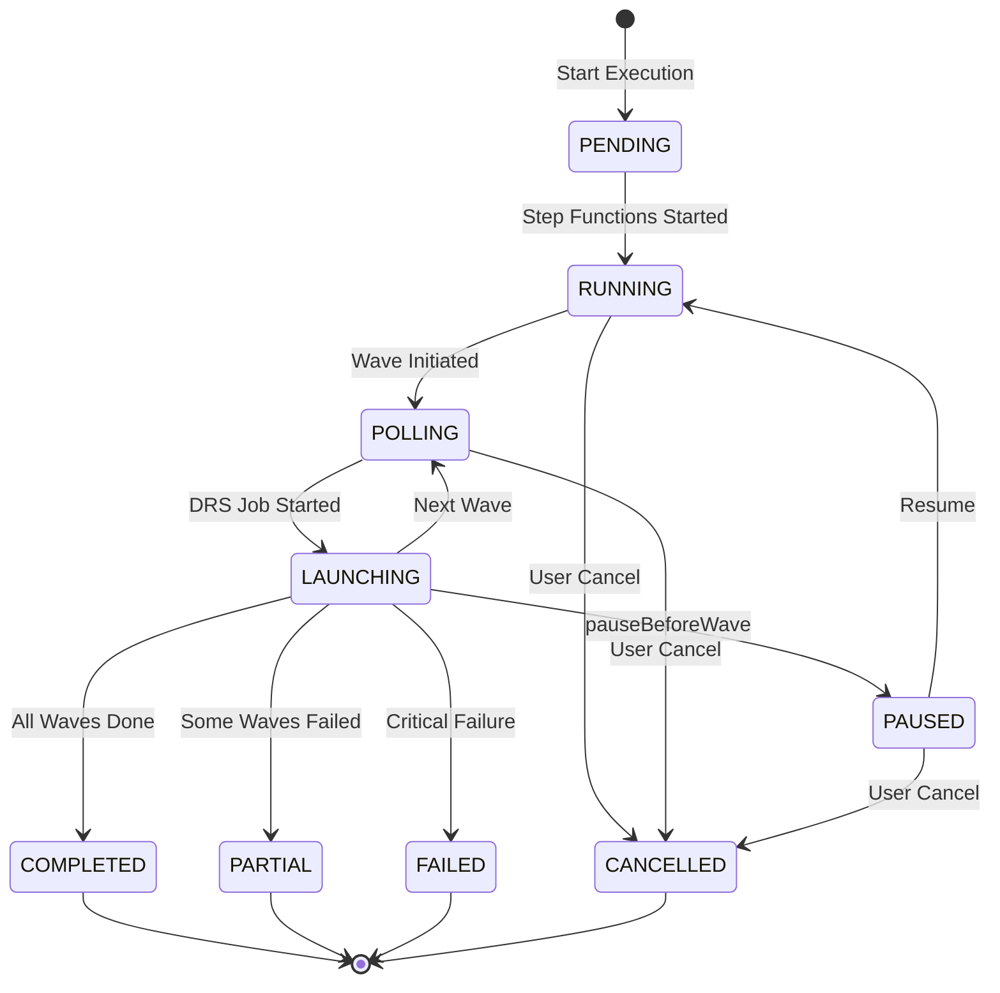
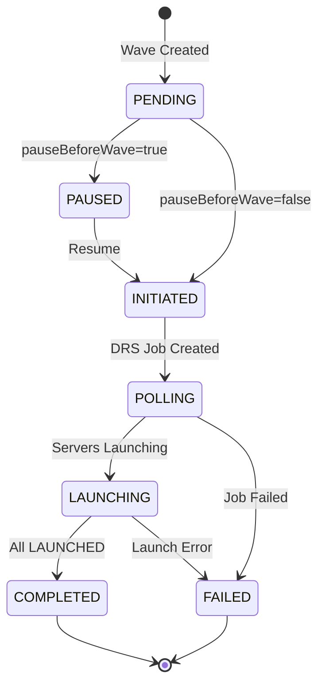

# Software Requirements Specification
# AWS DRS Orchestration System

**Version**: 5.0  
**Date**: December 2025  
**Status**: Production Release

---

## Document Purpose

This Software Requirements Specification (SRS) defines the functional and non-functional requirements for the AWS DRS Orchestration system. It serves as the authoritative source for system capabilities, API contracts, and validation criteria.

---

## System Architecture


*[View/Edit Source Diagram](../architecture/AWS-DRS-Orchestration-Architecture.drawio)*

---

## Scope

### In Scope
- Protection Group Management (CRUD, server discovery, conflict detection)
- Recovery Plan Management (wave configuration, multi-PG support, dependencies)
- Recovery Execution (drill/recovery modes, wave orchestration, pause/resume)
- Server Discovery (DRS API integration, automatic detection, assignment tracking)
- User Management (Cognito authentication, JWT authorization)
- Audit Trail (execution history, CloudWatch Logs)
- Instance Management (terminate recovery instances)

### Out of Scope
- Pre/Post-Wave Automation Hooks (Phase 2)
- VPC Test Isolation (Phase 2)
- Automated Rollback (Phase 2)
- Reprotection/Failback (Phase 3)

---

## Functional Requirements

### FR-1: Protection Group Management

#### FR-1.1: Create Protection Group
**Priority**: Critical

The system shall allow users to create a Protection Group with:
- Unique name (case-insensitive, 1-128 characters, globally unique)
- AWS region (all AWS DRS-supported regions)
- Optional description (max 512 characters)
- List of DRS source server IDs (minimum 1)

**Validation Rules**:
- Name must be globally unique (case-insensitive across all users)
- Server IDs must exist in DRS for the specified region (validated via API)
- Server IDs cannot be assigned to another Protection Group (conflict detection)
- System generates UUID as GroupId
- System records CreatedDate and LastModifiedDate timestamps

**API**: `POST /protection-groups`
```json
{
  "GroupName": "Database Servers",
  "Description": "Primary database tier",
  "Region": "us-east-1",
  "sourceServerIds": ["s-1234567890abcdef0", "s-0987654321fedcba0"]
}
```
**Response**: 201 Created with Protection Group data
**Errors**: 
- 400: Missing required fields, invalid server IDs
- 409: Duplicate name (PG_NAME_EXISTS), server conflict (SERVER_ASSIGNMENT_CONFLICT)

#### FR-1.2: List Protection Groups
**Priority**: Critical

The system shall return all Protection Groups with:
- GroupId, GroupName, Region, Description
- SourceServerIds array and server count
- CreatedDate and LastModifiedDate timestamps
- Enriched ServerDetails from DRS API (hostname, replication state)

**API**: `GET /protection-groups`
**Response**: `{ "groups": [...], "count": N }`

#### FR-1.3: Get Protection Group
**Priority**: Critical

The system shall return a single Protection Group by ID with all fields and enriched server details.

**API**: `GET /protection-groups/{id}`
**Response**: Protection Group object with ServerDetails
**Errors**: 404 (not found)

#### FR-1.4: Update Protection Group
**Priority**: High

The system shall allow updating:
- GroupName (with uniqueness validation)
- Description
- SourceServerIds (with conflict validation)

**Immutable fields**: Region

**Blocking Conditions**:
- Cannot update if Protection Group is part of an active execution (PG_IN_ACTIVE_EXECUTION)

**API**: `PUT /protection-groups/{id}`
**Response**: Updated Protection Group object
**Errors**: 400 (validation), 404 (not found), 409 (conflict or active execution)

#### FR-1.5: Delete Protection Group
**Priority**: High

The system shall delete a Protection Group only if not referenced by ANY Recovery Plan.

**API**: `DELETE /protection-groups/{id}`
**Response**: 200 with success message
**Errors**: 404 (not found), 409 (PG_IN_USE - referenced by Recovery Plans)

#### FR-1.6: Server Assignment Validation
**Priority**: Critical

The system shall enforce that each DRS source server can be assigned to at most one Protection Group (globally unique constraint across all users).

---

### FR-2: Recovery Plan Management

#### FR-2.1: Create Recovery Plan
**Priority**: Critical

The system shall allow users to create a Recovery Plan with:
- Unique name (case-insensitive, globally unique)
- Optional description
- One or more waves with configuration

**Wave Configuration**:
```json
{
  "waveNumber": 0,
  "name": "Database Tier",
  "description": "Primary databases",
  "protectionGroupIds": ["pg-uuid-1", "pg-uuid-2"],
  "serverIds": ["s-xxx", "s-yyy"],
  "dependsOnWaves": [],
  "pauseBeforeWave": false
}
```

**Validation Rules**:
- Plan name must be globally unique (case-insensitive)
- At least one wave required
- Each wave must have at least one Protection Group
- Each wave must have at least one server
- Wave numbers must be sequential starting from 0
- Dependencies can only reference previous waves (prevents circular dependencies)
- `pauseBeforeWave` only valid for waves after Wave 1

**API**: `POST /recovery-plans`
**Response**: 201 Created with Recovery Plan data
**Errors**: 400 (validation), 409 (RP_NAME_EXISTS)

#### FR-2.2: List Recovery Plans
**Priority**: Critical

The system shall return all Recovery Plans with:
- PlanId, PlanName, Description
- Waves array with configuration
- CreatedDate, LastModifiedDate
- LastExecutionStatus, LastStartTime, LastEndTime (from execution history)

**API**: `GET /recovery-plans`
**Response**: `{ "plans": [...], "count": N }`

#### FR-2.3: Get Recovery Plan
**Priority**: Critical

The system shall return a single Recovery Plan with full wave configuration.

**API**: `GET /recovery-plans/{id}`
**Response**: Recovery Plan object with waves array

#### FR-2.4: Update Recovery Plan
**Priority**: High

The system shall allow updating:
- PlanName (with uniqueness validation)
- Description
- Waves configuration

**Blocking Conditions**:
- Cannot update if plan has active execution

**API**: `PUT /recovery-plans/{id}`
**Errors**: 409 (currently executing)

#### FR-2.5: Delete Recovery Plan
**Priority**: High

The system shall delete a Recovery Plan only if not currently executing.

**API**: `DELETE /recovery-plans/{id}`
**Errors**: 409 (currently executing)

---

### FR-3: Execution Engine

#### FR-3.1: Start Execution
**Priority**: Critical

The system shall start a recovery execution with:
- PlanId (required)
- ExecutionType: DRILL or RECOVERY (required)
- InitiatedBy: username (optional, defaults to 'system')
- DryRun: boolean (optional, defaults to false)

**API**: `POST /executions`
```json
{
  "PlanId": "plan-uuid",
  "ExecutionType": "DRILL",
  "InitiatedBy": "admin@example.com"
}
```
**Response**: 202 Accepted with execution ID and initial status

**Behavior**:
1. Validate plan exists and has valid waves
2. Check for server conflicts with other active executions (including PAUSED)
3. If conflicts found, return 409 with conflict details
4. Create execution record with status PENDING
5. Initiate Step Functions state machine
6. Return immediately (async execution)

**Server Conflict Detection**:
- Checks all servers in the plan against servers in active executions
- Active statuses: PENDING, POLLING, INITIATED, LAUNCHING, STARTED, IN_PROGRESS, RUNNING, PAUSED, CANCELLING
- For PAUSED executions: looks up original Recovery Plan to get ALL servers (including upcoming waves)
- Frontend disables Drill/Recovery buttons when conflicts exist (proactive prevention)
- API returns 409 Conflict if execution attempted despite UI warning

#### FR-3.2: Wave Orchestration
**Priority**: Critical

The system shall execute waves sequentially:
1. Check for `pauseBeforeWave` configuration
2. If paused: Enter waitForTaskToken state, store token in DynamoDB
3. Launch DRS recovery for all servers in wave (single StartRecovery API call)
4. Poll job status via Step Functions orchestration
5. Wait for all servers to reach LAUNCHED status
6. Update execution record in DynamoDB
7. Proceed to next wave or complete

**Wave Execution Details**:
- All servers in a wave launch with one DRS API call
- 15-second delay between server launches (DRS-safe)
- Waves execute sequentially (Wave 0, then Wave 1, etc.)
- Step Functions orchestrates entire flow with error handling

#### FR-3.3: DRS Integration
**Priority**: Critical

The system shall call DRS StartRecovery API:
- Pass sourceServers array with sourceServerID for each server
- Set isDrill=true for DRILL executions, false for RECOVERY
- Monitor returned jobID for completion via DescribeJobs

#### FR-3.4: Job Monitoring
**Priority**: Critical

The system shall monitor DRS jobs:
- Poll DescribeJobs via Step Functions orchestration
- Track participatingServers launchStatus: PENDING → IN_PROGRESS → LAUNCHED
- Timeout after 30 minutes per wave
- Continue to next wave when all servers reach LAUNCHED status
- Mark wave FAILED if any server fails to launch

#### FR-3.5: Get Execution Status
**Priority**: Critical

The system shall return execution status:
- ExecutionId, PlanId, Status
- Per-wave status with serverStatuses array
- JobId for each wave (for DRS job lookup)
- StartTime, EndTime, Duration
- CurrentWave, TotalWaves
- PausedBeforeWave (if paused)
- InstancesTerminated flag

**API**: `GET /executions/{id}`

#### FR-3.6: List Executions
**Priority**: Critical

The system shall return execution history with:
- Pagination support (limit, nextToken)
- All executions sorted by StartTime descending

**API**: `GET /executions`
**Response**: `{ "items": [...], "nextToken": "..." }`

#### FR-3.7: Cancel Execution
**Priority**: Medium

The system shall cancel a running execution:
- Stop Step Functions execution
- Skip pending waves (not yet started)
- In-progress waves continue to completion (DRS jobs cannot be cancelled)
- Update status to CANCELLED

**API**: `DELETE /executions/{id}`
**Response**: 200 with updated execution status

#### FR-3.8: Pause Before Wave
**Priority**: High

The system shall support pausing execution before specific waves:
- Recovery Plans can configure `pauseBeforeWave: true` on any wave after Wave 1
- When enabled, execution pauses before starting that wave
- Step Functions uses `waitForTaskToken` callback pattern
- Task token stored in DynamoDB execution record
- Execution remains in PAUSED status until manually resumed
- Maximum pause duration: 1 year (31536000 seconds)

#### FR-3.9: Resume Execution
**Priority**: High

The system shall resume paused executions:
- Retrieve stored task token from DynamoDB
- Call Step Functions `SendTaskSuccess` with task token
- Continue execution with next wave
- Update status from PAUSED to appropriate active status

**API**: `POST /executions/{id}/resume`
**Response**: 200 OK with execution status
**Errors**: 400 (not paused), 404 (not found)

#### FR-3.10: Terminate Recovery Instances
**Priority**: Medium

The system shall terminate recovery instances after execution completes:
- Only available for terminal states (COMPLETED, FAILED, CANCELLED, PARTIAL)
- Terminates all EC2 instances launched during recovery
- Updates execution record with `instancesTerminated: true`
- Prevents duplicate termination attempts
- Returns summary of terminated/failed instances

**API**: `POST /executions/{id}/terminate-instances`
**Response**: 200 OK with termination results
**Errors**: 400 (execution still running), 404 (not found)

#### FR-3.11: Get Job Logs
**Priority**: Medium

The system shall return DRS job event logs:
- Query DescribeJobLogItems for each wave's jobId
- Return events: JOB_START, SNAPSHOT_START/END, CONVERSION_START/END, LAUNCH_START/END
- Include timestamps and error details

**API**: `GET /executions/{id}/job-logs`
**Response**: Job logs grouped by wave

#### FR-3.12: Bulk Delete Completed Executions
**Priority**: Low

The system shall delete all completed executions:
- Only deletes terminal states (COMPLETED, PARTIAL, FAILED, CANCELLED)
- Preserves active executions
- Returns count of deleted items

**API**: `DELETE /executions`
**Response**: `{ "deletedCount": N, "totalScanned": N }`

---

### FR-4: Server Discovery

#### FR-4.1: Discover DRS Servers
**Priority**: Critical

The system shall discover DRS source servers by region:
- Query DRS DescribeSourceServers API
- Return server ID, hostname, replication status, lag duration
- Indicate assignment status (available vs assigned to Protection Group)
- Support filtering by current Protection Group ID (for edit mode)

**API**: `GET /drs/source-servers?region={region}&currentProtectionGroupId={pgId}`
**Response**:
```json
{
  "region": "us-east-1",
  "initialized": true,
  "servers": [
    {
      "sourceServerID": "s-xxx",
      "hostname": "web-server-01",
      "state": "READY_FOR_RECOVERY",
      "replicationState": "CONTINUOUS",
      "lagDuration": "PT0S",
      "assignedToProtectionGroup": null,
      "selectable": true
    }
  ],
  "totalCount": 10,
  "availableCount": 7,
  "assignedCount": 3
}
```

---

### FR-5: Authentication

#### FR-5.1: User Authentication
**Priority**: Critical

The system shall authenticate users via AWS Cognito:
- Username/password authentication
- JWT token issuance (ID token for API authorization)
- Token refresh support via Amplify
- Session management with 45-minute auto-logout

#### FR-5.2: API Authorization
**Priority**: Critical

The system shall authorize API requests:
- Validate JWT token on each request via API Gateway Cognito Authorizer
- Extract user identity from token claims
- Log user actions for audit (InitiatedBy field)

---

## Non-Functional Requirements

### NFR-1: Performance

| Metric | Requirement |
|--------|-------------|
| API Response Time | < 2 seconds for CRUD operations |
| Page Load Time | < 3 seconds initial load |
| Execution Start | < 5 seconds to initiate Step Functions |
| DRS Job Polling | 15-second intervals during wave execution |
| UI Status Refresh | 3-second intervals for active executions |

### NFR-2: Scalability

| Metric | Requirement |
|--------|-------------|
| Concurrent Users | 50+ simultaneous users |
| Protection Groups | 1000+ per deployment |
| Recovery Plans | 500+ per deployment |
| Execution History | Unlimited (DynamoDB auto-scaling) |
| Servers per Wave | 100+ (DRS API limit) |

### NFR-3: Availability

| Metric | Requirement |
|--------|-------------|
| Target Availability | 99.9% (AWS serverless SLA) |
| Recovery Time | < 15 minutes for component failure |
| Data Durability | 99.999999999% (DynamoDB) |
| Multi-AZ | Automatic (Lambda, DynamoDB, S3) |

### NFR-4: Security

| Requirement | Implementation |
|-------------|----------------|
| Authentication | AWS Cognito User Pool with JWT tokens |
| Authorization | API Gateway Cognito Authorizer |
| Encryption at Rest | DynamoDB, S3 (AES-256) |
| Encryption in Transit | TLS 1.2+ for all API calls |
| Session Timeout | 45-minute auto-logout |
| IAM Least Privilege | Scoped Lambda execution roles |

### NFR-5: Maintainability

| Requirement | Implementation |
|-------------|----------------|
| Infrastructure as Code | CloudFormation nested stacks |
| Logging | CloudWatch Logs for all Lambda functions |
| Monitoring | CloudWatch Metrics and Alarms |
| Deployment | S3-based artifact deployment |
| Version Control | Git with feature branch workflow |

---

## API Specifications

### Base URL

```
https://{api-id}.execute-api.{region}.amazonaws.com/{stage}
```

### Authentication

All API requests require a valid JWT token in the Authorization header:

```
Authorization: Bearer {id_token}
```

### Common Response Codes

| Code | Description |
|------|-------------|
| 200 | Success |
| 201 | Created |
| 202 | Accepted (async operation started) |
| 400 | Bad Request (validation error) |
| 401 | Unauthorized (missing/invalid token) |
| 403 | Forbidden (insufficient permissions) |
| 404 | Not Found |
| 409 | Conflict (duplicate name, server conflict, active execution) |
| 500 | Internal Server Error |

### Error Response Format

```json
{
  "error": "ERROR_CODE",
  "message": "Human-readable error description",
  "details": { }
}
```

### API Endpoints

#### Protection Groups

| Method | Endpoint | Description |
|--------|----------|-------------|
| GET | /protection-groups | List all Protection Groups |
| POST | /protection-groups | Create Protection Group |
| GET | /protection-groups/{id} | Get Protection Group by ID |
| PUT | /protection-groups/{id} | Update Protection Group |
| DELETE | /protection-groups/{id} | Delete Protection Group |

#### Recovery Plans

| Method | Endpoint | Description |
|--------|----------|-------------|
| GET | /recovery-plans | List all Recovery Plans |
| POST | /recovery-plans | Create Recovery Plan |
| GET | /recovery-plans/{id} | Get Recovery Plan by ID |
| PUT | /recovery-plans/{id} | Update Recovery Plan |
| DELETE | /recovery-plans/{id} | Delete Recovery Plan |
| POST | /recovery-plans/{id}/execute | Execute Recovery Plan |

#### Executions

| Method | Endpoint | Description |
|--------|----------|-------------|
| GET | /executions | List all Executions |
| POST | /executions | Start new Execution |
| GET | /executions/{id} | Get Execution details |
| POST | /executions/{id}/resume | Resume paused Execution |
| POST | /executions/{id}/cancel | Cancel running Execution |
| POST | /executions/{id}/terminate-instances | Terminate recovery instances |
| GET | /executions/{id}/job-logs | Get DRS job event logs |
| DELETE | /executions | Bulk delete completed Executions |

#### DRS Integration

| Method | Endpoint | Description |
|--------|----------|-------------|
| GET | /drs/source-servers | Discover DRS source servers by region |

### Request/Response Examples

#### Create Protection Group

```http
POST /protection-groups
Content-Type: application/json
Authorization: Bearer {token}

{
  "GroupName": "Database Servers",
  "Description": "Primary database tier",
  "Region": "us-east-1",
  "sourceServerIds": ["s-1234567890abcdef0", "s-0987654321fedcba0"]
}
```

Response (201 Created):

```json
{
  "groupId": "uuid-xxx",
  "groupName": "Database Servers",
  "description": "Primary database tier",
  "region": "us-east-1",
  "sourceServerIds": ["s-1234567890abcdef0", "s-0987654321fedcba0"],
  "createdDate": 1702656000,
  "lastModifiedDate": 1702656000
}
```

#### Create Recovery Plan

```http
POST /recovery-plans
Content-Type: application/json
Authorization: Bearer {token}

{
  "PlanName": "3-Tier Application Recovery",
  "Description": "Complete application stack recovery",
  "Waves": [
    {
      "WaveId": "wave-0",
      "WaveName": "Database Tier",
      "ProtectionGroupId": "pg-uuid-1",
      "ServerIds": ["s-xxx"],
      "PauseBeforeWave": false,
      "Dependencies": []
    },
    {
      "WaveId": "wave-1",
      "WaveName": "Application Tier",
      "ProtectionGroupId": "pg-uuid-2",
      "ServerIds": ["s-yyy"],
      "PauseBeforeWave": true,
      "Dependencies": [{"DependsOnWaveId": "wave-0"}]
    }
  ]
}
```

#### Start Execution

```http
POST /executions
Content-Type: application/json
Authorization: Bearer {token}

{
  "PlanId": "plan-uuid",
  "ExecutionType": "DRILL",
  "InitiatedBy": "admin@example.com"
}
```

Response (202 Accepted):

```json
{
  "executionId": "exec-uuid",
  "status": "PENDING",
  "message": "Execution started - check status with GET /executions/{id}",
  "statusUrl": "/executions/exec-uuid"
}
```

#### Resume Paused Execution

```http
POST /executions/{id}/resume
Authorization: Bearer {token}
```

Response (200 OK):

```json
{
  "executionId": "exec-uuid",
  "status": "RUNNING",
  "message": "Execution resumed successfully"
}
```

#### Terminate Recovery Instances

```http
POST /executions/{id}/terminate-instances
Authorization: Bearer {token}
```

Response (200 OK):

```json
{
  "executionId": "exec-uuid",
  "terminated": ["i-xxx", "i-yyy"],
  "failed": [],
  "message": "2 instances terminated successfully"
}
```

---

## Data Requirements

### DynamoDB Tables

#### Protection Groups Table

**Table Name**: `{project}-protection-groups-{env}`

**Partition Key**: `GroupId` (String)

| Attribute | Type | Description |
|-----------|------|-------------|
| GroupId | String | UUID primary key |
| GroupName | String | Unique name (case-insensitive) |
| Description | String | Optional description |
| Region | String | AWS region code |
| SourceServerIds | List | Array of DRS source server IDs |
| AccountId | String | AWS account ID |
| Owner | String | Owner identifier |
| CreatedDate | Number | Unix timestamp |
| LastModifiedDate | Number | Unix timestamp |

#### Recovery Plans Table

**Table Name**: `{project}-recovery-plans-{env}`

**Partition Key**: `PlanId` (String)

| Attribute | Type | Description |
|-----------|------|-------------|
| PlanId | String | UUID primary key |
| PlanName | String | Unique name (case-insensitive) |
| Description | String | Optional description |
| Waves | List | Array of wave configurations |
| CreatedDate | Number | Unix timestamp |
| LastModifiedDate | Number | Unix timestamp |

**Wave Object Structure**:

```json
{
  "WaveId": "wave-0",
  "WaveName": "Database Tier",
  "WaveDescription": "Primary databases",
  "ExecutionOrder": 0,
  "ProtectionGroupId": "pg-uuid",
  "ServerIds": ["s-xxx", "s-yyy"],
  "PauseBeforeWave": false,
  "Dependencies": [{"DependsOnWaveId": "wave-0"}]
}
```

#### Execution History Table

**Table Name**: `{project}-execution-history-{env}`

**Partition Key**: `ExecutionId` (String)

**Sort Key**: `PlanId` (String)

**Global Secondary Indexes**:

- `PlanIdIndex`: PlanId (partition), StartTime (sort)
- `StatusIndex`: Status (partition), StartTime (sort)

| Attribute | Type | Description |
|-----------|------|-------------|
| ExecutionId | String | UUID primary key |
| PlanId | String | Reference to Recovery Plan |
| ExecutionType | String | DRILL or RECOVERY |
| Status | String | Execution status |
| StartTime | Number | Unix timestamp |
| EndTime | Number | Unix timestamp (when completed) |
| InitiatedBy | String | User who started execution |
| Waves | List | Array of wave execution states |
| TotalWaves | Number | Total waves in plan |
| StateMachineArn | String | Step Functions execution ARN |
| TaskToken | String | Step Functions task token (for pause/resume) |
| PausedBeforeWave | Number | Wave number paused before |
| InstancesTerminated | Boolean | Whether instances were terminated |
| ErrorMessage | String | Error details if failed |

**Wave Execution Object Structure**:

```json
{
  "WaveNumber": 0,
  "WaveName": "Database Tier",
  "Status": "COMPLETED",
  "JobId": "drsjob-xxx",
  "StartTime": 1702656000,
  "EndTime": 1702656300,
  "ServerStatuses": [
    {
      "SourceServerId": "s-xxx",
      "LaunchStatus": "LAUNCHED",
      "RecoveryInstanceId": "i-xxx"
    }
  ]
}
```

### Execution Status Values

| Status | Description |
|--------|-------------|
| PENDING | Execution created, not yet started |
| RUNNING | Step Functions execution in progress |
| POLLING | Waiting for DRS job completion |
| LAUNCHING | EC2 instances being launched |
| PAUSED | Paused before wave (waitForTaskToken) |
| COMPLETED | All waves completed successfully |
| PARTIAL | Some waves completed, some failed |
| FAILED | Execution failed |
| CANCELLED | Execution cancelled by user |
| CANCELLING | Cancellation in progress |

### Server Launch Status Values

| Status | Description |
|--------|-------------|
| PENDING | Not yet started |
| IN_PROGRESS | DRS job running |
| LAUNCHED | EC2 instance launched successfully |
| FAILED | Launch failed |
| TERMINATED | Instance terminated |

---

## Validation Rules Summary

### Protection Group Validation

| Rule | Error Code |
|------|------------|
| Name required (1-128 chars) | 400 |
| Name must be globally unique | PG_NAME_EXISTS (409) |
| Region required | 400 |
| At least one server required | 400 |
| Server IDs must exist in DRS | INVALID_SERVER_IDS (400) |
| Servers cannot be assigned to other PGs | SERVER_ASSIGNMENT_CONFLICT (409) |
| Cannot update if in active execution | PG_IN_ACTIVE_EXECUTION (409) |
| Cannot delete if used in any Recovery Plan | PG_IN_USE (409) |

### Recovery Plan Validation

| Rule | Error Code |
|------|------------|
| Name required | 400 |
| Name must be globally unique | RP_NAME_EXISTS (409) |
| At least one wave required | 400 |
| Each wave must have Protection Group | 400 |
| Each wave must have at least one server | 400 |
| Wave dependencies must reference previous waves | 400 |
| Cannot update if execution in progress | PLAN_HAS_ACTIVE_EXECUTION (409) |
| Cannot delete if execution in progress | PLAN_HAS_ACTIVE_EXECUTION (409) |

### Execution Validation

| Rule | Error Code |
|------|------------|
| PlanId required | 400 |
| ExecutionType must be DRILL or RECOVERY | 400 |
| Plan must exist | 404 |
| Plan must have waves | 400 |
| Plan cannot have active execution | PLAN_ALREADY_EXECUTING (409) |
| Servers cannot be in other active executions | SERVER_CONFLICT (409) |
| Resume only valid for PAUSED status | 400 |
| Terminate only valid for terminal states | 400 |

---

## Appendix: Status Flow Diagrams

### Execution Status Flow



### Wave Execution Flow


