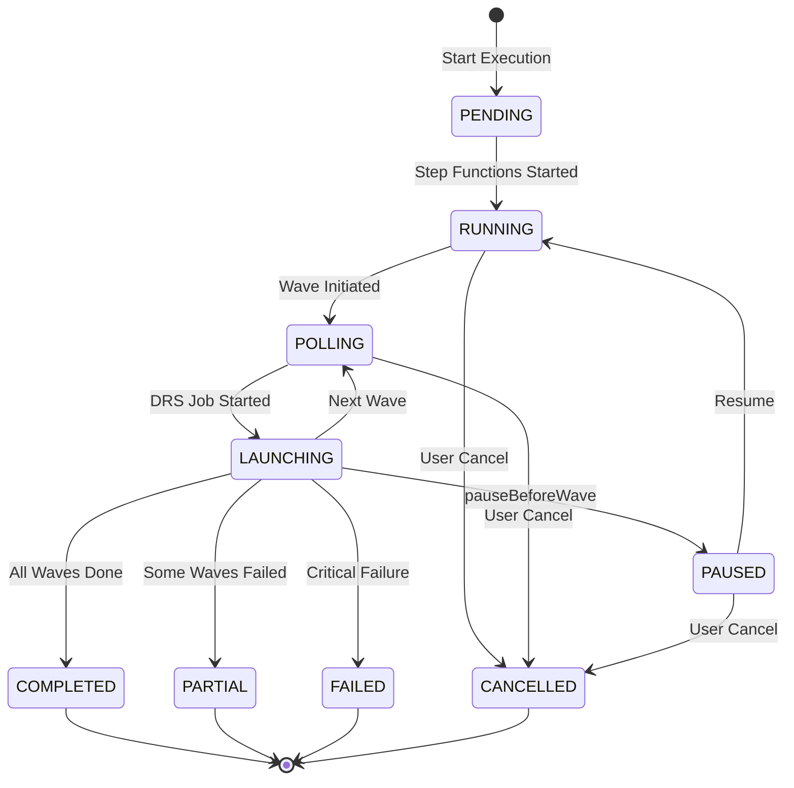
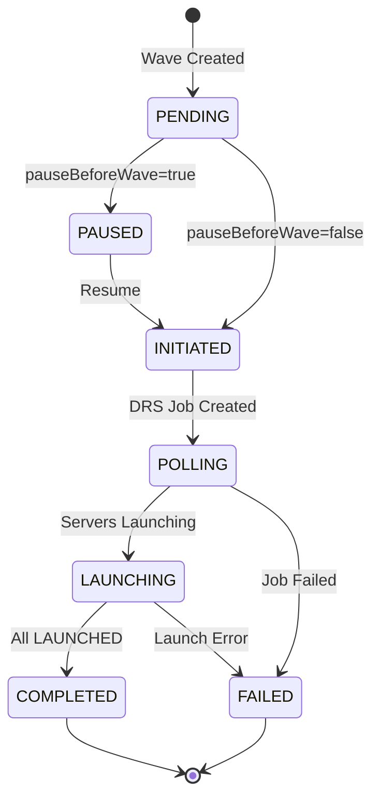

# Software Requirements Specification
# AWS DRS Orchestration System

**Version**: 1.0  
**Date**: December 2025  
**Status**: Requirements Specification

---

## Document Purpose

This Software Requirements Specification (SRS) defines the functional and non-functional requirements for the AWS DRS Orchestration system. It serves as the authoritative source for system capabilities, API contracts, and validation criteria.

---

## System Architecture


*[View/Edit Source Diagram](../architecture/AWS-DRS-Orchestration-Architecture.drawio)*

---

## Scope

### In Scope - Core Features (MVP)
- Protection Group Management (CRUD, server discovery, conflict detection)
- Recovery Plan Management (wave configuration, multi-PG support, dependencies)
- Recovery Execution (drill/recovery modes, wave orchestration, pause/resume)
- DRS Service Limits Validation (300 servers, 100 per job, 20 concurrent jobs)
- Server Discovery (DRS API integration, automatic detection, assignment tracking)
- User Management (Cognito authentication, JWT authorization)
- Audit Trail (execution history, CloudWatch Logs)
- Instance Management (terminate recovery instances)
- Real-time Execution Monitoring (3-second auto-refresh, DRS job events)
- Loading State Management (prevents multiple operations)
- AWS DRS Regional Support (30 regions: 28 commercial + 2 GovCloud)
- EC2 Launch Template & DRS Launch Settings (Protection Group level configuration)

### In Scope - Advanced Features (Phase 2)
- DRS Source Server Management - Remaining (Server Info, tags, disks, replication, post-launch)
- DRS Tag Synchronization (EC2 to DRS tag sync with bulk operations)
- SSM Automation Integration (pre/post-wave automation)
- Step Functions Visualization (real-time state machine monitoring)
- Multi-Account Support (cross-account orchestration, scale beyond 300 servers)
- Cross-Account DRS Monitoring (centralized monitoring and alerting)
- SNS Notification Integration (real-time notifications via multiple channels)
- Scheduled Drills (automated recurring drill execution)
- CodeBuild & CodeCommit Migration (AWS-native CI/CD pipeline)

---

## Functional Requirements

### FR-1: Protection Group Management

#### FR-1.1: Create Protection Group
**Priority**: Critical

The system shall allow users to create a Protection Group with:
- Unique name (case-insensitive, 1-128 characters, globally unique)
- AWS region (all 30 AWS DRS-supported regions)
- Optional description (max 512 characters)
- List of DRS source server IDs (minimum 1)


**Validation Rules**:
- Name must be globally unique (case-insensitive across all users)
- Server IDs must exist in DRS for the specified region (validated via API)
- Server IDs cannot be assigned to another Protection Group (conflict detection)
- System generates UUID as GroupId
- System records CreatedDate and LastModifiedDate timestamps

**API**: `POST /protection-groups`
```json
{
  "GroupName": "Database Servers",
  "Description": "Primary database tier",
  "Region": "us-east-1",
  "sourceServerIds": ["s-1234567890abcdef0", "s-0987654321fedcba0"]
}
```
**Response**: 201 Created with Protection Group data
**Errors**: 
- 400: Missing required fields, invalid server IDs
- 409: Duplicate name (PG_NAME_EXISTS), server conflict (SERVER_ASSIGNMENT_CONFLICT)

#### FR-1.2: List Protection Groups
**Priority**: Critical

The system shall return all Protection Groups with:
- GroupId, GroupName, Region, Description
- SourceServerIds array and server count
- CreatedDate and LastModifiedDate timestamps
- Enriched ServerDetails from DRS API (hostname, replication state)

**API**: `GET /protection-groups`
**Response**: `{ "groups": [...], "count": N }`

#### FR-1.3: Get Protection Group
**Priority**: Critical

The system shall return a single Protection Group by ID with all fields and enriched server details.

**API**: `GET /protection-groups/{id}`
**Response**: Protection Group object with ServerDetails
**Errors**: 404 (not found)

#### FR-1.4: Update Protection Group
**Priority**: High

The system shall allow updating:
- GroupName (with uniqueness validation)
- Description
- SourceServerIds (with conflict validation)

**Immutable fields**: Region

**Blocking Conditions**:
- Cannot update if Protection Group is part of an active execution (PG_IN_ACTIVE_EXECUTION)

**API**: `PUT /protection-groups/{id}`
**Response**: Updated Protection Group object
**Errors**: 400 (validation), 404 (not found), 409 (conflict or active execution)

#### FR-1.5: Delete Protection Group
**Priority**: High

The system shall delete a Protection Group only if not referenced by ANY Recovery Plan.

**API**: `DELETE /protection-groups/{id}`
**Response**: 200 with success message
**Errors**: 404 (not found), 409 (PG_IN_USE - referenced by Recovery Plans)

#### FR-1.6: Server Assignment Validation
**Priority**: Critical

The system shall enforce that each DRS source server can be assigned to at most one Protection Group (globally unique constraint across all users).

---

### FR-2: Recovery Plan Management

#### FR-2.1: Create Recovery Plan
**Priority**: Critical

The system shall allow users to create a Recovery Plan with:
- Unique name (case-insensitive, globally unique)
- Optional description
- One or more waves with configuration

**Wave Configuration**:
```json
{
  "waveNumber": 0,
  "name": "Database Tier",
  "description": "Primary databases",
  "protectionGroupIds": ["pg-uuid-1", "pg-uuid-2"],
  "serverIds": ["s-xxx", "s-yyy"],
  "dependsOnWaves": [],
  "pauseBeforeWave": false
}
```

**Validation Rules**:
- Plan name must be globally unique (case-insensitive)
- At least one wave required
- Each wave must have at least one Protection Group
- Each wave must have at least one server
- Wave numbers must be sequential starting from 0
- Dependencies can only reference previous waves (prevents circular dependencies)
- `pauseBeforeWave` only valid for waves after Wave 1

**API**: `POST /recovery-plans`
**Response**: 201 Created with Recovery Plan data
**Errors**: 400 (validation), 409 (RP_NAME_EXISTS)

#### FR-2.2: List Recovery Plans
**Priority**: Critical

The system shall return all Recovery Plans with:
- PlanId, PlanName, Description
- Waves array with configuration
- CreatedDate, LastModifiedDate
- LastExecutionStatus, LastStartTime, LastEndTime (from execution history)
- hasServerConflict, conflictInfo (for active execution detection)

**API**: `GET /recovery-plans`
**Response**: `{ "plans": [...], "count": N }`

#### FR-2.3: Get Recovery Plan
**Priority**: Critical

The system shall return a single Recovery Plan with full wave configuration.

**API**: `GET /recovery-plans/{id}`
**Response**: Recovery Plan object with waves array

#### FR-2.4: Update Recovery Plan
**Priority**: High

The system shall allow updating:
- PlanName (with uniqueness validation)
- Description
- Waves configuration

**Blocking Conditions**:
- Cannot update if plan has active execution

**API**: `PUT /recovery-plans/{id}`
**Errors**: 409 (currently executing)

#### FR-2.5: Delete Recovery Plan
**Priority**: High

The system shall delete a Recovery Plan only if not currently executing.

**API**: `DELETE /recovery-plans/{id}`
**Errors**: 409 (currently executing)

---

### FR-3: Execution Engine

#### FR-3.1: Start Execution
**Priority**: Critical

The system shall start a recovery execution with:
- PlanId (required)
- ExecutionType: DRILL or RECOVERY (required)
- InitiatedBy: username (optional, defaults to 'system')

**API**: `POST /executions`
```json
{
  "PlanId": "plan-uuid",
  "ExecutionType": "DRILL",
  "InitiatedBy": "admin@example.com"
}
```
**Response**: 202 Accepted with execution ID and initial status

**Behavior**:
1. Validate plan exists and has valid waves
2. Check for server conflicts with other active executions (including PAUSED)
3. If conflicts found, return 409 with conflict details
4. Create execution record with status PENDING
5. Initiate Step Functions state machine
6. Return immediately (async execution)

**Server Conflict Detection**:
- Checks all servers in the plan against servers in active executions
- Active statuses: PENDING, POLLING, INITIATED, LAUNCHING, STARTED, IN_PROGRESS, RUNNING, PAUSED, CANCELLING
- For PAUSED executions: looks up original Recovery Plan to get ALL servers (including upcoming waves)
- Frontend disables Drill/Recovery buttons when conflicts exist (proactive prevention)
- API returns 409 Conflict if execution attempted despite UI warning

#### FR-3.2: Wave Orchestration
**Priority**: Critical

The system shall execute waves sequentially:
1. Check for `pauseBeforeWave` configuration
2. If paused: Enter waitForTaskToken state, store token in DynamoDB
3. Launch DRS recovery for all servers in wave (single StartRecovery API call)
4. Poll job status via Step Functions orchestration
5. Wait for all servers to reach LAUNCHED status
6. Update execution record in DynamoDB
7. Proceed to next wave or complete

#### FR-3.3: DRS Integration
**Priority**: Critical

The system shall call DRS StartRecovery API:
- Pass sourceServers array with sourceServerID for each server
- Set isDrill=true for DRILL executions, false for RECOVERY
- Monitor returned jobID for completion via DescribeJobs

#### FR-3.4: Job Monitoring
**Priority**: Critical

The system shall monitor DRS jobs:
- Poll DescribeJobs via Step Functions orchestration
- Track participatingServers launchStatus: PENDING → IN_PROGRESS → LAUNCHED
- Timeout after 30 minutes per wave
- Continue to next wave when all servers reach LAUNCHED status
- Mark wave FAILED if any server fails to launch

#### FR-3.5: Get Execution Status
**Priority**: Critical

The system shall return execution status:
- ExecutionId, PlanId, Status
- Per-wave status with serverStatuses array
- JobId for each wave (for DRS job lookup)
- StartTime, EndTime, Duration
- CurrentWave, TotalWaves
- PausedBeforeWave (if paused)
- InstancesTerminated flag

**API**: `GET /executions/{id}`

#### FR-3.6: List Executions
**Priority**: Critical

The system shall return execution history with:
- Pagination support (limit, nextToken)
- All executions sorted by StartTime descending

**API**: `GET /executions`
**Response**: `{ "items": [...], "nextToken": "..." }`

#### FR-3.7: Cancel Execution
**Priority**: Medium

The system shall cancel a running execution:
- Stop Step Functions execution
- Skip pending waves (not yet started)
- In-progress waves continue to completion (DRS jobs cannot be cancelled)
- Update status to CANCELLED

**API**: `DELETE /executions/{id}`
**Response**: 200 with updated execution status

#### FR-3.8: Pause Before Wave
**Priority**: High

The system shall support pausing execution before specific waves:
- Recovery Plans can configure `pauseBeforeWave: true` on any wave after Wave 1
- When enabled, execution pauses before starting that wave
- Step Functions uses `waitForTaskToken` callback pattern
- Task token stored in DynamoDB execution record
- Execution remains in PAUSED status until manually resumed
- Maximum pause duration: 1 year (31536000 seconds)

#### FR-3.9: Resume Execution
**Priority**: High

The system shall resume paused executions:
- Retrieve stored task token from DynamoDB
- Call Step Functions `SendTaskSuccess` with task token
- Continue execution with next wave
- Update status from PAUSED to appropriate active status

**API**: `POST /executions/{id}/resume`
**Response**: 200 OK with execution status
**Errors**: 400 (not paused), 404 (not found)

#### FR-3.10: Terminate Recovery Instances
**Priority**: Medium

The system shall terminate recovery instances after execution completes:
- Only available for terminal states (COMPLETED, FAILED, CANCELLED, PARTIAL)
- Terminates all EC2 instances launched during recovery
- Updates execution record with `instancesTerminated: true`
- Prevents duplicate termination attempts
- Returns summary of terminated/failed instances

**API**: `POST /executions/{id}/terminate-instances`
**Response**: 200 OK with termination results
**Errors**: 400 (execution still running), 404 (not found)

#### FR-3.11: Get Job Logs
**Priority**: Medium

The system shall return DRS job event logs:
- Query DescribeJobLogItems for each wave's jobId
- Return events: JOB_START, SNAPSHOT_START/END, CONVERSION_START/END, LAUNCH_START/END
- Include timestamps and error details

**API**: `GET /executions/{id}/job-logs`
**Response**: Job logs grouped by wave

#### FR-3.12: Bulk Delete Completed Executions
**Priority**: Low

The system shall delete all completed executions:
- Only deletes terminal states (COMPLETED, PARTIAL, FAILED, CANCELLED)
- Preserves active executions
- Returns count of deleted items

**API**: `DELETE /executions`
**Response**: `{ "deletedCount": N, "totalScanned": N }`


---

### FR-4: DRS Service Limits Validation

#### FR-4.1: Validate DRS Service Limits
**Priority**: Critical

The system shall validate operations against AWS DRS service limits:
- 300 replicating servers per account per region (hard limit)
- 100 servers per recovery job (hard limit)
- 20 concurrent jobs (soft limit)
- 500 max servers in all jobs (soft limit)

**Frontend Validation**:
- Protection Group creation: Check server count against 300 limit
- Recovery Plan execution: Validate wave sizes against 100 server limit
- Execution start: Check concurrent job limits
- Real-time quota display in UI

**Backend Validation**:
- API endpoints validate limits before operations
- Return specific error codes for limit violations
- Include current usage in error responses

**API**: `GET /drs/service-limits?region={region}`
**Response**:
```json
{
  "region": "us-east-1",
  "limits": {
    "maxReplicatingServers": 300,
    "maxServersPerJob": 100,
    "maxConcurrentJobs": 20,
    "maxServersInAllJobs": 500
  },
  "usage": {
    "currentReplicatingServers": 150,
    "currentConcurrentJobs": 2,
    "currentServersInJobs": 75
  }
}
```

#### FR-4.2: Quota Enforcement
**Priority**: Critical

The system shall enforce DRS quotas:
- Block operations that would exceed limits
- Provide clear error messages with current usage
- Suggest alternatives (e.g., smaller waves, multi-account setup)

**Error Codes**:
- `DRS_REPLICATING_SERVERS_LIMIT_EXCEEDED`
- `DRS_SERVERS_PER_JOB_LIMIT_EXCEEDED`
- `DRS_CONCURRENT_JOBS_LIMIT_EXCEEDED`
- `DRS_TOTAL_SERVERS_IN_JOBS_LIMIT_EXCEEDED`

---

### FR-5: Server Discovery

#### FR-5.1: Discover DRS Servers
**Priority**: Critical

The system shall discover DRS source servers by region:
- Query DRS DescribeSourceServers API
- Return server ID, hostname, replication status, lag duration
- Indicate assignment status (available vs assigned to Protection Group)
- Support filtering by current Protection Group ID (for edit mode)

**API**: `GET /drs/source-servers?region={region}&currentProtectionGroupId={pgId}`
**Response**:
```json
{
  "region": "us-east-1",
  "initialized": true,
  "servers": [
    {
      "sourceServerID": "s-xxx",
      "hostname": "web-server-01",
      "state": "READY_FOR_RECOVERY",
      "replicationState": "CONTINUOUS",
      "lagDuration": "PT0S",
      "assignedToProtectionGroup": null,
      "selectable": true
    }
  ],
  "totalCount": 10,
  "availableCount": 7,
  "assignedCount": 3
}
```

---

### FR-6: DRS Source Server Management

This section defines requirements for DRS source server configuration. FR-6.1 through FR-6.18 cover server info, launch settings, EC2 templates, tags, disks, replication, and post-launch actions. FR-6.2 through FR-6.6 (Launch Settings and EC2 Templates) are MVP features; remaining requirements are Phase 2.

#### FR-6.1: Get Server Info (Phase 2)
**Priority**: High

The system shall return comprehensive DRS source server information:
- Server ID, ARN, hostname
- Lifecycle state and timestamps
- Data replication info (state, progress, lag)
- Source properties (OS, CPU, RAM, disks, network)
- Last launch result
- Tags

**API**: `GET /drs/source-servers/{id}?region={region}`
**Response**: Full server details object

#### FR-6.2: Get Launch Settings
**Priority**: High

The system shall return DRS launch configuration:
- targetInstanceTypeRightSizingMethod (NONE, BASIC, IN_AWS)
- launchDisposition (STOPPED, STARTED)
- copyPrivateIp (boolean)
- copyTags (boolean)
- licensing.osByol (boolean)
- ec2LaunchTemplateID

**Implementation**: Configured at Protection Group level via LaunchConfig field. Applied to all servers when Protection Group is saved.

**API**: Protection Group endpoints with LaunchConfig field

#### FR-6.3: Update Launch Settings
**Priority**: High

The system shall update DRS launch configuration:
- All fields from FR-6.2 are updatable
- Validation per DRS API constraints
- Applied via `apply_launch_config_to_servers()` function

**API**: `PUT /protection-groups/{id}` with LaunchConfig:
```json
{
  "LaunchConfig": {
    "TargetInstanceTypeRightSizingMethod": "BASIC",
    "LaunchDisposition": "STARTED",
    "CopyPrivateIp": true,
    "CopyTags": true,
    "Licensing": { "osByol": false }
  }
}
```

#### FR-6.4: Get EC2 Template Settings
**Priority**: High

The system shall return EC2 launch template configuration:
- Instance type
- Subnet ID
- Security group IDs
- IAM instance profile name

**Implementation**: Configured at Protection Group level via LaunchConfig field.

**API**: `GET /protection-groups/{id}` returns LaunchConfig with EC2 settings

#### FR-6.5: Update EC2 Template Settings
**Priority**: High

The system shall update EC2 launch template:
- Create new template version with updated settings
- Set new version as default
- Validate resources exist (subnet, security groups, instance profile)

**API**: `PUT /protection-groups/{id}` with LaunchConfig:
```json
{
  "LaunchConfig": {
    "SubnetId": "subnet-xxx",
    "SecurityGroupIds": ["sg-xxx", "sg-yyy"],
    "InstanceProfileName": "MyInstanceProfile",
    "InstanceType": "t3.medium"
  }
}
```

#### FR-6.6: Get EC2 Resources
**Priority**: High

The system shall return available EC2 resources for dropdowns:
- Subnets (with VPC, AZ, CIDR)
- Security groups (with VPC, description)
- Instance types
- IAM instance profiles

**API**: `GET /ec2/resources?region={region}`

#### FR-6.7: Get Server Tags
**Priority**: Medium

The system shall return all tags for a DRS source server.

**API**: `GET /drs/source-servers/{id}/tags?region={region}`
**Response**: `{ "sourceServerId": "s-xxx", "tags": { "key": "value" } }`

#### FR-6.8: Update Server Tags
**Priority**: Medium

The system shall add or update tags on a DRS source server:
- Validate tag key does not start with `aws:`
- Validate key length (1-128 chars)
- Validate value length (0-256 chars)
- Validate max 50 tags per resource

**API**: `PUT /drs/source-servers/{id}/tags`
```json
{
  "region": "us-east-1",
  "tags": { "Environment": "Production", "CostCenter": "CC-12345" }
}
```

#### FR-6.9: Delete Server Tags
**Priority**: Medium

The system shall remove tags from a DRS source server by key.

**API**: `DELETE /drs/source-servers/{id}/tags`
```json
{
  "region": "us-east-1",
  "tagKeys": ["Environment", "CostCenter"]
}
```

#### FR-6.10: Get Disk Settings
**Priority**: High

The system shall return disk configuration for a DRS source server:
- Device name
- Is boot disk
- Staging disk type (GP2, GP3, IO1, IO2, ST1, SC1)
- IOPS (for applicable types)
- Throughput (for GP3)
- Size in bytes

**API**: `GET /drs/source-servers/{id}/disks?region={region}`

#### FR-6.11: Update Disk Settings
**Priority**: High

The system shall update disk configuration:
- Staging disk type
- IOPS (for GP3, IO1, IO2)
- Throughput (for GP3)

**API**: `PUT /drs/source-servers/{id}/disks`
```json
{
  "region": "us-east-1",
  "disks": [
    { "deviceName": "/dev/sda1", "stagingDiskType": "GP3", "iops": 3000, "throughput": 125 },
    { "deviceName": "/dev/sdb", "stagingDiskType": "IO1", "iops": 10000 }
  ]
}
```

#### FR-6.12: Get Replication Settings
**Priority**: High

The system shall return replication configuration:
- Staging area subnet ID
- Associate default security group
- Replication server security group IDs
- Replication server instance type
- Use dedicated replication server
- Bandwidth throttling (Mbps, 0 = unlimited)
- Data plane routing (PRIVATE_IP, PUBLIC_IP)
- Create public IP
- EBS encryption settings
- Point-in-time (PIT) policy

**API**: `GET /drs/source-servers/{id}/replication?region={region}`

#### FR-6.13: Update Replication Settings
**Priority**: High

The system shall update replication configuration:
- All fields from FR-5.12 are updatable
- Validate subnet and security groups exist

**API**: `PUT /drs/source-servers/{id}/replication`
```json
{
  "region": "us-east-1",
  "stagingAreaSubnetId": "subnet-xxx",
  "replicationServersSecurityGroupsIDs": ["sg-xxx"],
  "replicationServerInstanceType": "t3.small",
  "useDedicatedReplicationServer": false,
  "bandwidthThrottling": 0,
  "dataPlaneRouting": "PRIVATE_IP",
  "pitPolicy": [
    { "interval": 10, "retentionDuration": 60, "units": "MINUTE", "enabled": true }
  ]
}
```

#### FR-6.14: Get Staging Resources
**Priority**: High

The system shall return available staging area resources:
- Subnets (with VPC, AZ, CIDR, name)
- Security groups (with VPC, name, description)

**API**: `GET /drs/staging-resources?region={region}`

#### FR-6.15: Get Post-Launch Settings
**Priority**: Medium

The system shall return post-launch action configuration:
- Deployment type (TEST_AND_CUTOVER, CUTOVER)
- SSM document configuration (name, timeout, must succeed)
- S3 log bucket
- S3 output key prefix

**API**: `GET /drs/source-servers/{id}/post-launch?region={region}`

#### FR-6.16: Update Post-Launch Settings
**Priority**: Medium

The system shall update post-launch action configuration.

**API**: `PUT /drs/source-servers/{id}/post-launch`
```json
{
  "region": "us-east-1",
  "deployment": "TEST_AND_CUTOVER",
  "ssmDocument": {
    "ssmDocumentName": "AWS-RunShellScript",
    "timeoutSeconds": 600,
    "mustSucceedForCutover": true
  },
  "s3LogBucket": "my-drs-logs",
  "s3OutputKeyPrefix": "post-launch/"
}
```

#### FR-6.17: List SSM Documents
**Priority**: Medium

The system shall return available SSM documents for post-launch actions.

**API**: `GET /ssm/documents?region={region}&type={Command|Automation}`
**Response**: List of documents with name, owner, type, platform types, description

#### FR-6.18: List S3 Buckets
**Priority**: Medium

The system shall return available S3 buckets for post-launch logs.

**API**: `GET /s3/buckets?region={region}`
**Response**: List of buckets with name, creation date, region

---

### FR-7: DRS Tag Synchronization (Phase 2)

**Implementation Phase**: Advanced Features

#### FR-7.1: Sync EC2 Tags to DRS
**Priority**: Medium

The system shall synchronize EC2 instance tags to DRS source servers:
- On-demand sync for individual servers
- Bulk sync operations for multiple servers
- Real-time progress monitoring
- Sync history and audit trail

**API**: `POST /drs/source-servers/{id}/sync-tags`
**Response**: Sync job status and progress

#### FR-7.2: Sync Instance Types
**Priority**: Medium

The system shall synchronize EC2 instance types to DRS launch templates:
- Match source instance type to target
- Validate instance type availability in target region
- Update launch template configuration

**API**: `POST /drs/source-servers/{id}/sync-instance-type`

---

### FR-8: SSM Automation Integration (Phase 2)

**Implementation Phase**: Advanced Features

#### FR-8.1: Pre-Wave Automation
**Priority**: Medium

The system shall execute SSM automation before wave execution:
- Manual approval gates
- Health checks
- Custom validation scripts

#### FR-8.2: Post-Wave Automation
**Priority**: Medium

The system shall execute SSM automation after wave completion:
- Application startup scripts
- Health validation
- Smoke tests

---

### FR-9: Step Functions Visualization (Phase 2)

**Implementation Phase**: Advanced Features

#### FR-9.1: Real-Time State Machine Visualization
**Priority**: Medium

The system shall provide real-time Step Functions execution visualization:
- State timeline with current position
- State input/output data
- CloudWatch Logs integration
- Error state highlighting

**API**: `GET /executions/{id}/step-functions-state`

---

### FR-10: Multi-Account Support (Phase 2)

**Implementation Phase**: Advanced Features

#### FR-10.1: Cross-Account Orchestration
**Priority**: Low

The system shall orchestrate recovery across multiple AWS accounts:
- Hub-and-spoke architecture
- Cross-account IAM roles
- Unified management UI
- Scale beyond 300-server DRS limit

#### FR-10.2: Account Management
**Priority**: Low

The system shall manage multiple DRS accounts:
- Account registration and validation
- Cross-account permission setup
- Account health monitoring

---

### FR-11: Cross-Account DRS Monitoring (Phase 2)

**Implementation Phase**: Advanced Features

#### FR-11.1: Centralized Monitoring
**Priority**: Low

The system shall provide centralized DRS monitoring:
- Dynamic account management
- Cross-account metrics collection
- Unified dashboards
- Alerting and notifications

---

### FR-12: SNS Notification Integration (Phase 2)

**Implementation Phase**: Advanced Features

#### FR-12.1: Real-Time Notifications
**Priority**: Low

The system shall send real-time notifications:
- Execution status changes
- DRS events
- System health alerts
- Multiple channels: Email, SMS, Slack, PagerDuty

**API**: `POST /notifications/configure`

---

### FR-13: Scheduled Drills (Phase 2)

**Implementation Phase**: Advanced Features

#### FR-13.1: Automated Drill Scheduling
**Priority**: Low

The system shall support automated drill scheduling:
- Cron-based scheduling
- Recurring drill execution
- Automated reporting
- Compliance tracking

---

### FR-14: CodeBuild & CodeCommit Migration (Phase 2)

**Implementation Phase**: Advanced Features

#### FR-14.1: AWS-Native CI/CD
**Priority**: Low

The system shall migrate to AWS-native CI/CD:
- CodePipeline orchestration
- CodeBuild compilation
- CodeCommit repository
- Leverage archived DR orchestrator patterns

---

### FR-15: Authentication

#### FR-15.1: User Authentication
**Priority**: Critical

The system shall authenticate users via AWS Cognito:
- Username/password authentication
- JWT token issuance (ID token for API authorization)
- Token refresh support via Amplify
- Session management with 45-minute auto-logout

#### FR-15.2: API Authorization
**Priority**: Critical

The system shall authorize API requests:
- Validate JWT token on each request via API Gateway Cognito Authorizer
- Extract user identity from token claims
- Log user actions for audit (InitiatedBy field)

---

## Non-Functional Requirements

### NFR-1: Performance

| Metric | Requirement |
|--------|-------------|
| API Response Time | < 2 seconds for CRUD operations |
| Page Load Time | < 3 seconds initial load |
| Execution Start | < 5 seconds to initiate Step Functions |
| DRS Job Polling | 15-second intervals during wave execution |
| UI Status Refresh | 3-second intervals for active executions |

### NFR-2: Scalability

| Metric | Requirement |
|--------|-------------|
| Concurrent Users | 50+ simultaneous users |
| Protection Groups | 1000+ per deployment |
| Recovery Plans | 500+ per deployment |
| Execution History | Unlimited (DynamoDB auto-scaling) |
| Servers per Wave | 100+ (DRS API limit) |

### NFR-3: Availability

| Metric | Requirement |
|--------|-------------|
| Target Availability | 99.9% (AWS serverless SLA) |
| Recovery Time | < 15 minutes for component failure |
| Data Durability | 99.999999999% (DynamoDB) |
| Multi-AZ | Automatic (Lambda, DynamoDB, S3) |

### NFR-4: Security

| Requirement | Implementation |
|-------------|----------------|
| Authentication | AWS Cognito User Pool with JWT tokens |
| Authorization | API Gateway Cognito Authorizer |
| Encryption at Rest | DynamoDB, S3 (AES-256) |
| Encryption in Transit | TLS 1.2+ for all API calls |
| Session Timeout | 45-minute auto-logout |
| IAM Least Privilege | Scoped Lambda execution roles |

### NFR-5: Maintainability

| Requirement | Implementation |
|-------------|----------------|
| Infrastructure as Code | CloudFormation nested stacks |
| Logging | CloudWatch Logs for all Lambda functions |
| Monitoring | CloudWatch Metrics and Alarms |
| Deployment | S3-based artifact deployment |
| Version Control | Git with feature branch workflow |


---

## API Specifications

### Base URL

```
https://{api-id}.execute-api.{region}.amazonaws.com/{stage}
```

### Authentication

All API requests require a valid JWT token in the Authorization header:

```
Authorization: Bearer {id_token}
```

### Common Response Codes

| Code | Description |
|------|-------------|
| 200 | Success |
| 201 | Created |
| 202 | Accepted (async operation started) |
| 400 | Bad Request (validation error) |
| 401 | Unauthorized (missing/invalid token) |
| 403 | Forbidden (insufficient permissions) |
| 404 | Not Found |
| 409 | Conflict (duplicate name, server conflict, active execution) |
| 500 | Internal Server Error |

### Error Response Format

```json
{
  "error": "ERROR_CODE",
  "message": "Human-readable error description",
  "details": { }
}
```

### API Endpoints Summary

#### Protection Groups

| Method | Endpoint | Description |
|--------|----------|-------------|
| GET | /protection-groups | List all Protection Groups |
| POST | /protection-groups | Create Protection Group |
| GET | /protection-groups/{id} | Get Protection Group by ID |
| PUT | /protection-groups/{id} | Update Protection Group |
| DELETE | /protection-groups/{id} | Delete Protection Group |

#### Recovery Plans

| Method | Endpoint | Description |
|--------|----------|-------------|
| GET | /recovery-plans | List all Recovery Plans |
| POST | /recovery-plans | Create Recovery Plan |
| GET | /recovery-plans/{id} | Get Recovery Plan by ID |
| PUT | /recovery-plans/{id} | Update Recovery Plan |
| DELETE | /recovery-plans/{id} | Delete Recovery Plan |

#### Executions

| Method | Endpoint | Description |
|--------|----------|-------------|
| GET | /executions | List all Executions |
| POST | /executions | Start new Execution |
| GET | /executions/{id} | Get Execution details |
| POST | /executions/{id}/resume | Resume paused Execution |
| DELETE | /executions/{id} | Cancel running Execution |
| POST | /executions/{id}/terminate-instances | Terminate recovery instances |
| GET | /executions/{id}/job-logs | Get DRS job event logs |
| DELETE | /executions | Bulk delete completed Executions |

#### DRS Server Discovery

| Method | Endpoint | Description |
|--------|----------|-------------|
| GET | /drs/source-servers | Discover DRS source servers by region |

#### DRS Service Limits Validation

| Method | Endpoint | Description |
|--------|----------|-------------|
| GET | /drs/service-limits | Get current DRS service limits and usage |
| POST | /drs/validate-limits | Validate operation against service limits |

#### DRS Source Server Management (Phase 2)

| Method | Endpoint | Description |
|--------|----------|-------------|
| GET | /drs/source-servers/{id} | Get full server details |
| GET | /drs/source-servers/{id}/launch-settings | Get launch configuration |
| PUT | /drs/source-servers/{id}/launch-settings | Update launch configuration |
| GET | /drs/source-servers/{id}/ec2-template | Get EC2 template settings |
| PUT | /drs/source-servers/{id}/ec2-template | Update EC2 template settings |
| GET | /drs/source-servers/{id}/tags | Get server tags |
| PUT | /drs/source-servers/{id}/tags | Add/update server tags |
| DELETE | /drs/source-servers/{id}/tags | Remove server tags |
| GET | /drs/source-servers/{id}/disks | Get disk configuration |
| PUT | /drs/source-servers/{id}/disks | Update disk configuration |
| GET | /drs/source-servers/{id}/replication | Get replication configuration |
| PUT | /drs/source-servers/{id}/replication | Update replication configuration |
| GET | /drs/source-servers/{id}/post-launch | Get post-launch configuration |
| PUT | /drs/source-servers/{id}/post-launch | Update post-launch configuration |
| POST | /drs/source-servers/{id}/sync-tags | Sync EC2 tags to DRS server |
| POST | /drs/source-servers/{id}/sync-instance-type | Sync EC2 instance type to DRS |

#### Supporting Resources (Phase 2)

| Method | Endpoint | Description |
|--------|----------|-------------|
| GET | /ec2/resources | Get EC2 resources (subnets, SGs, profiles) |
| GET | /drs/staging-resources | Get staging area resources |
| GET | /ssm/documents | List SSM documents |
| GET | /s3/buckets | List S3 buckets |

#### Step Functions Visualization (Phase 2)

| Method | Endpoint | Description |
|--------|----------|-------------|
| GET | /executions/{id}/step-functions-state | Get real-time state machine visualization |

#### Multi-Account Management (Phase 2)

| Method | Endpoint | Description |
|--------|----------|-------------|
| GET | /accounts | List registered DRS accounts |
| POST | /accounts | Register new DRS account |
| GET | /accounts/{id}/health | Check account health status |

#### Notifications (Phase 2)

| Method | Endpoint | Description |
|--------|----------|-------------|
| GET | /notifications/config | Get notification configuration |
| POST | /notifications/configure | Configure notification channels |
| POST | /notifications/test | Test notification delivery |

#### Scheduled Drills (Phase 2)

| Method | Endpoint | Description |
|--------|----------|-------------|
| GET | /schedules | List drill schedules |
| POST | /schedules | Create drill schedule |
| PUT | /schedules/{id} | Update drill schedule |
| DELETE | /schedules/{id} | Delete drill schedule |

---

## Data Requirements

### DynamoDB Tables

#### Protection Groups Table

**Table Name**: `{project}-protection-groups-{env}`

**Partition Key**: `GroupId` (String)

| Attribute | Type | Description |
|-----------|------|-------------|
| GroupId | String | UUID primary key |
| GroupName | String | Unique name (case-insensitive) |
| Description | String | Optional description |
| Region | String | AWS region code |
| SourceServerIds | List | Array of DRS source server IDs |
| AccountId | String | AWS account ID |
| Owner | String | Owner identifier |
| CreatedDate | Number | Unix timestamp |
| LastModifiedDate | Number | Unix timestamp |

#### Recovery Plans Table

**Table Name**: `{project}-recovery-plans-{env}`

**Partition Key**: `PlanId` (String)

| Attribute | Type | Description |
|-----------|------|-------------|
| PlanId | String | UUID primary key |
| PlanName | String | Unique name (case-insensitive) |
| Description | String | Optional description |
| Waves | List | Array of wave configurations |
| CreatedDate | Number | Unix timestamp |
| LastModifiedDate | Number | Unix timestamp |

**Wave Object Structure**:

```json
{
  "WaveId": "wave-0",
  "WaveName": "Database Tier",
  "WaveDescription": "Primary databases",
  "ExecutionOrder": 0,
  "ProtectionGroupId": "pg-uuid",
  "ServerIds": ["s-xxx", "s-yyy"],
  "PauseBeforeWave": false,
  "Dependencies": [{"DependsOnWaveId": "wave-0"}]
}
```

#### Execution History Table

**Table Name**: `{project}-execution-history-{env}`

**Partition Key**: `ExecutionId` (String)

**Sort Key**: `PlanId` (String)

**Global Secondary Indexes**:

- `PlanIdIndex`: PlanId (partition), StartTime (sort)
- `StatusIndex`: Status (partition), StartTime (sort)

| Attribute | Type | Description |
|-----------|------|-------------|
| ExecutionId | String | UUID primary key |
| PlanId | String | Reference to Recovery Plan |
| ExecutionType | String | DRILL or RECOVERY |
| Status | String | Execution status |
| StartTime | Number | Unix timestamp |
| EndTime | Number | Unix timestamp (when completed) |
| InitiatedBy | String | User who started execution |
| Waves | List | Array of wave execution states |
| TotalWaves | Number | Total waves in plan |
| StateMachineArn | String | Step Functions execution ARN |
| TaskToken | String | Step Functions task token (for pause/resume) |
| PausedBeforeWave | Number | Wave number paused before |
| InstancesTerminated | Boolean | Whether instances were terminated |
| ErrorMessage | String | Error details if failed |

### Execution Status Values

| Status | Description |
|--------|-------------|
| PENDING | Execution created, not yet started |
| RUNNING | Step Functions execution in progress |
| POLLING | Waiting for DRS job completion |
| LAUNCHING | EC2 instances being launched |
| PAUSED | Paused before wave (waitForTaskToken) |
| COMPLETED | All waves completed successfully |
| PARTIAL | Some waves completed, some failed |
| FAILED | Execution failed |
| CANCELLED | Execution cancelled by user |
| CANCELLING | Cancellation in progress |

---

## Validation Rules Summary

### Protection Group Validation

| Rule | Error Code |
|------|------------|
| Name required (1-128 chars) | 400 |
| Name must be globally unique | PG_NAME_EXISTS (409) |
| Region required | 400 |
| At least one server required | 400 |
| Server IDs must exist in DRS | INVALID_SERVER_IDS (400) |
| Servers cannot be assigned to other PGs | SERVER_ASSIGNMENT_CONFLICT (409) |
| Cannot update if in active execution | PG_IN_ACTIVE_EXECUTION (409) |
| Cannot delete if used in any Recovery Plan | PG_IN_USE (409) |

### Recovery Plan Validation

| Rule | Error Code |
|------|------------|
| Name required | 400 |
| Name must be globally unique | RP_NAME_EXISTS (409) |
| At least one wave required | 400 |
| Each wave must have Protection Group | 400 |
| Each wave must have at least one server | 400 |
| Wave dependencies must reference previous waves | 400 |
| Cannot update if execution in progress | PLAN_HAS_ACTIVE_EXECUTION (409) |
| Cannot delete if execution in progress | PLAN_HAS_ACTIVE_EXECUTION (409) |

### Execution Validation

| Rule | Error Code |
|------|------------|
| PlanId required | 400 |
| ExecutionType must be DRILL or RECOVERY | 400 |
| Plan must exist | 404 |
| Plan must have waves | 400 |
| Plan cannot have active execution | PLAN_ALREADY_EXECUTING (409) |
| Servers cannot be in other active executions | SERVER_CONFLICT (409) |
| Resume only valid for PAUSED status | 400 |
| Terminate only valid for terminal states | 400 |

### DRS Server Management Validation

| Rule | Error Code |
|------|------------|
| Server ID must exist in DRS | 404 |
| Region required for all operations | 400 |
| Tag key cannot start with aws: | 400 |
| Tag key max 128 characters | 400 |
| Tag value max 256 characters | 400 |
| Max 50 tags per server | 400 |
| IOPS only valid for GP3, IO1, IO2 | 400 |
| Throughput only valid for GP3 | 400 |
| SSM timeout must be 120-3600 seconds | 400 |

---

## Appendix: Status Flow Diagrams

### Execution Status Flow



### Wave Execution Flow



---

## References

- [Product Requirements Document](./PRODUCT_REQUIREMENTS_DOCUMENT.md)
- [UX/UI Design Specifications](./UX_UI_DESIGN_SPECIFICATIONS.md)
- [DRS Server Info MVP](../implementation/DRS_SERVER_INFO_MVP_PLAN.md)
- [DRS Launch Settings MVP](../implementation/DRS_LAUNCH_SETTINGS_MVP_PLAN.md)
- [EC2 Launch Template MVP](../implementation/EC2_LAUNCH_TEMPLATE_MVP_PLAN.md)
- [DRS Tags MVP](../implementation/DRS_TAGS_MVP_PLAN.md)
- [DRS Disk Settings MVP](../implementation/DRS_DISK_SETTINGS_MVP_PLAN.md)
- [DRS Replication Settings MVP](../implementation/DRS_REPLICATION_SETTINGS_MVP_PLAN.md)
- [DRS Post-Launch MVP](../implementation/DRS_POST_LAUNCH_MVP_PLAN.md)
