# UX/UI Design Specifications

## AWS DRS Orchestration System

**Version**: 1.0  
**Date**: December 2025  
**Status**: Design Specification

---

## Document Purpose

This document defines the user experience and interface specifications for building the AWS DRS Orchestration system frontend. It serves as a comprehensive blueprint for implementing the application using React, TypeScript, and AWS CloudScape Design System.

Use this specification to:
- Understand the complete visual design system and component library
- Implement each page with exact layouts, components, and behaviors
- Ensure consistency across all UI elements
- Meet accessibility and usability requirements

---

## Design System

The application shall be built using the following technology stack and design principles. All visual elements shall conform to the specifications defined in this section.

### Technology Stack

| Technology | Version | Purpose |
|------------|---------|---------|
| React | 19.1.1 | UI framework with hooks and functional components |
| TypeScript | 5.9.3 | Type-safe JavaScript |
| CloudScape Design System | 3.0.1148 | AWS-native UI component library |
| Vite | 7.1.7 | Build tool and development server |
| React Router | 7.9.5 | Client-side routing |
| AWS Amplify | 6.15.8 | Authentication and AWS integration |
| Axios | 1.13.2 | HTTP client for API communication |
| react-hot-toast | 2.6.0 | Toast notifications |
| date-fns | 4.1.0 | Date formatting and manipulation |

### Design Principles

1. **AWS Console Consistency**: Match AWS Console patterns for familiarity
2. **Progressive Disclosure**: Simple views by default, reveal complexity on demand
3. **Error Prevention**: Validate inputs proactively, provide clear feedback
4. **Accessibility**: WCAG 2.1 AA compliance, keyboard navigation, screen reader support
5. **Real-time Feedback**: Auto-refresh for active operations, immediate status updates

---

## Visual Design System

The following visual specifications shall be applied consistently throughout the application. These define the branding, typography, colors, spacing, and other visual elements.

### Branding & Logo

**Application Title**: Elastic Disaster Recovery Orchestrator

**AWS Logo**:
- URL: `https://a0.awsstatic.com/libra-css/images/logos/aws_smile-header-desktop-en-white_59x35.png`
- Retina URL: `https://a0.awsstatic.com/libra-css/images/logos/aws_smile-header-desktop-en-white_59x35@2x.png`
- Alt text: "AWS"
- Login page height: 50px
- Top navigation: Default CloudScape TopNavigation logo size

### Typography

**Font Family Stack**:
```css
font-family: "Amazon Ember", "Helvetica Neue", Roboto, Arial, sans-serif;
```

**Font Sizes**:

| Element | Size | Weight | Usage |
|---------|------|--------|-------|
| Page Title (h1) | 24px | 700 | Login card title |
| App Title | 20px | 700 | Login page branding |
| Section Header | 18px | 600 | Container headers |
| Body Text | 14px | 400 | Default text |
| Secondary Text | 12px | 400 | Labels, metadata |
| Tertiary Text | 11px | 400 | IDs, timestamps |
| Disclaimer | 10px | 400 | Footer text |

### Color Palette

**Primary Colors**:

| Name | Hex | Usage |
|------|-----|-------|
| AWS Orange | #ec7211 | Primary buttons, CTAs |
| AWS Dark Blue | #232f3e | Login background, headers |
| AWS Navy | #16191f | Primary text |
| White | #ffffff | Card backgrounds, button text |

**Semantic Colors**:

| Status | Hex | CloudScape Type | Usage |
|--------|-----|-----------------|-------|
| Success | #037f0c | success | Completed, healthy, available |
| Info/Active | #0972d3 | in-progress | Running, syncing, active |
| Warning | #d97706 | warning | Paused, limited capacity |
| Error | #d13212 | error | Failed, stalled, disconnected |
| Neutral | #5f6b7a | stopped/pending | Cancelled, pending, secondary text |

**UI Colors**:

| Name | Hex | Usage |
|------|-----|-------|
| Border Light | #e9ebed | Dividers, table borders |
| Border Medium | #aab7b8 | Input borders |
| Background Subtle | #fafafa | Table headers, hover states |
| Background Disabled | #f2f3f3 | Disabled elements |
| Background Error | #fef2f2 | Error state backgrounds |
| Code Background | #f5f5f5 | Code blocks, technical details |
| Footer Background | #1a242f | Disclaimer footer |
| Footer Border | #3d4f5f | Footer top border |
| Footer Text | #8d9ba8 | Disclaimer text |
| Footer Text Light | #aab7b8 | Disclaimer labels |

**Decorative Cube Colors** (Login Page):

| Cube | Primary | Light | Dark | Side |
|------|---------|-------|------|------|
| Orange | #FF9900 | #FFB84D | #CC7A00 | #E68A00 |
| Teal | #1DC7B4 | #4DD9CA | #17A090 | #1AB3A2 |
| Purple | #9469D6 | #B08DE6 | #7654AB | #855EC0 |
| Blue | #527FFF | #7A9FFF | #4266CC | #4A72E6 |

### Spacing System

Based on CloudScape design tokens:

| Size | Value | Usage |
|------|-------|-------|
| xxxs | 2px | Minimal gaps |
| xxs | 4px | Icon margins, tight spacing |
| xs | 8px | Form field gaps, small padding |
| s | 12px | List item padding |
| m | 16px | Container padding, standard gaps |
| l | 24px | Section spacing |
| xl | 32px | Page section margins |
| xxl | 40px | Major section breaks |

### Border Radius

| Element | Radius |
|---------|--------|
| Buttons | 3px |
| Input fields | 3px |
| Cards | 8px |
| Modals | 8px |
| Avatars/Icons | 50% (circular) |

### Shadows

| Element | Shadow |
|---------|--------|
| Login Card | `0 4px 16px rgba(0, 0, 0, 0.3)` |
| Decorative Cubes | `drop-shadow(0 4px 8px rgba(0,0,0,0.3))` |
| Modals | CloudScape default modal shadow |

### Icons

**CloudScape Icons Used**:

| Icon Name | Usage |
|-----------|-------|
| `notification` | Top nav notifications |
| `settings` | Top nav settings |
| `user-profile` | User menu |
| `status-positive` | Success states |
| `status-negative` | Error states |
| `status-warning` | Warning states |
| `status-pending` | Pending states |
| `status-in-progress` | Running states |
| `refresh` | Refresh buttons |
| `add-plus` | Create/Add buttons |
| `remove` | Delete buttons |
| `edit` | Edit buttons |
| `external` | External links |
| `copy` | Copy to clipboard |
| `search` | Search inputs |
| `filter` | Filter controls |
| `folder` | Protection Groups |
| `file` | Recovery Plans |
| `caret-right` | Navigation arrows |
| `caret-down` | Expandable sections |

**Custom Status Icons** (Wave Progress):

| Event | Icon | Color |
|-------|------|-------|
| Job Started | ▶ | #0972d3 |
| Job Completed | ✓ | #037f0c |
| Job Cancelled | ⊘ | #5f6b7a |
| Snapshot Start | ◉ | #0972d3 |
| Snapshot Complete | ✓ | #037f0c |
| Conversion Start | ↻ | #0972d3 |
| Conversion Complete | ✓ | #037f0c |
| Launch Start | ↑ | #0972d3 |
| Launch Complete | ✓ | #037f0c |
| Launch Failed | ✗ | #d13212 |

### Input Styles

**Text Input**:
```css
width: 100%;
padding: 8px 12px;
font-size: 14px;
font-family: "Amazon Ember", "Helvetica Neue", Roboto, Arial, sans-serif;
border: 1px solid #aab7b8;
border-radius: 3px;
box-sizing: border-box;
outline: none;
```

**Primary Button**:
```css
width: 100%;
padding: 8px 16px;
font-size: 14px;
font-family: "Amazon Ember", "Helvetica Neue", Roboto, Arial, sans-serif;
background-color: #ec7211;
color: #ffffff;
border: none;
border-radius: 3px;
cursor: pointer;
```

**Disabled State**:
```css
opacity: 0.6;
cursor: not-allowed;
```

### Layout Dimensions

| Element | Value |
|---------|-------|
| Side Navigation Width | 280px |
| Login Card Max Width | 400px |
| Content Max Width | 1200px (CloudScape default) |
| Modal Small | 300px |
| Modal Medium | 600px |
| Modal Large | 900px |
| Modal Max | 1200px |
| Top Navigation Height | 48px (CloudScape default) |
| Decorative Cubes Height | 120px |
| Cube SVG Size | 80×92px |

### Z-Index Layers

| Layer | Z-Index | Usage |
|-------|---------|-------|
| Top Navigation | 1002 | Sticky header |
| Modal Overlay | 1000 | CloudScape default |
| Dropdown Menus | 999 | CloudScape default |
| Tooltips | 998 | CloudScape default |

---

## Application Architecture

The application shall be structured as a single-page application (SPA) with the following architecture. All routing, authentication, and layout patterns shall conform to these specifications.

### Application Layout

The application shall use CloudScape AppLayout with the following structure:

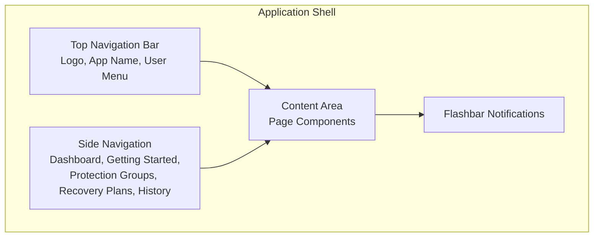

### Route Structure

Implement the following routes using React Router:

| Route | Component | Description |
|-------|-----------|-------------|
| /login | LoginPage | Cognito authentication |
| / | Dashboard | Overview metrics and quick actions |
| /getting-started | GettingStartedPage | Onboarding guide with quick links |
| /protection-groups | ProtectionGroupsPage | Protection Group management |
| /recovery-plans | RecoveryPlansPage | Recovery Plan management |
| /executions | ExecutionsPage | Execution list (Active/History tabs) |
| /executions/:id | ExecutionDetailsPage | Real-time execution monitoring |
| /servers/:id | ServerDetailsPage | DRS source server details and configuration |

### Authentication Flow

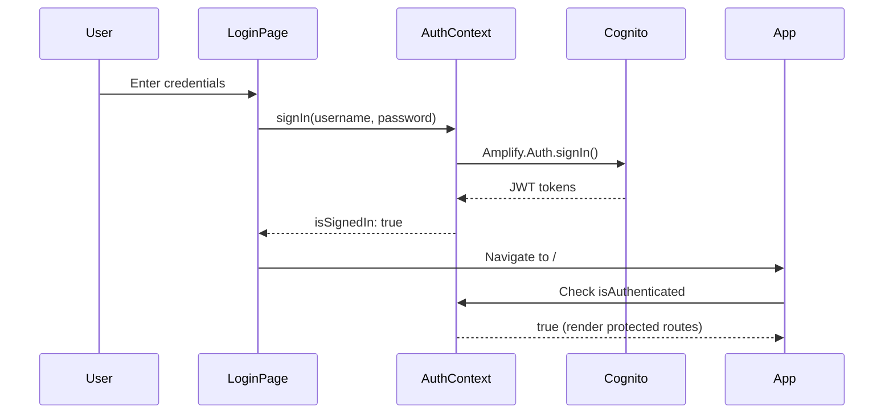

---

## Page Specifications

The following sections define each page that shall be implemented. Each specification includes the required layout, components, behavior, and styling.

### 1. Login Page

**Purpose**: Authenticate users via AWS Cognito

**Requirements**:
- Shall be the entry point for unauthenticated users
- Shall redirect authenticated users to Dashboard
- Shall display error messages for failed authentication attempts

**Layout Structure**:

```
┌─────────────────────────────────────────────────────────────┐
│                    Dark Background (#232F3E)                │
│                                                             │
│                      [AWS Logo]                             │
│              Elastic Disaster Recovery Orchestrator         │
│                                                             │
│                 ╭─────────────────────╮                     │
│                 │    White Card       │                     │
│                 │                     │                     │
│                 │      Sign in        │                     │
│                 │                     │                     │
│                 │  Username or email  │                     │
│                 │  ┌─────────────────┐│                     │
│                 │  │ placeholder...  ││                     │
│                 │  └─────────────────┘│                     │
│                 │                     │                     │
│                 │  Password           │                     │
│                 │  ┌─────────────────┐│                     │
│                 │  │ placeholder...  ││                     │
│                 │  └─────────────────┘│                     │
│                 │                     │                     │
│                 │  ┌─────────────────┐│                     │
│                 │  │    Sign in      ││                     │
│                 │  └─────────────────┘│                     │
│                 ╰─────────────────────╯                     │
│                                                             │
│     ◇ ◇ ◇ ◇ ◇ ◇ ◇ ◇ ◇ ◇ ◇ ◇  (3D Isometric Cubes)         │
│                                                             │
├─────────────────────────────────────────────────────────────┤
│  Disclaimer Footer (#1a242f)                                │
└─────────────────────────────────────────────────────────────┘
```

**Color Scheme**:

| Element | Color | Hex |
|---------|-------|-----|
| Page Background | AWS Dark Blue | #232F3E |
| Login Card | White | #FFFFFF |
| Card Title | AWS Navy | #16191F |
| App Title | White | #FFFFFF |
| Sign In Button | AWS Orange | #EC7211 |
| Sign In Button Text | White | #FFFFFF |
| Input Border | Light Grey | #AAB7B8 |
| Footer Background | Darker Blue | #1A242F |
| Footer Border | Slate | #3D4F5F |
| Footer Text | Muted Grey | #8D9BA8 |
| Footer Labels | Light Grey | #AAB7B8 |

**AWS Logo**:

- Source: `https://a0.awsstatic.com/libra-css/images/logos/aws_smile-header-desktop-en-white_59x35@2x.png`
- Height: 50px
- Alt text: "AWS"
- Centered above app title

**App Title**:

- Text: "Elastic Disaster Recovery Orchestrator"
- Font size: 20px
- Font weight: 700 (bold)
- Color: White (#FFFFFF)
- Letter spacing: 0.5px
- Centered below AWS logo

**Login Card**:

- Background: White (#FFFFFF)
- Border radius: 8px
- Padding: 32px
- Box shadow: `0 4px 16px rgba(0, 0, 0, 0.3)`
- Max width: 400px
- Centered horizontally

**Card Title**:

- Text: "Sign in"
- Font size: 24px
- Font weight: 700 (bold)
- Color: #16191F
- Text align: center
- Margin bottom: 24px

**Input Fields** (AWS IAM Identity Center style):

| Property | Value |
|----------|-------|
| Width | 100% |
| Padding | 8px 12px |
| Font size | 14px |
| Font family | "Amazon Ember", "Helvetica Neue", Roboto, Arial, sans-serif |
| Border | 1px solid #AAB7B8 |
| Border radius | 3px |

**Input Placeholders**:

| Field | Label | Placeholder |
|-------|-------|-------------|
| Username | "Username or email" | "Enter your username" |
| Password | "Password" | "Enter your password" |

**Sign In Button**:

| Property | Value |
|----------|-------|
| Width | 100% |
| Padding | 8px 16px |
| Font size | 14px |
| Background | #EC7211 (AWS Orange) |
| Text color | White |
| Border | none |
| Border radius | 3px |
| Cursor | pointer (normal), not-allowed (loading) |
| Opacity | 1.0 (normal), 0.6 (loading) |
| Loading text | "Signing in..." |

**3D Isometric Cubes**:

Decorative SVG cubes at bottom of page, creating visual interest.

| Cube Color | Main | Light | Dark | Side |
|------------|------|-------|------|------|
| Orange | #FF9900 | #FFB84D | #CC7A00 | #E68A00 |
| Teal | #1DC7B4 | #4DD9CA | #17A090 | #1AB3A2 |
| Purple | #9469D6 | #B08DE6 | #7654AB | #855EC0 |
| Blue | #527FFF | #7A9FFF | #4266CC | #4A72E6 |

- 12 cubes displayed in a row
- Colors cycle through the 4 color schemes
- Each cube: 80px wide × 92px tall
- Drop shadow: `0 4px 8px rgba(0,0,0,0.3)`
- Container height: 120px
- Gap between cubes: 20px

**Disclaimer Footer**:

- Background: #1A242F
- Padding: 12px 40px
- Border top: 1px solid #3D4F5F
- Max width: 1100px (centered)
- Font size: 10px
- Line height: 1.5
- Text color: #8D9BA8

**Disclaimer Text**:

```
Disclaimer: This AWS Elastic Disaster Recovery Orchestrator is a sample 
implementation provided by AWS Professional Services as a reference architecture. 
This tool is provided "AS IS" without warranty of any kind. Amazon Web Services 
is not responsible for any damages, data loss, or service disruptions arising 
from its use. This is not an official AWS product and is not covered by AWS 
Support plans. By using this tool, you acknowledge that you are responsible 
for testing, validating, and maintaining it within your environment. For 
continued development, we recommend Amazon Q Developer.
```

- "Disclaimer:" label: font-weight 600, color #AAB7B8
- "AS IS" and "This tool is provided...": bold
- "Amazon Q Developer": CloudScape Link (external, secondary variant)
  - URL: https://aws.amazon.com/q/developer/

**Components Used**:

- CloudScape SpaceBetween (vertical, size "l")
- CloudScape FormField (for labels)
- CloudScape Alert (type="error", dismissible)
- CloudScape Link (for Amazon Q Developer link)
- Custom styled HTML input elements
- Custom styled HTML button element
- Custom SVG Cube component

**Behavior**:

- Username field has autoFocus
- Submit on Enter key or button click
- Show "Signing in..." during authentication (button disabled, opacity 0.6)
- Display dismissible error Alert on authentication failure
- Redirect to Dashboard (/) on successful sign-in
- Auto-redirect to Dashboard if already authenticated (useEffect check)
- Form validation: both fields required (HTML5 validation)

### 2. Dashboard Page

**Purpose**: Operational dashboard showing execution status, metrics, and DRS capacity

**Requirements**:
- Shall display real-time execution metrics and status
- Shall show DRS capacity for the selected region
- Shall auto-refresh data every 30 seconds
- Shall provide quick navigation to active executions

**Layout**: Metric cards row + two-column layout + DRS capacity + recent activity

**Components to Implement**:

- CloudScape ContentLayout with Header
- CloudScape ColumnLayout (4 columns for metrics)
- CloudScape Container for each section
- CloudScape PieChart (donut variant) for execution status
- CloudScape Select for region selection
- CloudScape StatusIndicator for status display
- CloudScape Link for navigation
- DRSQuotaStatusPanel custom component

**Metric Cards Row** (4 columns):

| Card | Value Color | Description |
|------|-------------|-------------|
| Active Executions | Blue (#0972d3) if > 0, grey otherwise | Count of non-terminal executions |
| Completed | Green (#037f0c) | Count of completed executions |
| Failed | Red (#d91515) if > 0, grey otherwise | Count of failed executions |
| Success Rate | Green (≥80%), Orange (≥50%), Red (<50%) | Percentage of successful completions |

**Execution Status Section** (left column):

- CloudScape PieChart (donut variant, medium size)
- Inner metric: Total execution count
- Segments colored by status:
  - Completed: #037f0c (green)
  - In Progress: #0972d3 (blue)
  - Pending: #5f6b7a (grey)
  - Failed: #d91515 (red)
  - Rolled Back: #ff9900 (orange)
  - Cancelled/Paused: #5f6b7a (grey)
- Empty state: "No execution data" with link to Recovery Plans

**Active Executions Section** (right column):

- Header with count and "View all" link
- List of up to 5 active executions
- Each item shows: StatusIndicator + Plan name (link)
- Empty state: "No active executions"

**DRS Capacity Section**:

- Header with region selector dropdown (28 commercial DRS regions)
- DRSQuotaStatusPanel component showing:
  - Capacity status indicator (Available/Limited/At Capacity)
  - Replicating Servers progress bar (current/max)
  - Concurrent Jobs progress bar (current/max)
  - Servers in Active Jobs progress bar (current/max)
- Loading state with spinner
- Error state with warning indicator

**Recent Activity Section**:

- Header with "View history" link
- List of up to 5 recent executions (all statuses)
- Each item shows: StatusIndicator + Plan name (link) + timestamp
- Empty state: "No execution history yet"

**Auto-refresh**: Every 30 seconds for executions and DRS quotas

### 3. Getting Started Page

**Purpose**: Onboarding guide for new users

**Requirements**:
- Shall provide quick links to main application features
- Shall display a step-by-step guide for first-time users
- Shall include best practices for DR operations

**Layout**: Three-column card grid + Quick Start Guide container

**Components to Implement**:

- CloudScape ContentLayout with Header
- Custom CSS Grid (3 columns, 20px gap)
- CloudScape Container with fitHeight
- CloudScape Icon for card headers
- CloudScape Button (primary, fullWidth)
- CloudScape Grid for step layout
- CloudScape Box for typography
- CloudScape Link for navigation

**Quick Link Cards** (3 columns):

| Card | Icon | Description | Button |
|------|------|-------------|--------|
| Protection Groups | folder | "Group DRS servers for coordinated recovery." | "View Protection Groups" |
| Recovery Plans | file | "Design multi-wave recovery sequences." | "View Recovery Plans" |
| Execution History | status-in-progress | "Monitor and manage recovery executions." | "View Executions" |

**Quick Start Guide** (numbered steps with dividers):

| Step | Title | Instructions |
|------|-------|--------------|
| 1 | Create a Protection Group | Navigate to Protection Groups, select region, name group, select servers |
| 2 | Design a Recovery Plan | Navigate to Recovery Plans, name plan, add waves with Protection Groups, set dependencies and pause points |
| 3 | Execute a Drill or Recovery | From Recovery Plans, select "Run Drill" or "Run Recovery", monitor progress, use "Terminate Instances" after drill |
| ✓ | Best Practices | Run drills regularly, use pause points, keep groups focused, review history, terminate drill instances |

**Step Layout**: Grid with 1:11 column ratio (number : content)

**Step Number Styling**: fontSize="heading-xl", fontWeight="bold", color="text-status-info"

### 4. Protection Groups Page

**Purpose**: CRUD operations for Protection Groups

**Requirements**:
- Shall allow users to create, edit, and delete Protection Groups
- Shall display all Protection Groups in a searchable, sortable table
- Shall prevent deletion of groups used in Recovery Plans
- Shall prevent editing of groups with active executions

**Layout**: Full-width table with header actions

**Components to Implement**:

- CloudScape ContentLayout with Header
- CloudScape Table with useCollection hook
- CloudScape Header with "Create Group" button (primary)
- CloudScape TextFilter for search
- CloudScape Pagination (10 items per page)
- CloudScape ButtonDropdown for row actions
- ConfirmDialog for delete confirmation
- ProtectionGroupDialog for create/edit
- DateTimeDisplay for timestamps
- LoadingState and ErrorState components

**Header**:

- Title: "Protection Groups"
- Description: "Define groups of servers to protect together"
- Action: "Create Group" button (primary variant)

**Table Columns**:

| Column | Header | Sortable | Content |
|--------|--------|----------|---------|
| name | Name | Yes | Group name |
| description | Description | Yes | Description or "-" |
| region | Region | Yes | AWS region code |
| servers | Servers | Yes | Count of sourceServerIds |
| createdAt | Created | Yes | DateTimeDisplay (relative format) |
| actions | Actions | No | ButtonDropdown (Edit, Delete) |

**Row Actions** (ButtonDropdown):

| Action | Icon | Disabled Condition |
|--------|------|-------------------|
| Edit | edit | When group is in active execution |
| Delete | remove | When group is used in any recovery plan |

**Delete Confirmation Dialog**:

- Title: "Delete Protection Group"
- Message: "Are you sure you want to delete '{name}'? This action cannot be undone."
- Buttons: Cancel, Delete (loading state)

**Empty State**: "No protection groups" with guidance text
- ServerSelector component with real-time search

### 5. Recovery Plans Page

**Purpose**: CRUD operations for Recovery Plans with wave-based orchestration

**Requirements**:
- Shall allow users to create, edit, and delete Recovery Plans
- Shall support multi-wave configuration with Protection Group assignment per wave
- Shall detect and prevent execution when servers are in use by other active executions
- Shall track and display execution status for each plan
- Shall prevent editing/deletion of plans with active executions

**Layout**: Full-width table with header actions

**Components to Implement**:

- CloudScape ContentLayout with Header
- CloudScape Table with useCollection hook
- CloudScape Header with "Create Plan" button (primary)
- CloudScape TextFilter for search
- CloudScape Pagination (10 items per page)
- CloudScape ButtonDropdown for row actions
- CloudScape Badge for status display
- ConfirmDialog for delete confirmation
- RecoveryPlanDialog for create/edit
- DateTimeDisplay for timestamps
- StatusBadge for execution status
- LoadingState and ErrorState components
- PageTransition for animated transitions

**Header**:

- Title: "Recovery Plans"
- Description: "Define recovery strategies with wave-based orchestration"
- Action: "Create Plan" button (primary variant)

**Table Columns**:

| Column | Width | Sortable | Content |
|--------|-------|----------|---------|
| Plan Name | flex | Yes | Plan name with description tooltip, fontWeight 500 |
| Waves | 90px | No | Wave count or "X of Y" during active execution |
| Status | 120px (min) | No | StatusBadge or "Not Run" Badge |
| Last Start | 180px (min) | No | DateTimeDisplay (full format) or "Never" |
| Last End | 180px (min) | No | DateTimeDisplay (full format) or "Never" |
| Created | 180px (min) | No | DateTimeDisplay (full format) or "Unknown" |
| Actions | 150px | No | ButtonDropdown (icon variant) |

**Row Actions** (ButtonDropdown):

| Action | Icon | Description | Disabled Condition |
|--------|------|-------------|-------------------|
| Run Drill | check | "Test recovery without failover" | archived, executing, hasInProgressExecution, or hasServerConflict |
| Run Recovery | status-warning | "Coming soon - actual failover operation" | Always disabled (not yet implemented) |
| (divider) | - | - | - |
| Edit | edit | Edit plan configuration | hasInProgressExecution |
| Delete | remove | Delete plan | hasInProgressExecution |

**Server Conflict Detection**:

When a plan has servers that are currently in use by another active execution:
- `hasServerConflict` flag is set to `true`
- `conflictInfo.reason` contains the blocking reason
- Run Drill description changes to: "Blocked: {conflictInfo.reason}"
- Run Drill button is disabled

**Execution Disabled Logic**:

```typescript
const hasInProgressExecution = plansWithInProgressExecution.has(item.id);
const hasServerConflict = item.hasServerConflict === true;
const isExecutionDisabled = item.status === 'archived' || 
                            executing || 
                            hasInProgressExecution || 
                            hasServerConflict;
```

**Wave Progress Display** (during active execution):

- When a plan has an active execution, the Waves column shows "X of Y" format
- `executionProgress` Map tracks currentWave and totalWaves per plan
- Updated via `checkInProgressExecutions()` polling

**Active Execution Tracking**:

- Polls every 5 seconds to check for in-progress executions
- Active statuses: IN_PROGRESS, PENDING, RUNNING, POLLING, INITIATED, LAUNCHING, STARTED, PAUSED
- Stores plan IDs with active executions in `plansWithInProgressExecution` Set
- Persisted to sessionStorage for page refresh resilience
- Visibility change listener refreshes on tab focus

**Error Handling** (DRS Service Limits):

| Error Code | Toast Message |
|------------|---------------|
| WAVE_SIZE_LIMIT_EXCEEDED | "Wave size limit exceeded. Maximum {limit} servers per wave." |
| CONCURRENT_JOBS_LIMIT_EXCEEDED | "DRS concurrent jobs limit reached ({current}/{max}). Wait for active jobs to complete." |
| SERVERS_IN_JOBS_LIMIT_EXCEEDED | "Would exceed max servers in active jobs ({total}/{max})." |
| UNHEALTHY_SERVER_REPLICATION | "{count} server(s) have unhealthy replication state and cannot be recovered." |
| (default) | Generic error message from API |

**Delete Confirmation Dialog**:

- Title: "Delete Recovery Plan"
- Message: "Are you sure you want to delete '{name}'? This action cannot be undone."
- Buttons: Cancel, Delete (with loading state)

**Create/Edit Dialog** (RecoveryPlanDialog):

- Plan name input (required)
- Description textarea (optional)
- WaveConfigEditor component for wave configuration
- Protection Group selection per wave
- Pause before wave toggle (except Wave 1)
- Wave dependency configuration

**Empty State**:

- Title: "No recovery plans"
- Message: "No recovery plans found. Click 'Create Plan' above to get started."
- Centered text alignment

**Post-Execution Navigation**:

After successful drill/recovery start:
- Toast success message displayed
- Plan added to `plansWithInProgressExecution` Set
- Navigates to `/executions/{executionId}` for real-time monitoring

### 6. Executions Page (History)

**Purpose**: List and monitor recovery executions

**Requirements**:
- Shall display active executions in a card-based layout with real-time updates
- Shall display historical executions in a searchable, sortable table
- Shall auto-refresh active executions every 3 seconds
- Shall allow clearing of completed execution history
- Shall provide navigation to detailed execution view

**Layout**: Tabbed interface with Active and History views

**Components to Implement**:

- CloudScape Tabs (Active / History)
- CloudScape Container cards for active executions
- CloudScape Table for history list with useCollection hook
- CloudScape ProgressBar for in-progress executions
- CloudScape Badge for live updates indicator
- CloudScape Modal for Clear History confirmation

**Header Actions**:

| Button | Condition | Action |
|--------|-----------|--------|
| Refresh | Always | Reload executions list |

**Header Info** (when active executions exist):

- "Live Updates" badge (green)
- "Updated X ago" timestamp

**Active Tab**:

- Card-based layout for running/paused executions
- Each card shows:
  - Recovery Plan name (header)
  - Status badge (Running, Paused, Polling, etc.)
  - Wave progress (Wave X of Y)
  - Start time
  - Duration (live updating)
  - Progress bar (for in-progress executions)
  - "View Details" button
- Auto-refresh every 3 seconds when active executions exist
- Empty state: "No Active Executions" with guidance text

**History Tab**:

- "Clear Completed History" button (top right)
- TextFilter for searching executions
- Table with columns:

| Column | Width | Sortable | Content |
|--------|-------|----------|---------|
| Plan Name | flex | Yes | Recovery plan name |
| Status | 100px | No | StatusBadge component |
| Waves | 80px | No | "X waves" format |
| Started | 150px | Yes | DateTimeDisplay (full format) |
| Completed | 150px | Yes | DateTimeDisplay or "-" |
| Duration | 100px | No | Calculated duration |
| Actions | 80px | No | "View" inline-link button |

- Pagination (10 items per page)
- Empty state: "No execution history"

**Clear History Dialog**:

- Warning about permanent deletion
- Shows count of items to be deleted
- "This action cannot be undone" alert
- Cancel and "Clear History" buttons

### 7. Execution Details Page

**Purpose**: Real-time execution monitoring with pause/resume and instance management

**Requirements**:
- Shall display real-time execution status with 3-second polling for active executions
- Shall allow pausing and resuming of executions at wave boundaries
- Shall allow cancellation of active executions
- Shall allow termination of recovery instances after execution completes
- Shall display wave-by-wave progress with server-level details
- Shall show DRS job events timeline with auto-refresh

**Layout**: Header with actions, summary container, wave progress timeline

**Components to Implement**:

- CloudScape Header with back navigation
- CloudScape Container for execution summary
- CloudScape Alert for paused state notification
- CloudScape Alert for termination in progress
- CloudScape ProgressBar for overall progress
- WaveProgress component for wave timeline
- CloudScape Button for actions
- CloudScape Badge for status indicators
- ConfirmDialog for destructive actions

**Header Actions**:

| Element | Condition | Variant | Action |
|---------|-----------|---------|--------|
| Back to Executions | Always | Normal button | Navigate to /executions |
| Refresh | Always | Normal button | Reload execution data |
| Resume Execution | Status = PAUSED | Primary button | Resume paused execution |
| Cancel Execution | Status = RUNNING/POLLING/PAUSED/STARTED/PENDING/LAUNCHING/INITIATED | Normal button | Open cancel confirmation dialog |
| Terminate Instances | Terminal status + has jobIds + NOT already terminated + NOT terminating | Normal button | Open terminate confirmation dialog |
| "Terminating..." | terminationInProgress = true | Blue Badge | Visual indicator (no action) |
| "Instances Terminated" | instancesTerminated = true AND NOT terminating | Grey Badge | Visual indicator (no action) |

**Button Visibility Logic**:

```typescript
// Resume button: Only when paused
const isPaused = status === 'PAUSED';
showResumeButton = isPaused && !resuming;

// Cancel button: Active executions only
const canCancel = ['RUNNING', 'POLLING', 'PAUSED', 'STARTED', 
                   'PENDING', 'LAUNCHING', 'INITIATED'].includes(status);

// Terminate button: Terminal + has DRS jobs + not already terminated
const isTerminal = ['COMPLETED', 'CANCELLED', 'FAILED', 'PARTIAL'].includes(status);
const hasJobId = waves.some(wave => wave.jobId);
const canTerminate = isTerminal && hasJobId && !instancesTerminated;

// Badges: Mutually exclusive with Terminate button
showTerminatingBadge = terminationInProgress;
showTerminatedBadge = instancesTerminated && !terminationInProgress;
```

**Execution Summary Container**:

- Plan name (large, bold)
- Status badge with color
- Current wave / Total waves badge
- Initiated by user
- Start time and end time (if completed)
- Duration (calculated, updates in real-time for active)
- Execution ID (copyable)
- Overall progress bar (percentage based on wave/server completion)

**Alert States**:

| Alert Type | Condition | Content |
|------------|-----------|---------|
| Paused Alert | Status = PAUSED | "Execution is paused before starting Wave N. Click Resume to continue." with Resume button |
| Termination In Progress | terminationInProgress = true | "Terminating N recovery instance(s) via DRS. This may take a few minutes..." with progress bar and DRS job ID |
| Termination Success | terminateSuccess message | Green success alert with instance count |
| Termination Error | terminateError message | Red error alert with error details |
| Cancel Error | cancelError message | Red error alert |
| Resume Error | resumeError message | Red error alert |

**Wave Progress Timeline**:

- Visual timeline of all waves
- Status indicator per wave (Pending, Running, Paused, Completed, Failed)
- Protection Group name per wave
- Server count per wave (e.g., "3/3 servers")
- Duration per wave
- Expandable server details table:
  - Server hostname
  - Launch status (PENDING, IN_PROGRESS, LAUNCHED, FAILED)
  - Recovery instance ID (if launched)
  - Instance type
  - Private IP
- Expandable DRS Job Events section with auto-refresh

**Real-time Updates**:

- Execution status polling: Every 3 seconds for active executions
- Termination status polling: Every 5 seconds when terminationInProgress
- DRS Job Events polling: Every 3 seconds (independent)
- Auto-refresh stops when execution reaches terminal state
- Termination polling stops when instancesTerminated becomes true

**Progress Calculation**:

Progress percentage based on DRS job phases:
- JOB_START: 5%
- SNAPSHOT_COMPLETE: 15%
- CONVERSION_COMPLETE: 75%
- LAUNCHED: 100%

Each wave contributes equally to overall progress (100% / totalWaves)

### 8. Server Details Page

**Purpose**: View and configure DRS source server settings

**Requirements**:
- Shall display comprehensive DRS source server information
- Shall provide tabbed interface for different configuration categories
- Shall allow configuration of launch settings, EC2 templates, tags, disk settings, replication settings, and post-launch actions
- Shall display real-time replication status and progress

**Layout**: Header with server info, tabbed content area for different settings

**Components to Implement**:

- CloudScape Header with back navigation and server hostname
- CloudScape Tabs for different configuration sections
- ServerInfoPanel for read-only server details
- Action buttons for opening configuration dialogs

**Tabs**:

| Tab | Content |
|-----|---------|
| Overview | Server details, lifecycle state, replication status |
| Replication | Disk replication progress, lag duration |
| Network | Network interfaces, IP addresses |
| Disks | Source disk information |

**Action Buttons**:

| Button | Dialog | Description |
|--------|--------|-------------|
| Launch Settings | LaunchSettingsDialog | DRS launch configuration |
| EC2 Template | EC2TemplateEditor | EC2 launch template settings |
| Tags | TagsEditor | Server tag management |
| Disk Settings | DiskSettingsEditor | Per-disk configuration |
| Replication | ReplicationSettingsEditor | Replication configuration |
| Post-Launch | PostLaunchSettingsEditor | Post-launch actions |


---

## Component Library

The following components shall be implemented to support the application pages. Each component is designed for reusability and consistency across the application.

### Component Inventory

**MVP Components (23 Components)** - Required for initial release:

| Category | Component | Purpose |
|----------|-----------|---------|
| **Layout** | ErrorBoundary | Catch and display React errors |
| | ErrorFallback | Error state display |
| | ErrorState | Reusable error message |
| | LoadingState | Loading spinner with message |
| | CardSkeleton | Loading placeholder for cards |
| | DataTableSkeleton | Loading placeholder for tables |
| | PageTransition | Animated page transitions |
| | ProtectedRoute | Auth-gated route wrapper |
| | AppLayout | CloudScape app shell wrapper |
| | ContentLayout | CloudScape page content wrapper |
| **Dialogs** | ProtectionGroupDialog | Create/edit protection groups |
| | RecoveryPlanDialog | Create/edit recovery plans |
| | ConfirmDialog | Confirmation prompts |
| **Server Management** | ServerSelector | Multi-select server picker |
| | ServerDiscoveryPanel | DRS server discovery |
| | ServerListItem | Server row in selection list |
| **Form Controls** | RegionSelector | AWS region dropdown (30 DRS regions) |
| | WaveConfigEditor | Wave configuration form |
| **Status Display** | StatusBadge | Colored status indicator |
| | WaveProgress | Wave timeline with server details |
| | DateTimeDisplay | Formatted date/time display |
| | DRSQuotaStatus | DRS service quota/capacity display |
| | InvocationSourceBadge | Execution source indicator (UI/CLI/API/Scheduled) |
| **Execution** | ExecutionDetails | Execution summary panel |
| **Launch Config** | LaunchConfigSection | DRS launch settings + EC2 template config |

**Phase 2 Components** - DRS Source Server Management:

| Category | Component | Purpose |
|----------|-----------|---------|
| **Dialogs** | TagsEditor | Server tag management |
| | DiskSettingsEditor | Per-disk configuration |
| | ReplicationSettingsEditor | Replication settings |
| | PostLaunchSettingsEditor | Post-launch actions |
| **Server Management** | ServerInfoPanel | Read-only server details |
| | PitPolicyEditor | Point-in-time policy editor |
| **Status Display** | JobEventsTimeline | DRS job events display |

**Total: 32 Components (26 MVP + 7 Phase 2)**


---

## Component Specifications

The following sections define the detailed specifications for each component that shall be implemented. Each specification includes the required props interface, behavior, and visual requirements.

### ProtectionGroupDialog

**Purpose**: Create and edit Protection Groups with server selection

**Props**:

```typescript
interface ProtectionGroupDialogProps {
  visible: boolean;
  onDismiss: () => void;
  onSave: (group: ProtectionGroup) => Promise<void>;
  group?: ProtectionGroup; // undefined for create mode
  existingGroups: ProtectionGroup[]; // for validation
}
```

**Behavior**:

- Modal size: large (900px)
- Validates name uniqueness
- Fetches available servers on region change
- Filters out servers already assigned to other groups
- Shows server count in footer

### RecoveryPlanDialog

**Purpose**: Create and edit Recovery Plans with wave configuration

**Props**:

```typescript
interface RecoveryPlanDialogProps {
  visible: boolean;
  onDismiss: () => void;
  onSave: (plan: RecoveryPlan) => Promise<void>;
  plan?: RecoveryPlan;
  protectionGroups: ProtectionGroup[];
}
```

**Behavior**:

- Modal size: large (900px)
- Minimum 1 wave required
- Each wave references a Protection Group
- Pause before wave option (except Wave 1)
- Validates wave dependencies


### ConfirmDialog

**Purpose**: Reusable confirmation dialog for destructive actions

**Props**:

```typescript
interface ConfirmDialogProps {
  visible: boolean;
  title: string;
  message: string | React.ReactNode;
  confirmLabel?: string;
  cancelLabel?: string;
  variant?: 'normal' | 'danger';
  onConfirm: () => void;
  onCancel: () => void;
  loading?: boolean;
}
```

**Usage Examples**:

- Delete Protection Group
- Delete Recovery Plan
- Cancel Execution
- Terminate Recovery Instances

### ServerSelector

**Purpose**: Multi-select server picker with search and filtering

**Props**:

```typescript
interface ServerSelectorProps {
  region: string;
  selectedServers: string[];
  onChange: (serverIds: string[]) => void;
  excludeServerIds?: string[];
  disabled?: boolean;
}
```

**Features**:

- Real-time search by hostname
- Shows server lifecycle state
- Indicates servers assigned to other groups
- Checkbox selection with select all


### ServerInfoPanel

**Purpose**: Read-only display of DRS source server details with tabbed interface

**Props**:

```typescript
interface ServerInfoPanelProps {
  serverId: string;
  region: string;
  onClose?: () => void;
}
```

**Tabs**:

| Tab | Content |
|-----|---------|
| Overview | Server ID, hostname, OS, recommended instance type, RAM, CPUs, timestamps |
| Replication | Replication state, lag duration, ETA, last snapshot, disk progress bars |
| Network | Network interfaces with MAC addresses and IP addresses |
| Disks | Source disk devices with sizes |

**Status Indicators**:

| Lifecycle State | Status Type | Label |
|-----------------|-------------|-------|
| READY_FOR_TEST | success | Ready for Test |
| READY_FOR_CUTOVER | success | Ready for Cutover |
| CONTINUOUS | success | Replicating |
| INITIAL_SYNC | in-progress | Initial Sync |
| CUTTING_OVER | in-progress | Cutting Over |
| STALLED | error | Stalled |
| DISCONNECTED | error | Disconnected |
| STOPPED | stopped | Stopped |

**Data Display**:

- KeyValuePairs for structured data
- ProgressBar for disk replication progress
- StatusIndicator for lifecycle and replication states
- Badge for last recovery result


### LaunchSettingsDialog

**Purpose**: Configure DRS launch settings for a single server

**Props**:

```typescript
interface LaunchSettingsDialogProps {
  visible: boolean;
  onDismiss: () => void;
  serverId: string;
  serverName: string;
  region: string;
}
```

**Form Fields**:

| Field | Type | Options | Description |
|-------|------|---------|-------------|
| Right-Sizing | RadioGroup | NONE, BASIC, IN_AWS | Instance type determination method |
| Launch Disposition | RadioGroup | STARTED, STOPPED | Auto-start after launch |
| Copy Private IP | Checkbox | true/false | Copy source private IP |
| Copy Tags | Checkbox | true/false | Copy source server tags |
| BYOL Licensing | Checkbox | true/false | Bring Your Own License |

**Sections**:

1. Recovery Instance Configuration (right-sizing, disposition)
2. Copy Options (private IP, tags)
3. Licensing (BYOL)
4. Info alert showing linked EC2 Launch Template ID

**Validation**:

- Confirmation prompt for significant changes (right-sizing != NONE or disposition = STARTED)


### EC2TemplateEditor

**Purpose**: Edit EC2 launch template settings for recovery instances

**Props**:

```typescript
interface EC2TemplateEditorProps {
  visible: boolean;
  onDismiss: () => void;
  serverId: string;
  serverName: string;
  region: string;
}
```

**Form Fields**:

| Field | Type | Description |
|-------|------|-------------|
| Instance Type | Select | EC2 instance type (t3.micro, m5.large, etc.) |
| Subnet | Select | Target subnet for recovery instance |
| Security Groups | Multiselect | Security groups to attach |
| IAM Instance Profile | Select | IAM role for the instance |
| Tenancy | Select | default, dedicated, host |
| EBS Optimized | Checkbox | Enable EBS optimization |

**Data Loading**:

- Fetches available subnets from EC2
- Fetches security groups from EC2
- Fetches IAM instance profiles
- Fetches current launch template settings from DRS


### TagsEditor

**Purpose**: View, add, edit, and delete server tags

**Props**:

```typescript
interface TagsEditorProps {
  visible: boolean;
  onDismiss: () => void;
  serverId: string;
  serverName: string;
  region: string;
}
```

**Features**:

- Table display of existing tags (Key, Value, Actions columns)
- Inline value editing
- Delete button per tag row
- Add new tag form (Key input, Value input, Add button)
- Tag validation (no aws: prefix, max 128 char key, max 256 char value)
- Max 50 tags per server

**Table Columns**:

| Column | Width | Content |
|--------|-------|---------|
| Key | 200px | Tag key (read-only) |
| Value | flex | Editable input field |
| Actions | 80px | Delete button |


### DiskSettingsEditor

**Purpose**: Configure per-disk settings for replication

**Props**:

```typescript
interface DiskSettingsEditorProps {
  visible: boolean;
  onDismiss: () => void;
  serverId: string;
  serverName: string;
  region: string;
}
```

**Table Columns**:

| Column | Width | Content |
|--------|-------|---------|
| Device | 120px | Device name + boot disk badge |
| Size | 100px | Formatted disk size (GB/TB) |
| Disk Type | 200px | Select dropdown |
| IOPS | 100px | Number input (gp3/io1/io2 only) |
| Throughput | 120px | Number input (gp3 only) |

**Disk Type Options**:

| Type | Label | IOPS Range | Throughput |
|------|-------|------------|------------|
| GP3 | General Purpose SSD (gp3) | 3000-16000 | 125-1000 MiB/s |
| GP2 | General Purpose SSD (gp2) | Burst to 3000 | N/A |
| IO1 | Provisioned IOPS SSD (io1) | Up to 64000 | N/A |
| IO2 | Provisioned IOPS SSD (io2) | Up to 64000 | N/A |
| ST1 | Throughput Optimized HDD | N/A | Up to 500 MiB/s |
| SC1 | Cold HDD | N/A | Up to 250 MiB/s |

**Conditional Fields**:

- IOPS input: visible only for GP3, IO1, IO2
- Throughput input: visible only for GP3


### ReplicationSettingsEditor

**Purpose**: Configure replication settings including staging area, bandwidth, and PIT policy

**Props**:

```typescript
interface ReplicationSettingsEditorProps {
  visible: boolean;
  onDismiss: () => void;
  serverId: string;
  serverName: string;
  region: string;
}
```

**Expandable Sections**:

1. **Staging Area**
   - Subnet selector (fetched from EC2)
   - Security groups multiselect
   - Associate default security group checkbox

2. **Replication Server**
   - Instance type selector (t3.small through m5.xlarge)
   - Data plane routing (Private IP / Public IP)
   - Dedicated replication server checkbox
   - Create public IP checkbox

3. **Bandwidth Throttling**
   - Bandwidth limit input (Mbps, 0 = unlimited)

4. **Point-in-Time Snapshot Policy**
   - PitPolicyEditor sub-component

**Instance Type Options**:

| Type | vCPUs | Memory | Use Case |
|------|-------|--------|----------|
| t3.small | 2 | 2 GB | Small workloads (<5 servers) |
| t3.medium | 2 | 4 GB | Medium workloads (5-10 servers) |
| t3.large | 2 | 8 GB | Larger workloads (10-20 servers) |
| m5.large | 2 | 8 GB | High throughput |
| m5.xlarge | 4 | 16 GB | Very high throughput |


### PitPolicyEditor

**Purpose**: Sub-component for editing point-in-time snapshot retention rules

**Props**:

```typescript
interface PitPolicyEditorProps {
  pitPolicy: PitRule[];
  onChange: (policy: PitRule[]) => void;
}

interface PitRule {
  interval: number;
  retentionDuration: number;
  units: 'MINUTE' | 'HOUR' | 'DAY';
  enabled: boolean;
}
```

**Table Columns**:

| Column | Width | Content |
|--------|-------|---------|
| Enabled | 80px | Toggle switch |
| Interval | 100px | Number input |
| Units | 120px | Select (Minutes/Hours/Days) |
| Retention | 100px | Number input |

**Default Rules**:

| Interval | Units | Retention | Description |
|----------|-------|-----------|-------------|
| 10 | MINUTE | 60 | Keep 10-minute snapshots for 1 hour |
| 1 | HOUR | 24 | Keep hourly snapshots for 24 hours |
| 1 | DAY | 7 | Keep daily snapshots for 7 days |


### PostLaunchSettingsEditor

**Purpose**: Configure post-launch actions (SSM automation, S3 logging)

**Props**:

```typescript
interface PostLaunchSettingsEditorProps {
  visible: boolean;
  onDismiss: () => void;
  serverId: string;
  serverName: string;
  region: string;
}
```

**Form Sections**:

1. **Deployment Type**
   - Select: TEST_AND_CUTOVER or CUTOVER
   - Description text for each option

2. **SSM Automation Document** (expandable)
   - Enable toggle
   - SSM document autosuggest (fetched from SSM)
   - Timeout input (120-3600 seconds)
   - Must succeed for cutover checkbox

3. **S3 Logging** (expandable)
   - Enable toggle
   - S3 bucket selector (fetched from S3)
   - Key prefix input

**Deployment Options**:

| Value | Label | Description |
|-------|-------|-------------|
| TEST_AND_CUTOVER | Test and Cutover | Launch in test mode first, then cutover |
| CUTOVER | Cutover Only | Direct cutover without test phase |

**SSM Document Loading**:

- Fetches Command-type documents from SSM
- Shows document name, owner, and description
- Supports custom document names via autosuggest


### WaveConfigEditor

**Purpose**: Configure waves within a Recovery Plan

**Props**:

```typescript
interface WaveConfigEditorProps {
  waves: WaveConfig[];
  onChange: (waves: WaveConfig[]) => void;
  protectionGroups: ProtectionGroup[];
}
```

**Features**:

- Add/remove waves
- Reorder waves via drag-and-drop or up/down buttons
- Protection Group selector per wave
- Pause before wave checkbox (disabled for Wave 1)
- Wave number auto-updates on reorder

### StatusBadge

**Purpose**: Colored status indicator for executions and servers

**Props**:

```typescript
interface StatusBadgeProps {
  status: string;
  size?: 'small' | 'normal';
}
```

**Execution Status Colors**:

| Status | Color Hex | CloudScape Type | Description |
|--------|-----------|-----------------|-------------|
| COMPLETED | #037f0c | success | Execution finished successfully |
| RUNNING | #0972d3 | in-progress | Execution actively processing |
| POLLING | #0972d3 | in-progress | Waiting for DRS job status |
| PAUSED | #d97706 | warning | Execution paused before wave |
| PENDING | #5f6b7a | pending | Execution queued |
| FAILED | #d13212 | error | Execution failed |
| CANCELLED | #5f6b7a | stopped | Execution cancelled by user |

**DRS Server Lifecycle States**:

| State | Color Hex | CloudScape Type | Description |
|-------|-----------|-----------------|-------------|
| READY_FOR_TEST | #037f0c | success | Server ready for drill |
| READY_FOR_CUTOVER | #037f0c | success | Server ready for recovery |
| CONTINUOUS | #037f0c | success | Actively replicating |
| INITIAL_SYNC | #0972d3 | in-progress | Initial data sync |
| CUTTING_OVER | #0972d3 | in-progress | Cutover in progress |
| STALLED | #d13212 | error | Replication stalled |
| DISCONNECTED | #d13212 | error | Agent disconnected |
| STOPPED | #5f6b7a | stopped | Replication stopped |

**DRS Replication States**:

| State | Color Hex | CloudScape Type |
|-------|-----------|-----------------|
| HEALTHY | #037f0c | success |
| LAGGING | #d97706 | warning |
| STALLED | #d13212 | error |
| INITIAL_SYNC | #0972d3 | in-progress |

**Last Recovery Result**:

| Result | Color Hex | CloudScape Type |
|--------|-----------|-----------------|
| SUCCEEDED | #037f0c | success |
| FAILED | #d13212 | error |
| NOT_STARTED | #5f6b7a | pending |


### WaveProgress

**Purpose**: Visual timeline of wave execution progress

**Props**:

```typescript
interface WaveProgressProps {
  waves: WaveStatus[];
  currentWave: number;
  onWaveClick?: (waveNumber: number) => void;
}
```

**Visual Elements**:

- Horizontal timeline with wave nodes
- Status icon per wave (checkmark, spinner, pause, X)
- Connecting lines between waves
- Current wave highlight
- Expandable server details per wave
- Duration display per completed wave

### JobEventsTimeline

**Purpose**: Display DRS job events with auto-refresh

**Props**:

```typescript
interface JobEventsTimelineProps {
  jobId: string;
  region: string;
  autoRefresh?: boolean;
  refreshInterval?: number;
}
```

**Features**:

- Chronological event list
- Event type icons
- Timestamp formatting
- Auto-refresh every 3 seconds for active jobs
- Expandable event details


### DRSQuotaStatus

**Purpose**: Display DRS service quotas and capacity status with progress bars

**Props**:

```typescript
interface DRSQuotaStatusProps {
  quotas: DRSQuotaStatus;
  compact?: boolean;
}

interface DRSQuotaStatus {
  capacity: {
    status: 'available' | 'limited' | 'full';
    message: string;
    replicatingServers: number;
    maxReplicatingServers: number;
  };
  concurrentJobs: {
    current: number | null;
    max: number;
  };
  serversInJobs: {
    current: number | null;
    max: number;
  };
}
```

**Features**:

- Status indicator with capacity message (available/limited/full)
- Three progress bars in 3-column layout:
  - Replicating Servers (current/max)
  - Concurrent Jobs (current/max)
  - Servers in Active Jobs (current/max)
- Progress bar turns red (error status) when ≥90% capacity
- Compact mode shows only status indicator
- Auto-refresh every 30 seconds on Dashboard

**Visual Layout**:

```
┌─────────────────────────────────────────────────────────────────────────┐
│  ● Capacity Available - You can start new recovery jobs                 │
│                                                                         │
│  Replicating Servers     Concurrent Jobs        Servers in Active Jobs  │
│  ████████░░░░░░░░░░░░    ██░░░░░░░░░░░░░░░░░░   ░░░░░░░░░░░░░░░░░░░░░░  │
│  45 / 300                2 / 20                 0 / 200                  │
└─────────────────────────────────────────────────────────────────────────┘
```

**Status Colors**:

| Status | Indicator Type | Condition |
|--------|----------------|-----------|
| available | success | All quotas below 80% |
| limited | warning | Any quota between 80-90% |
| full | error | Any quota ≥90% |


### InvocationSourceBadge

**Purpose**: Display the source of an execution (UI, CLI, Scheduled, SSM, API, Step Functions)

**Props**:

```typescript
type InvocationSource = 'UI' | 'CLI' | 'EVENTBRIDGE' | 'SSM' | 'STEPFUNCTIONS' | 'API';

interface InvocationDetails {
  userEmail?: string;
  userId?: string;
  scheduleRuleName?: string;
  scheduleExpression?: string;
  ssmDocumentName?: string;
  ssmExecutionId?: string;
  parentStepFunctionArn?: string;
  parentExecutionId?: string;
  apiKeyId?: string;
  correlationId?: string;
  iamUser?: string;
}

interface InvocationSourceBadgeProps {
  source: InvocationSource | string;
  details?: InvocationDetails;
  showDetails?: boolean;
}
```

**Visual Elements**:

- Icon + Badge inline display
- Color-coded by source type

**Source Configuration**:

| Source | Icon | Badge Color | Label |
|--------|------|-------------|-------|
| UI | user-profile | blue | UI |
| CLI | script | grey | CLI |
| EVENTBRIDGE | calendar | green | Scheduled |
| SSM | settings | blue | SSM |
| STEPFUNCTIONS | share | blue | Step Functions |
| API | external | grey | API |


### LaunchConfigSection

**Purpose**: Configure EC2 launch settings and DRS launch configuration for Protection Groups

**Props**:

```typescript
interface LaunchConfigSectionProps {
  region: string;
  launchConfig: LaunchConfig;
  onChange: (config: LaunchConfig) => void;
  onExpandChange?: (expanded: boolean) => void;
  disabled?: boolean;
}

interface LaunchConfig {
  SubnetId?: string;
  SecurityGroupIds?: string[];
  InstanceType?: string;
  InstanceProfileName?: string;
  TargetInstanceTypeRightSizingMethod?: 'NONE' | 'BASIC' | 'IN_AWS';
  LaunchDisposition?: 'STARTED' | 'STOPPED';
  CopyPrivateIp?: boolean;
  CopyTags?: boolean;
  Licensing?: { osByol: boolean };
}
```

**Features**:

- ExpandableSection container with "Launch Settings" header
- Header shows "(configured)" suffix when any setting is set
- Lazy-loads EC2 resources when section expands
- Two-column layout for related fields
- Loading spinner while fetching EC2 resources
- Error alert if EC2 API fails

**Form Fields**:

| Field | Type | Description |
|-------|------|-------------|
| Target Subnet | Select (filterable) | VPC subnet for recovery instances |
| Instance Type | Select (filterable) | EC2 instance type |
| Security Groups | Multiselect (filterable) | Security groups for recovery instances |
| IAM Instance Profile | Select (filterable) | IAM role for recovery instances |
| Instance Type Right Sizing | Select | BASIC, IN_AWS, or NONE |
| Launch Disposition | Select | STARTED or STOPPED |
| OS Licensing | Select | BYOL or AWS provided |
| Copy Private IP | Checkbox | Copy source server private IP |
| Transfer Server Tags | Checkbox | Copy tags to recovery instances |

**Visual Layout**:

```
┌─────────────────────────────────────────────────────────────────────────┐
│ ▼ Launch Settings (configured)                                          │
│   Configure EC2 settings applied to all servers during recovery         │
├─────────────────────────────────────────────────────────────────────────┤
│                                                                         │
│  Target Subnet                    Instance Type                         │
│  ┌─────────────────────────┐      ┌─────────────────────────┐          │
│  │ subnet-abc123 (10.0.1.0)│      │ r5.xlarge               │          │
│  └─────────────────────────┘      └─────────────────────────┘          │
│                                                                         │
│  Security Groups                                                        │
│  ┌─────────────────────────────────────────────────────────────────┐   │
│  │ sg-123 (web-tier) × │ sg-456 (db-access) ×                      │   │
│  └─────────────────────────────────────────────────────────────────┘   │
│                                                                         │
│  IAM Instance Profile                                                   │
│  ┌─────────────────────────────────────────────────────────────────┐   │
│  │ DRRecoveryRole                                                   │   │
│  └─────────────────────────────────────────────────────────────────┘   │
│                                                                         │
│  Instance Type Right Sizing       Launch Disposition                    │
│  ┌─────────────────────────┐      ┌─────────────────────────┐          │
│  │ Inactive - Use template │      │ Started                 │          │
│  └─────────────────────────┘      └─────────────────────────┘          │
│                                                                         │
│  OS Licensing                                                           │
│  ┌─────────────────────────────────────────────────────────────────┐   │
│  │ Use AWS provided license                                         │   │
│  └─────────────────────────────────────────────────────────────────┘   │
│                                                                         │
│  ☑ Copy Private IP                ☑ Transfer Server Tags               │
│                                                                         │
└─────────────────────────────────────────────────────────────────────────┘
```

**Right Sizing Options**:

| Value | Label | Description |
|-------|-------|-------------|
| BASIC | Active (basic) | DRS selects instance type based on source |
| IN_AWS | Active (in-aws) | Periodic updates from EC2 metrics |
| NONE | Inactive | Use EC2 launch template instance type |


---

## User Flows

The following user flows define the expected interaction sequences that shall be supported by the application. Each flow represents a complete user journey through the system.

### Flow 1: Create Protection Group

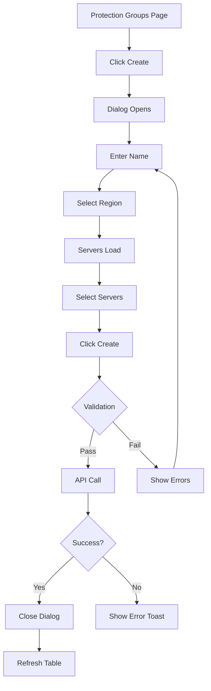

### Flow 2: Create Recovery Plan

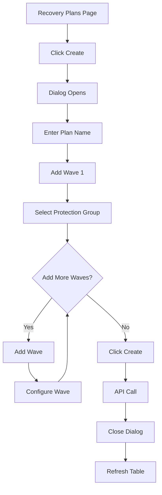


### Flow 3: Execute Recovery Plan

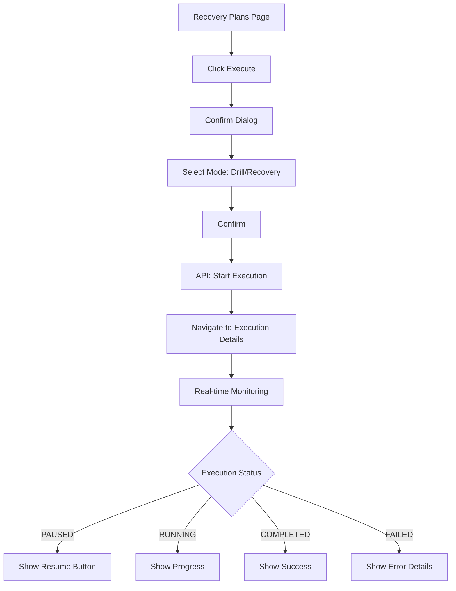

### Flow 4: Resume Paused Execution

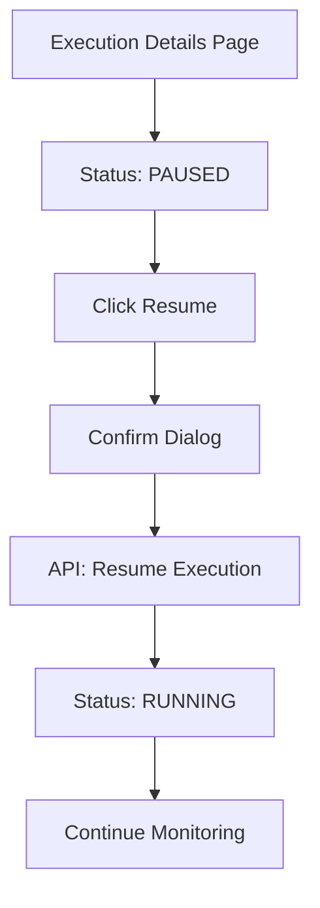

### Flow 5: Terminate Recovery Instances

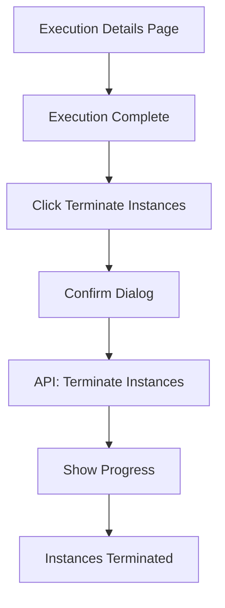


### Flow 6: View Server Details

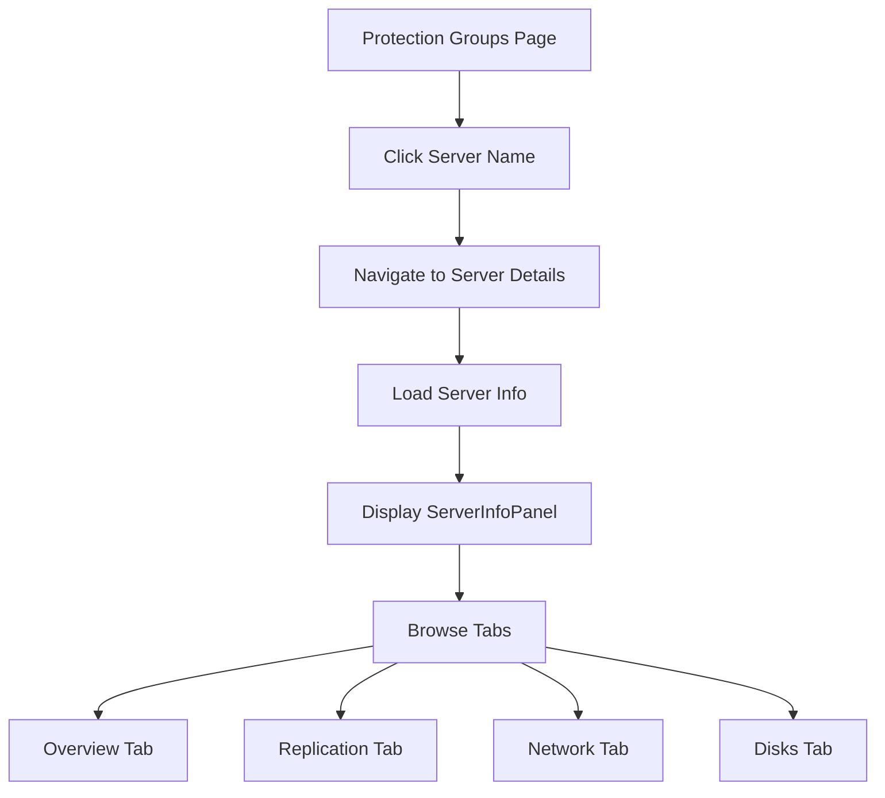

### Flow 7: Configure Launch Settings

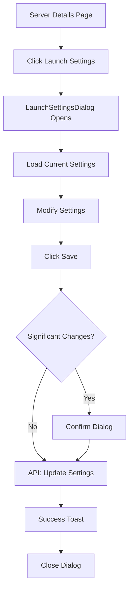

### Flow 8: Manage Server Tags

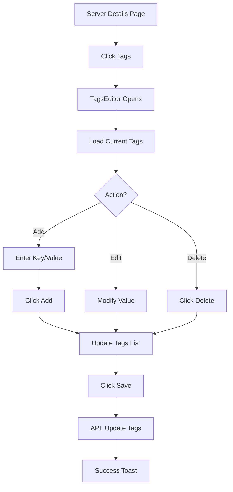


### Flow 9: Configure Disk Settings

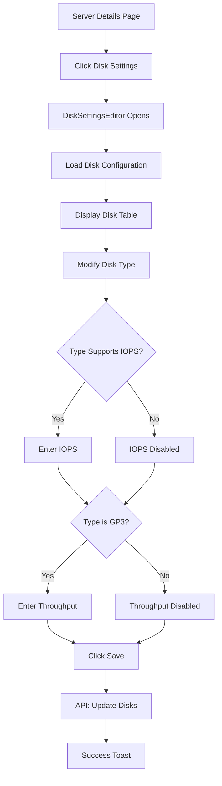

### Flow 10: Configure Replication Settings

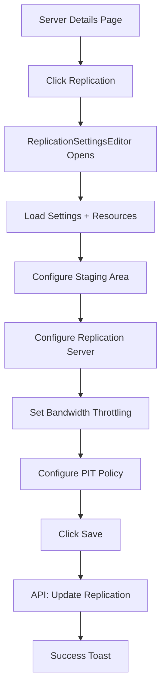

### Flow 11: Configure Post-Launch Actions

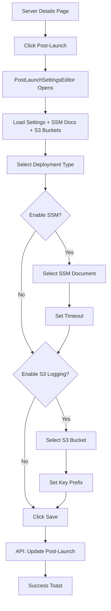


---

## Responsive Design

The application shall implement responsive design to support multiple device sizes. The following breakpoints and adaptations shall be implemented.

### Breakpoints

| Breakpoint | Width | Layout Adjustments |
|------------|-------|-------------------|
| Desktop | ≥1200px | Full layout, side navigation expanded |
| Tablet | 768-1199px | Collapsible navigation, 2-column grids |
| Mobile | <768px | Hidden navigation (hamburger), single column |

### Component Adaptations

| Component | Desktop | Tablet | Mobile |
|-----------|---------|--------|--------|
| Side Navigation | Expanded | Collapsed | Hidden (drawer) |
| Tables | Full columns | Reduced columns | Card view |
| Dialogs | Centered modal | Full width | Full screen |
| Forms | Multi-column | Single column | Single column |
| Dashboard Cards | 3 columns | 2 columns | 1 column |

### Table Column Priority

For responsive tables, columns are hidden in this order (lowest priority first):

1. Description (hide first)
2. Created/Updated timestamps
3. Secondary metrics
4. Primary identifier (always visible)
5. Actions (always visible)


---

## Accessibility

The application shall meet WCAG 2.1 AA compliance standards. The following accessibility requirements shall be implemented.

### WCAG 2.1 AA Compliance

| Requirement | Implementation |
|-------------|----------------|
| Color Contrast | Minimum 4.5:1 for text, 3:1 for large text |
| Keyboard Navigation | All interactive elements focusable via Tab |
| Focus Indicators | Visible focus ring on all focusable elements |
| Screen Reader | ARIA labels on all interactive elements |
| Error Identification | Errors announced and associated with fields |
| Resize Support | Content readable at 200% zoom |

### Keyboard Shortcuts

| Key | Action |
|-----|--------|
| Tab | Move focus forward |
| Shift+Tab | Move focus backward |
| Enter | Activate button/link |
| Space | Toggle checkbox/button |
| Escape | Close modal/dropdown |
| Arrow Keys | Navigate within lists/menus |

### ARIA Implementation

```typescript
// Button with loading state
<Button
  ariaLabel="Create protection group"
  loading={isLoading}
  ariaDisabled={isLoading}
>
  Create
</Button>

// Form field with error
<FormField
  label="Name"
  errorText={errors.name}
  ariaRequired={true}
>
  <Input
    ariaInvalid={!!errors.name}
    ariaDescribedby="name-error"
  />
</FormField>
```


---

## State Management

The application shall implement the following state management patterns using React Context and hooks.

### Context Providers

| Context | Purpose | State |
|---------|---------|-------|
| AuthContext | Authentication state | user, isAuthenticated, signIn, signOut |
| ApiContext | API client instance | apiClient with auth headers |
| NotificationContext | Toast notifications | notifications[], addNotification, removeNotification |

### Data Fetching Patterns

```typescript
// Standard data fetching with loading/error states
const [data, setData] = useState<T | null>(null);
const [loading, setLoading] = useState(true);
const [error, setError] = useState<string | null>(null);

const loadData = async () => {
  setLoading(true);
  setError(null);
  try {
    const result = await api.getData();
    setData(result);
  } catch (err) {
    setError(err.message);
  } finally {
    setLoading(false);
  }
};

useEffect(() => {
  loadData();
}, [dependencies]);
```

### Polling Pattern

```typescript
// Real-time polling for active executions
useEffect(() => {
  if (!isActiveExecution) return;
  
  const interval = setInterval(() => {
    loadExecutionStatus();
  }, 3000); // 3 second interval
  
  return () => clearInterval(interval);
}, [executionId, isActiveExecution]);
```


---

## Notification System

The application shall implement a dual notification system using both toast notifications for transient messages and flashbar notifications for persistent page-level messages.

### Toast Notifications

Using react-hot-toast for transient notifications:

| Type | Duration | Use Case |
|------|----------|----------|
| Success | 5 seconds | Operation completed successfully |
| Error | Persistent | Operation failed (user must dismiss) |
| Loading | Until resolved | Long-running operation in progress |

### Flashbar Notifications

Using CloudScape Flashbar for persistent page-level notifications:

| Type | Dismissible | Use Case |
|------|-------------|----------|
| Success | Yes | Major operation completed |
| Error | Yes | API errors, validation failures |
| Warning | Yes | Degraded functionality |
| Info | Yes | Informational messages |

### Notification Patterns

```typescript
// Success notification
toast.success('Protection group created successfully');

// Error notification with details
toast.error(`Failed to create: ${error.message}`);

// Loading notification
const toastId = toast.loading('Creating protection group...');
// Later...
toast.success('Created!', { id: toastId });
```


---

## Error Handling

The application shall implement comprehensive error handling at multiple levels to ensure graceful degradation and clear user feedback.

### Error Boundary

Wrap application in ErrorBoundary to catch React errors:

```typescript
<ErrorBoundary fallback={<ErrorFallback />}>
  <App />
</ErrorBoundary>
```

### API Error Handling

| HTTP Status | User Message | Action |
|-------------|--------------|--------|
| 400 | Validation error details | Show inline errors |
| 401 | Session expired | Redirect to login |
| 403 | Access denied | Show error page |
| 404 | Resource not found | Show not found message |
| 500 | Server error | Show retry option |

### Error Display Patterns

```typescript
// Inline form errors
<FormField
  label="Name"
  errorText={errors.name}
>
  <Input value={name} invalid={!!errors.name} />
</FormField>

// Page-level error
{error && (
  <Alert type="error" dismissible onDismiss={() => setError(null)}>
    {error}
  </Alert>
)}

// Empty state with error
<Box textAlign="center">
  <Icon name="status-negative" size="large" />
  <Box variant="h3">Failed to load data</Box>
  <Button onClick={retry}>Retry</Button>
</Box>
```


---

## Performance Optimization

The application shall implement the following performance optimization techniques to ensure fast load times and responsive user interactions.

### Code Splitting

```typescript
// Lazy load pages
const Dashboard = lazy(() => import('./pages/Dashboard'));
const ProtectionGroupsPage = lazy(() => import('./pages/ProtectionGroupsPage'));
const ExecutionDetailsPage = lazy(() => import('./pages/ExecutionDetailsPage'));

// Wrap in Suspense
<Suspense fallback={<LoadingState />}>
  <Routes>
    <Route path="/" element={<Dashboard />} />
  </Routes>
</Suspense>
```

### Memoization

```typescript
// Memoize expensive computations
const sortedItems = useMemo(() => 
  items.sort((a, b) => a.name.localeCompare(b.name)),
  [items]
);

// Memoize callbacks
const handleSave = useCallback(async () => {
  await saveData(formData);
}, [formData]);

// Memoize components
const MemoizedTable = memo(DataTable);
```

### Data Caching

| Data Type | Cache Duration | Invalidation |
|-----------|----------------|--------------|
| Protection Groups | 30 seconds | On create/update/delete |
| Recovery Plans | 30 seconds | On create/update/delete |
| DRS Servers | 60 seconds | On region change |
| Execution Status | No cache | Real-time polling |
| Server Details | 30 seconds | On settings update |


---

## Testing Requirements

The application shall be tested according to the following requirements to ensure quality and reliability.

### Unit Testing

| Component Type | Test Coverage | Tools |
|----------------|---------------|-------|
| UI Components | 80% | Vitest, React Testing Library |
| Utility Functions | 90% | Vitest |
| Custom Hooks | 80% | React Testing Library |
| API Services | 70% | Vitest, MSW |

### Component Test Example

```typescript
import { render, screen, fireEvent } from '@testing-library/react';
import { ConfirmDialog } from './ConfirmDialog';

describe('ConfirmDialog', () => {
  it('calls onConfirm when confirm button clicked', () => {
    const onConfirm = vi.fn();
    render(
      <ConfirmDialog
        visible={true}
        title="Delete?"
        message="Are you sure?"
        onConfirm={onConfirm}
        onCancel={() => {}}
      />
    );
    
    fireEvent.click(screen.getByText('Confirm'));
    expect(onConfirm).toHaveBeenCalled();
  });
});
```

### E2E Testing

| Flow | Priority | Tool |
|------|----------|------|
| Login/Logout | Critical | Playwright |
| Create Protection Group | Critical | Playwright |
| Create Recovery Plan | Critical | Playwright |
| Execute Recovery | Critical | Playwright |
| Server Configuration | High | Playwright |
| Pause/Resume Execution | High | Playwright |


---

## Appendix: CloudScape Components Reference

The following CloudScape components shall be used throughout the application. This reference provides guidance on component selection for common use cases.

### Layout Components

| Component | Usage |
|-----------|-------|
| AppLayout | Main application shell |
| ContentLayout | Page content wrapper with header |
| Container | Content container with optional header |
| SpaceBetween | Consistent spacing between elements |
| ColumnLayout | Responsive column grid |
| Grid | CSS grid wrapper |
| Box | Generic container with styling props |

### Navigation Components

| Component | Usage |
|-----------|-------|
| SideNavigation | Left sidebar navigation |
| BreadcrumbGroup | Breadcrumb trail |
| Tabs | Tabbed content |
| Link | Navigation links |
| TopNavigation | Top navigation bar |

### Form Components

| Component | Usage |
|-----------|-------|
| Form | Form container with actions |
| FormField | Field wrapper with label/error |
| Input | Text input |
| Textarea | Multi-line text input |
| Select | Single-select dropdown |
| Multiselect | Multi-select dropdown |
| Autosuggest | Autocomplete input |
| Checkbox | Boolean checkbox |
| RadioGroup | Radio button group |
| Toggle | On/off toggle switch |
| DatePicker | Date selection |


### Data Display Components

| Component | Usage |
|-----------|-------|
| Table | Data tables with sorting/filtering |
| Cards | Card-based layouts |
| KeyValuePairs | Key-value data display |
| ExpandableSection | Collapsible content sections |
| Badge | Status badges |
| StatusIndicator | Status with icon |
| ProgressBar | Progress visualization |
| Spinner | Loading indicator |

### Feedback Components

| Component | Usage |
|-----------|-------|
| Alert | Inline alerts and messages |
| Flashbar | Page-level notifications |
| Modal | Dialog windows |
| Popover | Contextual information |
| HelpPanel | Side panel help content |

### Action Components

| Component | Usage |
|-----------|-------|
| Button | Primary actions |
| ButtonDropdown | Dropdown menu actions |
| Icon | Iconography |
| Header | Page and section headers |
| Pagination | Table pagination |
| TextFilter | Search/filter input |

### Collection Hooks

```typescript
import { useCollection } from '@cloudscape-design/collection-hooks';

const { items, collectionProps, filterProps, paginationProps } = useCollection(
  data,
  {
    filtering: { empty: <EmptyState />, noMatch: <NoMatchState /> },
    pagination: { pageSize: 25 },
    sorting: { defaultState: { sortingColumn: { sortingField: 'name' } } },
    selection: {}
  }
);
```


---

## Appendix: UI Wireframes

The following wireframes define the visual layout that shall be implemented for each page. These wireframes serve as the authoritative reference for page structure and component placement.

### Login Page Wireframe

```
╔═══════════════════════════════════════════════════════════════════════════════╗
║                         Dark Background (#232F3E)                             ║
║                                                                               ║
║                              ╭──────────╮                                     ║
║                              │ AWS Logo │                                     ║
║                              ╰──────────╯                                     ║
║                    Elastic Disaster Recovery Orchestrator                     ║
║                              (white text)                                     ║
║                                                                               ║
║                     ╭─────────────────────────────────────╮                   ║
║                     │          White Login Card           │                   ║
║                     │                                     │                   ║
║                     │            Sign in                  │                   ║
║                     │                                     │                   ║
║                     │   Username or email                 │                   ║
║                     │   ┌───────────────────────────────┐ │                   ║
║                     │   │ Enter your username           │ │                   ║
║                     │   └───────────────────────────────┘ │                   ║
║                     │                                     │                   ║
║                     │   Password                          │                   ║
║                     │   ┌───────────────────────────────┐ │                   ║
║                     │   │ Enter your password           │ │                   ║
║                     │   └───────────────────────────────┘ │                   ║
║                     │                                     │                   ║
║                     │   ┌───────────────────────────────┐ │                   ║
║                     │   │▓▓▓▓▓▓▓▓▓ Sign in ▓▓▓▓▓▓▓▓▓▓▓▓│ │                   ║
║                     │   └───────────────────────────────┘ │                   ║
║                     │         (orange button #EC7211)     │                   ║
║                     ╰─────────────────────────────────────╯                   ║
║                                                                               ║
║       ◇       ◇       ◇       ◇       ◇       ◇       ◇       ◇              ║
║      orange   teal   purple  blue   orange   teal   purple  blue             ║
║                    (3D Isometric Cubes with shadows)                          ║
║                                                                               ║
╠═══════════════════════════════════════════════════════════════════════════════╣
║  Disclaimer Footer (#1A242F)                                                  ║
║  ─────────────────────────────────────────────────────────────────────────    ║
║  Disclaimer: This AWS Elastic Disaster Recovery Orchestrator is a sample      ║
║  implementation provided by AWS Professional Services... This tool is         ║
║  provided "AS IS" without warranty... For continued development, we           ║
║  recommend Amazon Q Developer (link).                                         ║
╚═══════════════════════════════════════════════════════════════════════════════╝
```

**Cube Colors** (repeating pattern):
- Orange: #FF9900
- Teal: #1DC7B4
- Purple: #9469D6
- Blue: #527FFF

### Dashboard Page Wireframe

```
╔═══════════════════════════════════════════════════════════════════════════════╗
║  ☁ Elastic Disaster Recovery Orchestrator                user@example.com ▾  ║
╠════════════════════╦══════════════════════════════════════════════════════════╣
║                    ║                                                          ║
║  ▶ Dashboard       ║  Dashboard                                               ║
║  ──────────────    ║  Real-time execution status and system metrics           ║
║    Getting Started ║  ══════════════════════════════════════════════════════  ║
║    Protection      ║                                                          ║
║    Groups          ║  ╭─────────────╮ ╭─────────────╮ ╭─────────────╮ ╭──────╮║
║    Recovery Plans  ║  │   Active    │ │  Completed  │ │   Failed    │ │Success║
║    History         ║  │ Executions  │ │             │ │             │ │ Rate ║║
║                    ║  │      1      │ │     24      │ │      2      │ │  92% ║║
║                    ║  ╰─────────────╯ ╰─────────────╯ ╰─────────────╯ ╰──────╯║
║                    ║                                                          ║
║                    ║  ╭─────────────────────────────╮ ╭─────────────────────╮ ║
║                    ║  │ Execution Status            │ │ Active Executions   │ ║
║                    ║  │                             │ │                     │ ║
║                    ║  │      ╭───────────╮          │ │ ● Running           │ ║
║                    ║  │     ╱   ╲        │          │ │   DR-Plan-Prod      │ ║
║                    ║  │    │  26 │ total │          │ │                     │ ║
║                    ║  │     ╲   ╱        │          │ │ ⏸ Paused            │ ║
║                    ║  │      ╰───────────╯          │ │   DR-Plan-QA        │ ║
║                    ║  │  ■ Completed  ■ Failed      │ │                     │ ║
║                    ║  │  ■ Running    ■ Paused      │ │ View all →          │ ║
║                    ║  ╰─────────────────────────────╯ ╰─────────────────────╯ ║
║                    ║                                                          ║
║                    ║  ╭─────────────────────────────────────────────────────╮ ║
║                    ║  │ DRS Capacity                    [us-east-1 ▾]       │ ║
║                    ║  │                                                     │ ║
║                    ║  │ ● Capacity Available - You can start new jobs       │ ║
║                    ║  │                                                     │ ║
║                    ║  │ Replicating Servers   Concurrent Jobs   Servers in  │ ║
║                    ║  │ ████████░░░░░░░░░░    ██░░░░░░░░░░░░░   Active Jobs │ ║
║                    ║  │ 45 / 300              2 / 20            ░░░░░░░░░░░ │ ║
║                    ║  │                                         0 / 200     │ ║
║                    ║  ╰─────────────────────────────────────────────────────╯ ║
║                    ║                                                          ║
║                    ║  ╭─────────────────────────────────────────────────────╮ ║
║                    ║  │ Recent Activity                      View history → │ ║
║                    ║  │                                                     │ ║
║                    ║  │ ✓ Completed  DR-Plan-Prod     Dec 10, 2025 2:30 PM  │ ║
║                    ║  │ ● Running    DR-Plan-Dev      Dec 10, 2025 1:15 PM  │ ║
║                    ║  │ ✗ Failed     DR-Plan-Test     Dec 9, 2025 4:45 PM   │ ║
║                    ║  ╰─────────────────────────────────────────────────────╯ ║
║                    ║                                                          ║
╚════════════════════╩══════════════════════════════════════════════════════════╝
```

### Getting Started Page Wireframe

```
╔═══════════════════════════════════════════════════════════════════════════════╗
║  ☁ Elastic Disaster Recovery Orchestrator                user@example.com ▾  ║
╠════════════════════╦══════════════════════════════════════════════════════════╣
║                    ║                                                          ║
║    Dashboard       ║  Getting Started                                         ║
║  ──────────────    ║  AWS Disaster Recovery Service Orchestration Platform    ║
║  ▶ Getting Started ║  ══════════════════════════════════════════════════════  ║
║    Protection      ║                                                          ║
║    Groups          ║  ╭──────────────────╮ ╭──────────────────╮ ╭────────────╮║
║    Recovery Plans  ║  │ 📁 Protection    │ │ 📄 Recovery      │ │ ● Execution││
║    History         ║  │    Groups        │ │    Plans         │ │   History  ││
║                    ║  │                  │ │                  │ │            ││
║                    ║  │ Group DRS servers│ │ Design multi-wave│ │ Monitor and││
║                    ║  │ for coordinated  │ │ recovery         │ │ manage     ││
║                    ║  │ recovery.        │ │ sequences.       │ │ executions.││
║                    ║  │                  │ │                  │ │            ││
║                    ║  │┌────────────────┐│ │┌────────────────┐│ │┌──────────┐││
║                    ║  ││View Protection ││ ││View Recovery   ││ ││View      │││
║                    ║  ││Groups          ││ ││Plans           ││ ││Executions│││
║                    ║  │└────────────────┘│ │└────────────────┘│ │└──────────┘││
║                    ║  ╰──────────────────╯ ╰──────────────────╯ ╰────────────╯║
║                    ║                                                          ║
║                    ║  ╭─────────────────────────────────────────────────────╮ ║
║                    ║  │ Quick Start Guide                                   │ ║
║                    ║  │ Follow these steps to set up your first DR plan     │ ║
║                    ║  │                                                     │ ║
║                    ║  │  1  Create a Protection Group                       │ ║
║                    ║  │     Protection Groups organize your DRS source      │ ║
║                    ║  │     servers into logical units.                     │ ║
║                    ║  │     → Navigate to Protection Groups, click "Create" │ ║
║                    ║  │     → Select region and servers                     │ ║
║                    ║  │  ─────────────────────────────────────────────────  │ ║
║                    ║  │  2  Design a Recovery Plan                          │ ║
║                    ║  │     Recovery Plans define the sequence of waves.    │ ║
║                    ║  │     → Navigate to Recovery Plans, click "Create"    │ ║
║                    ║  │     → Add waves with Protection Groups              │ ║
║                    ║  │  ─────────────────────────────────────────────────  │ ║
║                    ║  │  3  Execute a Drill or Recovery                     │ ║
║                    ║  │     Test with a Drill or execute actual Recovery.   │ ║
║                    ║  │     → From Recovery Plans, click "Run Drill"        │ ║
║                    ║  │     → Monitor progress in real-time                 │ ║
║                    ║  │  ─────────────────────────────────────────────────  │ ║
║                    ║  │  ✓  Best Practices                                  │ ║
║                    ║  │     → Run drills regularly to validate plans        │ ║
║                    ║  │     → Use pause points between waves                │ ║
║                    ║  │     → Terminate drill instances after testing       │ ║
║                    ║  ╰─────────────────────────────────────────────────────╯ ║
║                    ║                                                          ║
╚════════════════════╩══════════════════════════════════════════════════════════╝
```

### Protection Groups Page Wireframe

```
╔═══════════════════════════════════════════════════════════════════════════════╗
║  ☁ Elastic Disaster Recovery Orchestrator                user@example.com ▾  ║
╠════════════════════╦══════════════════════════════════════════════════════════╣
║                    ║                                                          ║
║    Dashboard       ║  Protection Groups                                       ║
║  ──────────────    ║  ══════════════════════════════════════════════════════  ║
║    Getting Started ║                                                          ║
║  ▶ Protection      ║  ┌─────────────────────────────┐  ┌──────────────────┐   ║
║    Groups          ║  │ 🔍 Search groups...         │  │  Create Group    │   ║
║    Recovery Plans  ║  └─────────────────────────────┘  └──────────────────┘   ║
║    History         ║                                                          ║
║                    ║  ┌────┬──────────────────┬─────────────┬─────────┬─────┐ ║
║                    ║  │ ☐  │ Name             │ Region      │ Servers │  ⋮  │ ║
║                    ║  ├────┼──────────────────┼─────────────┼─────────┼─────┤ ║
║                    ║  │ ☐  │ Database-Tier    │ us-east-1   │    3    │  ⋮  │ ║
║                    ║  │ ☐  │ App-Tier         │ us-east-1   │    5    │  ⋮  │ ║
║                    ║  │ ☐  │ Web-Tier         │ us-east-1   │    4    │  ⋮  │ ║
║                    ║  │ ☐  │ Cache-Tier       │ us-west-2   │    2    │  ⋮  │ ║
║                    ║  │ ☐  │ Analytics        │ us-west-2   │    3    │  ⋮  │ ║
║                    ║  └────┴──────────────────┴─────────────┴─────────┴─────┘ ║
║                    ║                                                          ║
║                    ║  ◂  1  2  3  ▸                       Showing 1-5 of 12   ║
║                    ║                                                          ║
╚════════════════════╩══════════════════════════════════════════════════════════╝
```

### Protection Group Dialog Wireframe

```
╭─────────────────────────────────────────────────────────────────────────────╮
│                                                                             │
│   Create Protection Group                                            ✕      │
│   ═══════════════════════════════════════════════════════════════════       │
│                                                                             │
│   Group Name *                                                              │
│   ┌───────────────────────────────────────────────────────────────────┐     │
│   │ Database-Tier                                                     │     │
│   └───────────────────────────────────────────────────────────────────┘     │
│                                                                             │
│   Description                                                               │
│   ┌───────────────────────────────────────────────────────────────────┐     │
│   │ Primary database servers for production environment               │     │
│   └───────────────────────────────────────────────────────────────────┘     │
│                                                                             │
│   Region *                                                                  │
│   ┌───────────────────────────────────────────────────────────────────┐     │
│   │ US East (N. Virginia) - us-east-1                              ▾  │     │
│   └───────────────────────────────────────────────────────────────────┘     │
│                                                                             │
│   Select Servers                                                            │
│   ┌───────────────────────────────────────────────────────────────────┐     │
│   │ 🔍 Search servers...                                              │     │
│   └───────────────────────────────────────────────────────────────────┘     │
│   ┌───────────────────────────────────────────────────────────────────┐     │
│   │  ☑  db-primary-01        ● Ready for Recovery    s-0abc123...     │     │
│   │  ☑  db-replica-01        ● Ready for Recovery    s-0def456...     │     │
│   │  ☑  db-replica-02        ● Ready for Recovery    s-0ghi789...     │     │
│   │  ☐  app-server-01        ● Ready for Recovery    s-0jkl012...     │     │
│   │  ☐  app-server-02        ○ Stalled               s-0mno345...     │     │
│   └───────────────────────────────────────────────────────────────────┘     │
│   3 servers selected                                                        │
│                                                                             │
│   ─────────────────────────────────────────────────────────────────────     │
│                                                                             │
│                                      ┌──────────┐  ┌────────────────┐       │
│                                      │  Cancel  │  │  Create Group  │       │
│                                      └──────────┘  └────────────────┘       │
│                                                                             │
╰─────────────────────────────────────────────────────────────────────────────╯
```

### Recovery Plans Page Wireframe

```
╔═══════════════════════════════════════════════════════════════════════════════╗
║  ☁ Elastic Disaster Recovery Orchestrator                user@example.com ▾  ║
╠════════════════════╦══════════════════════════════════════════════════════════╣
║                    ║                                                          ║
║    Dashboard       ║  Recovery Plans                                          ║
║  ──────────────    ║  ══════════════════════════════════════════════════════  ║
║    Getting Started ║                                                          ║
║    Protection      ║  ┌─────────────────────────────┐  ┌──────────────────┐   ║
║    Groups          ║  │ 🔍 Search plans...          │  │   Create Plan    │   ║
║  ▶ Recovery Plans  ║  └─────────────────────────────┘  └──────────────────┘   ║
║    History         ║                                                          ║
║                    ║  ┌────┬────────────────┬───────┬────────────┬──────────┐ ║
║                    ║  │ ☐  │ Name           │ Waves │ Last Run   │ Actions  │ ║
║                    ║  ├────┼────────────────┼───────┼────────────┼──────────┤ ║
║                    ║  │ ☐  │ DR-Plan-Prod   │   3   │ 2 hrs ago  │ Execute ⋮│ ║
║                    ║  │ ☐  │ DR-Plan-Dev    │   2   │ 1 day ago  │ Execute ⋮│ ║
║                    ║  │ ☐  │ DR-Plan-QA     │   3   │ 3 days ago │ Execute ⋮│ ║
║                    ║  └────┴────────────────┴───────┴────────────┴──────────┘ ║
║                    ║                                                          ║
║                    ║  ◂  1  ▸                              Showing 1-3 of 3   ║
║                    ║                                                          ║
╚════════════════════╩══════════════════════════════════════════════════════════╝
```

### Recovery Plan Dialog Wireframe

```
╭─────────────────────────────────────────────────────────────────────────────╮
│                                                                             │
│   Create Recovery Plan                                               ✕      │
│   ═══════════════════════════════════════════════════════════════════       │
│                                                                             │
│   Plan Name *                                                               │
│   ┌───────────────────────────────────────────────────────────────────┐     │
│   │ DR-Plan-Production                                                │     │
│   └───────────────────────────────────────────────────────────────────┘     │
│                                                                             │
│   Description                                                               │
│   ┌───────────────────────────────────────────────────────────────────┐     │
│   │ Full production DR plan with 3-tier architecture                  │     │
│   └───────────────────────────────────────────────────────────────────┘     │
│                                                                             │
│   Waves                                                    ┌────────────┐   │
│                                                            │ + Add Wave │   │
│                                                            └────────────┘   │
│   ╭───────────────────────────────────────────────────────────────────╮     │
│   │  Wave 1                                                           │     │
│   │  ─────────────────────────────────────────────────────────────    │     │
│   │  Protection Group    ┌────────────────────────────────────┐       │     │
│   │                      │ Database-Tier                    ▾ │       │     │
│   │                      └────────────────────────────────────┘       │     │
│   │  ☐ Pause before this wave (disabled for Wave 1)                   │     │
│   ╰───────────────────────────────────────────────────────────────────╯     │
│                                                                             │
│   ╭───────────────────────────────────────────────────────────────────╮     │
│   │  Wave 2                                                  Remove   │     │
│   │  ─────────────────────────────────────────────────────────────    │     │
│   │  Protection Group    ┌────────────────────────────────────┐       │     │
│   │                      │ App-Tier                         ▾ │       │     │
│   │                      └────────────────────────────────────┘       │     │
│   │  ☑ Pause before this wave                                         │     │
│   ╰───────────────────────────────────────────────────────────────────╯     │
│                                                                             │
│   ╭───────────────────────────────────────────────────────────────────╮     │
│   │  Wave 3                                                  Remove   │     │
│   │  ─────────────────────────────────────────────────────────────    │     │
│   │  Protection Group    ┌────────────────────────────────────┐       │     │
│   │                      │ Web-Tier                         ▾ │       │     │
│   │                      └────────────────────────────────────┘       │     │
│   │  ☐ Pause before this wave                                         │     │
│   ╰───────────────────────────────────────────────────────────────────╯     │
│                                                                             │
│   ─────────────────────────────────────────────────────────────────────     │
│                                                                             │
│                                      ┌──────────┐  ┌────────────────┐       │
│                                      │  Cancel  │  │  Create Plan   │       │
│                                      └──────────┘  └────────────────┘       │
│                                                                             │
╰─────────────────────────────────────────────────────────────────────────────╯
```

### Executions Page Wireframe (History)

```
╔═══════════════════════════════════════════════════════════════════════════════╗
║  ☁ Elastic Disaster Recovery Orchestrator                user@example.com ▾  ║
╠════════════════════╦══════════════════════════════════════════════════════════╣
║                    ║                                                          ║
║    Dashboard       ║  History                                                 ║
║  ──────────────    ║  Real-time monitoring and historical records of DRS      ║
║    Getting Started ║  recoveries                                              ║
║    Protection      ║  ══════════════════════════════════════════════════════  ║
║    Groups          ║                                                          ║
║    Recovery Plans  ║  ● Live Updates  Updated 5 seconds ago        ┌─────────┐║
║  ▶ History         ║                                               │ Refresh │║
║                    ║                                               └─────────┘║
║                    ║  ┌─────────────────┐  ┌──────────────────┐               ║
║                    ║  │  Active (2)     │  │   History (24)   │               ║
║                    ║  └─────────────────┘  └──────────────────┘               ║
║                    ║   ▔▔▔▔▔▔▔▔▔▔▔▔▔▔▔▔▔                                      ║
║                    ║                                                          ║
║                    ║  ╭─────────────────────────────────────────────────────╮ ║
║                    ║  │ DR-Plan-Production                                  │ ║
║                    ║  │ ─────────────────────────────────────────────────── │ ║
║                    ║  │ ● Running   Wave 2 of 3   Dec 10, 10:30 AM   45m 23s│ ║
║                    ║  │                                                     │ ║
║                    ║  │ Progress                                       67%  │ ║
║                    ║  │ ████████████████████████████░░░░░░░░░░░░░░░░░░░░░░  │ ║
║                    ║  │                                                     │ ║
║                    ║  │ ┌──────────────┐                                    │ ║
║                    ║  │ │ View Details │                                    │ ║
║                    ║  │ └──────────────┘                                    │ ║
║                    ║  ╰─────────────────────────────────────────────────────╯ ║
║                    ║                                                          ║
║                    ║  ╭─────────────────────────────────────────────────────╮ ║
║                    ║  │ DR-Plan-QA                                          │ ║
║                    ║  │ ─────────────────────────────────────────────────── │ ║
║                    ║  │ ⏸ Paused    Wave 1 of 2   Dec 10, 9:15 AM    1h 30m │ ║
║                    ║  │                                                     │ ║
║                    ║  │ ┌──────────────┐                                    │ ║
║                    ║  │ │ View Details │                                    │ ║
║                    ║  │ └──────────────┘                                    │ ║
║                    ║  ╰─────────────────────────────────────────────────────╯ ║
║                    ║                                                          ║
╚════════════════════╩══════════════════════════════════════════════════════════╝
```

### Executions Page Wireframe (History Tab)

```
╔═══════════════════════════════════════════════════════════════════════════════╗
║  ☁ Elastic Disaster Recovery Orchestrator                user@example.com ▾  ║
╠════════════════════╦══════════════════════════════════════════════════════════╣
║                    ║                                                          ║
║    Dashboard       ║  History                                                 ║
║  ──────────────    ║  Real-time monitoring and historical records of DRS      ║
║    Getting Started ║  recoveries                                              ║
║    Protection      ║  ══════════════════════════════════════════════════════  ║
║    Groups          ║                                               ┌─────────┐║
║    Recovery Plans  ║                                               │ Refresh │║
║  ▶ History         ║                                               └─────────┘║
║                    ║  ┌─────────────────┐  ┌──────────────────┐               ║
║                    ║  │  Active (2)     │  │   History (24)   │               ║
║                    ║  └─────────────────┘  └──────────────────┘               ║
║                    ║                        ▔▔▔▔▔▔▔▔▔▔▔▔▔▔▔▔▔▔                ║
║                    ║                                                          ║
║                    ║                              ┌──────────────────────────┐║
║                    ║                              │ Clear Completed History  │║
║                    ║                              └──────────────────────────┘║
║                    ║                                                          ║
║                    ║  ┌─────────────────────────────┐                         ║
║                    ║  │ 🔍 Find executions          │   24 matches            ║
║                    ║  └─────────────────────────────┘                         ║
║                    ║                                                          ║
║                    ║  ┌────────────┬──────────┬───────┬───────────┬──────────┐║
║                    ║  │ Plan Name  │ Status   │ Waves │ Started   │ Duration │║
║                    ║  ├────────────┼──────────┼───────┼───────────┼──────────┤║
║                    ║  │ DR-Plan-Dev│ ✓ Success│3 waves│Dec 9 2:30 │ 45m 12s  │║
║                    ║  │ DR-Plan-Pro│ ✓ Success│3 waves│Dec 8 10:00│ 1h 23m   │║
║                    ║  │ DR-Plan-QA │ ✗ Failed │2 waves│Dec 7 4:15 │ 12m 45s  │║
║                    ║  │ DR-Plan-Dev│ ⊘ Cancel │3 waves│Dec 6 9:00 │ 5m 30s   │║
║                    ║  └────────────┴──────────┴───────┴───────────┴──────────┘║
║                    ║                                                          ║
║                    ║  ◂  1  2  3  ▸                       Showing 1-10 of 24  ║
║                    ║                                                          ║
╚════════════════════╩══════════════════════════════════════════════════════════╝
```

### Execution Details Page Wireframe (Active/Paused)

```
╔═══════════════════════════════════════════════════════════════════════════════╗
║  ☁ Elastic Disaster Recovery Orchestrator                user@example.com ▾  ║
╠════════════════════╦══════════════════════════════════════════════════════════╣
║                    ║                                                          ║
║    Dashboard       ║  Execution Details                                       ║
║  ──────────────    ║  ══════════════════════════════════════════════════════  ║
║    Getting Started ║                                                          ║
║    Protection      ║  ┌──────────────────┐ ┌─────────┐ ┌──────────────────┐   ║
║    Groups          ║  │← Back to History │ │ Refresh │ │▶ Resume Execution│   ║
║    Recovery Plans  ║  └──────────────────┘ └─────────┘ └──────────────────┘   ║
║  ▶ History         ║                                   ┌──────────────────┐   ║
║                    ║                                   │ Cancel Execution │   ║
║                    ║                                   └──────────────────┘   ║
║                    ║                                                          ║
║                    ║  ╭─────────────────────────────────────────────────────╮ ║
║                    ║  │ ℹ Execution Paused                                  │ ║
║                    ║  │   Execution is paused before starting Wave 2.       │ ║
║                    ║  │   Click Resume to continue.          ┌────────────┐ │ ║
║                    ║  │                                      │   Resume   │ │ ║
║                    ║  │                                      └────────────┘ │ ║
║                    ║  ╰─────────────────────────────────────────────────────╯ ║
║                    ║                                                          ║
║                    ║  Recovery Plan                                           ║
║                    ║  ╭─────────────────────────────────────────────────────╮ ║
║                    ║  │ DR-Plan-Production                                  │ ║
║                    ║  │ ⏸ Paused   Wave 2 of 3   By: admin@example.com      │ ║
║                    ║  │                                                     │ ║
║                    ║  │ Started           Ended        Duration   Exec ID   │ ║
║                    ║  │ Dec 10, 10:30 AM  -            45m 23s    exec-abc..│ ║
║                    ║  │                                                     │ ║
║                    ║  │ Overall Progress                               33%  │ ║
║                    ║  │ ██████████████░░░░░░░░░░░░░░░░░░░░░░░░░░░░░░░░░░░░  │ ║
║                    ║  ╰─────────────────────────────────────────────────────╯ ║
║                    ║                                                          ║
║                    ║  Wave Progress                                           ║
║                    ║  ╭─────────────────────────────────────────────────────╮ ║
║                    ║  │    Wave 1           Wave 2           Wave 3         │ ║
║                    ║  │  Database-Tier     App-Tier         Web-Tier        │ ║
║                    ║  │                                                     │ ║
║                    ║  │  ╔═══════════╗   ╔═══════════╗   ┌───────────┐      │ ║
║                    ║  │  ║ ✓ Complete║   ║ ⏸ Paused  ║   │ ○ Pending │      │ ║
║                    ║  │  ╚═══════════╝   ╚═══════════╝   └───────────┘      │ ║
║                    ║  │   3/3 servers     Waiting...      0/4 servers       │ ║
║                    ║  │                                                     │ ║
║                    ║  │  ▼ Wave 1 Details - Database-Tier                   │ ║
║                    ║  │  ┌──────────────┬─────────────┬───────────────────┐ │ ║
║                    ║  │  │ Server       │ Status      │ Recovery Instance │ │ ║
║                    ║  │  ├──────────────┼─────────────┼───────────────────┤ │ ║
║                    ║  │  │ db-primary-01│ ✓ LAUNCHED  │ i-0abc123...      │ │ ║
║                    ║  │  │ db-replica-01│ ✓ LAUNCHED  │ i-0def456...      │ │ ║
║                    ║  │  │ db-replica-02│ ✓ LAUNCHED  │ i-0ghi789...      │ │ ║
║                    ║  │  └──────────────┴─────────────┴───────────────────┘ │ ║
║                    ║  │                                                     │ ║
║                    ║  │  ▼ DRS Job Events                      ↻ Refresh    │ ║
║                    ║  │  ┌─────────────────────────────────────────────────┐│ ║
║                    ║  │  │ 10:45 AM  ✓ LAUNCH_COMPLETE - db-replica-02     ││ ║
║                    ║  │  │ 10:44 AM  ✓ LAUNCH_COMPLETE - db-replica-01     ││ ║
║                    ║  │  │ 10:42 AM  ✓ LAUNCH_COMPLETE - db-primary-01     ││ ║
║                    ║  │  │ 10:40 AM  ↻ CONVERSION_COMPLETE                  ││ ║
║                    ║  │  │ 10:35 AM  ◉ SNAPSHOT_COMPLETE                    ││ ║
║                    ║  │  │ 10:30 AM  ▶ JOB_START                            ││ ║
║                    ║  │  └─────────────────────────────────────────────────┘│ ║
║                    ║  ╰─────────────────────────────────────────────────────╯ ║
║                    ║                                                          ║
╚════════════════════╩══════════════════════════════════════════════════════════╝
```

### Execution Details Page Wireframe (Completed with Terminate)

```
╔═══════════════════════════════════════════════════════════════════════════════╗
║  ☁ Elastic Disaster Recovery Orchestrator                user@example.com ▾  ║
╠════════════════════╦══════════════════════════════════════════════════════════╣
║                    ║                                                          ║
║    Dashboard       ║  Execution Details                                       ║
║  ──────────────    ║  ══════════════════════════════════════════════════════  ║
║    Getting Started ║                                                          ║
║    Protection      ║  ┌──────────────────┐ ┌─────────┐ ┌─────────────────────┐║
║    Groups          ║  │← Back to History │ │ Refresh │ │ Terminate Instances │║
║    Recovery Plans  ║  └──────────────────┘ └─────────┘ └─────────────────────┘║
║  ▶ History         ║                                                          ║
║                    ║  Recovery Plan                                           ║
║                    ║  ╭─────────────────────────────────────────────────────╮ ║
║                    ║  │ DR-Plan-Production                                  │ ║
║                    ║  │ ✓ Completed   Wave 3 of 3   By: admin@example.com   │ ║
║                    ║  │                                                     │ ║
║                    ║  │ Started           Ended            Duration  Exec ID│ ║
║                    ║  │ Dec 10, 10:30 AM  Dec 10, 11:45 AM 1h 15m    exec-..│ ║
║                    ║  ╰─────────────────────────────────────────────────────╯ ║
║                    ║                                                          ║
║                    ║  Wave Progress                                           ║
║                    ║  ╭─────────────────────────────────────────────────────╮ ║
║                    ║  │    Wave 1           Wave 2           Wave 3         │ ║
║                    ║  │  Database-Tier     App-Tier         Web-Tier        │ ║
║                    ║  │                                                     │ ║
║                    ║  │  ╔═══════════╗   ╔═══════════╗   ╔═══════════╗      │ ║
║                    ║  │  ║ ✓ Complete║   ║ ✓ Complete║   ║ ✓ Complete║      │ ║
║                    ║  │  ╚═══════════╝   ╚═══════════╝   ╚═══════════╝      │ ║
║                    ║  │   3/3 servers     5/5 servers     4/4 servers       │ ║
║                    ║  ╰─────────────────────────────────────────────────────╯ ║
║                    ║                                                          ║
╚════════════════════╩══════════════════════════════════════════════════════════╝
```

### Execution Details Page Wireframe (Instances Terminated)

```
╔═══════════════════════════════════════════════════════════════════════════════╗
║  ☁ Elastic Disaster Recovery Orchestrator                user@example.com ▾  ║
╠════════════════════╦══════════════════════════════════════════════════════════╣
║                    ║                                                          ║
║    Dashboard       ║  Execution Details                                       ║
║  ──────────────    ║  ══════════════════════════════════════════════════════  ║
║    Getting Started ║                                                          ║
║    Protection      ║  ┌──────────────────┐ ┌─────────┐  Instances Terminated  ║
║    Groups          ║  │← Back to History │ │ Refresh │  ▓▓▓▓▓▓▓▓▓▓▓▓▓▓▓▓▓▓▓▓ ║
║    Recovery Plans  ║  └──────────────────┘ └─────────┘                        ║
║  ▶ History         ║                                                          ║
║                    ║  ╭─────────────────────────────────────────────────────╮ ║
║                    ║  │ ✓ Successfully terminated 12 recovery instance(s)   │ ║
║                    ║  ╰─────────────────────────────────────────────────────╯ ║
║                    ║                                                          ║
║                    ║  Recovery Plan                                           ║
║                    ║  ╭─────────────────────────────────────────────────────╮ ║
║                    ║  │ DR-Plan-Production                                  │ ║
║                    ║  │ ✓ Completed   Wave 3 of 3   By: admin@example.com   │ ║
║                    ║  │                                                     │ ║
║                    ║  │ Started           Ended            Duration  Exec ID│ ║
║                    ║  │ Dec 10, 10:30 AM  Dec 10, 11:45 AM 1h 15m    exec-..│ ║
║                    ║  ╰─────────────────────────────────────────────────────╯ ║
║                    ║                                                          ║
╚════════════════════╩══════════════════════════════════════════════════════════╝
```

### Execution Details Page Wireframe (Termination In Progress)

```
╔═══════════════════════════════════════════════════════════════════════════════╗
║  ☁ Elastic Disaster Recovery Orchestrator                user@example.com ▾  ║
╠════════════════════╦══════════════════════════════════════════════════════════╣
║                    ║                                                          ║
║    Dashboard       ║  Execution Details                                       ║
║  ──────────────    ║  ══════════════════════════════════════════════════════  ║
║    Getting Started ║                                                          ║
║    Protection      ║  ┌──────────────────┐ ┌─────────┐  ● Terminating...      ║
║    Groups          ║  │← Back to History │ │ Refresh │                        ║
║    Recovery Plans  ║  └──────────────────┘ └─────────┘                        ║
║  ▶ History         ║                                                          ║
║                    ║  ╭─────────────────────────────────────────────────────╮ ║
║                    ║  │ ℹ Terminating Recovery Instances                    │ ║
║                    ║  │   Terminating 12 recovery instance(s) via DRS.      │ ║
║                    ║  │   This may take a few minutes...                    │ ║
║                    ║  │                                                     │ ║
║                    ║  │   Termination Progress                              │ ║
║                    ║  │   ████████████████████░░░░░░░░░░░░░░░░░░░░░░░░░░░░  │ ║
║                    ║  │   DRS Job: drsjob-abc123def456                      │ ║
║                    ║  ╰─────────────────────────────────────────────────────╯ ║
║                    ║                                                          ║
║                    ║  Recovery Plan                                           ║
║                    ║  ╭─────────────────────────────────────────────────────╮ ║
║                    ║  │ DR-Plan-Production                                  │ ║
║                    ║  │ ✓ Completed   Wave 3 of 3   By: admin@example.com   │ ║
║                    ║  ╰─────────────────────────────────────────────────────╯ ║
║                    ║                                                          ║
╚════════════════════╩══════════════════════════════════════════════════════════╝
```

### Cancel Execution Dialog Wireframe

```
╭─────────────────────────────────────────────────────────────────────────────╮
│                                                                             │
│   Cancel Execution                                                   ✕      │
│   ═══════════════════════════════════════════════════════════════════       │
│                                                                             │
│   Are you sure you want to cancel this execution?                           │
│                                                                             │
│   Completed waves will remain unchanged. The current in-progress wave       │
│   will continue to completion. Only pending (not yet started) waves         │
│   will be cancelled.                                                        │
│                                                                             │
│   ─────────────────────────────────────────────────────────────────────     │
│                                                                             │
│                                      ┌──────────┐  ┌────────────────────┐   │
│                                      │  Cancel  │  │ Cancel Execution   │   │
│                                      └──────────┘  └────────────────────┘   │
│                                                         (red button)        │
│                                                                             │
╰─────────────────────────────────────────────────────────────────────────────╯
```

### Terminate Instances Dialog Wireframe

```
╭─────────────────────────────────────────────────────────────────────────────╮
│                                                                             │
│   Terminate Recovery Instances                                       ✕      │
│   ═══════════════════════════════════════════════════════════════════       │
│                                                                             │
│   Are you sure you want to terminate all recovery instances from this       │
│   execution?                                                                │
│                                                                             │
│   This will permanently terminate all EC2 instances that were launched      │
│   as part of this recovery. This action cannot be undone.                   │
│                                                                             │
│   ─────────────────────────────────────────────────────────────────────     │
│                                                                             │
│                                      ┌──────────┐  ┌─────────────────────┐  │
│                                      │  Cancel  │  │ Terminate Instances │  │
│                                      └──────────┘  └─────────────────────┘  │
│                                                         (red button)        │
│                                                                             │
╰─────────────────────────────────────────────────────────────────────────────╯
```

### Clear History Dialog Wireframe

```
╭─────────────────────────────────────────────────────────────────────────────╮
│                                                                             │
│   Clear Completed History?                                           ✕      │
│   ═══════════════════════════════════════════════════════════════════       │
│                                                                             │
│   This will permanently delete all completed execution records              │
│   (24 items). Active executions will not be affected.                       │
│                                                                             │
│   ╭───────────────────────────────────────────────────────────────────╮     │
│   │ ⚠ Warning                                                         │     │
│   │   This action cannot be undone.                                   │     │
│   ╰───────────────────────────────────────────────────────────────────╯     │
│                                                                             │
│   ─────────────────────────────────────────────────────────────────────     │
│                                                                             │
│                                      ┌──────────┐  ┌────────────────┐       │
│                                      │  Cancel  │  │ Clear History  │       │
│                                      └──────────┘  └────────────────┘       │
│                                                                             │
╰─────────────────────────────────────────────────────────────────────────────╯
```

### Server Details Page Wireframe

```
╔═══════════════════════════════════════════════════════════════════════════════╗
║  ☁ Elastic Disaster Recovery Orchestrator                user@example.com ▾  ║
╠════════════════════╦══════════════════════════════════════════════════════════╣
║                    ║                                                          ║
║    Dashboard       ║  ← Back to Protection Groups                             ║
║  ──────────────    ║                                                          ║
║    Getting Started ║  web-server-01                                           ║
║    Protection      ║  s-0abc123def456789                                      ║
║    Groups          ║  ══════════════════════════════════════════════════════  ║
║    Recovery Plans  ║                                                          ║
║    History         ║  ╭──────────────╮ ╭──────────────╮ ╭──────────────╮      ║
║                    ║  │  Lifecycle   │ │ Replication  │ │    Last      │      ║
║                    ║  │    State     │ │    State     │ │  Recovery    │      ║
║                    ║  │              │ │              │ │              │      ║
║                    ║  │ ● Ready for  │ │ ● Healthy    │ │ ✓ Succeeded  │      ║
║                    ║  │   Recovery   │ │              │ │              │      ║
║                    ║  ╰──────────────╯ ╰──────────────╯ ╰──────────────╯      ║
║                    ║                                                          ║
║                    ║  Configuration Actions                                   ║
║                    ║  ┌────────────────┐ ┌──────────────┐ ┌────────┐          ║
║                    ║  │Launch Settings │ │ EC2 Template │ │  Tags  │          ║
║                    ║  └────────────────┘ └──────────────┘ └────────┘          ║
║                    ║  ┌───────────────┐ ┌─────────────┐ ┌─────────────────┐   ║
║                    ║  │ Disk Settings │ │ Replication │ │ Post-Launch     │   ║
║                    ║  └───────────────┘ └─────────────┘ └─────────────────┘   ║
║                    ║                                                          ║
║                    ║  ┌──────────┐ ┌─────────────┐ ┌─────────┐ ┌───────┐      ║
║                    ║  │ Overview │ │ Replication │ │ Network │ │ Disks │      ║
║                    ║  └──────────┘ └─────────────┘ └─────────┘ └───────┘      ║
║                    ║   ▔▔▔▔▔▔▔▔▔▔                                             ║
║                    ║                                                          ║
║                    ║  Server Details                                          ║
║                    ║  ┌─────────────────────────┬────────────────────────┐    ║
║                    ║  │ Server ID               │ s-0abc123def456789     │    ║
║                    ║  │ Hostname                │ web-server-01          │    ║
║                    ║  │ Operating System        │ Ubuntu 22.04 LTS       │    ║
║                    ║  │ Recommended Instance    │ t3.medium              │    ║
║                    ║  │ RAM                     │ 8 GB                   │    ║
║                    ║  │ CPUs                    │ 4 cores                │    ║
║                    ║  │ Added to Service        │ Dec 1, 2025, 10:30 AM  │    ║
║                    ║  │ Last Seen               │ 2 minutes ago          │    ║
║                    ║  └─────────────────────────┴────────────────────────┘    ║
║                    ║                                                          ║
╚════════════════════╩══════════════════════════════════════════════════════════╝
```


### Launch Settings Dialog Wireframe

```
╭─────────────────────────────────────────────────────────────────────────────╮
│                                                                             │
│   Launch Settings: web-server-01                                     ✕      │
│   ═══════════════════════════════════════════════════════════════════       │
│                                                                             │
│   ▼ Recovery Instance Configuration                                         │
│   ╭───────────────────────────────────────────────────────────────────╮     │
│   │                                                                   │     │
│   │   Instance Type Right-Sizing                                      │     │
│   │   ○ None - Use instance type from EC2 launch template             │     │
│   │   ● Basic - AWS recommends based on source specs                  │     │
│   │   ○ In AWS - Match existing AWS instance with same hostname       │     │
│   │                                                                   │     │
│   │   Launch Disposition                                              │     │
│   │   ● Started - Instance starts automatically after launch          │     │
│   │   ○ Stopped - Instance remains stopped after launch               │     │
│   │                                                                   │     │
│   ╰───────────────────────────────────────────────────────────────────╯     │
│                                                                             │
│   ▼ Copy Options                                                            │
│   ╭───────────────────────────────────────────────────────────────────╮     │
│   │   ☑ Copy Private IP Address                                       │     │
│   │   ☑ Copy Tags from Source Server                                  │     │
│   ╰───────────────────────────────────────────────────────────────────╯     │
│                                                                             │
│   ▼ Licensing                                                               │
│   ╭───────────────────────────────────────────────────────────────────╮     │
│   │   ☐ Bring Your Own License (BYOL)                                 │     │
│   ╰───────────────────────────────────────────────────────────────────╯     │
│                                                                             │
│   ℹ EC2 Launch Template: lt-0abc123def456789                                │
│                                                                             │
│   ─────────────────────────────────────────────────────────────────────     │
│                                                                             │
│                                      ┌──────────┐  ┌────────────────┐       │
│                                      │  Cancel  │  │  Save Changes  │       │
│                                      └──────────┘  └────────────────┘       │
│                                                                             │
╰─────────────────────────────────────────────────────────────────────────────╯
```


### Tags Editor Wireframe

```
╭─────────────────────────────────────────────────────────────────────────────╮
│                                                                             │
│   Tags: web-server-01                                                ✕      │
│   ═══════════════════════════════════════════════════════════════════       │
│                                                                             │
│   ┌──────────────────────┬────────────────────────────────┬─────────┐       │
│   │ Key                  │ Value                          │ Actions │       │
│   ├──────────────────────┼────────────────────────────────┼─────────┤       │
│   │ Environment          │ Production                     │    🗑   │       │
│   │ CostCenter           │ CC-12345                       │    🗑   │       │
│   │ Application          │ WebApp                         │    🗑   │       │
│   │ Owner                │ devops-team                    │    🗑   │       │
│   └──────────────────────┴────────────────────────────────┴─────────┘       │
│                                                                             │
│   Add New Tag                                                               │
│   ┌────────────────────────┐  ┌────────────────────────┐  ┌───────────┐     │
│   │ Key                    │  │ Value                  │  │  Add Tag  │     │
│   └────────────────────────┘  └────────────────────────┘  └───────────┘     │
│                                                                             │
│   ℹ Tags cannot start with "aws:" prefix. Max 50 tags per server.           │
│                                                                             │
│   ─────────────────────────────────────────────────────────────────────     │
│                                                                             │
│                                      ┌──────────┐  ┌────────────────┐       │
│                                      │  Cancel  │  │   Save Tags    │       │
│                                      └──────────┘  └────────────────┘       │
│                                                                             │
╰─────────────────────────────────────────────────────────────────────────────╯
```

### Disk Settings Editor Wireframe

```
╭─────────────────────────────────────────────────────────────────────────────╮
│                                                                             │
│   Disk Settings: web-server-01                                       ✕      │
│   ═══════════════════════════════════════════════════════════════════       │
│                                                                             │
│   ┌────────────┬──────────┬─────────────────┬─────────┬────────────┐        │
│   │ Device     │ Size     │ Disk Type       │ IOPS    │ Throughput │        │
│   ├────────────┼──────────┼─────────────────┼─────────┼────────────┤        │
│   │ /dev/sda1  │ 100 GB   │ GP3 (gp3)     ▾ │ 3000    │ 125        │        │
│   │ 🔵 Boot    │          │                 │         │            │        │
│   ├────────────┼──────────┼─────────────────┼─────────┼────────────┤        │
│   │ /dev/sdb   │ 500 GB   │ GP3 (gp3)     ▾ │ 6000    │ 250        │        │
│   ├────────────┼──────────┼─────────────────┼─────────┼────────────┤        │
│   │ /dev/sdc   │ 1.0 TB   │ IO1 (io1)     ▾ │ 10000   │ -          │        │
│   ├────────────┼──────────┼─────────────────┼─────────┼────────────┤        │
│   │ /dev/sdd   │ 2.0 TB   │ ST1 (st1)     ▾ │ -       │ -          │        │
│   └────────────┴──────────┴─────────────────┴─────────┴────────────┘        │
│                                                                             │
│   🔵 = Boot Disk                                                            │
│                                                                             │
│   ─────────────────────────────────────────────────────────────────────     │
│                                                                             │
│                                      ┌──────────┐  ┌────────────────┐       │
│                                      │  Cancel  │  │  Save Changes  │       │
│                                      └──────────┘  └────────────────┘       │
│                                                                             │
╰─────────────────────────────────────────────────────────────────────────────╯
```


### Replication Settings Editor Wireframe

```
╭─────────────────────────────────────────────────────────────────────────────╮
│                                                                             │
│   Replication Settings: web-server-01                                ✕      │
│   ═══════════════════════════════════════════════════════════════════       │
│                                                                             │
│   ▼ Staging Area                                                            │
│   ╭───────────────────────────────────────────────────────────────────╮     │
│   │   Staging Area Subnet                                             │     │
│   │   ┌─────────────────────────────────────────────────────────┐     │     │
│   │   │ Private-Subnet-A (10.0.1.0/24)                        ▾ │     │     │
│   │   └─────────────────────────────────────────────────────────┘     │     │
│   │                                                                   │     │
│   │   Security Groups                                                 │     │
│   │   ┌─────────────────────────────────────────────────────────┐     │     │
│   │   │ sg-abc123, sg-def456                                  ▾ │     │     │
│   │   └─────────────────────────────────────────────────────────┘     │     │
│   │                                                                   │     │
│   │   ☑ Associate default security group                              │     │
│   ╰───────────────────────────────────────────────────────────────────╯     │
│                                                                             │
│   ▼ Replication Server                                                      │
│   ╭───────────────────────────────────────────────────────────────────╮     │
│   │   Instance Type                    Data Plane Routing             │     │
│   │   ┌─────────────────────────┐      ┌─────────────────────────┐    │     │
│   │   │ t3.small (2 vCPU, 2GB)▾ │      │ Private IP            ▾ │    │     │
│   │   └─────────────────────────┘      └─────────────────────────┘    │     │
│   │                                                                   │     │
│   │   ☑ Use dedicated replication server                              │     │
│   │   ☐ Create public IP                                              │     │
│   ╰───────────────────────────────────────────────────────────────────╯     │
│                                                                             │
│   ▼ Bandwidth Throttling                                                    │
│   ╭───────────────────────────────────────────────────────────────────╮     │
│   │   Bandwidth Limit (Mbps)                                          │     │
│   │   ┌─────────────────────────┐  (0 = unlimited)                    │     │
│   │   │ 0                       │                                     │     │
│   │   └─────────────────────────┘                                     │     │
│   ╰───────────────────────────────────────────────────────────────────╯     │
│                                                                             │
│   ▼ Point-in-Time Snapshot Policy                                           │
│   ╭───────────────────────────────────────────────────────────────────╮     │
│   │   ┌─────────┬──────────┬─────────┬───────────────────────┐        │     │
│   │   │ Enabled │ Interval │ Units   │ Retention             │        │     │
│   │   ├─────────┼──────────┼─────────┼───────────────────────┤        │     │
│   │   │   ☑     │ 10       │ MIN   ▾ │ 60 minutes            │        │     │
│   │   │   ☑     │ 1        │ HOUR  ▾ │ 24 hours              │        │     │
│   │   │   ☑     │ 1        │ DAY   ▾ │ 7 days                │        │     │
│   │   └─────────┴──────────┴─────────┴───────────────────────┘        │     │
│   ╰───────────────────────────────────────────────────────────────────╯     │
│                                                                             │
│   ─────────────────────────────────────────────────────────────────────     │
│                                                                             │
│                                      ┌──────────┐  ┌────────────────┐       │
│                                      │  Cancel  │  │  Save Changes  │       │
│                                      └──────────┘  └────────────────┘       │
│                                                                             │
╰─────────────────────────────────────────────────────────────────────────────╯
```


### Post-Launch Settings Editor Wireframe

```
╭─────────────────────────────────────────────────────────────────────────────╮
│                                                                             │
│   Post-Launch Settings: web-server-01                                ✕      │
│   ═══════════════════════════════════════════════════════════════════       │
│                                                                             │
│   Deployment Type                                                           │
│   ┌───────────────────────────────────────────────────────────────────┐     │
│   │ Test and Cutover                                                ▾ │     │
│   └───────────────────────────────────────────────────────────────────┘     │
│   Launch in test mode first, then cutover                                   │
│                                                                             │
│   ▼ SSM Automation Document                                                 │
│   ╭───────────────────────────────────────────────────────────────────╮     │
│   │   ● Enable SSM post-launch action                                 │     │
│   │                                                                   │     │
│   │   SSM Document                                                    │     │
│   │   ┌─────────────────────────────────────────────────────────┐     │     │
│   │   │ AWS-RunShellScript                                    ▾ │     │     │
│   │   └─────────────────────────────────────────────────────────┘     │     │
│   │                                                                   │     │
│   │   Timeout (seconds)                                               │     │
│   │   ┌─────────────────────────────────────────────────────────┐     │     │
│   │   │ 600                                                     │     │     │
│   │   └─────────────────────────────────────────────────────────┘     │     │
│   │                                                                   │     │
│   │   ☑ Must succeed for cutover                                      │     │
│   ╰───────────────────────────────────────────────────────────────────╯     │
│                                                                             │
│   ▼ S3 Logging                                                              │
│   ╭───────────────────────────────────────────────────────────────────╮     │
│   │   ● Enable S3 logging                                             │     │
│   │                                                                   │     │
│   │   S3 Bucket                                                       │     │
│   │   ┌─────────────────────────────────────────────────────────┐     │     │
│   │   │ my-drs-logs-bucket                                    ▾ │     │     │
│   │   └─────────────────────────────────────────────────────────┘     │     │
│   │                                                                   │     │
│   │   Key Prefix                                                      │     │
│   │   ┌─────────────────────────────────────────────────────────┐     │     │
│   │   │ drs-logs/                                               │     │     │
│   │   └─────────────────────────────────────────────────────────┘     │     │
│   ╰───────────────────────────────────────────────────────────────────╯     │
│                                                                             │
│   ─────────────────────────────────────────────────────────────────────     │
│                                                                             │
│                                      ┌──────────┐  ┌────────────────┐       │
│                                      │  Cancel  │  │  Save Changes  │       │
│                                      └──────────┘  └────────────────┘       │
│                                                                             │
╰─────────────────────────────────────────────────────────────────────────────╯
```

---

*End of Document*
