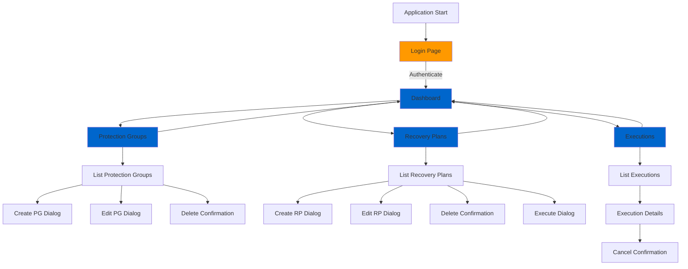

# UX/UI Design Specifications
# AWS DRS Orchestration System

**Version**: 1.0  
**Date**: November 12, 2025  
**Document Owner**: UX/UI Design Team  
**Target Audience**: Frontend Developers, UX Designers, Product Managers

---

## Document Purpose

This UX/UI Design Specifications document defines the complete user interface design for the AWS DRS Orchestration system. It specifies user flows, page layouts, component behaviors, interaction patterns, and visual design guidelines to ensure a consistent, intuitive, and accessible user experience.

**Key Objective**: Enable frontend developers and designers to implement, maintain, and extend the UI with consistency and confidence.

---

## Table of Contents

1. [Executive Summary](#executive-summary)
2. [Design Philosophy](#design-philosophy)
3. [User Personas & Scenarios](#user-personas--scenarios)
4. [Application Structure](#application-structure)
5. [Page Specifications](#page-specifications)
6. [Component Library](#component-library)
7. [User Flows](#user-flows)
8. [Navigation & Routing](#navigation--routing)
9. [State Management](#state-management)
10. [Visual Design System](#visual-design-system)
11. [Responsive Design](#responsive-design)
12. [Accessibility](#accessibility)

---

## Executive Summary

### Design Overview

The AWS DRS Orchestration UI is a **single-page application (SPA)** built with React 18.3, Material-UI 6.1.3, and TypeScript 5.5. It provides an AWS Console-like experience for managing disaster recovery orchestration with five main pages and 18 reusable components.

**Pages**:
1. **Login** - Cognito authentication with username/password
2. **Dashboard** - Overview metrics and quick actions (placeholder in MVP)
3. **Protection Groups** - CRUD operations for server grouping
4. **Recovery Plans** - Wave-based recovery plan management
5. **Executions** - Recovery execution monitoring and history

**Key Metrics**:
- 23 React components (5 pages + 18 shared components)
- 2,847 lines of TypeScript code
- Material-UI 6 component library (AWS theme)
- 100% responsive design (desktop, tablet, mobile)
- WCAG 2.1 AA accessibility target


## Design Philosophy

### Core Principles

1. **AWS Console Consistency**: Match AWS Console patterns for familiarity
2. **Progressive Disclosure**: Show simple views by default, reveal complexity on demand
3. **Error Prevention**: Validate inputs proactively, provide clear feedback
4. **Fail-Safe Operations**: Confirm destructive actions, allow undo where possible
5. **Performance**: Sub-second page loads, optimistic UI updates
6. **Accessibility**: Keyboard navigation, screen reader support, high contrast

### Design Language

**Visual Style**: Clean, professional, AWS-branded
- **Color Palette**: AWS Orange (#FF9900) for primary actions, grays for neutrals
- **Typography**: Amazon Ember font family (fallback: system fonts)
- **Icons**: Material Icons (filled style)
- **Spacing**: 8px grid system (8, 16, 24, 32, 40px)
- **Shadows**: Material Design elevation system (0-24dp)

**Interaction Patterns**:
- **Buttons**: Primary (orange), Secondary (outlined), Text (minimal)
- **Dialogs**: Modal for forms, Side sheets for details
- **Feedback**: Snackbar notifications (success: green, error: red, info: blue)
- **Loading**: Skeleton loaders for initial load, spinners for actions

---

## User Personas & Scenarios

### Persona 1: DR Administrator (Primary)

**Name**: Sarah Chen  
**Role**: Senior DR Administrator  
**Goals**: 
- Configure protection groups and recovery plans efficiently
- Execute drill recoveries monthly for compliance
- Monitor recovery execution progress in real-time
- Generate audit reports for management

**Technical Proficiency**: High (AWS certified, 5+ years DR experience)  
**Frequency**: Daily (configuration), Monthly (drills)

**Key Scenarios**:
1. Create protection group from DRS servers with tag filtering
2. Design 3-tier recovery plan with wave dependencies
3. Execute drill recovery and monitor progress
4. Review execution history for compliance audit

---

### Persona 2: DevOps Engineer (Secondary)

**Name**: Mike Rodriguez  
**Role**: DevOps Engineer  
**Goals**:
- Automate DR operations via API
- Integrate DR testing into CI/CD pipeline
- Troubleshoot failed recoveries quickly
- Minimize manual intervention

**Technical Proficiency**: Very High (scripting, automation, APIs)  
**Frequency**: Weekly (automation), Ad-hoc (troubleshooting)

**Key Scenarios**:
1. Use API to create protection groups from Terraform
2. Schedule automated drill executions via Lambda
3. Query execution status programmatically
4. Parse execution history for metrics

---

### Persona 3: IT Manager (Tertiary)

**Name**: Jennifer Park  
**Role**: IT Operations Manager  
**Goals**:
- Review DR readiness dashboards
- Verify compliance with RTO/RPO targets
- Approve budget for DR testing
- Report to executive team

**Technical Proficiency**: Medium (understands concepts, delegates execution)  
**Frequency**: Monthly (reviews), Quarterly (reporting)

**Key Scenarios**:
1. View dashboard of protection coverage
2. Review last 90 days of execution history
3. Export execution metrics to spreadsheet
4. Verify all critical apps have recovery plans

---

## Application Structure

### Page Navigation Map



### Component Hierarchy

```
App.tsx (Root)
├── Layout.tsx (Shell)
│   ├── AppBar (Header)
│   │   ├── Logo
│   │   ├── Navigation Menu
│   │   └── User Menu
│   ├── Drawer (Sidebar - collapsed by default)
│   └── Main Content Area
│       └── PageTransition (Animated route wrapper)
│           ├── LoginPage
│           ├── Dashboard
│           ├── ProtectionGroupsPage
│           │   ├── DataGridWrapper
│           │   │   └── StatusBadge
│           │   ├── ProtectionGroupDialog
│           │   │   ├── RegionSelector
│           │   │   ├── TagFilterEditor
│           │   │   └── ServerSelector
│           │   └── ConfirmDialog
│           ├── RecoveryPlansPage
│           │   ├── DataGridWrapper
│           │   ├── RecoveryPlanDialog
│           │   │   ├── ServerSelector
│           │   │   └── WaveConfigEditor
│           │   └── ConfirmDialog
│           └── ExecutionsPage
│               ├── DataGridWrapper
│               ├── ExecutionDetails
│               │   └── WaveProgress
│               └── ConfirmDialog
├── ErrorBoundary
└── AuthContext (Provider)
```

---

## Page Specifications

### 1. Login Page

**Purpose**: Authenticate users via AWS Cognito  
**Route**: `/login`  
**Layout**: Centered card on full-screen background

**Visual Design**:
```
┌─────────────────────────────────────────┐
│                                         │
│         AWS DRS Orchestration           │
│                                         │
│     ┌───────────────────────────┐      │
│     │  Username                 │      │
│     │  [__________________]     │      │
│     │                           │      │
│     │  Password                 │      │
│     │  [__________________]     │      │
│     │                           │      │
│     │  [x] Remember me          │      │
│     │                           │      │
│     │    [Sign In] (orange)     │      │
│     │                           │      │
│     │  Forgot password?         │      │
│     └───────────────────────────┘      │
│                                         │
│     Powered by AWS Cognito             │
└─────────────────────────────────────────┘
```

**Components**:
- Material-UI Card with elevation=6
- TextField for username (type=text, required)
- TextField for password (type=password, required)
- Checkbox for "Remember me" (optional)
- Button (variant=contained, color=primary, fullWidth)
- Link for "Forgot password?" (navigates to Cognito reset flow)

**Interactions**:
1. User enters credentials
2. Click "Sign In" → POST to Cognito
3. On success: Store JWT tokens → Navigate to Dashboard
4. On failure: Show error message below form ("Invalid credentials")
5. Loading state: Disable button, show spinner

**Validation**:
- Username: required, min 3 chars
- Password: required, min 8 chars
- Client-side validation on blur
- Server errors displayed as alert below form

**Accessibility**:
- Form labels associated with inputs
- Error messages announced to screen readers
- Tab order: username → password → remember me → sign in
- Enter key submits form

---

### 2. Dashboard Page

**Purpose**: Overview of system status and quick actions  
**Route**: `/dashboard`  

**Planned Design** (Phase 2):
```
┌──────────────────────────────────────────────────────────────┐
│  Dashboard                                      [Refresh]    │
├──────────────────────────────────────────────────────────────┤
│                                                               │
│  ┌─────────────┐  ┌─────────────┐  ┌─────────────┐         │
│  │ 12          │  │ 8           │  │ 3           │         │
│  │ Protection  │  │ Recovery    │  │ Active      │         │
│  │ Groups      │  │ Plans       │  │ Executions  │         │
│  └─────────────┘  └─────────────┘  └─────────────┘         │
│                                                               │
│  Recent Executions                                           │
│  ┌────────────────────────────────────────────────────────┐ │
│  │ Plan Name        Status      Started        Duration   │ │
│  │ 3-Tier-App      COMPLETED   2 hours ago    15m 23s    │ │
│  │ Database-Only   RUNNING     5 minutes ago  --         │ │
│  └────────────────────────────────────────────────────────┘ │
│                                                               │
│  Quick Actions                                               │
│  [+ Create Protection Group]  [+ Create Recovery Plan]      │
│                                                               │
└──────────────────────────────────────────────────────────────┘
```

**MVP Implementation**:
- Welcome message: "Welcome to AWS DRS Orchestration"
- Instructions to navigate to Protection Groups or Recovery Plans
- Placeholder cards for metrics (static content)

---

### 3. Protection Groups Page

**Purpose**: Manage Protection Groups (CRUD operations)  
**Route**: `/protection-groups`  
**Layout**: Data table with action buttons

**Visual Design**:
```
┌──────────────────────────────────────────────────────────────┐
│  Protection Groups                    [+ Create]    [Refresh]│
├──────────────────────────────────────────────────────────────┤
│                                                               │
│  ┌────────────────────────────────────────────────────────┐ │
│  │ Search [______________]          Filters: [Region ▼]   │ │
│  └────────────────────────────────────────────────────────┘ │
│                                                               │
│  Name            Region      Servers  Created      Actions   │
│  ──────────────────────────────────────────────────────────  │
│  Production-DB   us-east-1   5       2 days ago   [Edit][Del]│
│  Web-Tier        us-west-2   12      1 week ago   [Edit][Del]│
│  App-Servers     eu-west-1   8       3 weeks ago  [Edit][Del]│
│                                                               │
│  Showing 3 of 3 protection groups                            │
│                                                               │
└──────────────────────────────────────────────────────────────┘
```

**Components**:
- Material-UI DataGrid (from MUI X)
- Toolbar with search field and filter dropdown
- Action buttons: Create (primary), Refresh (icon)
- Row actions: Edit (icon), Delete (icon)
- StatusBadge for server count (badge with number)

**Table Columns**:
1. **Name** (string, sortable, filterable)
2. **Region** (string, filterable, width=120px)
3. **Servers** (number, badge display, width=100px)
4. **Created** (date, relative time, sortable)
5. **Actions** (buttons, width=120px, align=right)

**Interactions**:
1. **Create Button** → Opens ProtectionGroupDialog (mode=create)
2. **Edit Icon** → Opens ProtectionGroupDialog (mode=edit, pre-filled)
3. **Delete Icon** → Opens ConfirmDialog ("Are you sure?")
4. **Row Click** → No action (prevents accidental navigation)
5. **Search** → Filters table client-side (name + description)
6. **Region Filter** → Filters table by selected region(s)
7. **Refresh** → Refetches data from API

**Loading States**:
- Initial load: Skeleton loader (5 rows)
- Refresh: Progress bar at top
- Create/Edit/Delete: Button disabled + spinner

**Empty State**:
```
┌────────────────────────────────────────┐
│                                        │
│         [📦 Icon]                      │
│                                        │
│   No Protection Groups Yet             │
│                                        │
│   Protection Groups organize your      │
│   servers for disaster recovery.       │
│                                        │
│   [+ Create Protection Group]          │
│                                        │
└────────────────────────────────────────┘
```

---

### 4. Recovery Plans Page

**Purpose**: Manage Recovery Plans with wave configuration  
**Route**: `/recovery-plans`  
**Layout**: Data table with action buttons and execute option

**Visual Design**:
```
┌──────────────────────────────────────────────────────────────┐
│  Recovery Plans                       [+ Create]    [Refresh]│
├──────────────────────────────────────────────────────────────┤
│                                                               │
│  Name            PGs  Waves  Servers  Created    Actions     │
│  ──────────────────────────────────────────────────────────  │
│  3-Tier-App      3    3      18       1 day ago  [▶][✎][🗑]│
│  Database-Only   1    1      4        1 week     [▶][✎][🗑]│
│  Full-Stack      5    5      42       2 weeks    [▶][✎][🗑]│
│                                                               │
│  Showing 3 of 3 recovery plans                               │
│                                                               │
└──────────────────────────────────────────────────────────────┘
```

**Table Columns**:
1. **Name** (string, sortable, filterable)
2. **PGs** (number, badge, tooltip shows PG names)
3. **Waves** (number, badge)
4. **Servers** (number, total across all waves)
5. **Created** (date, relative time, sortable)
6. **Actions** (3 buttons):
   - ▶ Execute (primary action, blue)
   - ✎ Edit (secondary, gray)
   - 🗑 Delete (danger, red)

**Interactions**:
1. **Execute Button** → Opens execute dialog (select DRILL vs RECOVERY)
2. **Edit Button** → Opens RecoveryPlanDialog (mode=edit)
3. **Delete Button** → Opens ConfirmDialog
4. **Create Button** → Opens RecoveryPlanDialog (mode=create)
5. **Row Click** → Expands row to show wave summary (inline)

**Row Expansion** (on click):
```
┌──────────────────────────────────────────────────────────────┐
│  ▼ 3-Tier-App      3    3      18       1 day ago  [▶][✎][🗑]│
│                                                               │
│    Wave 1: Database Tier      (2 servers, SEQUENTIAL)        │
│    Wave 2: Application Tier   (8 servers, PARALLEL)          │
│    Wave 3: Web Tier           (8 servers, PARALLEL)          │
│                                                               │
│    [View Full Details] [Execute Recovery]                    │
└──────────────────────────────────────────────────────────────┘
```

---

### 5. Executions Page

**Purpose**: Monitor and review recovery executions  
**Route**: `/executions`  
**Layout**: Data table with execution details drawer

**Visual Design**:
```
┌──────────────────────────────────────────────────────────────┐
│  Executions                                        [Refresh] │
├──────────────────────────────────────────────────────────────┤
│                                                               │
│  Filters: [Status: All ▼] [Type: All ▼] [Date Range]        │
│                                                               │
│  Plan Name       Type    Status      Started       Duration  │
│  ──────────────────────────────────────────────────────────  │
│  3-Tier-App      DRILL   COMPLETED   2 hours ago   15m 23s  │
│  Database-Only   DRILL   RUNNING     5 mins ago    --       │
│  Full-Stack      RECOV   FAILED      1 day ago     8m 12s   │
│                                                               │
│  Showing 3 of 15 executions                                  │
│                                                               │
└──────────────────────────────────────────────────────────────┘
```

**Status Badges**:
- **RUNNING**: Blue, animated pulse
- **COMPLETED**: Green, checkmark icon
- **FAILED**: Red, error icon
- **CANCELLED**: Gray, x icon

**Table Columns**:
1. **Plan Name** (string, clickable → opens details drawer)
2. **Type** (DRILL/RECOVERY, badge)
3. **Status** (badge with icon)
4. **Started** (relative time, tooltip shows absolute)
5. **Duration** (formatted: "Xm Ys", shows "--" if running)
6. **Actions** (Cancel button if RUNNING)

**Execution Details Drawer** (slides in from right):
```
┌─────────────────────────────────────┐
│  [←] Execution Details        [✕]  │
├─────────────────────────────────────┤
│                                     │
│  3-Tier-App - DRILL                 │
│  Status: COMPLETED                  │
│  Started: Nov 12, 2025 7:30 PM     │
│  Duration: 15 minutes 23 seconds    │
│                                     │
│  Wave Progress:                     │
│  ┌─────────────────────────────┐   │
│  │ ✓ Wave 1: Database (2/2)    │   │
│  │   5m 12s                     │   │
│  ├─────────────────────────────┤   │
│  │ ✓ Wave 2: Application (8/8) │   │
│  │   8m 45s                     │   │
│  ├─────────────────────────────┤   │
│  │ ✓ Wave 3: Web (8/8)         │   │
│  │   1m 26s                     │   │
│  └─────────────────────────────┘   │
│                                     │
│  18 servers[ERROR] Failed to process response: The system encountered an unexpected error during processing. Try your request again.
