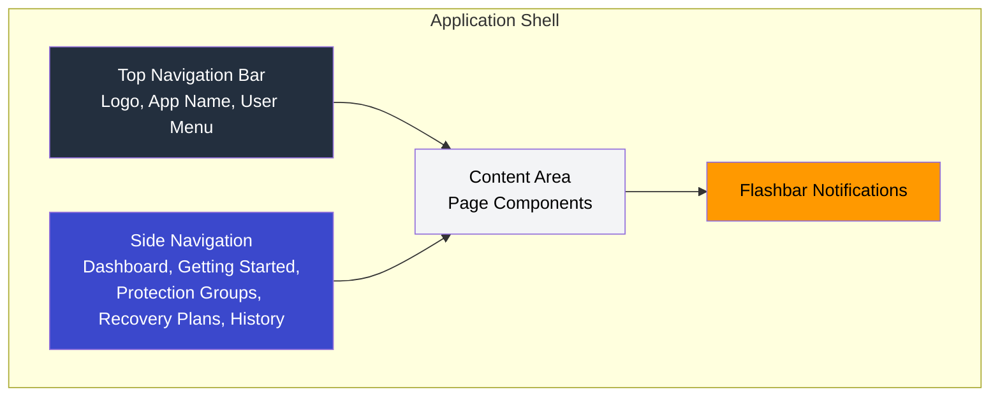
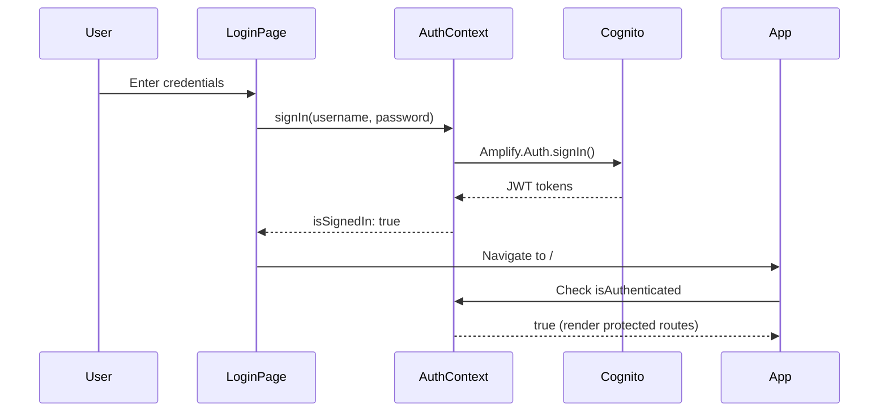
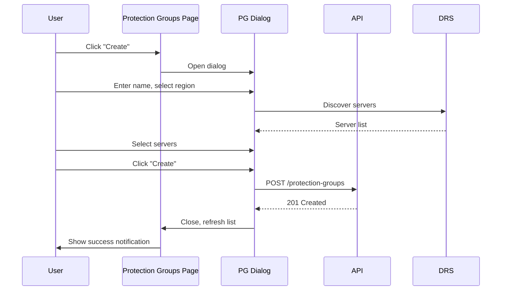
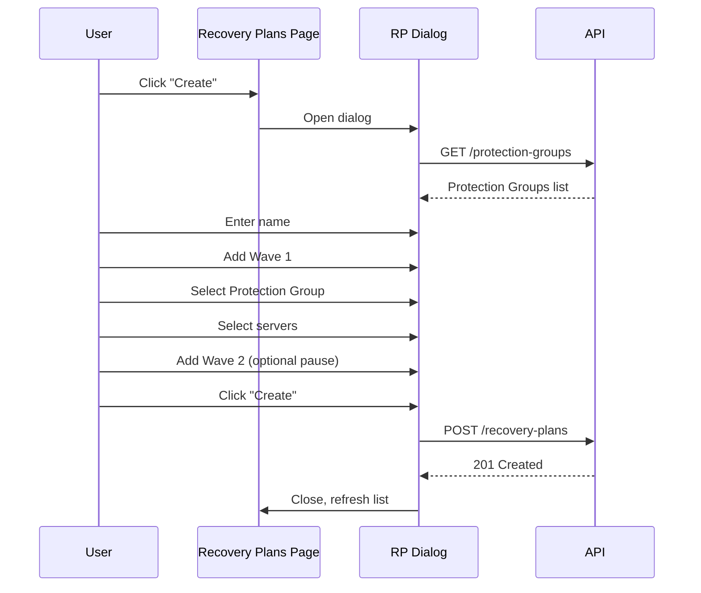
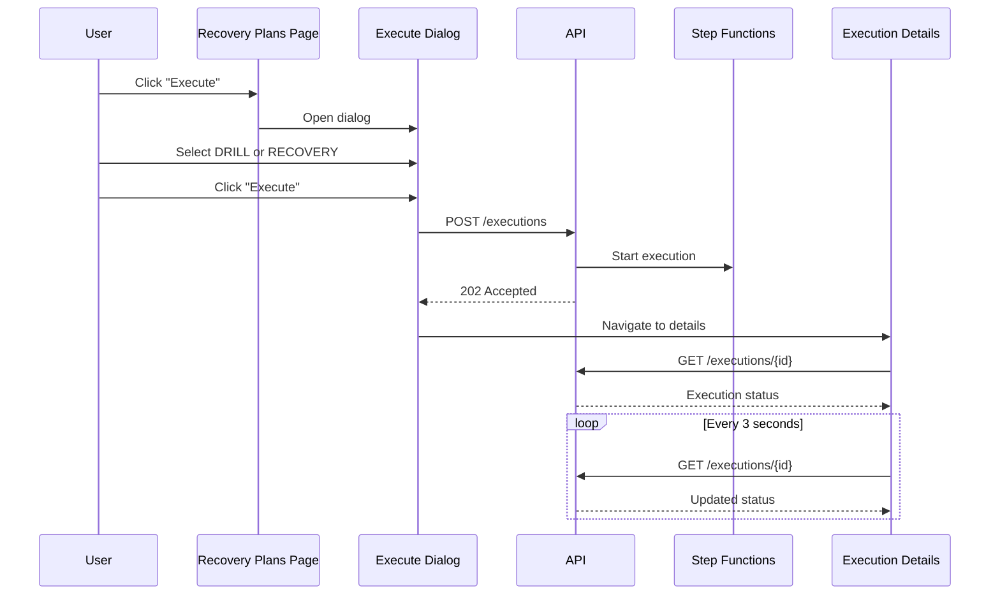
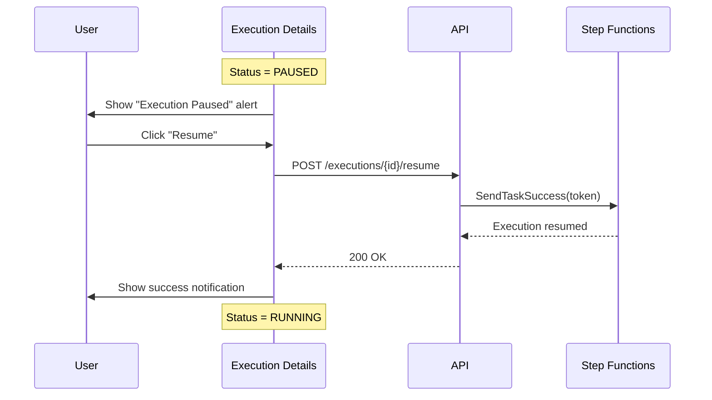
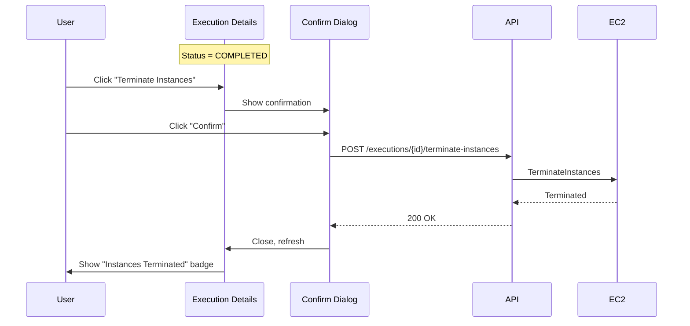

# UX/UI Design Specifications

## AWS DRS Orchestration System

**Version**: 5.0  
**Date**: December 2025  
**Status**: Production Release

---

## Document Purpose

This document defines the user experience and interface specifications for the AWS DRS Orchestration system. It serves as a blueprint for implementing the frontend application using React, TypeScript, and AWS CloudScape Design System.

---

## Design System

### Technology Stack

| Technology | Version | Purpose |
|------------|---------|---------|
| React | 19.1.1 | UI framework with hooks and functional components |
| TypeScript | 5.9.3 | Type-safe JavaScript |
| CloudScape Design System | 3.0.1148 | AWS-native UI component library |
| Vite | 7.1.7 | Build tool and development server |
| React Router | 7.9.5 | Client-side routing |
| AWS Amplify | 6.15.8 | Authentication and AWS integration |
| Axios | 1.13.2 | HTTP client for API communication |
| react-hot-toast | 2.6.0 | Toast notifications |
| date-fns | 4.1.0 | Date formatting and manipulation |

### Design Principles

1. **AWS Console Consistency**: Match AWS Console patterns for familiarity
2. **Progressive Disclosure**: Simple views by default, reveal complexity on demand
3. **Error Prevention**: Validate inputs proactively, provide clear feedback
4. **Accessibility**: WCAG 2.1 AA compliance, keyboard navigation, screen reader support
5. **Real-time Feedback**: Auto-refresh for active operations, immediate status updates


---

## Application Architecture

### System Architecture Overview


*[View/Edit Source Diagram](../architecture/AWS-DRS-Orchestration-Architecture.drawio)*

### Application Layout



### Route Structure

| Route | Component | Description |
|-------|-----------|-------------|
| /login | LoginPage | Cognito authentication |
| / | Dashboard | Overview metrics and quick actions |
| /getting-started | GettingStartedPage | Onboarding guide with quick links |
| /protection-groups | ProtectionGroupsPage | Protection Group management |
| /recovery-plans | RecoveryPlansPage | Recovery Plan management |
| /executions | ExecutionsPage | Execution list (Active/History tabs) |
| /executions/:id | ExecutionDetailsPage | Real-time execution monitoring |

### Authentication Flow



---

## Page Specifications

### 1. Login Page

**Purpose**: Authenticate users via AWS Cognito

**Visual Design**:
- Dark AWS-branded background (#232F3E)
- Centered white card with form
- AWS logo and "Elastic Disaster Recovery Orchestrator" title
- Decorative 3D isometric cubes at bottom
- Disclaimer footer with AWS Professional Services notice

**Components**:
- Custom styled input fields (AWS IAM Identity Center style)
- Orange primary button (#ec7211)
- CloudScape Alert for error messages
- CloudScape SpaceBetween for layout

**Behavior**:
- Submit on Enter key
- Show "Signing in..." during authentication
- Display error message on failure
- Redirect to Dashboard on success
- Auto-redirect if already authenticated

### 2. Dashboard Page

**Purpose**: Overview of system status and quick actions

**Layout**: Three-column grid with metric cards

**Content**:
- Protection Groups count with link
- Recovery Plans count with link
- Recent Executions summary
- Quick action buttons

### 3. Getting Started Page

**Purpose**: Onboarding guide for new users

**Layout**: Three-column grid with quick links plus Quick Start Guide

**Content**:
- Step 1: Create a Protection Group (link to /protection-groups)
- Step 2: Design a Recovery Plan (link to /recovery-plans)
- Step 3: Execute Recovery (link to /executions)
- Quick Start Guide container with workflow overview

**Components**:
- CloudScape ContentLayout with Header
- CloudScape ColumnLayout (3 columns)
- CloudScape Container for each section
- CloudScape Link for navigation

### 4. Protection Groups Page

**Purpose**: CRUD operations for Protection Groups

**Layout**: Full-width table with header actions

**Components**:
- CloudScape Table with useCollection hook
- CloudScape Header with Create and Refresh buttons
- CloudScape TextFilter for search
- CloudScape Pagination
- CloudScape Modal for create/edit dialog

**Table Columns**:

| Column | Width | Sortable | Content |
|--------|-------|----------|---------|
| Name | 200px | Yes | Group name (link to edit) |
| Region | 120px | Yes | AWS region code |
| Servers | 100px | Yes | Server count |
| Description | flex | No | Optional description |
| Created | 150px | Yes | Relative timestamp |
| Actions | 100px | No | Edit, Delete buttons |

**Create/Edit Dialog**:
- Name input field (required)
- Region selector dropdown (13 AWS regions)
- Description textarea (optional)
- ServerSelector component with real-time search

### 5. Recovery Plans Page

**Purpose**: CRUD operations for Recovery Plans

**Layout**: Full-width table with header actions

**Components**:
- CloudScape Table with useCollection hook
- CloudScape Header with Create and Refresh buttons
- CloudScape TextFilter for search
- CloudScape Pagination
- CloudScape Modal for create/edit dialog

**Table Columns**:

| Column | Width | Sortable | Content |
|--------|-------|----------|---------|
| Name | 200px | Yes | Plan name (link to edit) |
| Waves | 80px | Yes | Wave count |
| Status | 120px | Yes | Last execution status badge |
| Last Start | 150px | Yes | Last execution start time |
| Last End | 150px | Yes | Last execution end time |
| Actions | 150px | No | Execute, Edit, Delete buttons |

**Create/Edit Dialog**:
- Plan name input (required)
- Description textarea (optional)
- WaveConfigEditor component for wave configuration

### 6. Executions Page (History)

**Purpose**: List and monitor recovery executions

**Layout**: Tabbed interface with Active and History views

**Components**:
- CloudScape Tabs (Active / History)
- CloudScape Container cards for active executions
- CloudScape Table for history list
- CloudScape ProgressBar for in-progress executions
- CloudScape Badge for live updates indicator

**Active Tab**:
- Card-based layout for running executions
- Real-time progress bar
- Wave status summary
- Quick action buttons (View Details, Cancel)

**History Tab**:
- Table with all executions
- Status badges with color coding
- Duration calculation
- Link to execution details

### 7. Execution Details Page

**Purpose**: Real-time execution monitoring with pause/resume and instance management

**Layout**: Header with actions, summary container, wave progress timeline

**Components**:
- CloudScape Header with back navigation
- CloudScape Container for execution summary
- CloudScape Alert for paused state notification
- CloudScape ProgressBar for overall progress
- WaveProgress component for wave timeline
- CloudScape Button for actions
- ConfirmDialog for destructive actions

**Header Actions**:

| Button | Condition | Variant | Action |
|--------|-----------|---------|--------|
| Refresh | Always | Normal | Reload execution data |
| Resume Execution | Status = PAUSED | Primary | Resume paused execution |
| Cancel Execution | Status = RUNNING/POLLING | Normal | Cancel execution |
| Terminate Instances | Terminal + has jobIds | Normal | Terminate EC2 instances |

**Execution Summary**:
- Plan name and description
- Status badge with color
- Current wave / Total waves
- Initiated by user
- Start time and duration
- Execution ID (copyable)

**Paused State Alert**:
- Info alert with "Execution Paused" message
- Shows which wave is paused before
- Resume button in alert

**Wave Progress Timeline**:
- Visual timeline of all waves
- Status indicator per wave (✓, ✗, ▶, ○)
- Duration per wave
- Expandable server details
- Expandable DRS Job Events section
- Auto-refresh every 3 seconds for active executions

**Real-time Updates**:
- Execution status polling: Every 3 seconds for active executions
- DRS Job Events polling: Every 3 seconds (independent)
- Auto-refresh stops when execution reaches terminal state


---

## Component Library (22 Components)

### Dialog Components

| Component | Purpose | Props |
|-----------|---------|-------|
| ProtectionGroupDialog | Create/Edit Protection Groups | open, group, onClose, onSave |
| RecoveryPlanDialog | Create/Edit Recovery Plans | open, plan, onClose, onSave |
| ConfirmDialog | Confirmation with loading state | visible, title, message, onConfirm, onCancel, loading |

### Input Components

| Component | Purpose | Props |
|-----------|---------|-------|
| ServerSelector | Visual server selection with assignment status | region, selectedServers, onChange, currentGroupId |
| ServerDiscoveryPanel | DRS server discovery interface | region, onServersSelected |
| ServerListItem | Individual server display | server, selected, onSelect, disabled |
| RegionSelector | AWS region dropdown | value, onChange, disabled |
| WaveConfigEditor | Wave configuration form | waves, protectionGroups, onChange |

### Display Components

| Component | Purpose | Props |
|-----------|---------|-------|
| StatusBadge | Status indicators with color coding | status, size |
| WaveProgress | Wave execution timeline with DRS events | waves, currentWave, totalWaves, executionId |
| DateTimeDisplay | Timestamp formatting | timestamp, format |
| ExecutionDetails | Execution detail display | execution |
| JobEventsTimeline | DRS job event timeline | events |
| ServerStatusRow | Server status with instance details | server |

### State Components

| Component | Purpose | Props |
|-----------|---------|-------|
| ErrorBoundary | React error boundary wrapper | children, fallback |
| ErrorFallback | Error display component | error, resetErrorBoundary |
| ErrorState | Error state with retry button | message, onRetry |
| LoadingState | Loading spinner with message | message |
| CardSkeleton | Loading skeleton for cards | - |
| DataTableSkeleton | Loading skeleton for tables | columns, rows |

### Layout Components

| Component | Purpose | Props |
|-----------|---------|-------|
| PageTransition | Page transition animations | children |
| ProtectedRoute | Auth route wrapper | children |

---

## Component Specifications

### ServerSelector Component

**Purpose**: Select DRS source servers with real-time discovery and assignment status

**Features**:
- Real-time server discovery from DRS API
- Visual indication of server assignment status
- Search/filter functionality
- Checkbox selection with conflict prevention
- Shows hostname, server ID, replication state

**States**:
- Loading: Spinner while fetching servers
- Empty: No servers found in region
- Error: API error with retry option
- Loaded: Server list with selection

**Server Item Display**:
```
┌─────────────────────────────────────────────────────────────┐
│ ☐ s-1234567890abcdef0                                       │
│   web-server-01                                             │
│   🟢 CONTINUOUS | Ready for Recovery                        │
└─────────────────────────────────────────────────────────────┘

┌─────────────────────────────────────────────────────────────┐
│ ☐ s-0987654321fedcba0  (disabled)                          │
│   db-server-01                                              │
│   🔴 Assigned to: Database Servers                          │
└─────────────────────────────────────────────────────────────┘
```

### WaveConfigEditor Component

**Purpose**: Configure waves for Recovery Plans

**Features**:
- Add/remove waves dynamically
- Protection Group selection per wave
- Server selection from Protection Group
- Pause before wave checkbox (disabled for Wave 1)
- Wave reordering (drag or buttons)
- Dependency validation

**Wave Card Layout**:
```
┌─ Wave 1: Database Tier ─────────────────────────────────────┐
│ Protection Group: [DB-Primary ▼]                            │
│ Servers: [Select servers...] (3 selected)                   │
│ ☐ Pause execution before starting this wave (disabled)      │
│                                              [Remove Wave]  │
└─────────────────────────────────────────────────────────────┘
```

### WaveProgress Component

**Purpose**: Display wave execution timeline with real-time updates

**Features**:
- Overall progress bar with percentage
- Per-wave status indicators
- Expandable server details
- Expandable DRS Job Events timeline
- Auto-refresh for active executions (3-second interval)
- Duration calculation per wave

**Wave Status Indicators**:

| Status | Icon | Color |
|--------|------|-------|
| Completed | ✓ | Green (#037f0c) |
| Failed | ✗ | Red (#d91515) |
| In Progress | ▶ | Blue (#0972d3) |
| Pending | ○ | Gray (#5f6b7a) |
| Paused | ⏸ | Purple (#8B5CF6) |

**DRS Job Events**:

| Event | Icon | Description |
|-------|------|-------------|
| JOB_START | ▶ | Job initiated |
| SNAPSHOT_START | ◉ | Taking snapshot |
| SNAPSHOT_END | ✓ | Snapshot complete |
| CONVERSION_START | ↻ | Conversion started |
| CONVERSION_END | ✓ | Conversion succeeded |
| LAUNCH_START | ↑ | Launching instance |
| LAUNCH_END | ✓ | Instance launched |

### StatusBadge Component

**Purpose**: Consistent status display across the application

**Execution Status Colors**:

| Status | CloudScape Type | Color |
|--------|-----------------|-------|
| PENDING | pending | Gray |
| RUNNING | in-progress | Blue |
| POLLING | in-progress | Blue |
| LAUNCHING | in-progress | Blue |
| PAUSED | stopped | Purple |
| COMPLETED | success | Green |
| PARTIAL | warning | Yellow |
| FAILED | error | Red |
| CANCELLED | stopped | Orange |

### ConfirmDialog Component

**Purpose**: Confirmation dialogs for destructive actions

**Features**:
- Customizable title and message
- Loading state during async operations
- Cancel and Confirm buttons
- Keyboard support (Escape to cancel)

**Usage Examples**:
- Delete Protection Group
- Delete Recovery Plan
- Cancel Execution
- Terminate Instances

---

## User Flows

### Flow 1: Create Protection Group



### Flow 2: Create Recovery Plan



### Flow 3: Execute Recovery Plan



### Flow 4: Resume Paused Execution



### Flow 5: Terminate Recovery Instances



---

## Responsive Design

### Breakpoints

| Size | Width | Layout Changes |
|------|-------|----------------|
| Desktop | >1200px | Full layout with sidebar |
| Tablet | 768-1200px | Collapsed sidebar, full tables |
| Mobile | <768px | Stacked layout, hamburger menu |

### Component Adaptations

| Component | Desktop | Tablet | Mobile |
|-----------|---------|--------|--------|
| Navigation | Side panel | Collapsed | Hamburger |
| Tables | Full columns | Reduced columns | Card view |
| Dialogs | Large modal | Medium modal | Full screen |
| Forms | Multi-column | Single column | Single column |


---

## Accessibility

### WCAG 2.1 AA Compliance

| Requirement | Implementation |
|-------------|----------------|
| Color Contrast | 4.5:1 minimum for text |
| Focus Indicators | Visible focus ring on all interactive elements |
| Keyboard Navigation | Full functionality via keyboard |
| Screen Reader | ARIA labels and live regions |
| Error Identification | Clear error messages with field association |

### Keyboard Navigation

| Key | Action |
|-----|--------|
| Tab | Move focus forward |
| Shift+Tab | Move focus backward |
| Enter | Activate button/link |
| Space | Toggle checkbox, activate button |
| Escape | Close dialog/modal |
| Arrow Keys | Navigate lists and menus |

### ARIA Implementation

```tsx
// Button with aria-label
<Button
  iconName="edit"
  ariaLabel="Edit protection group"
  onClick={handleEdit}
/>

// Live region for status updates
<div aria-live="polite" aria-atomic="true">
  {statusMessage}
</div>

// Form field with error
<FormField
  label="Name"
  errorText={error}
  controlId="name-input"
>
  <Input
    value={name}
    onChange={handleChange}
    ariaDescribedby={error ? "name-error" : undefined}
  />
</FormField>
```

---

## State Management

### AuthContext

**Purpose**: Manage authentication state across the application

**State**:
```typescript
interface AuthState {
  isAuthenticated: boolean;
  loading: boolean;
  user: CognitoUser | null;
  error: string | null;
}
```

**Methods**:
- `signIn(username, password)`: Authenticate user
- `signOut()`: Sign out and clear tokens
- `checkAuth()`: Verify current authentication status

**Auto-logout**: 45-minute session timeout with activity tracking

### Data Fetching Pattern

```typescript
// API service with axios
const apiClient = {
  // Protection Groups
  listProtectionGroups: () => api.get('/protection-groups'),
  createProtectionGroup: (data) => api.post('/protection-groups', data),
  updateProtectionGroup: (id, data) => api.put(`/protection-groups/${id}`, data),
  deleteProtectionGroup: (id) => api.delete(`/protection-groups/${id}`),
  
  // Recovery Plans
  listRecoveryPlans: () => api.get('/recovery-plans'),
  createRecoveryPlan: (data) => api.post('/recovery-plans', data),
  updateRecoveryPlan: (id, data) => api.put(`/recovery-plans/${id}`, data),
  deleteRecoveryPlan: (id) => api.delete(`/recovery-plans/${id}`),
  
  // Executions
  listExecutions: () => api.get('/executions'),
  getExecution: (id) => api.get(`/executions/${id}`),
  startExecution: (data) => api.post('/executions', data),
  resumeExecution: (id) => api.post(`/executions/${id}/resume`),
  cancelExecution: (id) => api.post(`/executions/${id}/cancel`),
  terminateInstances: (id) => api.post(`/executions/${id}/terminate-instances`),
  getJobLogs: (id, jobId) => api.get(`/executions/${id}/job-logs`, { params: { jobId } }),
  
  // DRS
  discoverServers: (region, currentPgId) => 
    api.get('/drs/source-servers', { params: { region, currentProtectionGroupId: currentPgId } }),
};
```

### Loading and Error States

```typescript
// Standard loading/error pattern
const [loading, setLoading] = useState(false);
const [error, setError] = useState<string | null>(null);
const [data, setData] = useState<T | null>(null);

const fetchData = async () => {
  setLoading(true);
  setError(null);
  try {
    const result = await apiClient.getData();
    setData(result);
  } catch (err) {
    setError(err.message || 'An error occurred');
  } finally {
    setLoading(false);
  }
};
```

---

## Notification System

### Flashbar Notifications

**Types**:

| Type | Use Case | Auto-dismiss |
|------|----------|--------------|
| success | Operation completed | 5 seconds |
| error | Operation failed | Manual |
| warning | Attention needed | Manual |
| info | Informational | 10 seconds |

**Implementation**:
```typescript
const [notifications, setNotifications] = useState<FlashbarProps.MessageDefinition[]>([]);

const addNotification = (type: 'success' | 'error' | 'warning' | 'info', content: string) => {
  const id = Date.now().toString();
  setNotifications(prev => [
    ...prev,
    {
      type,
      content,
      dismissible: true,
      onDismiss: () => removeNotification(id),
      id,
    },
  ]);

  if (type === 'success') {
    setTimeout(() => removeNotification(id), 5000);
  }
};
```

---

## Error Handling

### Error Types

| Error Code | Display | Action |
|------------|---------|--------|
| 400 | Validation error message | Highlight field |
| 401 | "Session expired" | Redirect to login |
| 403 | "Access denied" | Show error state |
| 404 | "Not found" | Show error state |
| 409 | Conflict message | Show specific error |
| 500 | "Server error" | Show retry option |

### Conflict Error Handling

```typescript
// Handle 409 Conflict responses
if (error.response?.status === 409) {
  const errorCode = error.response.data.error;
  
  switch (errorCode) {
    case 'PG_NAME_EXISTS':
      setErrors({ name: 'A Protection Group with this name already exists' });
      break;
    case 'SERVER_ASSIGNMENT_CONFLICT':
      setError('Some servers are already assigned to other Protection Groups');
      break;
    case 'PG_IN_ACTIVE_EXECUTION':
      setError('Cannot modify - Protection Group is part of an active execution');
      break;
    case 'PLAN_ALREADY_EXECUTING':
      setError('This plan already has an execution in progress');
      break;
  }
}
```

---

## Performance Optimization

### Code Splitting

```typescript
// Lazy load pages
const Dashboard = lazy(() => import('./pages/Dashboard'));
const ProtectionGroupsPage = lazy(() => import('./pages/ProtectionGroupsPage'));
const RecoveryPlansPage = lazy(() => import('./pages/RecoveryPlansPage'));
const ExecutionsPage = lazy(() => import('./pages/ExecutionsPage'));
const ExecutionDetailsPage = lazy(() => import('./pages/ExecutionDetailsPage'));
```

### Memoization

```typescript
// Memoize expensive calculations
const progress = useMemo(() => {
  return calculateOverallProgressWithLogs(waves, planTotalWaves, jobLogs);
}, [waves, planTotalWaves, jobLogs]);

// Memoize callbacks
const handleSubmit = useCallback(async () => {
  // submission logic
}, [dependencies]);
```

### Polling Optimization

```typescript
// Stop polling when execution completes
useEffect(() => {
  if (!executionId || isTerminalStatus(status)) return;
  
  const interval = setInterval(() => {
    fetchExecutionStatus();
  }, 3000);
  
  return () => clearInterval(interval);
}, [executionId, status]);
```

---

## Testing Requirements

### Unit Tests

- Component rendering tests
- User interaction tests
- State management tests
- API service tests

### Integration Tests

- Page navigation flows
- Form submission flows
- Error handling flows

### E2E Tests (Playwright)

- Login flow
- Create Protection Group flow
- Create Recovery Plan flow
- Execute and monitor flow
- Pause/Resume flow
- Terminate instances flow

---

## Appendix: CloudScape Components Reference

### Layout Components

| Component | Usage |
|-----------|-------|
| AppLayout | Main application shell |
| ContentLayout | Page content wrapper |
| Container | Content sections |
| ColumnLayout | Multi-column layouts |
| SpaceBetween | Consistent spacing |
| Box | Generic container |
| Grid | CSS Grid wrapper |

### Navigation Components

| Component | Usage |
|-----------|-------|
| SideNavigation | Main navigation |
| BreadcrumbGroup | Page breadcrumbs |
| Tabs | Content tabs |
| Link | Navigation links |

### Form Components

| Component | Usage |
|-----------|-------|
| Form | Form container |
| FormField | Field wrapper with label |
| Input | Text input |
| Textarea | Multi-line input |
| Select | Dropdown select |
| Multiselect | Multi-select dropdown |
| Checkbox | Boolean input |
| RadioGroup | Radio buttons |
| DatePicker | Date selection |

### Data Display Components

| Component | Usage |
|-----------|-------|
| Table | Data tables |
| Cards | Card layouts |
| KeyValuePairs | Key-value display |
| ProgressBar | Progress indication |
| StatusIndicator | Status display |
| Badge | Labels and tags |
| Spinner | Loading indicator |

### Feedback Components

| Component | Usage |
|-----------|-------|
| Alert | Inline alerts |
| Flashbar | Toast notifications |
| Modal | Dialog windows |
| Popover | Contextual info |
| HelpPanel | Help content |

### Action Components

| Component | Usage |
|-----------|-------|
| Button | Primary actions |
| ButtonDropdown | Action menus |
| Toggle | On/off switches |
| ExpandableSection | Collapsible content |
