# UX/UI Design Specifications

## AWS DRS Orchestration System

**Version**: 4.0  
**Date**: December 2025  
**Status**: Production Release

---

## UI Design Diagrams

### Application Layout Structure


### Page Flow Diagram


### Protection Groups Page Wireframe

```
┌─────────────────────────────────────────────────────────────────────────────┐
│ Protection Groups                                           [Create Group]  │
│ Define groups of servers to protect together                                │
├─────────────────────────────────────────────────────────────────────────────┤
│ Find protection groups: [________________]                    2 matches      │
├─────────────────────────────────────────────────────────────────────────────┤
│ Name          │ Description │ Region    │ Servers │ Created    │ Actions    │
├─────────────────────────────────────────────────────────────────────────────┤
│ DB-Primary    │ Database    │ us-east-1 │ 2       │ 2 days ago │ [⋮]        │
│ App-Servers   │ -           │ us-east-1 │ 3       │ 1 day ago  │ [⋮]        │
│ Web-Tier      │ Frontend    │ us-west-2 │ 1       │ 3 hours ago│ [⋮]        │
├─────────────────────────────────────────────────────────────────────────────┤
│                                                    [1] [2] [3] ... [Next >] │
└─────────────────────────────────────────────────────────────────────────────┘

┌─── Create Protection Group Dialog ──────────────────────────────────────────┐
│ Name: [_________________________] *Required                                 │
│ Region: [us-east-1 ▼]                                                      │
│ Description: [_________________________________________________]            │
│                                                                             │
│ Available Servers:                                                          │
│ ┌─────────────────────────────────────────────────────────────────────────┐ │
│ │ ☐ s-1234567890 │ web-server-01    │ 🟢 Available                      │ │
│ │ ☐ s-2345678901 │ app-server-01    │ 🟢 Available                      │ │
│ │ ☐ s-3456789012 │ db-server-01     │ 🔴 Assigned to DB-Primary         │ │
│ └─────────────────────────────────────────────────────────────────────────┘ │
│                                                           [Cancel] [Create] │
└─────────────────────────────────────────────────────────────────────────────┘
```

### Recovery Plans Page Wireframe

```
┌─────────────────────────────────────────────────────────────────────────────┐
│ Recovery Plans                                              [Create Plan]    │
│ Define recovery strategies with wave-based orchestration                    │
├─────────────────────────────────────────────────────────────────────────────┤
│ Find recovery plans: [________________]                       3 matches      │
├─────────────────────────────────────────────────────────────────────────────┤
│ Plan Name    │ Waves │ Status      │ Last Start      │ Last End        │ Actions │
├─────────────────────────────────────────────────────────────────────────────┤
│ 3-Tier App   │ 3     │ ✅ COMPLETED │ Dec 15, 2:30 PM │ Dec 15, 2:45 PM │ [⋮]    │
│ Database Only │ 1     │ 🔵 Not Run   │ Never           │ Never           │ [⋮]    │
│ Web Failover  │ 2 of 3│ 🟡 RUNNING   │ Dec 15, 3:00 PM │ -               │ [⋮]    │
├─────────────────────────────────────────────────────────────────────────────┤
│                                                    [1] [2] [3] ... [Next >] │
└─────────────────────────────────────────────────────────────────────────────┘

┌─── Recovery Plan Configuration ─────────────────────────────────────────────┐
│ Plan Name: [3-Tier Application Recovery] *Required                          │
│ Description: [Complete application stack recovery]                          │
│                                                                             │
│ Wave Configuration:                                                         │
│ ┌─ Wave 1: Database Tier ───────────────────────────────────────────────┐   │
│ │ Protection Groups: [DB-Primary ▼] [DB-Secondary ▼]                   │   │
│ │ Dependencies: None                                                    │   │
│ │ ☐ Pause before wave (disabled for Wave 1)                            │   │
│ └───────────────────────────────────────────────────────────────────────┘   │
│ ┌─ Wave 2: Application Tier ────────────────────────────────────────────┐   │
│ │ Protection Groups: [App-Servers ▼]                                   │   │
│ │ Dependencies: Wave 1                                                  │   │
│ │ ☐ Pause execution before starting this wave                          │   │
│ └───────────────────────────────────────────────────────────────────────┘   │
│ ┌─ Wave 3: Web Tier ────────────────────────────────────────────────────┐   │
│ │ Protection Groups: [Web-Tier ▼]                                      │   │
│ │ Dependencies: Wave 2                                                  │   │
│ │ ☑ Pause execution before starting this wave                          │   │
│ └───────────────────────────────────────────────────────────────────────┘   │
│                                                           [Cancel] [Create] │
└─────────────────────────────────────────────────────────────────────────────┘
```

### Execution Details Page Wireframe

```
┌─────────────────────────────────────────────────────────────────────────────┐
│ [← Back] [Refresh] Execution Details    [Resume] [Cancel] [Terminate]       │
├─────────────────────────────────────────────────────────────────────────────┤
│ ┌─ ℹ️ Execution Paused ─────────────────────────────────────────────────┐   │
│ │ Execution is paused before starting Wave 3. Click Resume to continue. │   │
│ │                                                        [Resume]       │   │
│ └───────────────────────────────────────────────────────────────────────┘   │
│                                                                             │
│ Recovery Plan                                                               │
│                                                                             │
│ 3-Tier Application Recovery                                                 │
│ ⏸️ PAUSED    Wave 2 of 3    By: admin@example.com                         │
│                                                                             │
│ Started: Dec 15, 2025 3:00:15 PM    Duration: 5m 23s                      │
│ Execution ID: exec-abc123def456                                             │
│                                                                             │
│ Overall Progress                                                    67%     │
│ █████████████░░░░░░░                                                │
├─────────────────────────────────────────────────────────────────────────────┤
│ Wave Progress                                                               │
│                                                                             │
│ ✅ Wave 1: Database Tier                                    COMPLETED (2m) │
│    ████████████████████ 100%                                      │
│    2 servers launched successfully                                          │
│    ▼ DRS Job Events (6)                                                    │
│    ┌────────────────────────────────────────────────────────────────────┐   │
│    │ ▶ Job Started                              Dec 15, 3:00:15 PM     │   │
│    │ 📸 Taking Snapshot                         Dec 15, 3:00:20 PM     │   │
│    │ ✓ Snapshot Complete                        Dec 15, 3:02:15 PM     │   │
│    │ 🔄 Conversion Started                      Dec 15, 3:02:20 PM     │   │
│    │ ✓ Conversion Succeeded                     Dec 15, 3:08:45 PM     │   │
│    │ 🚀 Launching Instance                      Dec 15, 3:08:50 PM     │   │
│    │ ✓ Instance Launched                        Dec 15, 3:10:15 PM     │   │
│    └────────────────────────────────────────────────────────────────────┘   │
│                                                                             │
│ ✅ Wave 2: Application Tier                                 COMPLETED (4m) │
│    ████████████████████ 100%                                      │
│    1 server launched successfully                                           │
│                                                                             │
│ ⏸️ Wave 3: Web Tier                                            PAUSED      │
│    ░░░░░░░░░░░░░░░░░░░░ 0%                                        │
│    Paused - waiting for manual resume                                       │
└─────────────────────────────────────────────────────────────────────────────┘
```

### Component Interaction Diagram


### Status Indicator Design

```mermaid
graph LR
    subgraph "Execution Status"
        PENDING["⏳ PENDING<br/>Gray"]
        POLLING["🔄 POLLING<br/>Blue"]
        LAUNCHING["🟡 LAUNCHING<br/>Yellow"]
        PAUSED["⏸️ PAUSED<br/>Purple"]
        COMPLETED["✅ COMPLETED<br/>Green"]
        FAILED["❌ FAILED<br/>Red"]
        CANCELLED["⏹️ CANCELLED<br/>Orange"]
    end
    
    subgraph "Server Status"
        AVAILABLE["🟢 Available<br/>Green"]
        ASSIGNED["🔴 Assigned<br/>Red"]
        LAUNCHED["✅ Launched<br/>Green"]
        ERROR["❌ Error<br/>Red"]
    end
    
    style PENDING fill:#6B7280,color:#fff
    style POLLING fill:#3B82F6,color:#fff
    style LAUNCHING fill:#F59E0B,color:#000
    style PAUSED fill:#8B5CF6,color:#fff
    style COMPLETED fill:#10B981,color:#fff
    style FAILED fill:#EF4444,color:#fff
    style CANCELLED fill:#F97316,color:#fff
    
    style AVAILABLE fill:#10B981,color:#fff
    style ASSIGNED fill:#EF4444,color:#fff
    style LAUNCHED fill:#10B981,color:#fff
    style ERROR fill:#EF4444,color:#fff
```



---

## Design System

### Framework

- **UI Library**: AWS CloudScape Design System
- **React Version**: 18.3
- **TypeScript**: 5.5
- **Build Tool**: Vite 5.4

### Design Principles

1. **AWS Console Consistency**: Match AWS Console patterns for familiarity
2. **Progressive Disclosure**: Simple views by default, reveal complexity on demand
3. **Error Prevention**: Validate inputs proactively, provide clear feedback
4. **Accessibility**: WCAG 2.1 AA compliance, keyboard navigation, screen reader support

### CloudScape Components Used

- AppLayout (page structure with navigation)
- Table (data display with sorting, filtering, pagination)
- Form, FormField, Input, Select (form controls)
- Modal (dialogs)
- Button, SpaceBetween, Box (layout)
- StatusIndicator, Badge (status display)
- Wizard, Steps (multi-step flows)
- Alert, Flashbar (notifications)
- Header, BreadcrumbGroup (navigation)
- Tabs (content organization)
- ProgressBar (execution progress)
- ColumnLayout, Container (content structure)

---

## Application Structure

### Navigation

The application uses CloudScape AppLayout with a top navigation bar:

- Logo and application name (DR Orchestrator)
- Main navigation links: Dashboard, Protection Groups, Recovery Plans, History
- User menu with sign out option

### Routes

| Route | Page | Description |
|-------|------|-------------|
| /login | LoginPage | Cognito authentication |
| / | Dashboard | Overview metrics and quick actions (default landing) |
| /getting-started | GettingStartedPage | Onboarding guide with quick links |
| /protection-groups | ProtectionGroupsPage | Protection Group management |
| /protection-groups/new | ProtectionGroupsPage | Create new Protection Group |
| /recovery-plans | RecoveryPlansPage | Recovery Plan management |
| /recovery-plans/new | RecoveryPlansPage | Create new Recovery Plan |
| /executions | ExecutionsPage | Execution list with Active/History tabs |
| /executions/:executionId | ExecutionDetailsPage | Real-time execution monitoring |

---

## Page Specifications

### 1. Login Page

**Purpose**: Authenticate users via AWS Cognito

**Components**:

- CloudScape Container with centered layout
- CloudScape Input for username/password
- CloudScape Button (variant primary)
- CloudScape Alert for error messages

**Behavior**:

- Submit on Enter key
- Show loading spinner during authentication
- Display error message on failure
- Redirect to Getting Started page on success

### 2. Getting Started Page

**Purpose**: Onboarding guide for new users

**Layout**: Three-column grid with quick links plus Quick Start Guide

**Components**:

- CloudScape ContentLayout with Header
- CloudScape ColumnLayout (3 columns)
- CloudScape Container for each section
- Quick Start Guide container with 3-step workflow

**Content**:

- Step 1: Create a Protection Group
- Step 2: Design a Recovery Plan
- Step 3: Execute Recovery

### 3. Dashboard Page

**Purpose**: Overview of system status and quick actions

**Components**:

- CloudScape Cards for metrics
- CloudScape Button for quick actions
- Recent executions summary

### 4. Protection Groups Page

**Purpose**: CRUD operations for Protection Groups

**Components**:

- CloudScape Table with collection hooks
- CloudScape Header with Create and Refresh buttons
- CloudScape Modal for create/edit dialog

**Table Columns**: Name, Region, Servers, Created, Actions

**Create/Edit Dialog**:

- Name input field (required)
- Region selector dropdown (13 AWS regions)
- Description field (optional)
- Server selector with real-time search and assignment status

### 5. Recovery Plans Page

**Purpose**: CRUD operations for Recovery Plans

**Components**:

- CloudScape Table with collection hooks
- CloudScape Header with Create and Refresh buttons
- CloudScape Modal for create/edit dialog

**Table Columns**: Name, Protection Groups, Waves, Servers, Created, Actions

**Create/Edit Dialog**:

- Plan name and description fields
- Protection Group multi-select
- Wave configuration editor

### 6. Executions Page (History)

**Purpose**: List and monitor recovery executions

**Components**:

- CloudScape Tabs (Active / History)
- CloudScape Table for history list
- CloudScape Container cards for active executions
- CloudScape ProgressBar for in-progress executions
- CloudScape Badge for live updates indicator

**Status Indicators**: PENDING, POLLING, LAUNCHING, COMPLETED, FAILED, CANCELLED

### 7. Execution Details Page

**Purpose**: Real-time execution monitoring with pause/resume and instance management

**Components**:

- CloudScape Header with back navigation and action buttons
- CloudScape Container for execution summary
- WaveProgress component showing wave timeline with DRS job events
- CloudScape ProgressBar for overall execution progress
- CloudScape Alert for paused state with resume action
- CloudScape Button for cancel execution
- CloudScape Button for resume execution (when paused)
- CloudScape Button for terminate instances (when completed)
- ConfirmDialog for destructive actions with loading states

**Action Buttons**:

| Button | Condition | Action |
|--------|-----------|--------|
| Refresh | Always | Reload execution data |
| Resume Execution | Status = PAUSED | Resume paused execution |
| Cancel Execution | Status = RUNNING/POLLING | Cancel execution |
| Terminate Instances | Status = COMPLETED/FAILED + has jobIds | Terminate recovery EC2 instances |

**Real-time Updates**:

- Execution status polling: Every 3 seconds for active executions
- DRS Job Events polling: Every 3 seconds (independent of status polling)
- Auto-refresh stops when execution reaches terminal state

**Paused State Display**:

- Alert banner showing "Execution Paused" with wave number
- Resume button in header and in alert
- Paused before wave indicator

---

## Component Library (22 components)

| Component | Purpose |
|-----------|---------|
| ProtectionGroupDialog | Create/Edit Protection Groups modal |
| RecoveryPlanDialog | Create/Edit Recovery Plans modal |
| ServerSelector | Visual server selection with assignment status |
| ServerDiscoveryPanel | DRS server discovery interface |
| ServerListItem | Individual server display in lists |
| RegionSelector | AWS region dropdown |
| StatusBadge | Status indicators with color coding |
| WaveProgress | Wave execution timeline with DRS job events auto-refresh |
| WaveConfigEditor | Wave configuration form with pause-before-wave option |
| ConfirmDialog | Confirmation dialogs with loading state support |
| DateTimeDisplay | Timestamp formatting |
| ExecutionDetails | Execution detail display |
| ErrorBoundary | React error boundary wrapper |
| ErrorFallback | Error display component |
| ErrorState | Error state with retry button |
| LoadingState | Loading spinner with message |
| CardSkeleton | Loading skeleton for cards |
| DataTableSkeleton | Loading skeleton for tables |
| PageTransition | Page transition animations |
| ProtectedRoute | Auth route wrapper |
| JobEventsTimeline | DRS job event timeline display |
| ServerStatusRow | Server status with source/recovery instance details |

### CloudScape Layout Components

| Component | Purpose |
|-----------|---------|
| AppLayout | Page shell with navigation |
| ContentLayout | Page content wrapper with header |

---

## User Flows

### Flow 1: Create Protection Group

1. Navigate to Protection Groups page
2. Click Create button
3. Enter name and select region
4. System discovers DRS servers
5. Select available servers
6. Click Create
7. Success notification displayed

### Flow 2: Create Recovery Plan

1. Navigate to Recovery Plans page
2. Click Create button
3. Enter name and description
4. Select Protection Groups
5. Configure waves
6. Click Create

### Flow 3: Execute Recovery

1. Navigate to Recovery Plans page
2. Click Execute button on plan row
3. Select execution type (DRILL or RECOVERY)
4. Confirm execution
5. Redirect to Execution Details page
6. Monitor wave progress

### Flow 4: Monitor Execution

1. Navigate to History page
2. View Active tab for in-progress executions
3. Click View Details
4. View wave progress timeline with DRS job events
5. Auto-refresh updates status every 3 seconds
6. DRS Job Events section auto-refreshes independently

### Flow 5: Resume Paused Execution

1. Execution reaches wave with `pauseBeforeWave: true`
2. Step Functions enters PAUSED state
3. UI shows "Execution Paused" alert with wave number
4. User clicks Resume Execution button
5. API calls Step Functions SendTaskSuccess
6. Execution continues with next wave
7. UI updates to show wave in progress

### Flow 6: Terminate Recovery Instances

1. Execution completes (COMPLETED, FAILED, or CANCELLED)
2. Terminate Instances button becomes available
3. User clicks Terminate Instances
4. Confirmation dialog appears with warning
5. User confirms termination
6. API terminates all EC2 recovery instances
7. Badge shows "Instances Terminated"
8. Button is hidden (prevents duplicate termination)

---

## Responsive Design

| Size | Width | Layout |
|------|-------|--------|
| Desktop | >1200px | Full layout with sidebar |
| Tablet | 768-1200px | Collapsed sidebar |
| Mobile | <768px | Stacked layout, hamburger menu |

---

## Accessibility

### WCAG 2.1 AA Compliance

- Color contrast ratio: 4.5:1 minimum
- Focus indicators on all interactive elements
- Keyboard navigation for all functionality
- Screen reader announcements for status changes

### Keyboard Navigation

| Key | Action |
|-----|--------|
| Tab | Move focus forward |
| Shift+Tab | Move focus backward |
| Enter | Activate button/link |
| Space | Toggle checkbox |
| Escape | Close dialog |

---

## State Management

### React Context

- AuthContext: User authentication state, JWT tokens, login/logout functions

### Data Fetching

- API calls via axios with JWT token
- Loading states during fetch
- Error handling with toast notifications
- Auto-refresh for active executions (3-second interval)
