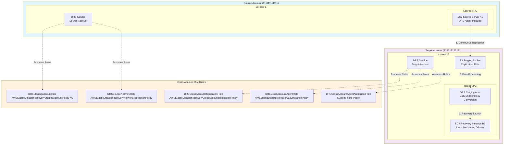
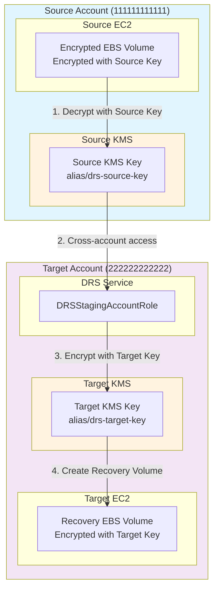
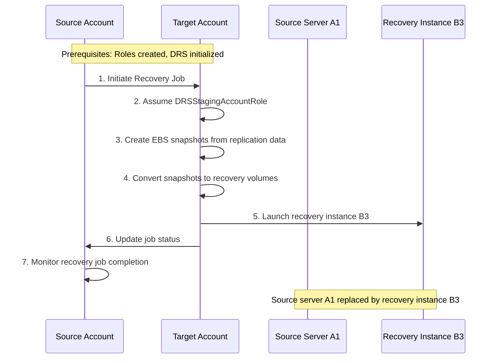
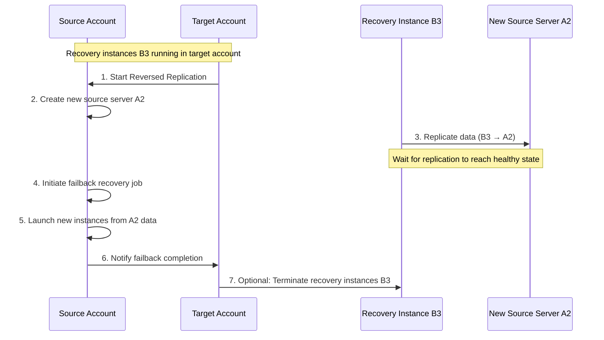

# AWS Elastic Disaster Recovery (DRS) Cross-Account Comprehensive Research

## Table of Contents
1. [Overview](#overview)
2. [Cross-Account Architecture](#cross-account-architecture)
3. [IAM Roles and Permissions](#iam-roles-and-permissions)
4. [KMS Key Requirements for EBS Encryption](#kms-key-requirements-for-ebs-encryption)
5. [DRS Agent Installation](#drs-agent-installation)
6. [Failover Process](#failover-process)
7. [Failback Process](#failback-process)
8. [Network Requirements](#network-requirements)
9. [Security Considerations](#security-considerations)
10. [Best Practices](#best-practices)
11. [Troubleshooting](#troubleshooting)

## Overview

AWS Elastic Disaster Recovery (DRS) enables cross-account disaster recovery scenarios where source servers in one AWS account can be replicated and recovered to a different AWS account. This setup provides additional isolation and security for disaster recovery operations.

### Key Benefits
- **Account Isolation**: Separate billing, security boundaries, and administrative control
- **Compliance**: Meet regulatory requirements for data segregation
- **Security**: Reduced blast radius in case of account compromise
- **Operational Flexibility**: Different teams can manage source and target environments

### Supported Scenarios
- Cross-account within same region
- Cross-account cross-region
- Hybrid (on-premises to AWS cross-account)
- AWS to AWS cross-account

## Cross-Account Architecture



## IAM Roles and Permissions

### 1. Staging Role (DRSStagingAccountRole)

**Purpose**: Enables DRS to recover source servers into the target account and perform failback operations.

**Trust Policy**:
```json
{
  "Version": "2012-10-17",
  "Statement": [
    {
      "Effect": "Allow",
      "Principal": {
        "Service": "drs.amazonaws.com"
      },
      "Action": [
        "sts:AssumeRole",
        "sts:SetSourceIdentity"
      ],
      "Condition": {
        "StringLike": {
          "sts:SourceIdentity": "{{target_account}}",
          "aws:SourceAccount": "{{target_account}}"
        },
        "ArnLike": {
          "aws:SourceArn": "arn:aws:drs:*:*:source-server/*"
        }
      }
    }
  ]
}
```

**Managed Policy**: `AWSElasticDisasterRecoveryStagingAccountPolicy_v2`

**Key Permissions**:
```json
{
  "Version": "2012-10-17",
  "Statement": [
    {
      "Sid": "DRSStagingAccountPolicyv21",
      "Effect": "Allow",
      "Action": [
        "drs:DescribeSourceServers",
        "drs:DescribeRecoverySnapshots",
        "drs:CreateConvertedSnapshotForDrs",
        "drs:GetReplicationConfiguration",
        "drs:DescribeJobs",
        "drs:DescribeJobLogItems"
      ],
      "Resource": "*"
    },
    {
      "Sid": "DRSStagingAccountPolicyv22",
      "Effect": "Allow",
      "Action": [
        "ec2:ModifySnapshotAttribute"
      ],
      "Resource": "arn:aws:ec2:*:*:snapshot/*",
      "Condition": {
        "StringEquals": {
          "ec2:Add/userId": "${aws:SourceIdentity}"
        },
        "Null": {
          "aws:ResourceTag/AWSElasticDisasterRecoveryManaged": "false"
        }
      }
    },
    {
      "Sid": "DRSStagingAccountPolicyv23",
      "Effect": "Allow",
      "Action": "drs:IssueAgentCertificateForDrs",
      "Resource": [
        "arn:aws:drs:*:*:source-server/*"
      ]
    }
  ]
}
```

### 2. Network Role (DRSSourceNetworkRole)

**Purpose**: Enables network replication capabilities for cross-account scenarios.

**Trust Policy**:
```json
{
  "Version": "2012-10-17",
  "Statement": [
    {
      "Effect": "Allow",
      "Principal": {
        "Service": "drs.amazonaws.com"
      },
      "Action": "sts:AssumeRole",
      "Condition": {
        "StringLike": {
          "aws:SourceAccount": "{{target_account}}"
        },
        "ArnLike": {
          "aws:SourceArn": "arn:aws:drs:*:*:source-network/*"
        }
      }
    }
  ]
}
```

**Managed Policy**: `AWSElasticDisasterRecoveryNetworkReplicationPolicy`

### 3. Cross-Account Replication Role (DRSCrossAccountReplicationRole)

**Purpose**: Supports cross-account replication and failback operations.

**Trust Policy**:
```json
{
  "Version": "2012-10-17",
  "Statement": [
    {
      "Effect": "Allow",
      "Principal": {
        "Service": "drs.amazonaws.com"
      },
      "Action": [
        "sts:AssumeRole"
      ],
      "Condition": {
        "StringLike": {
          "aws:SourceArn": "arn:aws:drs:*::recovery-instance/*"
        }
      }
    },
    {
      "Effect": "Allow",
      "Principal": {
        "Service": "drs.amazonaws.com"
      },
      "Action": [
        "sts:AssumeRole"
      ],
      "Condition": {
        "StringLike": {
          "aws:SourceArn": "arn:aws:drs:*::source-server/*"
        }
      }
    }
  ]
}
```

**Managed Policy**: `AWSElasticDisasterRecoveryCrossAccountReplicationPolicy`

**Key Permissions**:
```json
{
  "Version": "2012-10-17",
  "Statement": [
    {
      "Sid": "CrossAccountPolicy1",
      "Effect": "Allow",
      "Action": [
        "ec2:DescribeVolumes",
        "ec2:DescribeVolumeAttribute",
        "ec2:DescribeInstances",
        "drs:DescribeSourceServers",
        "drs:DescribeReplicationConfigurationTemplates",
        "drs:CreateSourceServerForDrs"
      ],
      "Resource": "*"
    },
    {
      "Sid": "CrossAccountPolicy2",
      "Effect": "Allow",
      "Action": [
        "drs:TagResource"
      ],
      "Resource": "arn:aws:drs:*:*:source-server/*",
      "Condition": {
        "StringEquals": {
          "drs:CreateAction": "CreateSourceServerForDrs"
        }
      }
    }
  ]
}
```

### 4. Cross-Account Agent Role (DRSCrossAccountAgentRole)

**Purpose**: Allows DRS agents on EC2 instances to communicate across accounts.

**Trust Policy**:
```json
{
  "Version": "2012-10-17",
  "Statement": [
    {
      "Effect": "Allow",
      "Principal": {},
      "Action": [
        "sts:AssumeRole",
        "sts:TagSession"
      ],
      "Condition": {
        "ArnEquals": {
          "aws:PrincipalArn": "arn:aws:iam::{{source_account}}:role/service-role/DRSCrossAccountAgentAuthorizedRole_{{target_account}}"
        }
      }
    },
    {
      "Effect": "Allow",
      "Principal": {},
      "Action": [
        "sts:SetSourceIdentity"
      ],
      "Condition": {
        "StringLike": {
          "sts:SourceIdentity": "i-*"
        },
        "ArnEquals": {
          "aws:PrincipalArn": "arn:aws:iam::{{source_account}}:role/service-role/DRSCrossAccountAgentAuthorizedRole_{{target_account}}"
        }
      }
    }
  ]
}
```

**Managed Policy**: `AWSElasticDisasterRecoveryEc2InstancePolicy`

### 5. Cross-Account Agent Authorized Role (DRSCrossAccountAgentAuthorizedRole)

**Purpose**: Authorizes cross-account agent communications with proper identity validation.

**Trust Policy**:
```json
{
  "Version": "2012-10-17",
  "Statement": [
    {
      "Effect": "Allow",
      "Principal": {
        "AWS": [
          "arn:aws:iam::{{source_account}}:root"
        ]
      },
      "Action": [
        "sts:AssumeRole",
        "sts:TagSession"
      ],
      "Condition": {
        "StringLike": {
          "aws:RequestTag/SourceInstanceARN": "${ec2:SourceInstanceARN}"
        },
        "ForAnyValue:StringEquals": {
          "sts:TransitiveTagKeys": "SourceInstanceARN"
        }
      }
    }
  ]
}
```

**Inline Policy**:
```json
{
  "Version": "2012-10-17",
  "Statement": [
    {
      "Effect": "Allow",
      "Action": [
        "sts:AssumeRole",
        "sts:TagSession"
      ],
      "Resource": "arn:aws:iam::{{target_account}}:role/service-role/DRSCrossAccountAgentRole_{{source_account}}"
    },
    {
      "Effect": "Allow",
      "Action": [
        "sts:SetSourceIdentity"
      ],
      "Resource": "arn:aws:iam::{{target_account}}:role/service-role/DRSCrossAccountAgentRole_{{source_account}}",
      "Condition": {
        "StringLike": {
          "sts:SourceIdentity": "i-*"
        }
      }
    }
  ]
}
```

## KMS Key Requirements for EBS Encryption

### Overview

AWS DRS cross-account scenarios require careful configuration of KMS keys for EBS volume encryption. When source servers have encrypted EBS volumes, DRS must be able to decrypt data in the source account and re-encrypt it in the target account during replication and recovery operations.

### Cross-Account KMS Key Architecture



### KMS Key Policy Requirements

#### 1. Source Account KMS Key Policy

The KMS key in the source account must grant permissions to the DRS service in the target account.

**Complete Source KMS Key Policy**:
```json
{
  "Version": "2012-10-17",
  "Id": "DRS-Cross-Account-Source-Key-Policy",
  "Statement": [
    {
      "Sid": "Enable IAM User Permissions",
      "Effect": "Allow",
      "Principal": {
        "AWS": "arn:aws:iam::111111111111:root"
      },
      "Action": "kms:*",
      "Resource": "*"
    },
    {
      "Sid": "Allow DRS Service Cross-Account Access",
      "Effect": "Allow",
      "Principal": {
        "AWS": "arn:aws:iam::222222222222:role/service-role/DRSStagingAccountRole"
      },
      "Action": [
        "kms:Decrypt",
        "kms:DescribeKey",
        "kms:GenerateDataKey",
        "kms:GenerateDataKeyWithoutPlaintext",
        "kms:ReEncrypt*",
        "kms:CreateGrant"
      ],
      "Resource": "*",
      "Condition": {
        "StringEquals": {
          "kms:ViaService": [
            "ec2.us-east-1.amazonaws.com",
            "drs.us-east-1.amazonaws.com"
          ]
        }
      }
    },
    {
      "Sid": "Allow DRS Service Grant Creation",
      "Effect": "Allow",
      "Principal": {
        "AWS": "arn:aws:iam::222222222222:role/service-role/DRSStagingAccountRole"
      },
      "Action": [
        "kms:CreateGrant",
        "kms:ListGrants",
        "kms:RevokeGrant"
      ],
      "Resource": "*",
      "Condition": {
        "Bool": {
          "kms:GrantIsForAWSResource": "true"
        },
        "StringEquals": {
          "kms:GranteePrincipal": [
            "drs.us-east-1.amazonaws.com",
            "ec2.us-east-1.amazonaws.com"
          ]
        }
      }
    }
  ]
}
```

#### 2. Target Account KMS Key Policy

The KMS key in the target account must allow DRS to encrypt recovery volumes.

**Complete Target KMS Key Policy**:
```json
{
  "Version": "2012-10-17",
  "Id": "DRS-Cross-Account-Target-Key-Policy",
  "Statement": [
    {
      "Sid": "Enable IAM User Permissions",
      "Effect": "Allow",
      "Principal": {
        "AWS": "arn:aws:iam::222222222222:root"
      },
      "Action": "kms:*",
      "Resource": "*"
    },
    {
      "Sid": "Allow DRS Service Local Access",
      "Effect": "Allow",
      "Principal": {
        "AWS": "arn:aws:iam::222222222222:role/service-role/DRSStagingAccountRole"
      },
      "Action": [
        "kms:Encrypt",
        "kms:Decrypt",
        "kms:ReEncrypt*",
        "kms:GenerateDataKey*",
        "kms:DescribeKey",
        "kms:CreateGrant",
        "kms:ListGrants",
        "kms:RevokeGrant"
      ],
      "Resource": "*",
      "Condition": {
        "StringEquals": {
          "kms:ViaService": [
            "ec2.us-west-2.amazonaws.com",
            "drs.us-west-2.amazonaws.com"
          ]
        }
      }
    },
    {
      "Sid": "Allow EC2 Service for Volume Operations",
      "Effect": "Allow",
      "Principal": {
        "Service": "ec2.amazonaws.com"
      },
      "Action": [
        "kms:Decrypt",
        "kms:GenerateDataKey",
        "kms:CreateGrant"
      ],
      "Resource": "*",
      "Condition": {
        "StringEquals": {
          "kms:ViaService": "ec2.us-west-2.amazonaws.com"
        }
      }
    }
  ]
}
```

### KMS Key Setup Procedures

#### 1. Create Source Account KMS Key

```bash
# Create KMS key in source account
aws kms create-key \
  --description "DRS Cross-Account Source Encryption Key" \
  --key-usage ENCRYPT_DECRYPT \
  --key-spec SYMMETRIC_DEFAULT \
  --region us-east-1 \
  --profile source-account

# Create alias
aws kms create-alias \
  --alias-name alias/drs-source-key \
  --target-key-id <KEY-ID> \
  --region us-east-1 \
  --profile source-account

# Apply key policy
aws kms put-key-policy \
  --key-id alias/drs-source-key \
  --policy-name default \
  --policy file://source-key-policy.json \
  --region us-east-1 \
  --profile source-account
```

#### 2. Create Target Account KMS Key

```bash
# Create KMS key in target account
aws kms create-key \
  --description "DRS Cross-Account Target Encryption Key" \
  --key-usage ENCRYPT_DECRYPT \
  --key-spec SYMMETRIC_DEFAULT \
  --region us-west-2 \
  --profile target-account

# Create alias
aws kms create-alias \
  --alias-name alias/drs-target-key \
  --target-key-id <KEY-ID> \
  --region us-west-2 \
  --profile target-account

# Apply key policy
aws kms put-key-policy \
  --key-id alias/drs-target-key \
  --policy-name default \
  --policy file://target-key-policy.json \
  --region us-west-2 \
  --profile target-account
```

### DRS Replication Configuration Template Settings

#### Configure Encryption Settings in DRS

```bash
# Update replication configuration template with KMS key
aws drs update-replication-configuration-template \
  --replication-configuration-template-id <TEMPLATE-ID> \
  --ebs-encryption ENABLED \
  --ebs-encryption-key-arn "arn:aws:kms:us-west-2:222222222222:key/<TARGET-KEY-ID>" \
  --region us-west-2 \
  --profile target-account
```

**Complete Replication Configuration Template**:
```json
{
  "replicationConfigurationTemplateID": "rct-xxxxxxxxx",
  "stagingAreaSubnetId": "subnet-xxxxxxxxx",
  "associateDefaultSecurityGroup": true,
  "replicationServerInstanceType": "t3.small",
  "replicationServersSecurityGroupsIDs": ["sg-xxxxxxxxx"],
  "createPublicIP": false,
  "stagingAreaTags": {
    "Environment": "DR",
    "Purpose": "DRS-Staging"
  },
  "useDedicatedReplicationServer": false,
  "defaultLargeStagingDiskType": "GP3",
  "ebsEncryption": "ENABLED",
  "ebsEncryptionKeyArn": "arn:aws:kms:us-west-2:222222222222:key/<TARGET-KEY-ID>",
  "bandwidthThrottling": 0,
  "dataPlaneRouting": "PRIVATE_IP",
  "replicationServerInstanceType": "t3.small"
}
```

### Launch Configuration Template Settings

#### Configure Recovery Instance Encryption

```bash
# Update launch configuration template with KMS key
aws drs update-launch-configuration-template \
  --launch-configuration-template-id <TEMPLATE-ID> \
  --launch-disposition STARTED \
  --target-instance-type-right-sizing-method BASIC \
  --copy-private-ip false \
  --copy-tags true \
  --licensing '{"osByol": false}' \
  --region us-west-2 \
  --profile target-account
```

**Launch Configuration with Encryption**:
```json
{
  "launchConfigurationTemplateID": "lct-xxxxxxxxx",
  "postLaunchActions": {
    "deployment": "NON_PRODUCTION",
    "s3LogBucket": "drs-logs-bucket",
    "s3OutputKeyPrefix": "post-launch-logs/",
    "cloudWatchLogGroupName": "/aws/drs/post-launch",
    "ssmDocuments": []
  },
  "enableMapAutoTagging": true,
  "mapAutoTaggingMpeID": "mpe-xxxxxxxxx",
  "launchDisposition": "STARTED",
  "targetInstanceTypeRightSizingMethod": "BASIC",
  "copyPrivateIp": false,
  "associatePublicIpAddress": false,
  "copyTags": true,
  "licensing": {
    "osByol": false
  },
  "bootMode": "LEGACY_BIOS",
  "smallVolumeMaxSize": 100,
  "smallVolumeConf": {
    "volumeType": "gp3",
    "iops": 3000,
    "throughput": 125,
    "encrypted": true,
    "kmsKeyId": "arn:aws:kms:us-west-2:222222222222:key/<TARGET-KEY-ID>"
  },
  "largeVolumeConf": {
    "volumeType": "gp3",
    "iops": 3000,
    "throughput": 125,
    "encrypted": true,
    "kmsKeyId": "arn:aws:kms:us-west-2:222222222222:key/<TARGET-KEY-ID>"
  }
}
```

### IAM Permissions for KMS Operations

#### Additional DRSStagingAccountRole Permissions

The `DRSStagingAccountRole` requires additional KMS permissions beyond the managed policy:

```json
{
  "Version": "2012-10-17",
  "Statement": [
    {
      "Sid": "DRSKMSCrossAccountPermissions",
      "Effect": "Allow",
      "Action": [
        "kms:Decrypt",
        "kms:Encrypt",
        "kms:ReEncrypt*",
        "kms:GenerateDataKey*",
        "kms:DescribeKey",
        "kms:CreateGrant",
        "kms:ListGrants",
        "kms:RevokeGrant"
      ],
      "Resource": [
        "arn:aws:kms:us-east-1:111111111111:key/*",
        "arn:aws:kms:us-west-2:222222222222:key/*"
      ],
      "Condition": {
        "StringEquals": {
          "kms:ViaService": [
            "ec2.us-east-1.amazonaws.com",
            "ec2.us-west-2.amazonaws.com",
            "drs.us-east-1.amazonaws.com",
            "drs.us-west-2.amazonaws.com"
          ]
        }
      }
    }
  ]
}
```

### Encryption Scenarios and Requirements

#### Scenario 1: Unencrypted Source → Encrypted Target

**Requirements**:
- Target account KMS key with DRS permissions
- Replication configuration template with `ebsEncryption: ENABLED`
- Launch configuration template with encrypted volume settings

**Configuration**:
```bash
# Only target KMS key required
aws drs update-replication-configuration-template \
  --ebs-encryption ENABLED \
  --ebs-encryption-key-arn "arn:aws:kms:us-west-2:222222222222:key/<TARGET-KEY-ID>"
```

#### Scenario 2: Encrypted Source → Encrypted Target (Same Key)

**Requirements**:
- Source KMS key with cross-account permissions to target DRS role
- Same key used in both accounts (cross-account key sharing)

**Configuration**:
```bash
# Use same key ARN in both accounts
aws drs update-replication-configuration-template \
  --ebs-encryption ENABLED \
  --ebs-encryption-key-arn "arn:aws:kms:us-east-1:111111111111:key/<SHARED-KEY-ID>"
```

#### Scenario 3: Encrypted Source → Encrypted Target (Different Keys)

**Requirements**:
- Source KMS key with cross-account decrypt permissions
- Target KMS key with DRS encrypt permissions
- Both keys configured in DRS templates

**Configuration**:
```bash
# Configure target key for new volumes
aws drs update-replication-configuration-template \
  --ebs-encryption ENABLED \
  --ebs-encryption-key-arn "arn:aws:kms:us-west-2:222222222222:key/<TARGET-KEY-ID>"
```

### KMS Key Validation and Testing

#### 1. Validate Cross-Account Key Access

```bash
# Test decrypt access from target account
aws kms decrypt \
  --ciphertext-blob fileb://encrypted-data.bin \
  --key-id "arn:aws:kms:us-east-1:111111111111:key/<SOURCE-KEY-ID>" \
  --region us-east-1 \
  --profile target-account-role

# Test encrypt access in target account
aws kms encrypt \
  --key-id "arn:aws:kms:us-west-2:222222222222:key/<TARGET-KEY-ID>" \
  --plaintext "test data" \
  --region us-west-2 \
  --profile target-account
```

#### 2. Validate DRS Service Access

```bash
# Check if DRS can access source key
aws kms describe-key \
  --key-id "arn:aws:kms:us-east-1:111111111111:key/<SOURCE-KEY-ID>" \
  --region us-east-1 \
  --profile drs-staging-role

# Check if DRS can access target key
aws kms describe-key \
  --key-id "arn:aws:kms:us-west-2:222222222222:key/<TARGET-KEY-ID>" \
  --region us-west-2 \
  --profile drs-staging-role
```

### Troubleshooting KMS Issues

#### Common KMS Errors

**Error**: `AccessDenied: The ciphertext refers to a customer master key that does not exist`

**Causes**:
- KMS key not found in target region
- Incorrect key ARN in configuration
- Key deleted or disabled

**Resolution**:
```bash
# Verify key exists and is enabled
aws kms describe-key --key-id <KEY-ID> --region <REGION>

# Check key policy
aws kms get-key-policy --key-id <KEY-ID> --policy-name default --region <REGION>
```

**Error**: `KMSAccessDenied: The role is not authorized to perform: kms:Decrypt`

**Causes**:
- Missing cross-account permissions in source key policy
- Incorrect principal ARN in key policy
- Missing ViaService condition

**Resolution**:
```bash
# Update source key policy with correct DRS role ARN
aws kms put-key-policy \
  --key-id <SOURCE-KEY-ID> \
  --policy-name default \
  --policy file://updated-source-key-policy.json
```

**Error**: `KMSInvalidState: The key is disabled`

**Causes**:
- KMS key is disabled
- Key rotation caused issues
- Key scheduled for deletion

**Resolution**:
```bash
# Enable the key
aws kms enable-key --key-id <KEY-ID> --region <REGION>

# Cancel key deletion if scheduled
aws kms cancel-key-deletion --key-id <KEY-ID> --region <REGION>
```

### KMS Key Rotation Considerations

#### Automatic Key Rotation

```bash
# Enable automatic key rotation
aws kms enable-key-rotation --key-id <KEY-ID> --region <REGION>

# Check rotation status
aws kms get-key-rotation-status --key-id <KEY-ID> --region <REGION>
```

**Impact on DRS**:
- DRS automatically uses the latest key version
- Existing encrypted volumes remain accessible
- No manual intervention required for rotation

#### Manual Key Rotation

**Process**:
1. Create new KMS key
2. Update DRS configuration templates
3. Test replication with new key
4. Update key policies for cross-account access
5. Disable old key after validation

### Cost Optimization for KMS

#### KMS Usage Patterns

```yaml
KMS_Costs:
  Key_Management: $1/month per key
  API_Requests:
    - Encrypt/Decrypt: $0.03 per 10,000 requests
    - GenerateDataKey: $0.03 per 10,000 requests
  Cross_Region_Requests: Additional $0.02 per 10,000 requests
```

#### Cost Optimization Strategies

1. **Shared Keys**: Use single key across multiple DRS configurations
2. **Regional Keys**: Create keys in each region to avoid cross-region charges
3. **Key Consolidation**: Consolidate multiple keys where security permits
4. **Monitoring**: Use CloudWatch to monitor KMS usage and costs

### CloudFormation Templates for KMS Setup

#### Source Account KMS Key Template

```yaml
AWSTemplateFormatVersion: '2010-09-09'
Description: 'DRS Cross-Account Source KMS Key'

Parameters:
  TargetAccountId:
    Type: String
    Description: 'Target AWS Account ID'
  SourceRegion:
    Type: String
    Default: 'us-east-1'
    Description: 'Source AWS Region'

Resources:
  DRSSourceKMSKey:
    Type: AWS::KMS::Key
    Properties:
      Description: 'DRS Cross-Account Source Encryption Key'
      KeyUsage: ENCRYPT_DECRYPT
      KeySpec: SYMMETRIC_DEFAULT
      EnableKeyRotation: true
      KeyPolicy:
        Version: '2012-10-17'
        Statement:
          - Sid: 'Enable IAM User Permissions'
            Effect: Allow
            Principal:
              AWS: !Sub 'arn:aws:iam::${AWS::AccountId}:root'
            Action: 'kms:*'
            Resource: '*'
          - Sid: 'Allow DRS Service Cross-Account Access'
            Effect: Allow
            Principal:
              AWS: !Sub 'arn:aws:iam::${TargetAccountId}:role/service-role/DRSStagingAccountRole'
            Action:
              - 'kms:Decrypt'
              - 'kms:DescribeKey'
              - 'kms:GenerateDataKey'
              - 'kms:GenerateDataKeyWithoutPlaintext'
              - 'kms:ReEncrypt*'
              - 'kms:CreateGrant'
            Resource: '*'
            Condition:
              StringEquals:
                'kms:ViaService':
                  - !Sub 'ec2.${SourceRegion}.amazonaws.com'
                  - !Sub 'drs.${SourceRegion}.amazonaws.com'

  DRSSourceKMSKeyAlias:
    Type: AWS::KMS::Alias
    Properties:
      AliasName: alias/drs-source-key
      TargetKeyId: !Ref DRSSourceKMSKey

Outputs:
  KMSKeyId:
    Description: 'DRS Source KMS Key ID'
    Value: !Ref DRSSourceKMSKey
    Export:
      Name: !Sub '${AWS::StackName}-KMSKeyId'
  
  KMSKeyArn:
    Description: 'DRS Source KMS Key ARN'
    Value: !GetAtt DRSSourceKMSKey.Arn
    Export:
      Name: !Sub '${AWS::StackName}-KMSKeyArn'
```

#### Target Account KMS Key Template

```yaml
AWSTemplateFormatVersion: '2010-09-09'
Description: 'DRS Cross-Account Target KMS Key'

Parameters:
  TargetRegion:
    Type: String
    Default: 'us-west-2'
    Description: 'Target AWS Region'

Resources:
  DRSTargetKMSKey:
    Type: AWS::KMS::Key
    Properties:
      Description: 'DRS Cross-Account Target Encryption Key'
      KeyUsage: ENCRYPT_DECRYPT
      KeySpec: SYMMETRIC_DEFAULT
      EnableKeyRotation: true
      KeyPolicy:
        Version: '2012-10-17'
        Statement:
          - Sid: 'Enable IAM User Permissions'
            Effect: Allow
            Principal:
              AWS: !Sub 'arn:aws:iam::${AWS::AccountId}:root'
            Action: 'kms:*'
            Resource: '*'
          - Sid: 'Allow DRS Service Local Access'
            Effect: Allow
            Principal:
              AWS: !Sub 'arn:aws:iam::${AWS::AccountId}:role/service-role/DRSStagingAccountRole'
            Action:
              - 'kms:Encrypt'
              - 'kms:Decrypt'
              - 'kms:ReEncrypt*'
              - 'kms:GenerateDataKey*'
              - 'kms:DescribeKey'
              - 'kms:CreateGrant'
              - 'kms:ListGrants'
              - 'kms:RevokeGrant'
            Resource: '*'
            Condition:
              StringEquals:
                'kms:ViaService':
                  - !Sub 'ec2.${TargetRegion}.amazonaws.com'
                  - !Sub 'drs.${TargetRegion}.amazonaws.com'
          - Sid: 'Allow EC2 Service for Volume Operations'
            Effect: Allow
            Principal:
              Service: ec2.amazonaws.com
            Action:
              - 'kms:Decrypt'
              - 'kms:GenerateDataKey'
              - 'kms:CreateGrant'
            Resource: '*'
            Condition:
              StringEquals:
                'kms:ViaService': !Sub 'ec2.${TargetRegion}.amazonaws.com'

  DRSTargetKMSKeyAlias:
    Type: AWS::KMS::Alias
    Properties:
      AliasName: alias/drs-target-key
      TargetKeyId: !Ref DRSTargetKMSKey

Outputs:
  KMSKeyId:
    Description: 'DRS Target KMS Key ID'
    Value: !Ref DRSTargetKMSKey
    Export:
      Name: !Sub '${AWS::StackName}-KMSKeyId'
  
  KMSKeyArn:
    Description: 'DRS Target KMS Key ARN'
    Value: !GetAtt DRSTargetKMSKey.Arn
    Export:
      Name: !Sub '${AWS::StackName}-KMSKeyArn'
```

## DRS Agent Installation

The AWS Replication Agent must be installed on each source server that you want to add to AWS Elastic Disaster Recovery. This section provides comprehensive installation instructions for both Linux and Windows EC2 instances, including automated deployment options using AWS Systems Manager.

### Prerequisites

Before installing the DRS Agent, ensure the following requirements are met:

#### General Requirements
- **AWS Credentials**: Valid AWS Access Key ID and Secret Access Key with appropriate DRS permissions
- **Network Connectivity**: HTTPS (port 443) access to AWS DRS endpoints
- **Instance Metadata**: EC2 instance metadata service must be accessible
- **Root/Administrator Access**: Installation requires elevated privileges

#### Linux Requirements
- **Supported Operating Systems**: See [AWS DRS Linux Support Matrix](https://docs.aws.amazon.com/drs/latest/userguide/Supported-Operating-Systems-Linux.html)
- **Root Privileges**: Required to run the installer
- **Sudoers Access**: The installer creates an `aws-replication` user that must be added to sudoers
- **TLS 1.2 Support**: Required for downloading the installer (legacy OS may need workaround)

#### Windows Requirements
- **Supported Operating Systems**: See [AWS DRS Windows Support Matrix](https://docs.aws.amazon.com/drs/latest/userguide/Supported-Operating-Systems-Windows.html)
- **Administrator Privileges**: Required to run the installer
- **PowerShell**: Recommended for installation (supports Ctrl+V for pasting)
- **TLS 1.2**: Required for Windows Server 2016 and older versions

### Regional Availability and Download URLs

AWS DRS Agent installers are available in all AWS regions where DRS is supported. The installers are hosted in region-specific S3 buckets for optimal download performance.

#### Linux Agent Download URLs

**Standard Installer Format**:
```
https://aws-elastic-disaster-recovery-<REGION>.s3.<REGION>.amazonaws.com/latest/linux/aws-replication-installer-init
```

**Hash Validation**:
```
https://aws-elastic-disaster-recovery-hashes-<REGION>.s3.<REGION>.amazonaws.com/latest/linux/aws-replication-installer-init.sha512
```

#### Windows Agent Download URLs

**Standard Installer Format**:
```
https://aws-elastic-disaster-recovery-<REGION>.s3.<REGION>.amazonaws.com/latest/windows/AwsReplicationWindowsInstaller.exe
```

**Legacy Windows Server 2003/2008**:
```
https://aws-elastic-disaster-recovery-<REGION>.s3.<REGION>.amazonaws.com/latest/windows_legacy/AwsReplicationWindowsLegacyInstaller.exe
```

**Windows Server 2012**:
```
https://aws-elastic-disaster-recovery-<REGION>.s3.<REGION>.amazonaws.com/latest/windows_legacy/windows_2012_legacy/AwsReplicationWindows2012LegacyInstaller.exe
```

#### Complete Regional Download Matrix

| Region | Region Code | Linux Installer | Windows Installer |
|--------|-------------|-----------------|-------------------|
| US East (N. Virginia) | us-east-1 | [Download](https://aws-elastic-disaster-recovery-us-east-1.s3.us-east-1.amazonaws.com/latest/linux/aws-replication-installer-init) | [Download](https://aws-elastic-disaster-recovery-us-east-1.s3.us-east-1.amazonaws.com/latest/windows/AwsReplicationWindowsInstaller.exe) |
| US East (Ohio) | us-east-2 | [Download](https://aws-elastic-disaster-recovery-us-east-2.s3.us-east-2.amazonaws.com/latest/linux/aws-replication-installer-init) | [Download](https://aws-elastic-disaster-recovery-us-east-2.s3.us-east-2.amazonaws.com/latest/windows/AwsReplicationWindowsInstaller.exe) |
| US West (N. California) | us-west-1 | [Download](https://aws-elastic-disaster-recovery-us-west-1.s3.us-west-1.amazonaws.com/latest/linux/aws-replication-installer-init) | [Download](https://aws-elastic-disaster-recovery-us-west-1.s3.us-west-1.amazonaws.com/latest/windows/AwsReplicationWindowsInstaller.exe) |
| US West (Oregon) | us-west-2 | [Download](https://aws-elastic-disaster-recovery-us-west-2.s3.us-west-2.amazonaws.com/latest/linux/aws-replication-installer-init) | [Download](https://aws-elastic-disaster-recovery-us-west-2.s3.us-west-2.amazonaws.com/latest/windows/AwsReplicationWindowsInstaller.exe) |
| Asia Pacific (Hong Kong) | ap-east-1 | [Download](https://aws-elastic-disaster-recovery-ap-east-1.s3.ap-east-1.amazonaws.com/latest/linux/aws-replication-installer-init) | [Download](https://aws-elastic-disaster-recovery-ap-east-1.s3.ap-east-1.amazonaws.com/latest/windows/AwsReplicationWindowsInstaller.exe) |
| Asia Pacific (Tokyo) | ap-northeast-1 | [Download](https://aws-elastic-disaster-recovery-ap-northeast-1.s3.ap-northeast-1.amazonaws.com/latest/linux/aws-replication-installer-init) | [Download](https://aws-elastic-disaster-recovery-ap-northeast-1.s3.ap-northeast-1.amazonaws.com/latest/windows/AwsReplicationWindowsInstaller.exe) |
| Asia Pacific (Seoul) | ap-northeast-2 | [Download](https://aws-elastic-disaster-recovery-ap-northeast-2.s3.ap-northeast-2.amazonaws.com/latest/linux/aws-replication-installer-init) | [Download](https://aws-elastic-disaster-recovery-ap-northeast-2.s3.ap-northeast-2.amazonaws.com/latest/windows/AwsReplicationWindowsInstaller.exe) |
| Asia Pacific (Osaka) | ap-northeast-3 | [Download](https://aws-elastic-disaster-recovery-ap-northeast-3.s3.ap-northeast-3.amazonaws.com/latest/linux/aws-replication-installer-init) | [Download](https://aws-elastic-disaster-recovery-ap-northeast-3.s3.ap-northeast-3.amazonaws.com/latest/windows/AwsReplicationWindowsInstaller.exe) |
| Asia Pacific (Singapore) | ap-southeast-1 | [Download](https://aws-elastic-disaster-recovery-ap-southeast-1.s3.ap-southeast-1.amazonaws.com/latest/linux/aws-replication-installer-init) | [Download](https://aws-elastic-disaster-recovery-ap-southeast-1.s3.ap-southeast-1.amazonaws.com/latest/windows/AwsReplicationWindowsInstaller.exe) |
| Asia Pacific (Sydney) | ap-southeast-2 | [Download](https://aws-elastic-disaster-recovery-ap-southeast-2.s3.ap-southeast-2.amazonaws.com/latest/linux/aws-replication-installer-init) | [Download](https://aws-elastic-disaster-recovery-ap-southeast-2.s3.ap-southeast-2.amazonaws.com/latest/windows/AwsReplicationWindowsInstaller.exe) |
| Asia Pacific (Jakarta) | ap-southeast-3 | [Download](https://aws-elastic-disaster-recovery-ap-southeast-3.s3.ap-southeast-3.amazonaws.com/latest/linux/aws-replication-installer-init) | [Download](https://aws-elastic-disaster-recovery-ap-southeast-3.s3.ap-southeast-3.amazonaws.com/latest/windows/AwsReplicationWindowsInstaller.exe) |
| Asia Pacific (Melbourne) | ap-southeast-4 | [Download](https://aws-elastic-disaster-recovery-ap-southeast-4.s3.ap-southeast-4.amazonaws.com/latest/linux/aws-replication-installer-init) | [Download](https://aws-elastic-disaster-recovery-ap-southeast-4.s3.ap-southeast-4.amazonaws.com/latest/windows/AwsReplicationWindowsInstaller.exe) |
| Asia Pacific (Mumbai) | ap-south-1 | [Download](https://aws-elastic-disaster-recovery-ap-south-1.s3.ap-south-1.amazonaws.com/latest/linux/aws-replication-installer-init) | [Download](https://aws-elastic-disaster-recovery-ap-south-1.s3.ap-south-1.amazonaws.com/latest/windows/AwsReplicationWindowsInstaller.exe) |
| Asia Pacific (Hyderabad) | ap-south-2 | [Download](https://aws-elastic-disaster-recovery-ap-south-2.s3.ap-south-2.amazonaws.com/latest/linux/aws-replication-installer-init) | [Download](https://aws-elastic-disaster-recovery-ap-south-2.s3.ap-south-2.amazonaws.com/latest/windows/AwsReplicationWindowsInstaller.exe) |
| Europe (Frankfurt) | eu-central-1 | [Download](https://aws-elastic-disaster-recovery-eu-central-1.s3.eu-central-1.amazonaws.com/latest/linux/aws-replication-installer-init) | [Download](https://aws-elastic-disaster-recovery-eu-central-1.s3.eu-central-1.amazonaws.com/latest/windows/AwsReplicationWindowsInstaller.exe) |
| Europe (Zurich) | eu-central-2 | [Download](https://aws-elastic-disaster-recovery-eu-central-2.s3.eu-central-2.amazonaws.com/latest/linux/aws-replication-installer-init) | [Download](https://aws-elastic-disaster-recovery-eu-central-2.s3.eu-central-2.amazonaws.com/latest/windows/AwsReplicationWindowsInstaller.exe) |
| Europe (Stockholm) | eu-north-1 | [Download](https://aws-elastic-disaster-recovery-eu-north-1.s3.eu-north-1.amazonaws.com/latest/linux/aws-replication-installer-init) | [Download](https://aws-elastic-disaster-recovery-eu-north-1.s3.eu-north-1.amazonaws.com/latest/windows/AwsReplicationWindowsInstaller.exe) |
| Europe (Milan) | eu-south-1 | [Download](https://aws-elastic-disaster-recovery-eu-south-1.s3.eu-south-1.amazonaws.com/latest/linux/aws-replication-installer-init) | [Download](https://aws-elastic-disaster-recovery-eu-south-1.s3.eu-south-1.amazonaws.com/latest/windows/AwsReplicationWindowsInstaller.exe) |
| Europe (Spain) | eu-south-2 | [Download](https://aws-elastic-disaster-recovery-eu-south-2.s3.eu-south-2.amazonaws.com/latest/linux/aws-replication-installer-init) | [Download](https://aws-elastic-disaster-recovery-eu-south-2.s3.eu-south-2.amazonaws.com/latest/windows/AwsReplicationWindowsInstaller.exe) |
| Europe (Ireland) | eu-west-1 | [Download](https://aws-elastic-disaster-recovery-eu-west-1.s3.eu-west-1.amazonaws.com/latest/linux/aws-replication-installer-init) | [Download](https://aws-elastic-disaster-recovery-eu-west-1.s3.eu-west-1.amazonaws.com/latest/windows/AwsReplicationWindowsInstaller.exe) |
| Europe (London) | eu-west-2 | [Download](https://aws-elastic-disaster-recovery-eu-west-2.s3.eu-west-2.amazonaws.com/latest/linux/aws-replication-installer-init) | [Download](https://aws-elastic-disaster-recovery-eu-west-2.s3.eu-west-2.amazonaws.com/latest/windows/AwsReplicationWindowsInstaller.exe) |
| Europe (Paris) | eu-west-3 | [Download](https://aws-elastic-disaster-recovery-eu-west-3.s3.eu-west-3.amazonaws.com/latest/linux/aws-replication-installer-init) | [Download](https://aws-elastic-disaster-recovery-eu-west-3.s3.eu-west-3.amazonaws.com/latest/windows/AwsReplicationWindowsInstaller.exe) |
| Canada (Central) | ca-central-1 | [Download](https://aws-elastic-disaster-recovery-ca-central-1.s3.ca-central-1.amazonaws.com/latest/linux/aws-replication-installer-init) | [Download](https://aws-elastic-disaster-recovery-ca-central-1.s3.ca-central-1.amazonaws.com/latest/windows/AwsReplicationWindowsInstaller.exe) |
| Middle East (UAE) | me-central-1 | [Download](https://aws-elastic-disaster-recovery-me-central-1.s3.me-central-1.amazonaws.com/latest/linux/aws-replication-installer-init) | [Download](https://aws-elastic-disaster-recovery-me-central-1.s3.me-central-1.amazonaws.com/latest/windows/AwsReplicationWindowsInstaller.exe) |
| Middle East (Bahrain) | me-south-1 | [Download](https://aws-elastic-disaster-recovery-me-south-1.s3.me-south-1.amazonaws.com/latest/linux/aws-replication-installer-init) | [Download](https://aws-elastic-disaster-recovery-me-south-1.s3.me-south-1.amazonaws.com/latest/windows/AwsReplicationWindowsInstaller.exe) |
| Israel (Tel Aviv) | il-central-1 | [Download](https://aws-elastic-disaster-recovery-il-central-1.s3.il-central-1.amazonaws.com/latest/linux/aws-replication-installer-init) | [Download](https://aws-elastic-disaster-recovery-il-central-1.s3.il-central-1.amazonaws.com/latest/windows/AwsReplicationWindowsInstaller.exe) |
| South America (São Paulo) | sa-east-1 | [Download](https://aws-elastic-disaster-recovery-sa-east-1.s3.sa-east-1.amazonaws.com/latest/linux/aws-replication-installer-init) | [Download](https://aws-elastic-disaster-recovery-sa-east-1.s3.sa-east-1.amazonaws.com/latest/windows/AwsReplicationWindowsInstaller.exe) |
| Africa (Cape Town) | af-south-1 | [Download](https://aws-elastic-disaster-recovery-af-south-1.s3.af-south-1.amazonaws.com/latest/linux/aws-replication-installer-init) | [Download](https://aws-elastic-disaster-recovery-af-south-1.s3.af-south-1.amazonaws.com/latest/windows/AwsReplicationWindowsInstaller.exe) |

### Manual Installation Instructions

#### Linux Installation

**Step 1: Download the Installer**
```bash
# Download using wget
wget -O ./aws-replication-installer-init \
  https://aws-elastic-disaster-recovery-us-east-1.s3.us-east-1.amazonaws.com/latest/linux/aws-replication-installer-init

# Or download using curl
curl -o aws-replication-installer-init \
  https://aws-elastic-disaster-recovery-us-east-1.s3.us-east-1.amazonaws.com/latest/linux/aws-replication-installer-init
```

**Step 2: Validate Hash (Optional but Recommended)**
```bash
# Download hash file
wget -O installer.sha512 \
  https://aws-elastic-disaster-recovery-hashes-us-east-1.s3.us-east-1.amazonaws.com/latest/linux/aws-replication-installer-init.sha512

# Verify hash
sha512sum -c installer.sha512
```

**Step 3: Run the Installer**
```bash
# Make executable and run
chmod +x aws-replication-installer-init
sudo ./aws-replication-installer-init
```

**Step 4: Provide Configuration**
```bash
# The installer will prompt for:
AWS Region name: us-east-1
AWS Access Key ID: AKIAI0SF0DNN71EXAMPLE
AWS Secret Access Key: wJalrXUtnFEMI/K71MDENG/bPxRfiCYEXAMPLEKEY

# Select disks for replication
Choose the disks you want to replicate. Your disks are: /dev/sda,/dev/xvda
To replicate some of the disks, type the path of the disks, separated with a comma.
To replicate all disks, press Enter:
```

**Alternative: Non-Interactive Installation**
```bash
# Install with parameters
sudo ./aws-replication-installer-init \
  --region us-east-1 \
  --aws-access-key-id AKIAI0SF0DNN71EXAMPLE \
  --aws-secret-access-key wJalrXUtnFEMI/K71MDENG/bPxRfiCYEXAMPLEKEY \
  --disks /dev/sda,/dev/xvdb
```

#### Windows Installation

**Step 1: Download the Installer**
```powershell
# Enable TLS 1.2 for older Windows versions
[System.Net.ServicePointManager]::SecurityProtocol = 'TLS12'

# Download installer
Invoke-WebRequest -Uri "https://aws-elastic-disaster-recovery-us-east-1.s3.us-east-1.amazonaws.com/latest/windows/AwsReplicationWindowsInstaller.exe" -OutFile "AwsReplicationWindowsInstaller.exe"
```

**Step 2: Run as Administrator**
```powershell
# Run the installer with elevated privileges
Start-Process -FilePath ".\AwsReplicationWindowsInstaller.exe" -Verb RunAs
```

**Step 3: Follow GUI Installation**
The Windows installer provides a graphical interface that will:
1. Prompt for AWS credentials (Access Key ID, Secret Access Key, Region)
2. Detect available disks for replication
3. Allow selection of specific disks or all disks
4. Install the replication agent service
5. Register the server with AWS DRS

### Automated Installation with AWS Systems Manager

AWS Systems Manager provides several approaches for automating DRS Agent installation across multiple EC2 instances.

#### Using AWS-RunShellScript (Linux)

**Create SSM Document for Linux DRS Agent Installation**:
```yaml
# Custom SSM Document: Install-DRS-Agent-Linux
schemaVersion: '2.2'
description: 'Install AWS DRS Replication Agent on Linux EC2 instances'
parameters:
  region:
    type: String
    description: 'AWS Region for DRS replication'
    default: 'us-east-1'
  accessKeyId:
    type: String
    description: 'AWS Access Key ID for DRS'
  secretAccessKey:
    type: String
    description: 'AWS Secret Access Key for DRS'
    noEcho: true
  disks:
    type: String
    description: 'Comma-separated list of disks to replicate (leave empty for all)'
    default: ''
mainSteps:
  - action: 'aws:runShellScript'
    name: 'installDRSAgent'
    inputs:
      timeoutSeconds: '3600'
      runCommand:
        - '#!/bin/bash'
        - 'set -e'
        - 'echo "Starting DRS Agent installation..."'
        - ''
        - '# Download installer'
        - 'REGION="{{ region }}"'
        - 'wget -O /tmp/aws-replication-installer-init https://aws-elastic-disaster-recovery-${REGION}.s3.${REGION}.amazonaws.com/latest/linux/aws-replication-installer-init'
        - ''
        - '# Make executable'
        - 'chmod +x /tmp/aws-replication-installer-init'
        - ''
        - '# Install with parameters'
        - 'if [ -z "{{ disks }}" ]; then'
        - '  # Install all disks'
        - '  /tmp/aws-replication-installer-init --region "{{ region }}" --aws-access-key-id "{{ accessKeyId }}" --aws-secret-access-key "{{ secretAccessKey }}" --no-prompt'
        - 'else'
        - '  # Install specific disks'
        - '  /tmp/aws-replication-installer-init --region "{{ region }}" --aws-access-key-id "{{ accessKeyId }}" --aws-secret-access-key "{{ secretAccessKey }}" --disks "{{ disks }}" --no-prompt'
        - 'fi'
        - ''
        - 'echo "DRS Agent installation completed successfully"'
        - ''
        - '# Cleanup'
        - 'rm -f /tmp/aws-replication-installer-init'
```

**Execute via AWS CLI**:
```bash
aws ssm send-command \
  --document-name "Install-DRS-Agent-Linux" \
  --targets "Key=tag:Environment,Values=Production" \
  --parameters \
    region=us-east-1 \
    accessKeyId=AKIAI0SF0DNN71EXAMPLE \
    secretAccessKey=wJalrXUtnFEMI/K71MDENG/bPxRfiCYEXAMPLEKEY \
    disks="/dev/sda,/dev/xvdb" \
  --region us-east-1
```

#### Using AWS-RunPowerShellScript (Windows)

**Create SSM Document for Windows DRS Agent Installation**:
```yaml
# Custom SSM Document: Install-DRS-Agent-Windows
schemaVersion: '2.2'
description: 'Install AWS DRS Replication Agent on Windows EC2 instances'
parameters:
  region:
    type: String
    description: 'AWS Region for DRS replication'
    default: 'us-east-1'
  accessKeyId:
    type: String
    description: 'AWS Access Key ID for DRS'
  secretAccessKey:
    type: String
    description: 'AWS Secret Access Key for DRS'
    noEcho: true
mainSteps:
  - action: 'aws:runPowerShellScript'
    name: 'installDRSAgent'
    inputs:
      timeoutSeconds: '3600'
      runCommand:
        - '$ErrorActionPreference = "Stop"'
        - 'Write-Output "Starting DRS Agent installation..."'
        - ''
        - '# Enable TLS 1.2'
        - '[System.Net.ServicePointManager]::SecurityProtocol = [System.Net.SecurityProtocolType]::Tls12'
        - ''
        - '# Download installer'
        - '$region = "{{ region }}"'
        - '$installerUrl = "https://aws-elastic-disaster-recovery-$region.s3.$region.amazonaws.com/latest/windows/AwsReplicationWindowsInstaller.exe"'
        - '$installerPath = "$env:TEMP\AwsReplicationWindowsInstaller.exe"'
        - ''
        - 'Write-Output "Downloading installer from $installerUrl"'
        - 'Invoke-WebRequest -Uri $installerUrl -OutFile $installerPath'
        - ''
        - '# Create configuration file for silent installation'
        - '$configFile = "$env:TEMP\drs-config.txt"'
        - '@"'
        - 'region={{ region }}'
        - 'access_key_id={{ accessKeyId }}'
        - 'secret_access_key={{ secretAccessKey }}'
        - '"@ | Out-File -FilePath $configFile -Encoding ASCII'
        - ''
        - '# Run installer silently'
        - 'Write-Output "Running DRS Agent installer..."'
        - 'Start-Process -FilePath $installerPath -ArgumentList "/S", "/CONFIG=$configFile" -Wait -NoNewWindow'
        - ''
        - 'Write-Output "DRS Agent installation completed successfully"'
        - ''
        - '# Cleanup'
        - 'Remove-Item -Path $installerPath -Force -ErrorAction SilentlyContinue'
        - 'Remove-Item -Path $configFile -Force -ErrorAction SilentlyContinue'
```

#### Using State Manager for Ongoing Management

**Create Association for Automatic Installation**:
```bash
aws ssm create-association \
  --name "Install-DRS-Agent-Linux" \
  --targets "Key=tag:DRSEnabled,Values=true" \
  --schedule-expression "rate(7 days)" \
  --parameters \
    region=us-east-1 \
    accessKeyId=AKIAI0SF0DNN71EXAMPLE \
    secretAccessKey=wJalrXUtnFEMI/K71MDENG/bPxRfiCYEXAMPLEKEY \
  --association-name "DRS-Agent-Installation" \
  --region us-east-1
```

### AWS Managed SSM Documents

AWS provides several managed SSM documents that can assist with DRS Agent troubleshooting and management:

#### AWSSupport-TroubleshootLinuxMGNDRSAgentLogs

**Purpose**: Troubleshoot DRS Agent installation issues on Linux systems by analyzing installation logs.

**Document Type**: Automation

**Platforms**: Linux

**Parameters**:
- `AutomationAssumeRole` (Optional): IAM role for execution
- `BucketName` (Required): S3 bucket containing agent logs
- `S3ObjectKey` (Required): Path to the agent log file
- `ServiceName` (Required): "AWS DRS" or "AWS MGN"

**Usage Example**:
```bash
aws ssm start-automation-execution \
  --document-name "AWSSupport-TroubleshootLinuxMGNDRSAgentLogs" \
  --parameters \
    BucketName=my-drs-logs-bucket \
    S3ObjectKey=logs/aws_replication_agent_installer.log \
    ServiceName="AWS DRS" \
  --region us-east-1
```

**What it does**:
1. Validates the provided log file
2. Parses the latest agent installation for known errors
3. Provides detailed troubleshooting recommendations
4. Identifies common installation issues and solutions

### Installation Validation and Verification

After installing the DRS Agent, verify successful installation and replication status:

#### Linux Verification
```bash
# Check agent service status
sudo systemctl status aws-replication-agent

# Check agent logs
sudo tail -f /var/log/aws-replication-agent/aws-replication-agent.log

# Verify network connectivity
sudo netstat -tlnp | grep aws-replication

# Check disk replication status
sudo /opt/aws/aws-replication-agent/bin/aws-replication-agent status
```

#### Windows Verification
```powershell
# Check service status
Get-Service -Name "AWS Replication Agent"

# Check event logs
Get-EventLog -LogName Application -Source "AWS Replication Agent" -Newest 10

# Verify network connections
netstat -an | findstr :443

# Check agent status
& "C:\Program Files\AWS Replication Agent\aws-replication-agent.exe" status
```

#### AWS Console Verification
1. Navigate to AWS DRS Console
2. Go to **Source servers** page
3. Verify the server appears with status "Healthy replication"
4. Check replication progress and lag metrics
5. Validate that all selected disks are being replicated

### Troubleshooting Common Installation Issues

#### Linux Issues

**Issue**: `Permission denied` when running installer
```bash
# Solution: Ensure proper permissions and sudo access
chmod +x aws-replication-installer-init
sudo ./aws-replication-installer-init
```

**Issue**: `Unable to add aws-replication user to sudoers`
```bash
# Solution: Manually add user to sudoers
echo "aws-replication ALL=(ALL) NOPASSWD:ALL" | sudo tee -a /etc/sudoers.d/aws-replication
```

**Issue**: `TLS 1.2 not supported` on legacy systems
```bash
# Solution: Download on modern system and transfer
# On modern system:
wget -O aws-replication-installer-init https://aws-elastic-disaster-recovery-us-east-1.s3.us-east-1.amazonaws.com/latest/linux/aws-replication-installer-init

# Transfer to legacy system via SCP/SFTP
scp aws-replication-installer-init user@legacy-server:/tmp/
```

#### Windows Issues

**Issue**: PowerShell TLS 1.2 error on Windows Server 2016 and older
```powershell
# Solution: Enable TLS 1.2 before download
[System.Net.ServicePointManager]::SecurityProtocol = 'TLS12'
```

**Issue**: Installer fails to run
```powershell
# Solution: Run as Administrator and check execution policy
Set-ExecutionPolicy -ExecutionPolicy RemoteSigned -Scope CurrentUser
Start-Process -FilePath ".\AwsReplicationWindowsInstaller.exe" -Verb RunAs
```

**Issue**: Service fails to start after installation
```powershell
# Solution: Check Windows Event Log and restart service
Get-EventLog -LogName System -Source "Service Control Manager" | Where-Object {$_.Message -like "*AWS Replication*"}
Restart-Service -Name "AWS Replication Agent"
```

### Security Best Practices for Agent Installation

#### Credential Management
- **Use IAM Roles**: Prefer EC2 instance profiles over hardcoded credentials
- **Rotate Credentials**: Regularly rotate access keys used for agent installation
- **Least Privilege**: Grant only necessary DRS permissions to installation credentials
- **Secure Storage**: Store credentials in AWS Secrets Manager or Parameter Store

#### Network Security
- **VPC Endpoints**: Use VPC endpoints for DRS API calls to avoid internet traffic
- **Security Groups**: Restrict outbound HTTPS (443) to AWS DRS endpoints only
- **NACLs**: Configure Network ACLs to allow necessary DRS replication traffic

#### Monitoring and Logging
- **CloudTrail**: Enable CloudTrail to log DRS API calls
- **CloudWatch**: Monitor agent installation success/failure rates
- **SSM Compliance**: Use SSM Compliance to track agent installation status across fleet

### Automation and Scaling

#### Auto Scaling Group Integration
```bash
# User Data script for automatic DRS Agent installation
#!/bin/bash
yum update -y

# Install DRS Agent
REGION=$(curl -s http://169.254.169.254/latest/meta-data/placement/region)
wget -O /tmp/aws-replication-installer-init https://aws-elastic-disaster-recovery-${REGION}.s3.${REGION}.amazonaws.com/latest/linux/aws-replication-installer-init

chmod +x /tmp/aws-replication-installer-init

# Get credentials from instance profile or Secrets Manager
ACCESS_KEY=$(aws secretsmanager get-secret-value --secret-id drs-agent-credentials --query SecretString --output text | jq -r .access_key_id)
SECRET_KEY=$(aws secretsmanager get-secret-value --secret-id drs-agent-credentials --query SecretString --output text | jq -r .secret_access_key)

# Install agent
/tmp/aws-replication-installer-init \
  --region $REGION \
  --aws-access-key-id $ACCESS_KEY \
  --aws-secret-access-key $SECRET_KEY \
  --no-prompt

# Cleanup
rm -f /tmp/aws-replication-installer-init
```

#### Lambda-based Installation Orchestration
```python
import boto3
import json

def lambda_handler(event, context):
    """
    Lambda function to orchestrate DRS Agent installation via SSM
    """
    ssm = boto3.client('ssm')
    
    # Get target instances
    targets = [
        {
            'Key': 'tag:DRSEnabled',
            'Values': ['true']
        }
    ]
    
    # Send installation command
    response = ssm.send_command(
        DocumentName='Install-DRS-Agent-Linux',
        Targets=targets,
        Parameters={
            'region': [event.get('region', 'us-east-1')],
            'accessKeyId': [event['accessKeyId']],
            'secretAccessKey': [event['secretAccessKey']]
        },
        TimeoutSeconds=3600,
        Comment='Automated DRS Agent Installation'
    )
    
    return {
        'statusCode': 200,
        'body': json.dumps({
            'commandId': response['Command']['CommandId'],
            'message': 'DRS Agent installation initiated'
        })
    }
```

## Failover Process

### Prerequisites
1. **DRS Initialization**: Both source and target accounts must have DRS initialized
2. **IAM Roles**: All cross-account roles must be created and properly configured
3. **Network Connectivity**: Proper network setup between accounts/regions
4. **Agent Installation**: DRS agent installed on source servers
5. **Replication Health**: Source servers must be in healthy replication state

### Failover Steps



### Detailed Failover Process

1. **Initiate Recovery**
   - Select source servers for recovery
   - Choose point-in-time recovery snapshot
   - Configure launch settings (instance type, subnet, security groups)

2. **Cross-Account Role Assumption**
   - DRS service assumes `DRSStagingAccountRole` in target account
   - Validates permissions and source identity

3. **Snapshot Processing**
   - Create converted snapshots from replication data
   - Apply any necessary transformations for target environment

4. **Instance Launch**
   - Launch EC2 instances in target account
   - Apply launch configuration settings
   - Attach converted EBS volumes

5. **Network Configuration**
   - Configure network interfaces
   - Apply security group rules
   - Set up routing if cross-region

6. **Validation**
   - Verify instance health
   - Confirm application functionality
   - Update DNS/load balancer configurations

## Failback Process

### Overview
Failback is the process of returning operations from the recovery environment back to the original source environment. This involves reversed replication and careful coordination between accounts.

### Failback Prerequisites
1. **Successful Failover**: Recovery instances must be running successfully
2. **DRS Initialization**: DRS must be initialized in both directions
3. **Cross-Account Roles**: Failback roles must exist in both accounts
4. **Network Access**: Recovery instances must have network connectivity
5. **Metadata Access**: EC2 instance metadata must be accessible

### Failback Steps



### Detailed Failback Process

1. **Start Reversed Replication**
   ```bash
   # In target account console
   # Navigate to Recovery Instances page
   # Select recovery instances B3
   # Click "Start reversed replication"
   ```

2. **Source Server Creation**
   - New source server A2 created in original account
   - Begins receiving replicated data from recovery instances B3
   - Monitor replication progress until healthy

3. **Failback Recovery**
   ```bash
   # In source account console
   # Navigate to Source Servers page
   # Select new source servers A2
   # Initiate recovery job to launch final instances
   ```

4. **Traffic Redirection**
   - Update DNS records to point to new instances
   - Update load balancer targets
   - Verify application functionality

5. **Cleanup**
   - Optionally terminate recovery instances B3
   - Stop replication of original source servers A1
   - Clean up unused resources

## Network Requirements

### Cross-Account Networking

1. **VPC Peering** (Same Region)
   ```json
   {
     "VpcPeeringConnection": {
       "RequesterVpcInfo": {
         "VpcId": "vpc-source-account",
         "Region": "us-east-1",
         "OwnerId": "111111111111"
       },
       "AccepterVpcInfo": {
         "VpcId": "vpc-target-account", 
         "Region": "us-east-1",
         "OwnerId": "222222222222"
       }
     }
   }
   ```

2. **Transit Gateway** (Cross-Region)
   - Create Transit Gateway in each region
   - Set up cross-region peering
   - Configure route tables for DRS traffic

3. **VPN/Direct Connect**
   - For hybrid scenarios
   - Ensure sufficient bandwidth for replication
   - Configure routing for DRS endpoints

### Security Group Rules

**Source Account Security Groups**:
```json
{
  "SecurityGroupRules": [
    {
      "IpProtocol": "tcp",
      "FromPort": 443,
      "ToPort": 443,
      "CidrIp": "0.0.0.0/0",
      "Description": "HTTPS for DRS agent communication"
    },
    {
      "IpProtocol": "tcp", 
      "FromPort": 1500,
      "ToPort": 1500,
      "CidrIp": "target-vpc-cidr",
      "Description": "DRS replication traffic"
    }
  ]
}
```

**Target Account Security Groups**:
```json
{
  "SecurityGroupRules": [
    {
      "IpProtocol": "tcp",
      "FromPort": 1500,
      "ToPort": 1500,
      "SourceSecurityGroupId": "sg-source-account",
      "Description": "Accept DRS replication traffic"
    }
  ]
}
```

## Security Considerations

### 1. Least Privilege Access
- Use condition statements in trust policies
- Limit resource access with ARN patterns
- Regular audit of cross-account permissions

### 2. Identity Validation
- Source identity validation in trust policies
- Instance identity verification for agent roles
- Proper tagging for resource identification

### 3. Network Security
- Private subnet deployment for recovery instances
- VPC endpoints for AWS service communication
- Network ACLs for additional layer of security

### 4. Data Encryption
- **Encryption in transit**: All replication data encrypted using TLS 1.2
- **EBS encryption**: Recovery volumes encrypted with customer-managed KMS keys
- **S3 encryption**: Staging data encrypted with SSE-S3 or SSE-KMS
- **Cross-account KMS**: Source and target KMS keys with proper cross-account policies
- **Key rotation**: Automatic KMS key rotation enabled for enhanced security
- **Encryption at rest**: All DRS staging areas and snapshots encrypted

### 5. Monitoring and Logging
```json
{
  "CloudTrail": {
    "EventName": [
      "AssumeRole",
      "CreateSourceServerForDrs", 
      "StartRecovery",
      "DescribeSourceServers"
    ],
    "Resources": [
      "arn:aws:iam::*:role/DRS*",
      "arn:aws:drs:*:*:*"
    ]
  }
}
```

## Best Practices

### 1. Account Setup
- **Separate Billing**: Use separate billing accounts for cost tracking
- **Organizational Units**: Organize accounts in AWS Organizations
- **Service Control Policies**: Apply SCPs for governance

### 2. Role Management
- **Automated Creation**: Use CloudFormation/Terraform for role creation
- **Naming Convention**: Follow consistent naming patterns
- **Regular Rotation**: Implement role credential rotation

### 3. Testing and Validation
- **Regular Drills**: Perform monthly failover/failback tests
- **Automation**: Automate testing procedures
- **Documentation**: Maintain runbooks and procedures

### 4. Monitoring
```yaml
CloudWatch_Alarms:
  - ReplicationLag: > 15 minutes
  - FailedRecoveryJobs: > 0
  - CrossAccountAssumeRoleFailures: > 5
```

### 5. Cost Optimization
- **Lifecycle Policies**: Implement S3 lifecycle policies for staging data
- **Instance Right-Sizing**: Use appropriate instance types for recovery
- **Resource Cleanup**: Automate cleanup of unused resources

## Troubleshooting

### Common Issues

#### 1. Role Assumption Failures
**Error**: `AccessDenied: User is not authorized to perform: sts:AssumeRole`

**Causes**:
- Incorrect trust policy configuration
- Missing source identity conditions
- Wrong account IDs in policies

**Resolution**:
```bash
# Verify role trust policy
aws iam get-role --role-name DRSStagingAccountRole

# Check CloudTrail for detailed error
aws logs filter-log-events \
  --log-group-name CloudTrail/DRSEvents \
  --filter-pattern "{ $.errorCode = \"AccessDenied\" }"
```

#### 2. Network Connectivity Issues
**Error**: `NetworkError: Unable to reach DRS endpoints`

**Causes**:
- Security group restrictions
- Network ACL blocking traffic
- Missing VPC peering/routing

**Resolution**:
```bash
# Test connectivity from source server
telnet drs.us-east-1.amazonaws.com 443

# Check security group rules
aws ec2 describe-security-groups \
  --group-ids sg-xxxxxxxxx
```

#### 3. Replication Failures
**Error**: `ReplicationError: Failed to replicate data to target account`

**Causes**:
- Insufficient permissions
- Network bandwidth limitations
- Storage quota exceeded

**Resolution**:
```bash
# Check DRS replication status
aws drs describe-source-servers \
  --source-server-ids s-xxxxxxxxx

# Monitor replication metrics
aws cloudwatch get-metric-statistics \
  --namespace AWS/DRS \
  --metric-name ReplicationLag
```

#### 4. Recovery Instance Launch Failures
**Error**: `LaunchError: Failed to launch recovery instance`

**Causes**:
- Insufficient EC2 capacity
- Invalid launch configuration
- Missing subnet/security group

**Resolution**:
```bash
# Check EC2 limits
aws service-quotas get-service-quota \
  --service-code ec2 \
  --quota-code L-1216C47A

# Verify launch template
aws ec2 describe-launch-templates \
  --launch-template-ids lt-xxxxxxxxx
```

#### 5. KMS Encryption Failures
**Error**: `KMSAccessDenied: Cross-account access denied for KMS key`

**Causes**:
- Missing cross-account permissions in KMS key policy
- Incorrect DRS role ARN in key policy
- Key disabled or scheduled for deletion
- Missing ViaService conditions

**Resolution**:
```bash
# Verify KMS key policy
aws kms get-key-policy \
  --key-id arn:aws:kms:us-east-1:111111111111:key/xxxxxxxxx \
  --policy-name default

# Test cross-account key access
aws kms describe-key \
  --key-id arn:aws:kms:us-east-1:111111111111:key/xxxxxxxxx \
  --region us-east-1 \
  --profile target-account-drs-role

# Check key status
aws kms describe-key \
  --key-id arn:aws:kms:us-east-1:111111111111:key/xxxxxxxxx \
  --query 'KeyMetadata.KeyState'
```

### Diagnostic Commands

```bash
# Check DRS service status
aws drs describe-source-servers --region us-east-1

# Verify cross-account roles
aws iam list-roles --path-prefix /service-role/DRS

# Monitor replication progress
aws drs describe-jobs --filters jobIDs=drsjob-xxxxxxxxx

# Check recovery instances
aws drs describe-recovery-instances --region us-west-2

# Validate network connectivity
aws ec2 describe-vpc-peering-connections \
  --filters Name=status-code,Values=active

# Verify KMS key access
aws kms describe-key --key-id alias/drs-source-key --region us-east-1
aws kms describe-key --key-id alias/drs-target-key --region us-west-2

# Check KMS key policies
aws kms get-key-policy \
  --key-id alias/drs-source-key \
  --policy-name default \
  --region us-east-1

# Test KMS cross-account access
aws kms decrypt \
  --ciphertext-blob fileb://test-encrypted-data.bin \
  --key-id arn:aws:kms:us-east-1:111111111111:key/xxxxxxxxx \
  --region us-east-1 \
  --profile target-account-role
```

### Logging and Monitoring Setup

```yaml
# CloudWatch Log Groups
LogGroups:
  - /aws/drs/replication
  - /aws/drs/recovery-jobs
  - /aws/drs/agent-logs

# CloudTrail Events
Events:
  - drs:StartRecovery
  - drs:CreateSourceServerForDrs
  - sts:AssumeRole
  - ec2:RunInstances

# Custom Metrics
Metrics:
  - DRS.ReplicationLag
  - DRS.RecoveryJobSuccess
  - DRS.CrossAccountRoleAssumptions
```

## Conclusion

AWS DRS cross-account setup provides robust disaster recovery capabilities with enhanced security and isolation. Proper implementation requires careful attention to IAM roles, KMS key policies for encryption, network configuration, and operational procedures. 

**Critical Success Factors**:
- **IAM Roles**: All 5 cross-account roles properly configured with correct trust policies
- **KMS Keys**: Cross-account encryption keys with appropriate policies for source and target accounts
- **Network Connectivity**: Proper VPC peering, Transit Gateway, or VPN setup between accounts
- **Agent Installation**: DRS agents successfully installed and reporting healthy replication
- **Testing**: Regular failover/failback drills to validate the entire process

Regular testing and monitoring ensure the solution remains effective and ready for actual disaster scenarios. The key to success is thorough preparation, automated testing, proper encryption key management, and maintaining up-to-date documentation of all procedures and configurations.