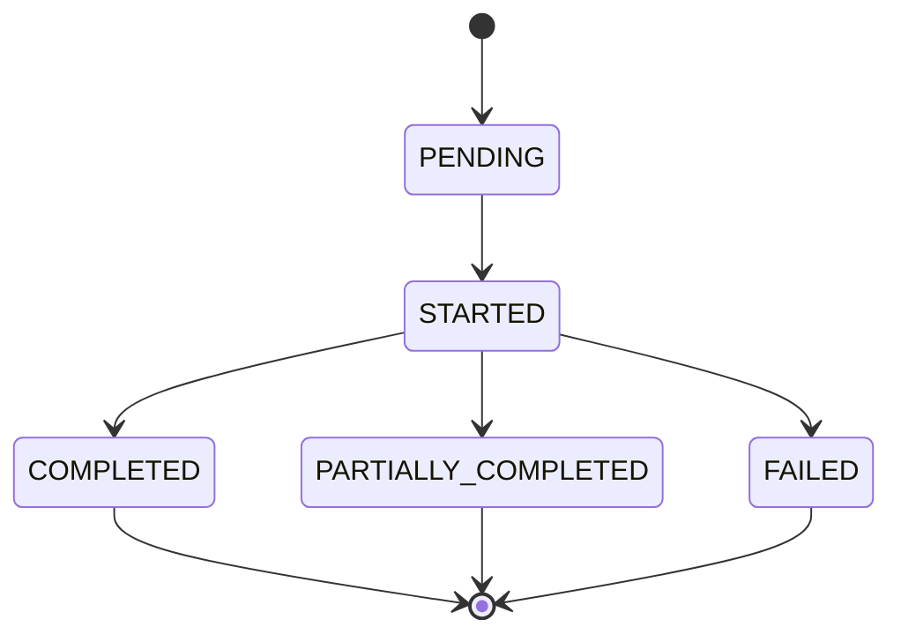

# AWS Elastic Disaster Recovery (DRS) - Service Limits and Capabilities Research

## Executive Summary

Comprehensive analysis of AWS DRS service capabilities, limitations, quotas, and operational constraints to inform UI design rules and API restrictions for the orchestration solution.

## Service Quotas and Limits

> **Last Validated**: December 10, 2025 against AWS Service Quotas API

### Account-Level Limits

| Resource | Current Limit | Adjustable | Quota Code | Notes |
|----------|---------------|------------|------------|-------|
| **Source servers per account** | 4,000 | Yes | L-E28BE5E0 | Adjustable via Service Quotas |
| **Replicating source servers** | 300 | **No (Hard Limit)** | L-C1D14A2B | **Cannot be increased - critical constraint** |
| **Max source servers in all Jobs** | 500 | No | L-05AFA8C6 | Total servers across all active jobs |
| **Concurrent jobs (total)** | 20 | No | L-D88FAC3A | Combined recovery + drill jobs |
| **Max source servers per job** | 100 | No | L-B827C881 | Hard limit per single job |
| **Max concurrent jobs per server** | 1 | No | L-DD6D028C | Server can only be in one job at a time |
| **Max launch actions per resource** | 200 | No | L-0588D03B | Post-launch automation actions |
| **Max launch config templates** | 1 | No | L-1F3FAE4D | Per source server |
| **Max source networks per account** | 100 | Yes | L-4B0323BD | Network configurations |
| **Snapshots per source server** | 1,024 | No | N/A | Point-in-time recovery snapshots |

**Critical Note**: The 300 replicating source servers limit is a **hard limit** that cannot be increased. This is the most important constraint for capacity planning.

### Regional Limits

| Resource | Current Limit | Adjustable | Notes |
|----------|---------------|------------|-------|
| **Source servers per region** | 4,000 | Yes | Same as account limit |
| **Replicating source servers per region** | 300 | **No (Hard Limit)** | Critical constraint |
| **Staging area subnets** | 1 per AZ | No | DRS creates automatically |
| **Replication settings templates** | 100 | Yes | Per region |

### Job-Level Constraints

| Constraint | Limit | Impact on Orchestration |
|------------|-------|------------------------|
| **Max servers per recovery job** | 100 | Wave size must be ≤ 100 servers |
| **Max servers per drill job** | 100 | Drill wave size must be ≤ 100 servers |
| **Max source servers in all Jobs** | 500 | Total servers across all concurrent jobs |
| **Job timeout** | 24 hours | Jobs auto-fail after 24h |
| **Concurrent jobs per account** | 20 | Combined recovery + drill jobs (not split) |

## DRS Job States and Transitions

### Job Status Lifecycle



### Server Launch Status within Jobs

| Status | Description | Orchestration Action |
|--------|-------------|---------------------|
| `PENDING` | Server queued for launch | Continue polling |
| `IN_PROGRESS` | Launch in progress | Continue polling |
| `LAUNCHED` | Successfully launched | Mark wave complete |
| `FAILED` | Launch failed | Handle error, may retry |
| `STOPPED` | Launch stopped/cancelled | Handle cancellation |
| `PENDING_LAUNCH` | Waiting for launch trigger | Should not occur in API usage |

### Critical Job Constraints

1. **No Job Modification**: Once started, jobs cannot be modified (servers cannot be added/removed)
2. **No Job Pause**: Jobs cannot be paused - they run to completion or failure
3. **No Partial Cancellation**: Cannot cancel individual servers within a job
4. **Job Cleanup**: Failed jobs may leave resources that need manual cleanup

## DRS UI Capabilities vs API Capabilities

### DRS Console UI Capabilities

| Feature | UI Support | API Support | Orchestration Impact |
|---------|------------|-------------|---------------------|
| **Single server recovery** | ✅ Yes | ✅ Yes | Basic building block |
| **Multi-server recovery** | ✅ Yes (up to 100) | ✅ Yes | Wave execution |
| **Drill execution** | ✅ Yes | ✅ Yes | Testing capability |
| **Point-in-time recovery** | ✅ Yes | ✅ Yes | Snapshot selection |
| **Launch template editing** | ✅ Yes | ✅ Yes | Instance customization |
| **Tag management** | ✅ Yes | ✅ Yes | Metadata management |
| **Job monitoring** | ✅ Yes | ✅ Yes | Progress tracking |
| **Job cancellation** | ✅ Yes | ✅ Yes | Emergency stop |
| **Bulk operations** | ❌ Limited | ✅ Yes | API advantage |
| **Automation/scripting** | ❌ No | ✅ Yes | API only |
| **Cross-account operations** | ❌ Manual | ✅ Yes (with roles) | API advantage |

### DRS Console UI Limitations

1. **No Bulk Server Management**: Cannot select and operate on multiple servers efficiently
2. **No Orchestration**: No wave-based or dependency-driven recovery
3. **No Automation**: All operations require manual clicks
4. **Limited Filtering**: Basic search and filter capabilities
5. **No Custom Workflows**: Cannot define multi-step recovery procedures
6. **No Integration**: Cannot integrate with external systems or notifications

## API-Specific Constraints and Considerations

### StartRecovery API Constraints

```json
{
  "sourceServers": [
    {"sourceServerID": "s-1234567890abcdef0"}
  ],
  "isDrill": false,
  "tags": {
    "key": "value"
  }
}
```

**Critical Constraints**:
- **Max 100 servers per call**
- **Tags parameter can cause conversion phase to be skipped** (avoid in production)
- **No job modification after start**
- **Returns single job ID for all servers**

### DescribeJobs API Constraints

```json
{
  "filters": {
    "jobIDs": ["job-1234567890abcdef0"],
    "fromDate": "2025-01-15T00:00:00Z",
    "toDate": "2025-01-15T23:59:59Z"
  },
  "maxResults": 200
}
```

**Constraints**:
- **Max 200 jobs per call**
- **Date range limited to 90 days**
- **Job history retention: 90 days**

### DescribeSourceServers API Constraints

```json
{
  "filters": {
    "sourceServerIDs": ["s-1234567890abcdef0"],
    "isArchived": false
  },
  "maxResults": 200
}
```

**Constraints**:
- **Max 200 servers per call**
- **Pagination required for large server counts**
- **Archived servers excluded by default**

## Replication and Data Protection Constraints

### Replication Requirements

| Requirement | Constraint | UI Design Impact |
|-------------|------------|------------------|
| **Minimum replication time** | 15 minutes | Cannot recover immediately after setup |
| **Initial sync duration** | Hours to days | Progress indication needed |
| **Continuous replication** | Must be healthy | Health checks required |
| **Network bandwidth** | Varies by data change rate | Performance considerations |

### Point-in-Time Recovery

| Feature | Constraint | Orchestration Impact |
|---------|------------|---------------------|
| **Snapshot frequency** | Every 10 minutes | Recovery granularity |
| **Snapshot retention** | 1,024 snapshots | ~7 days of history |
| **Cross-region snapshots** | Not supported | Regional recovery only |
| **Snapshot selection** | Manual or latest | UI selection required |

## Network and Security Constraints

### Staging Area Requirements

| Component | Constraint | Impact |
|-----------|------------|--------|
| **Staging subnet** | 1 per AZ, auto-created | Cannot customize |
| **Security groups** | DRS-managed | Limited customization |
| **Internet access** | Required for replication | Network design constraint |
| **Bandwidth** | Shared across servers | Performance impact |

### Launch Template Constraints

| Setting | Constraint | UI Validation Needed |
|---------|------------|---------------------|
| **Instance type** | Must be available in target AZ | Availability check |
| **AMI** | Must be accessible | Permission check |
| **Key pair** | Must exist in target region | Existence validation |
| **Security groups** | Must exist in target VPC | Validation required |
| **Subnets** | Must be in target VPC | Network validation |

## Cost and Billing Constraints

### DRS Pricing Model

| Component | Pricing | Orchestration Impact |
|-----------|---------|---------------------|
| **Replication servers** | $0.028/hour per server | Continuous cost |
| **EBS snapshots** | $0.05/GB-month | Storage cost |
| **Data transfer** | Standard AWS rates | Network cost |
| **Recovery instances** | Standard EC2 pricing | Runtime cost |
| **Drill instances** | Standard EC2 pricing | Testing cost |

### Cost Optimization Constraints

1. **Drill Cleanup**: Must terminate drill instances to avoid charges
2. **Snapshot Management**: Old snapshots auto-deleted, cannot extend retention
3. **Replication Efficiency**: Cannot pause replication without losing protection
4. **Instance Right-Sizing**: DRS can auto-adjust instance types

## AWS DRS Best Practices and Operational Recommendations

### Multi-Account Architecture Recommendations

#### AWS Hard Limit: 300 Replicating Source Servers

The 300 replicating source servers limit is a **hard limit** that cannot be increased via Service Quotas. This is the most critical constraint for capacity planning:

#### Why Multi-Account Architecture

| Factor | Single Account (at 300 limit) | Multi-Account (≤300 per account) |
|--------|------------------------------|----------------------------------|
| **Replicating Servers** | Hard limit of 300 | 300 per account, scales horizontally |
| **API Rate Limiting** | Shared across all servers | Distributed across accounts |
| **Replication Bandwidth** | Contention for staging area resources | Isolated bandwidth per account |
| **Job Concurrency** | 20 jobs shared across all servers | 20 jobs per account |
| **Management Complexity** | High - single point of failure | Distributed - isolated failures |
| **Cost Allocation** | Difficult to separate by business unit | Clear separation by account |

#### Operational Benefits of Multi-Account

1. **Blast Radius Reduction**: Issues in one account don't affect others
2. **Independent Scaling**: Each account can scale independently
3. **Simplified Billing**: Clear cost separation by business unit/application
4. **Parallel Operations**: Multiple teams can operate independently
5. **Regional Distribution**: Different accounts for different regions

#### When to Use Multi-Account Architecture

| Scenario | Recommendation | Rationale |
|----------|----------------|----------|
| **< 100 servers** | Single account | Simple management, low complexity |
| **100-250 servers** | Single account (monitor capacity) | Acceptable with good monitoring |
| **250-300 servers** | Plan for multi-account | Approaching hard limit |
| **300+ servers** | **Multi-account required** | Hard limit of 300 replicating servers |
| **Multiple business units** | Multi-account | Clear ownership and billing |
| **Multiple regions** | Multi-account per region | Simplified regional management |
| **Compliance requirements** | Multi-account | Isolation for regulatory compliance |

## UI Design Rules and Restrictions

### Account Capacity Warnings

```typescript
// Account capacity validation
const ACCOUNT_CAPACITY_LIMITS = {
  HARD_MAX_REPLICATING_SERVERS: 300,  // Hard limit - cannot be increased
  SOFT_MAX_SOURCE_SERVERS: 4000,      // Adjustable service quota
  WARNING_THRESHOLD: 250,              // Show multi-account warning
  CRITICAL_THRESHOLD: 280              // Block new servers, recommend new account
};

function validateAccountCapacity(currentReplicatingCount: number): ValidationResult {
  if (currentReplicatingCount >= ACCOUNT_CAPACITY_LIMITS.HARD_MAX_REPLICATING_SERVERS) {
    return {
      valid: false,
      level: 'error',
      message: `Account has ${currentReplicatingCount} replicating servers. Hard limit of 300 reached.`,
      recommendation: 'Create additional AWS accounts for new servers - this limit cannot be increased'
    };
  }
  
  if (currentReplicatingCount >= ACCOUNT_CAPACITY_LIMITS.CRITICAL_THRESHOLD) {
    return {
      valid: true,
      level: 'warning',
      message: `Account approaching 300 replicating server hard limit (${currentReplicatingCount}/300).`,
      recommendation: 'Plan for additional AWS accounts - limit cannot be increased'
    };
  }
  
  if (currentReplicatingCount >= ACCOUNT_CAPACITY_LIMITS.WARNING_THRESHOLD) {
    return {
      valid: true,
      level: 'info', 
      message: `Account at ${currentReplicatingCount}/300 replicating servers. Consider multi-account architecture.`,
      recommendation: 'Plan for additional AWS accounts'
    };
  }
  
  return { valid: true };
}
```


```typescript
// UI Validation Rules
const WAVE_SIZE_LIMITS = {
  MAX_SERVERS_PER_WAVE: 100,
  MAX_CONCURRENT_WAVES: 10, // Based on job limits
  MAX_TOTAL_SERVERS: 1000   // Account limit
};

function validateWaveSize(servers: string[]): ValidationResult {
  if (servers.length > WAVE_SIZE_LIMITS.MAX_SERVERS_PER_WAVE) {
    return {
      valid: false,
      error: `Wave cannot exceed ${WAVE_SIZE_LIMITS.MAX_SERVERS_PER_WAVE} servers`
    };
  }
  return { valid: true };
}
```

### Concurrent Execution Restrictions

```typescript
// Execution Limits
const EXECUTION_LIMITS = {
  MAX_CONCURRENT_JOBS: 20,           // Total concurrent jobs (recovery + drill combined)
  MAX_SERVERS_IN_ALL_JOBS: 500,      // Total servers across all active jobs
  MAX_SERVERS_PER_JOB: 100           // Per individual job
};

function validateConcurrentExecutions(
  activeJobs: number,
  serversInActiveJobs: number,
  newJobServerCount: number
): ValidationResult {
  if (activeJobs >= EXECUTION_LIMITS.MAX_CONCURRENT_JOBS) {
    return {
      valid: false,
      error: 'Maximum concurrent jobs (20) reached'
    };
  }
  
  const totalServersAfterNewJob = serversInActiveJobs + newJobServerCount;
  if (totalServersAfterNewJob > EXECUTION_LIMITS.MAX_SERVERS_IN_ALL_JOBS) {
    return {
      valid: false,
      error: `Would exceed max servers in all jobs (${totalServersAfterNewJob}/${EXECUTION_LIMITS.MAX_SERVERS_IN_ALL_JOBS})`
    };
  }
  
  if (newJobServerCount > EXECUTION_LIMITS.MAX_SERVERS_PER_JOB) {
    return {
      valid: false,
      error: `Job exceeds max servers per job (${newJobServerCount}/${EXECUTION_LIMITS.MAX_SERVERS_PER_JOB})`
    };
  }
  
  return { valid: true };
}
```

### Server State Restrictions

```typescript
// Server State Validation
const VALID_REPLICATION_STATES = [
  'CONTINUOUS_REPLICATION',
  'INITIAL_SYNC',
  'RESCAN'
];

const INVALID_REPLICATION_STATES = [
  'DISCONNECTED',
  'STOPPED',
  'STALLED',
  'NOT_STARTED'
];

function validateServerForRecovery(server: DRSSourceServer): ValidationResult {
  if (INVALID_REPLICATION_STATES.includes(server.dataReplicationState)) {
    return {
      valid: false,
      error: `Server ${server.sourceServerID} is in ${server.dataReplicationState} state`
    };
  }
  
  if (server.lifeCycle.state === 'STOPPED') {
    return {
      valid: false,
      error: `Server ${server.sourceServerID} lifecycle is stopped`
    };
  }
  
  return { valid: true };
}
```

### Recovery Plan Validation Rules

```typescript
// Recovery Plan Constraints
const PLAN_LIMITS = {
  MAX_WAVES: 50,           // Reasonable UI limit
  MAX_SERVERS_TOTAL: 1000, // Account limit
  MAX_WAVE_DEPENDENCIES: 10 // Prevent complex dependency chains
};

function validateRecoveryPlan(plan: RecoveryPlan): ValidationResult[] {
  const errors: ValidationResult[] = [];
  
  // Validate wave count
  if (plan.waves.length > PLAN_LIMITS.MAX_WAVES) {
    errors.push({
      valid: false,
      error: `Plan cannot exceed ${PLAN_LIMITS.MAX_WAVES} waves`
    });
  }
  
  // Validate total server count
  const totalServers = plan.waves.reduce((sum, wave) => sum + wave.serverIds.length, 0);
  if (totalServers > PLAN_LIMITS.MAX_SERVERS_TOTAL) {
    errors.push({
      valid: false,
      error: `Plan cannot exceed ${PLAN_LIMITS.MAX_SERVERS_TOTAL} total servers`
    });
  }
  
  // Validate wave dependencies
  plan.waves.forEach(wave => {
    if (wave.dependsOn && wave.dependsOn.length > PLAN_LIMITS.MAX_WAVE_DEPENDENCIES) {
      errors.push({
        valid: false,
        error: `Wave ${wave.waveNumber} has too many dependencies`
      });
    }
  });
  
  return errors;
}
```

## API Rate Limiting and Throttling

### DRS API Rate Limits

| API Call | Rate Limit | Burst Limit | Orchestration Impact |
|----------|------------|-------------|---------------------|
| `StartRecovery` | 10/minute | 20 | Limit wave start frequency |
| `DescribeJobs` | 100/minute | 200 | Polling frequency constraint |
| `DescribeSourceServers` | 100/minute | 200 | Server discovery rate |
| `UpdateLaunchConfiguration` | 50/minute | 100 | Configuration update rate |
| `TerminateRecoveryInstances` | 20/minute | 40 | Cleanup rate limit |

### Recommended API Usage Patterns

```typescript
// Rate-Limited API Client
class DRSApiClient {
  private rateLimiter = new RateLimiter({
    startRecovery: { rate: 8, burst: 15 },      // Stay under 10/min limit
    describeJobs: { rate: 80, burst: 150 },     // Stay under 100/min limit
    describeSourceServers: { rate: 80, burst: 150 }
  });
  
  async startRecovery(request: StartRecoveryRequest): Promise<StartRecoveryResponse> {
    await this.rateLimiter.acquire('startRecovery');
    return this.drsClient.startRecovery(request);
  }
  
  async describeJobs(request: DescribeJobsRequest): Promise<DescribeJobsResponse> {
    await this.rateLimiter.acquire('describeJobs');
    return this.drsClient.describeJobs(request);
  }
}
```

## Error Handling and Recovery Scenarios

### Common DRS API Errors

| Error Code | Cause | UI Handling | Recovery Action |
|------------|-------|-------------|-----------------|
| `ThrottlingException` | Rate limit exceeded | Show retry message | Exponential backoff |
| `ValidationException` | Invalid parameters | Show validation error | Fix parameters |
| `ResourceNotFoundException` | Server not found | Show error message | Refresh server list |
| `ConflictException` | Server already in use | Show conflict message | Wait or cancel |
| `ServiceQuotaExceededException` | Quota exceeded | Show quota error | Request increase |
| `InternalServerError` | AWS service issue | Show retry message | Retry with backoff |

### Recovery Scenarios

```typescript
// Error Recovery Patterns
class ExecutionErrorHandler {
  async handleJobFailure(jobId: string, error: DRSError): Promise<RecoveryAction> {
    switch (error.code) {
      case 'ThrottlingException':
        return {
          action: 'RETRY',
          delay: this.calculateBackoff(error.retryAfter),
          message: 'Rate limit exceeded, retrying...'
        };
        
      case 'ConflictException':
        return {
          action: 'WAIT',
          delay: 60000, // 1 minute
          message: 'Server busy, waiting for availability...'
        };
        
      case 'ServiceQuotaExceededException':
        return {
          action: 'FAIL',
          message: 'Account quota exceeded. Contact AWS support to increase limits.'
        };
        
      default:
        return {
          action: 'RETRY',
          delay: 30000, // 30 seconds
          maxRetries: 3,
          message: 'Temporary error, retrying...'
        };
    }
  }
}
```

## Monitoring and Observability Constraints

### CloudWatch Metrics Available

| Metric | Dimension | Use Case |
|--------|-----------|----------|
| `JobsInProgress` | Account | Monitor concurrent jobs |
| `JobsCompleted` | Account, JobType | Track success rate |
| `JobsFailed` | Account, JobType | Monitor failure rate |
| `ReplicationLag` | SourceServerID | Monitor replication health |
| `DataReplicationState` | SourceServerID | Track server state |

### Logging Limitations

1. **DRS Service Logs**: Not directly accessible, only through CloudTrail
2. **Job Logs**: Limited detail in API responses
3. **Server Logs**: Available through EC2 after launch
4. **Custom Logging**: Must implement in orchestration layer

## Regional Availability and Constraints

### DRS Supported Regions (December 2025)

> **Last Verified**: December 2025 from [AWS DRS Endpoints and Quotas](https://docs.aws.amazon.com/general/latest/gr/drs.html)

AWS DRS is available in **28 commercial regions** plus 2 GovCloud regions:

| Region | Code | FIPS Endpoint |
|--------|------|---------------|
| **Americas (6 regions)** | | |
| US East (N. Virginia) | us-east-1 | ✅ Yes |
| US East (Ohio) | us-east-2 | ✅ Yes |
| US West (Oregon) | us-west-2 | ✅ Yes |
| US West (N. California) | us-west-1 | ✅ Yes |
| Canada (Central) | ca-central-1 | No |
| South America (São Paulo) | sa-east-1 | No |
| **Europe (8 regions)** | | |
| Europe (Ireland) | eu-west-1 | No |
| Europe (London) | eu-west-2 | No |
| Europe (Frankfurt) | eu-central-1 | No |
| Europe (Paris) | eu-west-3 | No |
| Europe (Stockholm) | eu-north-1 | No |
| Europe (Milan) | eu-south-1 | No |
| Europe (Spain) | eu-south-2 | No |
| Europe (Zurich) | eu-central-2 | No |
| **Asia Pacific (10 regions)** | | |
| Asia Pacific (Tokyo) | ap-northeast-1 | No |
| Asia Pacific (Seoul) | ap-northeast-2 | No |
| Asia Pacific (Osaka) | ap-northeast-3 | No |
| Asia Pacific (Singapore) | ap-southeast-1 | No |
| Asia Pacific (Sydney) | ap-southeast-2 | No |
| Asia Pacific (Mumbai) | ap-south-1 | No |
| Asia Pacific (Hyderabad) | ap-south-2 | No |
| Asia Pacific (Jakarta) | ap-southeast-3 | No |
| Asia Pacific (Melbourne) | ap-southeast-4 | No |
| Asia Pacific (Hong Kong) | ap-east-1 | No |
| **Middle East & Africa (4 regions)** | | |
| Middle East (Bahrain) | me-south-1 | No |
| Middle East (UAE) | me-central-1 | No |
| Africa (Cape Town) | af-south-1 | No |
| Israel (Tel Aviv) | il-central-1 | No |
| **GovCloud (2 regions)** | | |
| AWS GovCloud (US-East) | us-gov-east-1 | ✅ Yes |
| AWS GovCloud (US-West) | us-gov-west-1 | ✅ Yes |

> **Note**: Canada West (Calgary) `ca-west-1` is NOT currently listed in AWS DRS endpoints.

### Cross-Region Constraints

1. **No Cross-Region Replication**: Source and target must be in same region
2. **No Cross-Region Recovery**: Cannot recover to different region
3. **Regional Isolation**: Each region operates independently
4. **Launch Template Limitations**: Cannot use launch templates across regions

## Recommended UI Design Patterns

### 1. Progressive Disclosure

```typescript
// Show limits contextually
const WaveConfigurationPanel = () => {
  return (
    <div>
      <FormField
        label="Servers in Wave"
        description={`Maximum ${WAVE_SIZE_LIMITS.MAX_SERVERS_PER_WAVE} servers per wave`}
        errorText={serverCount > WAVE_SIZE_LIMITS.MAX_SERVERS_PER_WAVE ? 
          'Too many servers selected' : undefined}
      >
        <ServerSelector maxSelection={WAVE_SIZE_LIMITS.MAX_SERVERS_PER_WAVE} />
      </FormField>
    </div>
  );
};
```

### 2. Real-Time Validation

```typescript
// Validate as user types/selects
const useWaveValidation = (wave: Wave) => {
  return useMemo(() => {
    const errors = [];
    
    if (wave.servers.length > WAVE_SIZE_LIMITS.MAX_SERVERS_PER_WAVE) {
      errors.push(`Wave exceeds maximum size of ${WAVE_SIZE_LIMITS.MAX_SERVERS_PER_WAVE} servers`);
    }
    
    wave.servers.forEach(server => {
      const validation = validateServerForRecovery(server);
      if (!validation.valid) {
        errors.push(validation.error);
      }
    });
    
    return errors;
  }, [wave]);
};
```

### 3. Quota Awareness

```typescript
// Show current usage vs limits
const QuotaIndicator = ({ current, limit, label }: QuotaProps) => {
  const percentage = (current / limit) * 100;
  const isNearLimit = percentage > 80;
  
  return (
    <div className={`quota-indicator ${isNearLimit ? 'warning' : ''}`}>
      <span>{label}: {current}/{limit}</span>
      <ProgressBar value={percentage} />
      {isNearLimit && (
        <Alert type="warning">
          Approaching {label} limit. Consider requesting quota increase.
        </Alert>
      )}
    </div>
  );
};
```

## Summary of Critical UI Rules

### Execution Rules

1. **Max 100 servers per wave** - Hard DRS limit per job
2. **Max 20 concurrent jobs** - Combined recovery + drill (not split)
3. **Max 500 servers in all jobs** - Total across all active jobs
4. **Validate server replication state** - Must be healthy
5. **Check account quotas** - Before starting executions

### Planning Rules
1. **Max 1,000 servers per account** - Service quota
2. **Validate circular dependencies** - Prevent infinite loops
3. **Check server availability** - Not in other executions
4. **Validate launch templates** - Must exist and be valid
5. **Regional constraints** - All servers must be in same region

### Account Capacity Rules

1. **300 replicating servers is a HARD LIMIT** - Cannot be increased
2. **Show warning at 250 replicating servers** - Plan for multi-account
3. **Block new servers at 280+ replicating servers** - Approaching hard limit
4. **4,000 source servers per account** - Adjustable service quota
5. **500 max servers in all jobs** - Adjustable service quota

### Operational Rules
1. **Rate limit API calls** - Respect service limits
2. **Implement exponential backoff** - For throttling errors
3. **Monitor job timeouts** - 24-hour limit
4. **Handle partial failures** - Some servers may fail
5. **Cleanup drill instances** - Prevent unnecessary charges
6. **Monitor account capacity** - Track server count vs 300 limit

## Key Findings Summary

### Critical Discovery: 300 Replicating Server Hard Limit

**Most Important Finding**: The **300 replicating source servers limit is a hard limit** that cannot be increased via Service Quotas. This is the most critical constraint for capacity planning.

**Verified AWS Service Quotas** (December 10, 2025):

| Quota | Value | Adjustable | Quota Code | Notes |
|-------|-------|------------|------------|-------|
| Source servers per account | 4,000 | ✅ Yes | L-E28BE5E0 | Can be increased |
| **Replicating source servers** | **300** | **❌ No** | **L-C1D14A2B** | **Hard limit - cannot be increased** |
| Concurrent jobs | 20 | ❌ No | L-D88FAC3A | Combined recovery + drill |
| Max servers in all jobs | 500 | ❌ No | L-05AFA8C6 | Total across active jobs |
| Max servers per job | 100 | ❌ No | L-B827C881 | Per individual job |
| Max concurrent jobs per server | 1 | ❌ No | L-DD6D028C | Server exclusivity |

**Why 300 Replicating Server Limit Matters**:

- This is a **hard limit** - cannot be increased via Service Quotas
- Applies to servers actively replicating data
- Forces multi-account architecture for larger deployments
- API rate limiting shared across all servers in account
- Replication bandwidth contention in staging areas

**UI Implementation Impact**:

- Must implement account capacity warnings at 250 replicating servers
- Should block new server additions at 280+ replicating servers
- Need multi-account guidance and migration planning
- Clearly distinguish between "source servers" (4,000) and "replicating servers" (300)

### Service Architecture Implications

1. **Current Solution Design**: Built for single-account usage (up to 300 replicating servers)
2. **Future Enhancement Required**: Multi-account support for enterprise scale beyond 300 servers
3. **UI Validation Critical**: Prevent users from hitting hard limits
4. **Migration Planning**: Help users transition to multi-account when approaching 300 limit

This research provides the foundation for implementing comprehensive validation, error handling, and user guidance in the orchestration UI, with particular emphasis on the critical 300 replicating server hard limit.