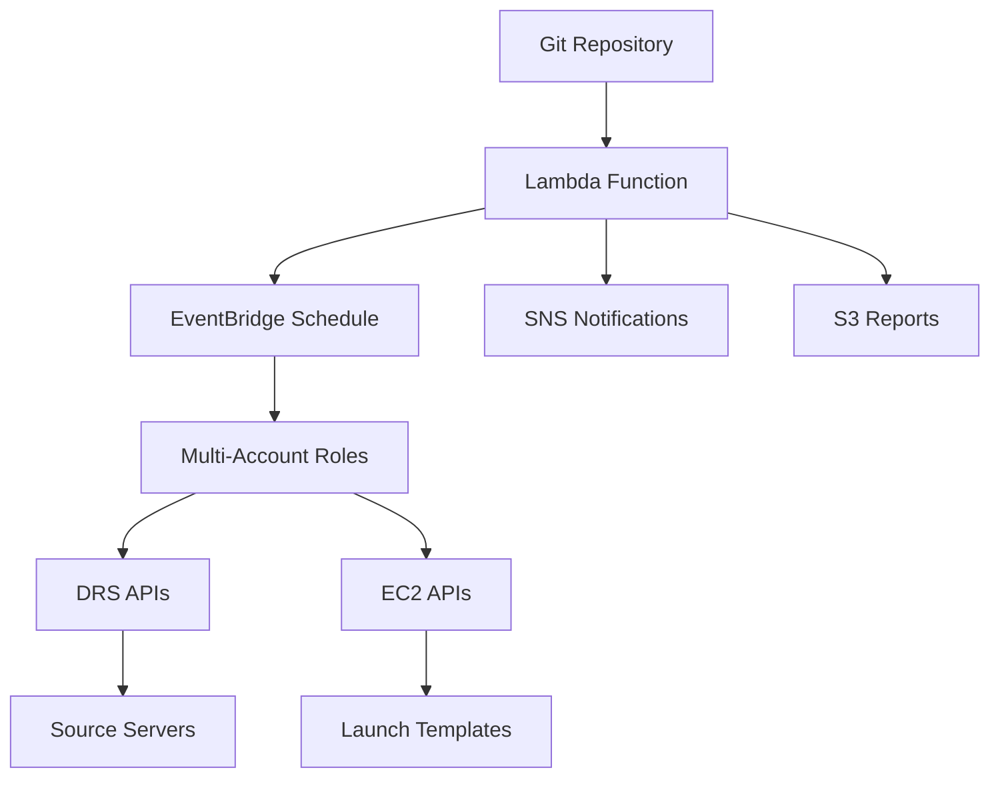

# AWS DRS Configuration Synchronizer Analysis

## Overview

Analysis of the official AWS sample tool: [drs-configuration-synchronizer](https://github.com/aws-samples/drs-tools/tree/main/drs-configuration-synchronizer)

This tool demonstrates AWS's enterprise approach for managing DRS configurations at scale using Infrastructure as Code principles.

## Key Findings

### What AWS Officially Supports for Launch Template Editing

The Configuration Synchronizer explicitly lists **allowed** and **ignored** EC2 launch template settings:

#### ✅ Allowed EC2 Launch Template Settings (AWS Supported)
| Setting | Description | Use Case |
|---------|-------------|----------|
| **IamInstanceProfile** | Instance IAM role | Application permissions |
| **InstanceType** | EC2 instance type | Performance/cost optimization |
| **Monitoring** | CloudWatch detailed monitoring | Observability |
| **DisableApiTermination** | Termination protection | Production safety |
| **InstanceInitiatedShutdownBehavior** | Shutdown behavior | Instance lifecycle |
| **TagSpecifications** | Instance and volume tags | Organization/billing |
| **CreditSpecification** | T-series CPU credits | Burstable performance |
| **CpuOptions** | CPU configuration | Performance tuning |
| **CapacityReservationSpecification** | Reserved capacity | Cost optimization |
| **LicenseSpecifications** | License tracking | Compliance |
| **MetadataOptions** | Instance metadata settings | Security hardening |
| **PrivateDnsNameOptions** | DNS configuration | Networking |
| **MaintenanceOptions** | Maintenance settings | Availability |
| **DisableApiStop** | Stop protection | Production safety |
| **SecurityGroupIds** | Security groups | Network security |
| **NetworkInterfaces** | Network configuration | Advanced networking |

#### ❌ Ignored EC2 Launch Template Settings (AWS Managed)
| Setting | Reason AWS Ignores |
|---------|-------------------|
| **BlockDeviceMappings** | DRS manages disk mappings from source |
| **EbsOptimized** | DRS determines based on instance type |
| **ElasticGpuSpecifications** | Not applicable to recovery |
| **ElasticInferenceAccelerators** | Not applicable to recovery |
| **EnclaveOptions** | Security feature not for recovery |
| **HibernationOptions** | Not applicable to recovery |
| **ImageId** | DRS creates recovery-specific AMIs |
| **InstanceRequirements** | DRS handles instance selection |
| **KernelId** | Part of AMI managed by DRS |
| **KeyName** | Handled separately by DRS |
| **RamDiskId** | Part of AMI managed by DRS |
| **SecurityGroups** | Use SecurityGroupIds instead |
| **UserData** | DRS may inject recovery scripts |

## DRS Configuration Management Approach

### 1. Infrastructure as Code (IaC) Model
- Configuration stored in source control (Git)
- YAML-based configuration files
- Tag-based overrides for specific servers
- Automated synchronization via Lambda

### 2. Configuration Hierarchy
```
1. Global defaults (defaults.yml)
2. Account-specific defaults (defaults_for_account_123456789012.yml)
3. Tag-based overrides (override_for_tag__Environment__Production.yml)
```

### 3. Multi-Account Support
- Central synchronizer assumes roles in target accounts
- Per-account configuration customization
- Cross-account IAM role deployment

## Configuration Categories

### Launch Configuration Settings (DRS API)
**Allowed Settings:**
- `copyPrivateIp` - Copy source server private IP
- `copyTags` - Copy source server tags
- `launchDisposition` - STARTED/STOPPED after recovery
- `licensing.osByol` - Bring Your Own License
- `targetInstanceTypeRightSizingMethod` - Instance type selection

### Replication Configuration Settings (DRS API)
**Allowed Settings:**
- `associateDefaultSecurityGroup` - Use default security group
- `bandwidthThrottling` - Replication bandwidth limit
- `createPublicIP` - Public IP for replication server
- `dataPlaneRouting` - PRIVATE_IP/PUBLIC_IP routing
- `defaultLargeStagingDiskType` - Staging disk type (GP3, etc.)
- `ebsEncryption` - Encryption settings
- `replicationServerInstanceType` - Replication server type
- `stagingAreaSubnetId` - Replication subnet
- `useDedicatedReplicationServer` - Dedicated vs shared

**Ignored Settings:**
- `PitPolicy` - Point-in-time policy (managed elsewhere)

## Advanced Features

### 1. Automatic Subnet Assignment
- Matches source server IP to target subnet CIDR
- Requires VPC and subnet tagged with `drstarget=true`
- Handles IP address preservation for on-premises migrations

### 2. Tag-Based Configuration
- Server tags drive configuration overrides
- CSV-based tag mapping (`server-tag-mapping.csv`)
- Flexible tag-based rules

### 3. Configuration Exclusions
- Per-server feature exclusions (`config-sync-exclusions.csv`)
- Dry-run capability
- Selective feature disabling

### 4. Reporting and Monitoring
- SNS notifications for execution results
- S3-stored inventory reports
- CloudWatch logging integration

## Architecture



## Example Configuration Files

### Launch Configuration Defaults
```yaml
# drs-launch-configurations/defaults.yml
copyPrivateIp: true
copyTags: true
launchDisposition: STARTED
licensing:
  osByol: true
targetInstanceTypeRightSizingMethod: BASIC
```

### Launch Template Defaults
```yaml
# ec2-launch-templates/defaults.yml
MetadataOptions:
  HttpEndpoint: enabled
  HttpTokens: required
  InstanceMetadataTags: enabled
Monitoring:
  Enabled: true
IamInstanceProfile:
  Name: "MyRecoveryRole"
```

### Tag-Based Override
```yaml
# ec2-launch-templates/override_for_tag__Environment__Production.yml
InstanceType: m5.large
DisableApiTermination: true
Monitoring:
  Enabled: true
```

## Key Insights for DRS Orchestration

### 1. AWS Validates Enterprise Configuration Management
This tool proves AWS expects customers to:
- Manage DRS configurations as code
- Apply configurations at scale across multiple servers
- Use tag-based configuration overrides
- Integrate with CI/CD pipelines

### 2. Clear Separation of Concerns
- **DRS manages**: AMI, block devices, user data, core networking
- **Customers manage**: Instance types, IAM roles, security groups, monitoring, tags

### 3. Tag-Driven Architecture
- Tags are the primary mechanism for configuration differentiation
- Supports complex enterprise tagging strategies
- Enables automated configuration application

### 4. Multi-Account Enterprise Pattern
- Central management with distributed execution
- Cross-account IAM role assumptions
- Account-specific configuration overrides

## Implementation Recommendations

Based on this analysis, our DRS Orchestration solution should:

### 1. Support Direct Launch Template Editing
- Focus on the **allowed** settings from AWS's official list
- Provide warnings for **ignored** settings
- Enable bulk operations across multiple servers

### 2. Implement Tag-Based Configuration
- Use tags to group servers for configuration management
- Support configuration templates based on tags
- Enable tag-based Protection Group definitions

### 3. Provide Configuration Validation
- Validate against AWS's allowed/ignored lists
- Warn users about settings DRS will ignore
- Provide configuration drift detection

### 4. Enterprise Features
- Multi-account support for large organizations
- Configuration as code export/import
- Audit trails for configuration changes

## Conclusion

The AWS DRS Configuration Synchronizer validates that:

1. **Launch template editing is officially supported** and expected
2. **Specific settings are safe to edit** (comprehensive allow list provided)
3. **Tag-based configuration management** is the recommended pattern
4. **Enterprise-scale automation** is a core use case
5. **Multi-account architectures** are supported and expected

This analysis confirms our approach to enable launch template editing in the DRS Orchestration UI, focusing on the AWS-approved settings while warning about ignored fields.