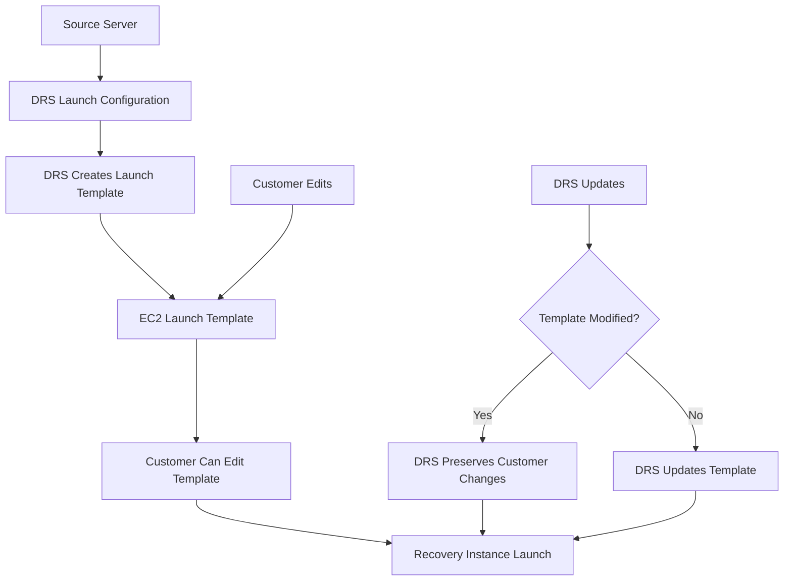

# AWS DRS Launch Template Settings Research

## Overview

AWS DRS uses EC2 Launch Templates to define how recovery instances are launched. This document analyzes which settings DRS supports for modification and which should not be edited.

## DRS Launch Configuration vs EC2 Launch Template

DRS provides two levels of launch configuration:

1. **DRS Launch Configuration** - High-level settings managed by DRS API
2. **EC2 Launch Template** - Low-level EC2 settings (can be edited by customers)

**Important**: AWS DRS creates launch templates that customers can modify directly in the EC2 console. DRS will not override customer changes to launch templates.

## DRS Launch Configuration Settings (Safe to Edit)

These settings are managed through DRS APIs and are safe to modify:

### Basic Settings
| Setting | API Field | Values | Description |
|---------|-----------|---------|-------------|
| **Launch Disposition** | `launchDisposition` | `STOPPED`, `STARTED` | Whether instance starts automatically after recovery |
| **Copy Private IP** | `copyPrivateIp` | `true`, `false` | Copy source server's private IP to recovery instance |
| **Copy Tags** | `copyTags` | `true`, `false` | Copy source server tags to recovery instance |
| **Configuration Name** | `name` | String (0-128 chars) | Human-readable name for the configuration |

### Instance Type Settings
| Setting | API Field | Values | Description |
|---------|-----------|---------|-------------|
| **Right Sizing Method** | `targetInstanceTypeRightSizingMethod` | `NONE`, `BASIC`, `IN_AWS` | How DRS selects instance type |

- `NONE`: Use exact instance type from source
- `BASIC`: DRS recommends based on CPU/RAM
- `IN_AWS`: AWS recommends optimal instance type

### Licensing Settings
| Setting | API Field | Values | Description |
|---------|-----------|---------|-------------|
| **BYOL (Bring Your Own License)** | `licensing.osByol` | `true`, `false` | Use existing OS license vs AWS-provided |

### Post-Launch Actions
| Setting | API Field | Values | Description |
|---------|-----------|---------|-------------|
| **Post-Launch Enabled** | `postLaunchEnabled` | `true`, `false` | Execute post-launch actions after recovery |

### Launch Into Existing Instance
| Setting | API Field | Values | Description |
|---------|-----------|---------|-------------|
| **Launch Into Instance ID** | `launchIntoInstanceProperties.launchIntoEC2InstanceID` | EC2 Instance ID | Launch into existing instance instead of creating new |

## EC2 Launch Template Settings (Customer Editable)

AWS DRS creates launch templates that customers can modify. DRS will **NOT** override customer changes.

### Safe to Edit in Launch Template
| Setting | Description | Notes |
|---------|-------------|-------|
| **Instance Type** | EC2 instance type for recovery | Override DRS right-sizing recommendations |
| **Key Pair (KeyName)** | SSH key pair for access | Essential for server access after recovery |
| **Security Groups** | Additional security groups | Add application-specific security groups |
| **IAM Instance Profile** | Instance role for recovery instance | Add roles for application requirements |
| **Subnet ID** | Target subnet for recovery | Change recovery subnet if needed |
| **Tags (TagSpecifications)** | Additional instance tags | Add custom tags for organization |
| **Monitoring** | Detailed monitoring settings | Enable CloudWatch detailed monitoring |
| **Tenancy** | Instance tenancy (default/dedicated) | Change for compliance requirements |
| **Placement Group** | EC2 placement group | Specify for performance optimization |
| **Credit Specification** | T-series CPU credits | Configure burstable performance |
| **Elastic GPU** | GPU specifications | Add GPU for compute workloads |
| **Elastic Inference** | ML inference acceleration | Add for ML workloads |

### Settings to Avoid Editing
| Setting | Reason | Risk Level |
|---------|--------|------------|
| **AMI ID (ImageId)** | DRS creates AMIs from source server snapshots | ❌ Critical - Recovery will fail |
| **Block Device Mappings** | DRS maps source server disks with specific snapshots | ❌ Critical - Data corruption/loss |
| **User Data (if DRS-generated)** | DRS may inject recovery scripts | ⚠️ High - May break recovery process |
| **Network Interfaces (primary)** | DRS configures primary network interface | ⚠️ Medium - May break connectivity |
| **Instance Metadata Options** | DRS may require specific metadata settings | ⚠️ Medium - May break DRS agent |

### Best Practices for Launch Template Editing
| Practice | Description |
|----------|-------------|
| **Test First** | Always test changes in drill mode |
| **Document Changes** | Keep record of all modifications |
| **Backup Template** | Create template versions before changes |
| **Monitor Recovery** | Watch DRS job logs after changes |

## DRS Launch Template Workflow



## Best Practices

### ✅ Safe Practices
1. **Edit launch templates directly** in EC2 console
2. **Test in drill mode** before production recovery
3. **Create template versions** before making changes
4. **Document all modifications** for team reference

### ❌ Avoid These Practices
1. **Never edit AMI ID** - DRS manages recovery snapshots
2. **Don't modify block device mappings** - Risk of data loss
3. **Don't change primary network interface** - May break connectivity

### ✅ Most Common Customer Edits
1. **Add SSH key pairs** - Essential for server access after recovery
2. **Add security groups** - Application-specific firewall rules
3. **Change instance types** - Performance or cost optimization
4. **Add IAM roles** - Application permissions and AWS service access
5. **Change subnets** - Recovery in different availability zones
6. **Add custom tags** - Cost allocation and organization
7. **Enable detailed monitoring** - Enhanced CloudWatch metrics

## Configuration Hierarchy

```
DRS Launch Configuration (High Level)
├── Launch Disposition (STARTED/STOPPED)
├── Right Sizing Method (NONE/BASIC/IN_AWS)
├── Copy Settings (IP, Tags)
├── Licensing (BYOL)
└── Post-Launch Actions

EC2 Launch Template (Low Level - DRS Managed)
├── AMI ID (DRS Generated)
├── Instance Type (DRS Calculated)
├── Security Groups (DRS Required)
├── Subnet (DRS Managed)
├── User Data (DRS Scripts)
└── Block Devices (DRS Mapped)
```

## API Examples

### Safe Configuration Changes (DRS API)
```python
# Update launch configuration via DRS API
drs_client.update_launch_configuration(
    sourceServerID='s-1234567890abcdef0',
    launchDisposition='STARTED',
    targetInstanceTypeRightSizingMethod='BASIC',
    copyPrivateIp=False,
    copyTags=True,
    postLaunchEnabled=True,
    licensing={'osByol': False}
)
```

### Safe Direct Launch Template Edit
```python
# SAFE - Direct EC2 launch template modification
ec2_client.modify_launch_template(
    LaunchTemplateId='lt-1234567890abcdef0',
    LaunchTemplateData={
        'InstanceType': 'm5.large',           # ✅ SAFE - Override instance type
        'KeyName': 'my-key-pair',             # ✅ SAFE - Add SSH access
        'SecurityGroupIds': ['sg-123', 'sg-456'],  # ✅ SAFE - Add security groups
        'IamInstanceProfile': {'Name': 'MyRole'},  # ✅ SAFE - Add IAM role
        'TagSpecifications': [{
            'ResourceType': 'instance',
            'Tags': [{'Key': 'Environment', 'Value': 'Production'}]
        }]  # ✅ SAFE - Add custom tags
    }
)
```

## Troubleshooting Launch Template Issues

### Common Problems
| Problem | Cause | Solution |
|---------|-------|----------|
| Recovery fails with "Invalid AMI" | Manual AMI change | Let DRS manage AMI selection |
| Instance launches but agent fails | Modified user data | Restore DRS user data scripts |
| Network connectivity issues | Changed security groups | Restore DRS security groups |
| Wrong instance type launched | Right-sizing conflict | Check DRS right-sizing settings |

### Validation Commands
```bash
# Check DRS launch configuration
aws drs get-launch-configuration --source-server-id s-1234567890abcdef0

# Check EC2 launch template (referenced by DRS)
aws ec2 describe-launch-template-versions --launch-template-id lt-1234567890abcdef0

# Validate launch template doesn't conflict with DRS
aws drs describe-jobs --filters jobIDs=drsjob-1234567890abcdef0
```

## Summary

### Critical - Never Edit These
- **AMI ID (ImageId)** - DRS creates recovery-specific AMIs
- **Block Device Mappings** - DRS maps source server disks with snapshots

### High Risk - Edit with Caution
- **User Data** - May contain DRS recovery scripts
- **Primary Network Interface** - DRS configures networking
- **Instance Metadata Options** - May affect DRS agent

### Safe to Edit (Common Customer Changes)
- **Instance Type** - Performance/cost optimization
- **Key Pair** - SSH access after recovery
- **Security Groups** - Application firewall rules
- **IAM Instance Profile** - Application permissions
- **Subnet ID** - Recovery location
- **Tags** - Organization and cost allocation
- **Monitoring** - CloudWatch settings
- **Tenancy/Placement** - Performance optimization

### DRS Configuration Settings (Edit via DRS API)
- Launch disposition (started/stopped)
- Instance type right-sizing method
- Copy private IP/tags from source
- Licensing (BYOL)
- Post-launch actions

**Key Principle**: DRS preserves customer launch template edits. Most settings are safe to modify, but never change AMI ID or block device mappings as these are critical for recovery functionality.