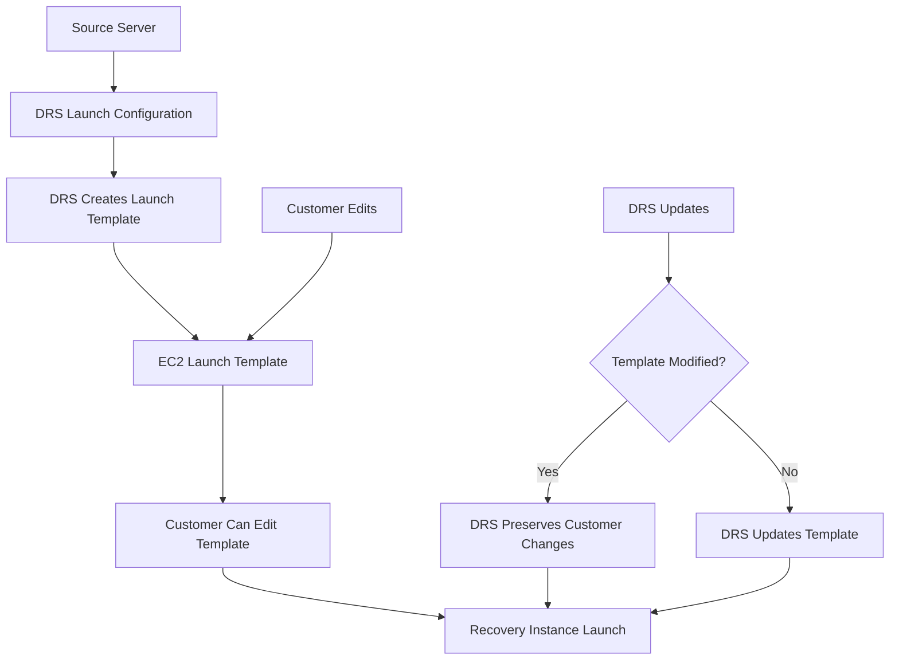

# AWS DRS Launch Template Settings Research

## Overview

AWS DRS uses EC2 Launch Templates to define how recovery instances are launched. This document analyzes which settings DRS supports for modification and which should not be edited.

## DRS Launch Configuration vs EC2 Launch Template

DRS provides two levels of launch configuration:

1. **DRS Launch Configuration** - High-level settings managed by DRS API
2. **EC2 Launch Template** - Low-level EC2 settings (can be edited by customers)

**Important**: AWS DRS creates launch templates that customers can modify directly in the EC2 console. DRS will not override customer changes to launch templates.

## DRS Launch Configuration Settings (Safe to Edit)

These settings are managed through DRS APIs and are safe to modify:

### Basic Settings
| Setting | API Field | Values | Description |
|---------|-----------|---------|-------------|
| **Launch Disposition** | `launchDisposition` | `STOPPED`, `STARTED` | Whether instance starts automatically after recovery |
| **Copy Private IP** | `copyPrivateIp` | `true`, `false` | Copy source server's private IP to recovery instance |
| **Copy Tags** | `copyTags` | `true`, `false` | Copy source server tags to recovery instance |
| **Configuration Name** | `name` | String (0-128 chars) | Human-readable name for the configuration |

### Instance Type Settings
| Setting | API Field | Values | Description |
|---------|-----------|---------|-------------|
| **Right Sizing Method** | `targetInstanceTypeRightSizingMethod` | `NONE`, `BASIC`, `IN_AWS` | How DRS selects instance type |

- `NONE`: Use exact instance type from source
- `BASIC`: DRS recommends based on CPU/RAM
- `IN_AWS`: AWS recommends optimal instance type

### Licensing Settings
| Setting | API Field | Values | Description |
|---------|-----------|---------|-------------|
| **BYOL (Bring Your Own License)** | `licensing.osByol` | `true`, `false` | Use existing OS license vs AWS-provided |

### Post-Launch Actions
| Setting | API Field | Values | Description |
|---------|-----------|---------|-------------|
| **Post-Launch Enabled** | `postLaunchEnabled` | `true`, `false` | Execute post-launch actions after recovery |

### Launch Into Existing Instance
| Setting | API Field | Values | Description |
|---------|-----------|---------|-------------|
| **Launch Into Instance ID** | `launchIntoInstanceProperties.launchIntoEC2InstanceID` | EC2 Instance ID | Launch into existing instance instead of creating new |

## EC2 Launch Template Settings (Customer Editable)

AWS DRS creates launch templates that customers can modify. DRS will **NOT** override customer changes.

### Safe to Edit in Launch Template
| Setting | Description | Notes |
|---------|-------------|-------|
| **Instance Type** | EC2 instance type for recovery | Can override DRS right-sizing |
| **Key Pair** | SSH key pair for access | Add your own key pair |
| **Security Groups** | Additional security groups | Can add more SGs beyond DRS defaults |
| **IAM Instance Profile** | Instance role for recovery instance | Can add additional permissions |
| **User Data** | Additional boot scripts | Can append to DRS user data |
| **Tags** | Additional instance tags | Can add custom tags |
| **Monitoring** | Detailed monitoring settings | Safe to enable/disable |
| **Tenancy** | Instance tenancy (default/dedicated) | Can change if needed |
| **Placement Group** | EC2 placement group | Can specify for performance |

### Settings to Avoid Editing
| Setting | Reason | Risk Level |
|---------|--------|------------|
| **AMI ID** | DRS manages recovery snapshots | ❌ High - Will break recovery |
| **Block Device Mappings** | DRS maps source server disks | ❌ High - Data loss risk |
| **Network Interfaces** | DRS manages primary network config | ⚠️ Medium - May break connectivity |

### Best Practices for Launch Template Editing
| Practice | Description |
|----------|-------------|
| **Test First** | Always test changes in drill mode |
| **Document Changes** | Keep record of all modifications |
| **Backup Template** | Create template versions before changes |
| **Monitor Recovery** | Watch DRS job logs after changes |

## DRS Launch Template Workflow



## Best Practices

### ✅ Safe Practices
1. **Edit launch templates directly** in EC2 console
2. **Test in drill mode** before production recovery
3. **Create template versions** before making changes
4. **Document all modifications** for team reference

### ❌ Avoid These Practices
1. **Never edit AMI ID** - DRS manages recovery snapshots
2. **Don't modify block device mappings** - Risk of data loss
3. **Don't change primary network interface** - May break connectivity

### ✅ Recommended Edits
1. **Add SSH key pairs** for server access
2. **Add security groups** for application requirements
3. **Change instance types** for performance needs
4. **Add IAM roles** for application permissions
5. **Add custom tags** for organization

## Configuration Hierarchy

```
DRS Launch Configuration (High Level)
├── Launch Disposition (STARTED/STOPPED)
├── Right Sizing Method (NONE/BASIC/IN_AWS)
├── Copy Settings (IP, Tags)
├── Licensing (BYOL)
└── Post-Launch Actions

EC2 Launch Template (Low Level - DRS Managed)
├── AMI ID (DRS Generated)
├── Instance Type (DRS Calculated)
├── Security Groups (DRS Required)
├── Subnet (DRS Managed)
├── User Data (DRS Scripts)
└── Block Devices (DRS Mapped)
```

## API Examples

### Safe Configuration Changes (DRS API)
```python
# Update launch configuration via DRS API
drs_client.update_launch_configuration(
    sourceServerID='s-1234567890abcdef0',
    launchDisposition='STARTED',
    targetInstanceTypeRightSizingMethod='BASIC',
    copyPrivateIp=False,
    copyTags=True,
    postLaunchEnabled=True,
    licensing={'osByol': False}
)
```

### Safe Direct Launch Template Edit
```python
# SAFE - Direct EC2 launch template modification
ec2_client.modify_launch_template(
    LaunchTemplateId='lt-1234567890abcdef0',
    LaunchTemplateData={
        'InstanceType': 'm5.large',           # ✅ SAFE - Override instance type
        'KeyName': 'my-key-pair',             # ✅ SAFE - Add SSH access
        'SecurityGroupIds': ['sg-123', 'sg-456'],  # ✅ SAFE - Add security groups
        'IamInstanceProfile': {'Name': 'MyRole'},  # ✅ SAFE - Add IAM role
        'TagSpecifications': [{
            'ResourceType': 'instance',
            'Tags': [{'Key': 'Environment', 'Value': 'Production'}]
        }]  # ✅ SAFE - Add custom tags
    }
)
```

## Troubleshooting Launch Template Issues

### Common Problems
| Problem | Cause | Solution |
|---------|-------|----------|
| Recovery fails with "Invalid AMI" | Manual AMI change | Let DRS manage AMI selection |
| Instance launches but agent fails | Modified user data | Restore DRS user data scripts |
| Network connectivity issues | Changed security groups | Restore DRS security groups |
| Wrong instance type launched | Right-sizing conflict | Check DRS right-sizing settings |

### Validation Commands
```bash
# Check DRS launch configuration
aws drs get-launch-configuration --source-server-id s-1234567890abcdef0

# Check EC2 launch template (referenced by DRS)
aws ec2 describe-launch-template-versions --launch-template-id lt-1234567890abcdef0

# Validate launch template doesn't conflict with DRS
aws drs describe-jobs --filters jobIDs=drsjob-1234567890abcdef0
```

## Summary

### DRS-Managed Settings (Never Edit Manually)
- AMI ID
- Block device mappings  
- User data scripts
- Core security groups
- Network interfaces
- Instance metadata options

### DRS Configuration Settings (Edit via DRS API)
- Launch disposition (started/stopped)
- Instance type right-sizing
- Copy private IP/tags
- Licensing (BYOL)
- Post-launch actions
- Launch into existing instance

### EC2 Settings (Use with Extreme Caution)
- Additional security groups (add only)
- Additional tags
- Monitoring settings
- Placement groups (may conflict)

**Key Principle**: AWS DRS allows and preserves customer launch template modifications. Edit templates directly in EC2 console, but avoid changing AMI ID and block device mappings.