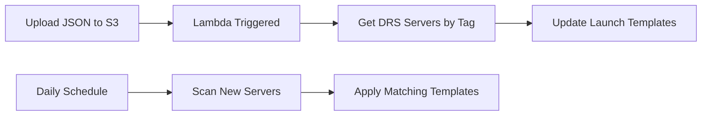

# AWS DRS Template Manager Analysis

## Overview

Analysis of the official AWS sample tool: [drs-template-manager](https://github.com/aws-samples/drs-tools/tree/main/drs-template-manager)

This tool demonstrates AWS's recommended approach for batch editing DRS launch templates.

## Key Findings

### What AWS Officially Supports Editing

Based on the AWS sample tool, these launch template fields are **officially supported** for customer modification:

#### Safe to Edit (Per AWS Sample)
| Field | Example Value | Purpose |
|-------|---------------|---------|
| **InstanceType** | `"t3.small"` | Override DRS instance type recommendations |
| **KeyName** | `"my-keypair"` | Add SSH key for server access |
| **SecurityGroupIds** | `["sg-123", "sg-456"]` | Add application security groups |
| **IamInstanceProfile.Name** | `"MyCustomRole"` | Add application IAM permissions |
| **TagSpecifications** | Custom tags | Organization and cost allocation |
| **EbsOptimized** | `true/false` | EBS optimization setting |
| **Monitoring** | `{"Enabled": true}` | CloudWatch detailed monitoring |
| **BlockDeviceMappings.VolumeType** | `"gp3"`, `"io1"` | Change EBS volume types |
| **BlockDeviceMappings.VolumeSize** | `100` | Increase volume sizes |
| **BlockDeviceMappings.Iops** | `3000` | Set IOPS for io1/io2 volumes |
| **NetworkInterfaces.SubnetId** | `"subnet-123"` | Change recovery subnet |

#### Fields AWS Sets to null (DRS Manages)
| Field | Value in Sample | Reason |
|-------|-----------------|--------|
| **ImageId** | `null` | DRS creates recovery AMIs |
| **UserData** | `null` | DRS may inject recovery scripts |
| **NetworkInterfaces.Groups** | `null` | DRS manages primary security groups |
| **NetworkInterfaces.PrivateIpAddress** | `null` | DRS manages IP assignment |

## AWS Sample Template Structure

The sample template shows AWS's recommended approach:

```json
{
  "InstanceType": "t3.small",
  "KeyName": null,
  "ImageId": null,
  "IamInstanceProfile": {
    "Name": "AWSElasticDisasterRecoveryRecoveryInstanceRole"
  },
  "BlockDeviceMappings": [
    {
      "DeviceName": "/dev/xvda",
      "Ebs": {
        "VolumeSize": 8,
        "VolumeType": "io1",
        "Iops": 400
      }
    }
  ],
  "TagSpecifications": [
    {
      "ResourceType": "instance",
      "Tags": [
        {
          "Key": "AWSElasticDisasterRecoverySourceServerID",
          "Value": "s-xxxxxxxxxxxxxxxxx"
        },
        {
          "Key": "Name",
          "Value": "YourServerNameHere"
        }
      ]
    }
  ]
}
```

## Tool Architecture

### Components
1. **S3 Bucket** - Stores JSON launch templates
2. **set-drs-templates Lambda** - Updates templates when JSON uploaded
3. **schedule-drs-templates Lambda** - Daily scan for new servers
4. **EventBridge Rule** - Triggers scheduled updates

### Workflow


## Required IAM Permissions

The tool requires these specific permissions:
- `s3:PutObject`, `s3:GetObject`, `s3:ListBucket`
- `drs:DescribeSourceServers`, `drs:GetLaunchConfiguration`
- `ec2:ModifyLaunchTemplate`, `ec2:CreateLaunchTemplateVersion`

## Key Insights

### 1. AWS Officially Supports Direct Template Editing
The existence of this tool proves AWS expects customers to modify launch templates directly.

### 2. Tag-Based Template Management
- Templates are applied based on DRS source server tags
- One template per server (1:1 relationship)
- Template filename prefix matches tag value

### 3. Batch Operations
- Tool enables bulk template updates across multiple servers
- Automated application to new servers via scheduling

### 4. Version Management
- Creates new launch template versions (doesn't overwrite)
- Sets new version as default for the template

## What This Means for DRS Orchestration

### Confirmed Safe Edits
Based on AWS's official sample:
- ✅ Instance types, key pairs, security groups
- ✅ IAM roles, tags, monitoring settings
- ✅ EBS volume types, sizes, IOPS
- ✅ Subnet placement

### Confirmed DRS-Managed (Don't Edit)
- ❌ AMI ID (ImageId) - Always null in sample
- ❌ User Data - Always null in sample
- ❌ Primary network interface settings

### Best Practices from AWS Sample
1. **Use tags** to organize template application
2. **Version templates** rather than overwriting
3. **Automate** template application for new servers
4. **Test** template changes in drill mode first

## Implementation for DRS Orchestration

This analysis confirms our approach should:

1. **Enable direct launch template editing** in the UI
2. **Focus on commonly edited fields**: instance type, keys, security groups, IAM roles
3. **Avoid editing**: AMI ID, user data, primary network settings
4. **Use tag-based organization** for template management
5. **Support bulk operations** across multiple servers

The AWS sample validates that customers routinely edit launch templates and AWS provides tooling to support this workflow.