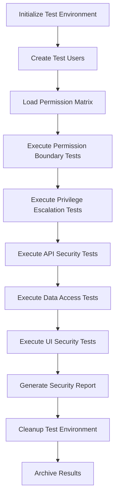

# RBAC Security Testing Plan - AWS DRS Orchestration Solution

## Executive Summary

This document outlines a comprehensive security testing plan for the Role-Based Access Control (RBAC) system implemented in the AWS DRS Orchestration Solution. The plan includes automated security tests, permission boundary validation, and detailed reporting for AWS security teams.

## Security Testing Objectives

### Primary Goals
1. **Permission Boundary Validation**: Ensure users cannot exceed their assigned role permissions
2. **Privilege Escalation Prevention**: Verify no paths exist for users to gain unauthorized access
3. **Cross-Account Security**: Validate cross-account operations respect permission boundaries
4. **API Security**: Ensure all API endpoints properly enforce RBAC controls
5. **UI Security**: Verify frontend components respect backend permission decisions
6. **Data Access Control**: Confirm users can only access authorized data

### Compliance Requirements
- **AWS Security Standards**: Align with AWS internal security requirements
- **Least Privilege Principle**: Validate minimal necessary permissions
- **Defense in Depth**: Multi-layer security validation
- **Audit Trail**: Complete logging of all security test activities

## RBAC Role Definitions

### Role Hierarchy
```
Super Admin (aws:admin)
├── Admin (aws:admin-limited)
│   ├── Power User (aws:power-user)
│   └── Operator (aws:operator)
└── Read-Only User (aws:read-only)
```

### Permission Matrix

| Resource/Action | Super Admin | Admin | Power User | Operator | Read-Only |
|----------------|-------------|-------|------------|----------|-----------|
| **User Management** |
| Create Users | ✅ | ✅ | ❌ | ❌ | ❌ |
| Delete Users | ✅ | ✅ | ❌ | ❌ | ❌ |
| Modify User Roles | ✅ | ✅ | ❌ | ❌ | ❌ |
| View Users | ✅ | ✅ | ✅ | ✅ | ✅ |
| **Account Management** |
| Register Accounts | ✅ | ✅ | ✅ | ❌ | ❌ |
| Delete Accounts | ✅ | ✅ | ❌ | ❌ | ❌ |
| Modify Accounts | ✅ | ✅ | ✅ | ❌ | ❌ |
| View Accounts | ✅ | ✅ | ✅ | ✅ | ✅ |
| **DRS Operations** |
| Start Recovery | ✅ | ✅ | ✅ | ✅ | ❌ |
| Stop Recovery | ✅ | ✅ | ✅ | ✅ | ❌ |
| Terminate Instances | ✅ | ✅ | ✅ | ❌ | ❌ |
| View Executions | ✅ | ✅ | ✅ | ✅ | ✅ |
| **Protection Groups** |
| Create Groups | ✅ | ✅ | ✅ | ✅ | ❌ |
| Delete Groups | ✅ | ✅ | ✅ | ❌ | ❌ |
| Modify Groups | ✅ | ✅ | ✅ | ✅ | ❌ |
| View Groups | ✅ | ✅ | ✅ | ✅ | ✅ |
| **Recovery Plans** |
| Create Plans | ✅ | ✅ | ✅ | ✅ | ❌ |
| Delete Plans | ✅ | ✅ | ✅ | ❌ | ❌ |
| Modify Plans | ✅ | ✅ | ✅ | ✅ | ❌ |
| View Plans | ✅ | ✅ | ✅ | ✅ | ✅ |

## Automated Security Testing Framework

### Test Categories

#### 1. Permission Boundary Tests
**Objective**: Verify users cannot perform actions outside their role permissions

**Test Cases**:
- **PBT-001**: Read-only user attempts to create protection group
- **PBT-002**: Operator attempts to delete user account
- **PBT-003**: Power user attempts to modify user roles
- **PBT-004**: Admin attempts super admin actions
- **PBT-005**: Cross-role resource access attempts

#### 2. Privilege Escalation Tests
**Objective**: Ensure no paths exist for unauthorized privilege escalation

**Test Cases**:
- **PET-001**: Modify own user role through API manipulation
- **PET-002**: Access admin endpoints through parameter tampering
- **PET-003**: JWT token manipulation for role elevation
- **PET-004**: Session hijacking and role impersonation
- **PET-005**: Cross-account role assumption without proper permissions

#### 3. API Security Tests
**Objective**: Validate all API endpoints enforce RBAC correctly

**Test Cases**:
- **AST-001**: Direct API calls bypassing frontend validation
- **AST-002**: Malformed requests with elevated permissions
- **AST-003**: Concurrent requests with different permission levels
- **AST-004**: API endpoint enumeration and unauthorized access
- **AST-005**: Cross-origin requests with elevated privileges

#### 4. Data Access Control Tests
**Objective**: Ensure users only access authorized data

**Test Cases**:
- **DAC-001**: Cross-account data access without proper roles
- **DAC-002**: Historical execution data access by unauthorized users
- **DAC-003**: User management data access by non-admin users
- **DAC-004**: Account configuration access by read-only users
- **DAC-005**: Sensitive data exposure in API responses

#### 5. UI Security Tests
**Objective**: Verify frontend respects backend permission decisions

**Test Cases**:
- **UIS-001**: Hidden UI elements accessible through DOM manipulation
- **UIS-002**: Client-side permission bypass attempts
- **UIS-003**: Browser developer tools permission manipulation
- **UIS-004**: Cached permission data exploitation
- **UIS-005**: Frontend routing bypass for restricted pages

## Test Implementation

### Automated Test Suite Structure

```
tests/security/
├── rbac_security_tests.py          # Main test orchestrator
├── permission_boundary_tests.py    # Permission validation tests
├── privilege_escalation_tests.py   # Escalation prevention tests
├── api_security_tests.py           # API endpoint security tests
├── data_access_tests.py            # Data access control tests
├── ui_security_tests.py            # Frontend security tests
├── test_users/                     # Test user configurations
│   ├── super_admin_user.json
│   ├── admin_user.json
│   ├── power_user.json
│   ├── operator_user.json
│   └── readonly_user.json
├── test_scenarios/                 # Security test scenarios
│   ├── permission_matrix.json
│   ├── escalation_vectors.json
│   └── attack_patterns.json
└── reports/                        # Generated security reports
    ├── security_test_report.html
    ├── vulnerability_summary.json
    └── compliance_matrix.csv
```

### Test User Management

**Automated Test User Creation**:
```python
# Create isolated test users for each role
test_users = {
    'super_admin': create_test_user('test-super-admin', 'aws:admin'),
    'admin': create_test_user('test-admin', 'aws:admin-limited'),
    'power_user': create_test_user('test-power-user', 'aws:power-user'),
    'operator': create_test_user('test-operator', 'aws:operator'),
    'readonly': create_test_user('test-readonly', 'aws:read-only')
}
```

**Test Isolation**:
- Each test runs with fresh authentication tokens
- Test data is isolated per test run
- Cleanup procedures ensure no test artifacts remain

### Security Test Execution Flow



## Security Test Scenarios

### Scenario 1: Cross-Role Permission Violation
**Description**: Test user with Operator role attempts Admin actions
**Steps**:
1. Authenticate as Operator user
2. Attempt to create new user account
3. Attempt to delete existing user
4. Attempt to modify user roles
5. Verify all attempts are blocked with proper error codes

**Expected Results**:
- All unauthorized actions return 403 Forbidden
- No partial data exposure in error messages
- Audit logs capture all unauthorized attempts

### Scenario 2: JWT Token Manipulation
**Description**: Attempt to modify JWT token claims for privilege escalation
**Steps**:
1. Authenticate as Read-only user
2. Capture JWT token
3. Attempt to modify role claims in token
4. Use modified token for Admin actions
5. Verify token validation prevents escalation

**Expected Results**:
- Modified tokens are rejected
- No successful privilege escalation
- Security events logged

### Scenario 3: Cross-Account Data Access
**Description**: Test unauthorized cross-account data access
**Steps**:
1. Register multiple test accounts
2. Create users with account-specific permissions
3. Attempt cross-account data access
4. Verify proper isolation

**Expected Results**:
- Users only access authorized account data
- Cross-account attempts are blocked
- Proper error handling without data leakage

### Scenario 4: API Parameter Tampering
**Description**: Attempt to bypass permissions through parameter manipulation
**Steps**:
1. Authenticate with limited permissions
2. Intercept API requests
3. Modify parameters to access restricted resources
4. Verify server-side validation

**Expected Results**:
- Server validates all parameters
- Unauthorized access attempts fail
- No sensitive data exposure

## Security Report Generation

### Report Components

#### 1. Executive Summary
- Overall security posture assessment
- Critical findings summary
- Compliance status overview
- Recommended actions

#### 2. Detailed Test Results
- Test case execution results
- Permission matrix validation
- Failed security controls
- Vulnerability classifications

#### 3. Risk Assessment
- Risk severity ratings (Critical, High, Medium, Low)
- Business impact analysis
- Exploitability assessment
- Remediation priority matrix

#### 4. Compliance Matrix
- AWS security standard alignment
- Regulatory compliance status
- Control effectiveness ratings
- Gap analysis

#### 5. Technical Findings
- Detailed vulnerability descriptions
- Proof-of-concept demonstrations
- Code references and line numbers
- Recommended fixes with code examples

### Report Formats

#### HTML Dashboard Report
- Interactive security dashboard
- Drill-down capability for detailed findings
- Visual risk heat maps
- Trend analysis charts

#### JSON Machine-Readable Report
- Structured data for security tools integration
- API-friendly format for automated processing
- Standardized vulnerability schema
- Metrics and KPIs

#### CSV Compliance Matrix
- Tabular format for compliance tracking
- Control mapping to requirements
- Status tracking for remediation
- Audit trail documentation

## Continuous Security Testing

### Automated Test Execution
- **Daily**: Permission boundary validation
- **Weekly**: Full security test suite
- **Monthly**: Comprehensive penetration testing
- **On-Demand**: Pre-deployment security validation

### Integration Points
- **CI/CD Pipeline**: Security tests in deployment pipeline
- **Monitoring**: Real-time permission violation detection
- **Alerting**: Immediate notification of security failures
- **Reporting**: Automated report distribution to security teams

### Test Data Management
- **Synthetic Data**: Use non-production test data
- **Data Masking**: Protect sensitive information in tests
- **Cleanup**: Automated test data removal
- **Isolation**: Separate test and production environments

## Implementation Timeline

### Phase 1: Foundation (Week 1-2)
- [ ] Set up security testing framework
- [ ] Create test user management system
- [ ] Implement basic permission boundary tests
- [ ] Develop initial reporting capabilities

### Phase 2: Core Testing (Week 3-4)
- [ ] Implement privilege escalation tests
- [ ] Add API security validation
- [ ] Create data access control tests
- [ ] Develop UI security tests

### Phase 3: Advanced Testing (Week 5-6)
- [ ] Add cross-account security tests
- [ ] Implement attack simulation scenarios
- [ ] Create comprehensive reporting
- [ ] Add continuous testing automation

### Phase 4: Integration (Week 7-8)
- [ ] Integrate with CI/CD pipeline
- [ ] Set up monitoring and alerting
- [ ] Create security team dashboards
- [ ] Document procedures and runbooks

## Success Criteria

### Security Validation
- [ ] 100% of permission boundaries validated
- [ ] Zero successful privilege escalation attempts
- [ ] All API endpoints properly secured
- [ ] Complete data access control validation
- [ ] UI security controls verified

### Reporting Quality
- [ ] Comprehensive security report generated
- [ ] All findings properly classified and prioritized
- [ ] Clear remediation guidance provided
- [ ] Compliance status accurately reported
- [ ] Executive summary suitable for leadership review

### Automation Coverage
- [ ] Fully automated test execution
- [ ] No manual intervention required for standard tests
- [ ] Automated report generation and distribution
- [ ] Integration with existing security tools
- [ ] Continuous monitoring capabilities

## Risk Mitigation

### Test Environment Security
- **Isolation**: Complete separation from production
- **Access Control**: Restricted access to test environment
- **Data Protection**: No production data in tests
- **Monitoring**: Full audit logging of test activities

### False Positive Management
- **Validation**: Manual verification of critical findings
- **Context**: Proper risk assessment with business context
- **Prioritization**: Focus on exploitable vulnerabilities
- **Documentation**: Clear explanation of findings

### Remediation Support
- **Code Examples**: Specific fix recommendations
- **Testing**: Validation of remediation effectiveness
- **Documentation**: Updated security procedures
- **Training**: Security awareness for development team

This comprehensive security testing plan ensures thorough validation of the RBAC system while providing detailed reporting suitable for AWS security teams. The automated approach eliminates the need for manual intervention while maintaining high security standards.