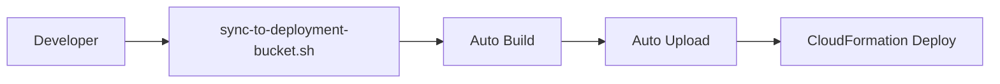

# CloudFormation Deployment Issues and Solutions

**Analysis Date:** December 8, 2025  
**Status:** Resolved with Automated Deployment Process  
**Current Solution:** `sync-to-deployment-bucket.sh` script

## Current Deployment Architecture

### Current Automated Process

**Deployment Script:** `./scripts/sync-to-deployment-bucket.sh`

```bash
# Automated deployment workflow
./scripts/sync-to-deployment-bucket.sh --build-frontend --deploy-cfn

# This automatically:
# 1. Builds frontend from current source
# 2. Packages Lambda functions with dependencies
# 3. Syncs all artifacts to S3
# 4. Deploys via CloudFormation
```

**CloudFormation Integration:**
```yaml
# All functions use single deployment package
ApiHandlerFunction:
  Code:
    S3Bucket: !Ref SourceBucket
    S3Key: 'lambda/deployment-package.zip'  # Contains all current code
```

### Current Solution Benefits

**Automated sync script provides:**
- ✅ Frontend build from current source (`npm run build`)
- ✅ Lambda packaging with current code
- ✅ Automatic artifact upload to S3
- ✅ CloudFormation deployment with latest artifacts
- ✅ Single command deployment

**Deploy from scratch workflow:**
```bash
# Complete deployment from current source
./scripts/sync-to-deployment-bucket.sh --build-frontend --deploy-cfn
```

## Current Deployment Flow

### Automated Deployment Process


**Benefits:**
- ✅ Single command deployment
- ✅ Always deploys current source
- ✅ Automatic build and packaging
- ✅ No manual steps required
- ✅ Fast deployment (~5-10 minutes)
- ✅ Consistent artifact generation

### Deployment Options Available

**Fast Lambda Updates:**
```bash
# Update Lambda code only (~5 seconds)
./scripts/sync-to-deployment-bucket.sh --update-lambda-code
```

**Full Stack Deployment:**
```bash
# Deploy all infrastructure (~5-10 minutes)
./scripts/sync-to-deployment-bucket.sh --deploy-cfn
```

**Frontend Only:**
```bash
# Build and deploy frontend only
./scripts/sync-to-deployment-bucket.sh --build-frontend --deploy-frontend
```

## Common Deployment Issues

### 1. Stale S3 Artifacts
**Problem:** CloudFormation uses old artifacts from S3

**Solution:** Always sync before deploying
```bash
# Ensure S3 has latest code
./scripts/sync-to-deployment-bucket.sh
# Then deploy
./scripts/sync-to-deployment-bucket.sh --deploy-cfn
```

### 2. Frontend Configuration Mismatch
**Problem:** Frontend can't connect to API after deployment

**Solution:** Use automated frontend build
```bash
# Build with correct configuration
./scripts/sync-to-deployment-bucket.sh --build-frontend --deploy-frontend
```

### 3. Lambda Function Not Updated
**Problem:** Code changes not reflected in deployed function

**Solution:** Use fast Lambda update
```bash
# Quick code update
./scripts/sync-to-deployment-bucket.sh --update-lambda-code
```

## Deployment Best Practices

### 1. Always Sync Before Deploy

**Recommended workflow:**
```bash
# Step 1: Sync all code to S3
./scripts/sync-to-deployment-bucket.sh

# Step 2: Deploy infrastructure
./scripts/sync-to-deployment-bucket.sh --deploy-cfn

# Step 3: Verify deployment
aws cloudformation describe-stacks --stack-name drs-orchestration-dev
```

### 2. Use Environment Files

**Frontend configuration:**
```bash
# Ensure .env.dev exists with correct API endpoints
cp .env.test.template .env.dev
# Edit .env.dev with your stack outputs
```

### 3. Verify Deployment Success

**Check deployment status:**
```bash
# Verify stack status
aws cloudformation describe-stacks \
  --stack-name drs-orchestration-dev \
  --query 'Stacks[0].StackStatus'

# Check S3 artifacts are current
aws s3 ls s3://aws-drs-orchestration/lambda/ --region us-east-1

# Test API endpoint
API_ENDPOINT=$(aws cloudformation describe-stacks \
  --stack-name drs-orchestration-dev \
  --query 'Stacks[0].Outputs[?OutputKey==`ApiEndpoint`].OutputValue' \
  --output text)

curl "$API_ENDPOINT/protection-groups" -H "Authorization: Bearer $TOKEN"
```

### 4. Troubleshooting Failed Deployments

**Common failure scenarios:**

| Error | Cause | Solution |
|-------|-------|----------|
| `No updates to be performed` | No changes detected | Verify S3 artifacts are updated |
| `Template validation error` | Invalid CloudFormation | Run `make validate` before deploy |
| `Insufficient permissions` | IAM role lacks permissions | Check deployment role permissions |
| `Resource already exists` | Stack name conflict | Use unique stack name or delete existing |

## Quick Deployment Commands

**Most common deployment scenarios:**

```bash
# Complete deployment from scratch
./scripts/sync-to-deployment-bucket.sh --build-frontend --deploy-cfn

# Update only Lambda code (fastest)
./scripts/sync-to-deployment-bucket.sh --update-lambda-code

# Update only frontend
./scripts/sync-to-deployment-bucket.sh --build-frontend --deploy-frontend

# Sync code without deploying
./scripts/sync-to-deployment-bucket.sh

# Preview changes (dry run)
./scripts/sync-to-deployment-bucket.sh --dry-run
```

## Advanced Deployment Options

**For enterprise environments:**

1. **GitLab CI/CD Integration** - Automated pipeline on git push
2. **Multiple Environment Support** - Dev, test, prod deployments
3. **Blue/Green Deployments** - Zero-downtime updates
4. **Rollback Capabilities** - Quick revert to previous version

**Environment-specific deployments:**
```bash
# Deploy to different environments
./scripts/sync-to-deployment-bucket.sh --profile dev-profile --deploy-cfn
./scripts/sync-to-deployment-bucket.sh --profile prod-profile --deploy-cfn
```

## Summary

**Current state:** Automated deployment process ensures CloudFormation always deploys current source code.

**Key benefits:**
- ✅ Single command deployment from source
- ✅ Automatic build and packaging
- ✅ Fast updates for development
- ✅ Reliable artifact management
- ✅ Multiple deployment options

**Best practice:** Always use `sync-to-deployment-bucket.sh` script for consistent, reliable deployments.