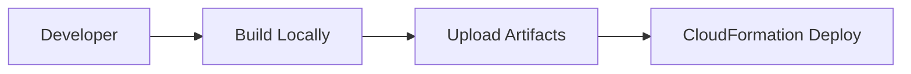
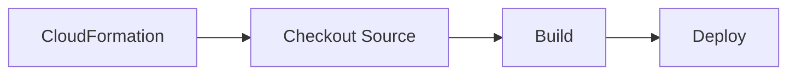
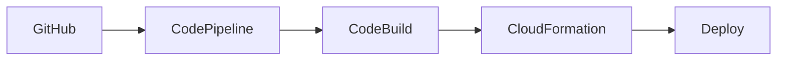

# CloudFormation Deployment Issues - Why "Deploy from Scratch" Doesn't Work

**Analysis Date:** December 7, 2025  
**Issue:** CloudFormation doesn't deploy current working code  

## Root Problem: Pre-built vs Source-based Deployment

### What CloudFormation Actually Does

**Frontend Deployment:**
```yaml
# frontend-stack.yaml
FrontendBuildResource:
  Type: Custom::FrontendBuild
  Properties:
    ServiceToken: !Ref FrontendBuilderFunctionArn  # Uses pre-built Lambda
```

**Backend Deployment:**
```yaml
# lambda-stack.yaml  
OrchestrationFunction:
  Code:
    S3Bucket: !Ref SourceBucket
    S3Key: 'lambda/orchestration.zip'  # Uses pre-built zip
```

### The Fundamental Issue

**CloudFormation expects pre-built artifacts:**
- ❌ Frontend: Uses `frontend/dist/` folder from Lambda package
- ❌ Backend: Uses `lambda/orchestration.zip` from S3
- ❌ No source code building during deployment

**What's missing for true "deploy from scratch":**
- ✅ Source code checkout from git
- ✅ Frontend build (`npm run build`)  
- ✅ Lambda packaging with current code
- ✅ Automatic artifact upload to S3

## Why This Architecture Was Chosen

### Pre-built Artifact Approach (Current)


**Pros:**
- Fast CloudFormation deployment (no build time)
- Predictable artifacts (what you build is what deploys)
- No build dependencies in AWS (no Node.js/npm in Lambda)

**Cons:**
- ❌ Manual build step required
- ❌ Not true "deploy from scratch"
- ❌ Easy to deploy wrong version
- ❌ Developer must remember to build/upload

### Source-based Approach (What You Want)


**Pros:**
- ✅ True "deploy from scratch" from git
- ✅ Always deploys current source
- ✅ No manual build steps

**Cons:**
- Slower deployment (build time)
- More complex (CodeBuild/CodePipeline required)
- Build dependencies in AWS

## Current Deployment Gaps

### 1. Frontend Deployment Gap
**Problem:** `build_and_deploy.py` uses pre-built `frontend/dist/` folder

```python
# lambda/build_and_deploy.py line 25
def use_prebuilt_dist(frontend_dir):
    """Use pre-built dist/ folder from Lambda package (no npm required)"""
    dist_dir = os.path.join(frontend_dir, 'dist')
    
    if not os.path.exists(dist_dir):
        raise Exception(f"Pre-built dist directory not found at {dist_dir}")
```

**Issue:** The Lambda package contains old `frontend/dist/` folder, not current enhanced UI

### 2. Backend Deployment Gap  
**Problem:** `orchestration.zip` contains placeholder, not working Step Functions code

```yaml
# cfn/lambda-stack.yaml
OrchestrationFunction:
  Handler: drs_orchestrator.lambda_handler  # Expects placeholder
  Code:
    S3Key: 'lambda/orchestration.zip'      # Contains old placeholder
```

**Issue:** S3 artifact is outdated, doesn't include your local fixes

## Solutions for True "Deploy from Scratch"

### Option 1: Fix Current Architecture (Minimal Changes)

**Update build process to use current source:**

1. **Frontend:** Modify `build_and_deploy.py` to build from source
```python
def build_frontend_from_source(frontend_dir):
    """Build frontend from source using npm"""
    subprocess.run(['npm', 'install'], cwd=frontend_dir, check=True)
    subprocess.run(['npm', 'run', 'build'], cwd=frontend_dir, check=True)
    return os.path.join(frontend_dir, 'dist')
```

2. **Backend:** Update packaging to include current code
```bash
# Update lambda/orchestration.zip with current drs_orchestrator.py
cd lambda
zip -r orchestration.zip drs_orchestrator.py requirements.txt
aws s3 cp orchestration.zip s3://your-bucket/lambda/
```

### Option 2: CodeBuild Integration (Proper Solution)

**Add CodeBuild project to CloudFormation:**

```yaml
# New: build-stack.yaml
CodeBuildProject:
  Type: AWS::CodeBuild::Project
  Properties:
    Source:
      Type: GITHUB
      Location: https://github.com/your-repo/AWS-DRS-Orchestration
    Environment:
      Type: LINUX_CONTAINER
      Image: aws/codebuild/amazonlinux2-x86_64-standard:3.0
    ServiceRole: !Ref CodeBuildRole
    Artifacts:
      Type: S3
      Location: !Sub '${ArtifactBucket}/builds'
```

**Build script:**
```yaml
# buildspec.yml
version: 0.2
phases:
  install:
    runtime-versions:
      nodejs: 18
      python: 3.12
  pre_build:
    commands:
      - cd frontend && npm install
  build:
    commands:
      - cd frontend && npm run build
      - cd ../lambda && zip -r orchestration.zip *.py requirements.txt
  post_build:
    commands:
      - aws s3 cp lambda/orchestration.zip s3://$ARTIFACT_BUCKET/lambda/
      - aws s3 sync frontend/dist/ s3://$FRONTEND_BUCKET/
```

### Option 3: CodePipeline (Enterprise Solution)

**Full CI/CD pipeline:**


## Immediate Fix for Your Situation

**Since you have working code locally, update the artifacts:**

```bash
# 1. Build current frontend
cd frontend
npm run build

# 2. Package current backend  
cd ../lambda
zip -r orchestration.zip drs_orchestrator.py requirements.txt

# 3. Upload to S3 (replace old artifacts)
aws s3 cp orchestration.zip s3://drs-orchestration-lambda-source-777788889999/lambda/

# 4. Update CloudFormation stack (will use new artifacts)
aws cloudformation update-stack \
  --stack-name dr-orchestrator \
  --use-previous-template \
  --capabilities CAPABILITY_IAM CAPABILITY_NAMED_IAM
```

## Long-term Recommendation

**Implement CodeBuild integration** for true "deploy from scratch":

1. Add CodeBuild project to CloudFormation
2. Modify frontend Lambda to trigger CodeBuild
3. CodeBuild checks out source, builds, and deploys
4. CloudFormation becomes truly source-driven

This would give you:
- ✅ Deploy from any git commit/tag
- ✅ Always current source code
- ✅ No manual build steps
- ✅ Proper CI/CD integration

## Why This Matters

**Current state:** "Deploy from CloudFormation" ≠ "Deploy current code"  
**Desired state:** "Deploy from CloudFormation" = "Deploy latest source"

Your working Step Functions implementation and enhanced UI exist in source but not in deployed artifacts. The CloudFormation architecture needs to be source-driven, not artifact-driven, for true "deploy from scratch" capability.