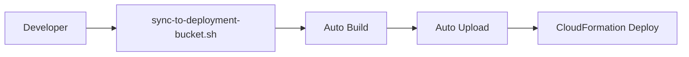
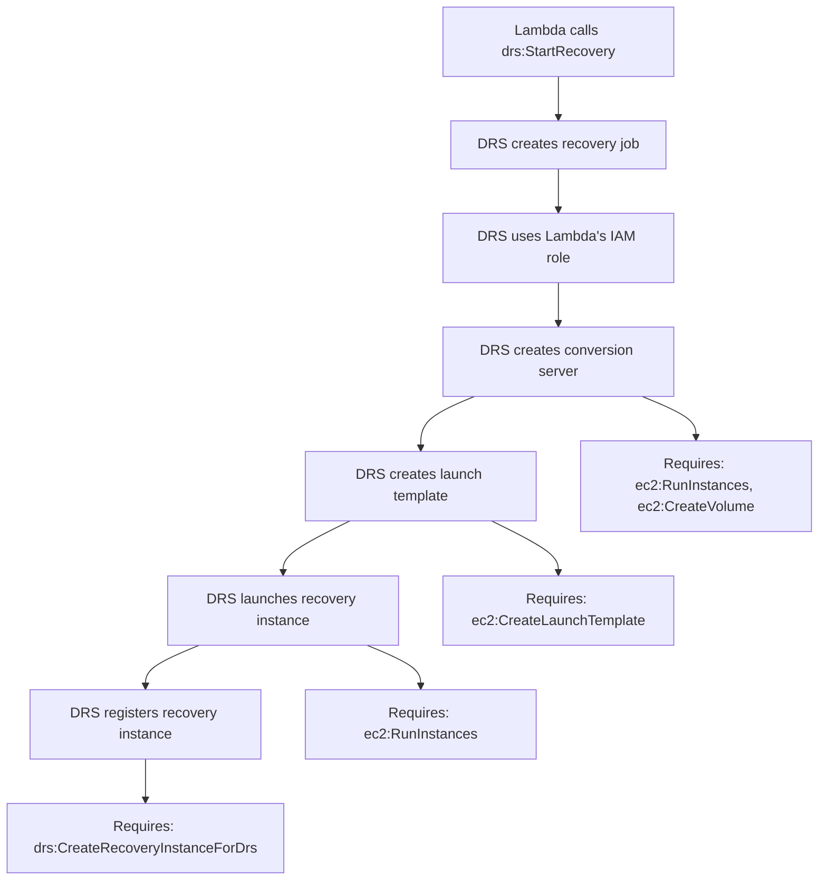

# Deployment Troubleshooting Guide

**Version**: 2.1  
**Date**: January 1, 2026  
**Status**: Production Ready - EventBridge Security Enhancements Complete

---

## Overview

This guide consolidates all deployment-related troubleshooting for AWS DRS Orchestration, covering CloudFormation deployment issues and IAM permission problems.

---

## CloudFormation Deployment Issues

### Current Deployment Architecture

**Deployment Script:** `./scripts/sync-to-deployment-bucket.sh`

```bash
# Automated deployment workflow
./scripts/sync-to-deployment-bucket.sh --build-frontend --deploy-cfn

# This automatically:
# 1. Builds frontend from current source
# 2. Packages Lambda functions with dependencies
# 3. Syncs all artifacts to S3
# 4. Deploys via CloudFormation
```

**CloudFormation Integration:**
```yaml
# All functions use single deployment package
ApiHandlerFunction:
  Code:
    S3Bucket: !Ref SourceBucket
    S3Key: 'lambda/deployment-package.zip'  # Contains all current code
```

### Current Solution Benefits

**Automated sync script provides:**
- ✅ Frontend build from current source (`npm run build`)
- ✅ Lambda packaging with current code
- ✅ Automatic artifact upload to S3
- ✅ CloudFormation deployment with latest artifacts
- ✅ Single command deployment

**Deploy from scratch workflow:**
```bash
# Complete deployment from current source
./scripts/sync-to-deployment-bucket.sh --build-frontend --deploy-cfn
```

### Current Deployment Flow



**Benefits:**
- ✅ Single command deployment
- ✅ Always deploys current source
- ✅ Automatic build and packaging
- ✅ No manual steps required
- ✅ Fast deployment (~5-10 minutes)
- ✅ Consistent artifact generation

### Deployment Options Available

**Fast Lambda Updates:**
```bash
# Update Lambda code only (~5 seconds)
./scripts/sync-to-deployment-bucket.sh --update-lambda-code
```

**Full Stack Deployment:**
```bash
# Deploy all infrastructure (~5-10 minutes)
./scripts/sync-to-deployment-bucket.sh --deploy-cfn
```

**Frontend Only:**
```bash
# Build and deploy frontend only
./scripts/sync-to-deployment-bucket.sh --build-frontend --deploy-frontend
```

### Common Deployment Issues

#### 1. Stale S3 Artifacts
**Problem:** CloudFormation uses old artifacts from S3

**Solution:** Always sync before deploying
```bash
# Ensure S3 has latest code
./scripts/sync-to-deployment-bucket.sh
# Then deploy
./scripts/sync-to-deployment-bucket.sh --deploy-cfn
```

#### 2. Frontend Configuration Mismatch
**Problem:** Frontend can't connect to API after deployment

**Solution:** Use automated frontend build
```bash
# Build with correct configuration
./scripts/sync-to-deployment-bucket.sh --build-frontend --deploy-frontend
```

#### 3. Lambda Function Not Updated
**Problem:** Code changes not reflected in deployed function

**Solution:** Use fast Lambda update
```bash
# Quick code update
./scripts/sync-to-deployment-bucket.sh --update-lambda-code
```

### Deployment Best Practices

#### 1. Always Sync Before Deploy

**Recommended workflow:**
```bash
# Step 1: Sync all code to S3
./scripts/sync-to-deployment-bucket.sh

# Step 2: Deploy infrastructure
./scripts/sync-to-deployment-bucket.sh --deploy-cfn

# Step 3: Verify deployment
aws cloudformation describe-stacks --stack-name aws-drs-orchestrator-dev
```

#### 2. Use Environment Files

**Frontend configuration:**
```bash
# Ensure .env.dev exists with correct API endpoints
cp .env.test.template .env.dev
# Edit .env.dev with your stack outputs
```

#### 3. Verify Deployment Success

**Check deployment status:**
```bash
# Verify stack status
aws cloudformation describe-stacks \
  --stack-name aws-drs-orchestrator-dev \
  --query 'Stacks[0].StackStatus'

# Check S3 artifacts are current
aws s3 ls s3://aws-drs-orchestration/lambda/ --region us-east-1

# Test API endpoint
API_ENDPOINT=$(aws cloudformation describe-stacks \
  --stack-name aws-drs-orchestrator-dev \
  --query 'Stacks[0].Outputs[?OutputKey==`ApiEndpoint`].OutputValue' \
  --output text)

curl "$API_ENDPOINT/protection-groups" -H "Authorization: Bearer $TOKEN"
```

#### 4. Troubleshooting Failed Deployments

**Common failure scenarios:**

| Error | Cause | Solution |
|-------|-------|----------|
| `No updates to be performed` | No changes detected | Verify S3 artifacts are updated |
| `Template validation error` | Invalid CloudFormation | Run `make validate` before deploy |
| `Insufficient permissions` | IAM role lacks permissions | Check deployment role permissions |
| `Resource already exists` | Stack name conflict | Use unique stack name or delete existing |

### Quick Deployment Commands

**Most common deployment scenarios:**

```bash
# Complete deployment from scratch
./scripts/sync-to-deployment-bucket.sh --build-frontend --deploy-cfn

# Update only Lambda code (fastest)
./scripts/sync-to-deployment-bucket.sh --update-lambda-code

# Update only frontend
./scripts/sync-to-deployment-bucket.sh --build-frontend --deploy-frontend

# Sync code without deploying
./scripts/sync-to-deployment-bucket.sh

# Preview changes (dry run)
./scripts/sync-to-deployment-bucket.sh --dry-run
```

### Advanced Deployment Options

**For enterprise environments:**

1. **GitLab CI/CD Integration** - Automated pipeline on git push
2. **Multiple Environment Support** - Dev, test, prod deployments
3. **Blue/Green Deployments** - Zero-downtime updates
4. **Rollback Capabilities** - Quick revert to previous version

**Environment-specific deployments:**
```bash
# Deploy to different environments
./scripts/sync-to-deployment-bucket.sh --profile dev-profile --deploy-cfn
./scripts/sync-to-deployment-bucket.sh --profile prod-profile --deploy-cfn
```

---

## IAM Role Analysis - DRS Permissions

### Current IAM Roles (CloudFormation Deployed)

#### 1. ApiHandlerRole ✅ DEPLOYED

**CloudFormation Resource**: `cfn/lambda-stack.yaml` → `ApiHandlerRole`
**Lambda Function**: `api-handler` (REST API endpoints)

**DRS Permissions** (as deployed):

```yaml
# Core DRS Operations
- drs:DescribeSourceServers
- drs:DescribeRecoveryInstances
- drs:DescribeJobs
- drs:DescribeJobLogItems
- drs:DescribeRecoverySnapshots
- drs:DescribeReplicationConfigurationTemplates
- drs:DescribeLaunchConfigurationTemplates

# Recovery Operations
- drs:StartRecovery
- drs:TerminateRecoveryInstances
- drs:DisconnectRecoveryInstance
- drs:ReverseReplication
- drs:StartFailback
- drs:StopFailback

# Replication Management
- drs:StartReplication
- drs:StopReplication
- drs:PauseReplication
- drs:ResumeReplication
- drs:RetryDataReplication

# Configuration Management
- drs:GetReplicationConfiguration
- drs:UpdateReplicationConfiguration
- drs:GetLaunchConfiguration
- drs:UpdateLaunchConfiguration
- drs:CreateReplicationConfigurationTemplate
- drs:UpdateReplicationConfigurationTemplate
- drs:DeleteReplicationConfigurationTemplate
- drs:CreateLaunchConfigurationTemplate
- drs:UpdateLaunchConfigurationTemplate
- drs:DeleteLaunchConfigurationTemplate

# Source Server Management
- drs:CreateSourceServer
- drs:DeleteSourceServer
- drs:MarkAsArchived
- drs:UntagResource
- drs:TagResource
- drs:ListTagsForResource

# Extended Recovery Operations
- drs:CreateExtendedSourceServer
- drs:DeleteJob
- drs:GetFailbackReplicationConfiguration
- drs:UpdateFailbackReplicationConfiguration

# Service Management
- drs:InitializeService
- drs:GetReplicationConfiguration
- drs:DescribeSourceNetworks
- drs:CreateSourceNetwork
- drs:DeleteSourceNetwork
- drs:UpdateSourceNetwork
```

**EC2 Permissions** (as deployed):

```yaml
# Instance Management
- ec2:DescribeInstances
- ec2:DescribeInstanceStatus
- ec2:TerminateInstances
- ec2:DetachVolume
- ec2:DeleteVolume

# DRS Instance Launching (conversion phase)
- ec2:RunInstances
- ec2:CreateVolume
- ec2:AttachVolume
- ec2:CreateTags
- ec2:CreateNetworkInterface
- ec2:AttachNetworkInterface
- ec2:DescribeVolumes
- ec2:DescribeSnapshots
- ec2:ModifyInstanceAttribute
- ec2:DescribeImages
- ec2:DescribeSecurityGroups
- ec2:DescribeSubnets
- ec2:DescribeVpcs

# Snapshot/AMI Operations (drill conversion)
- ec2:CreateSnapshot
- ec2:DeleteSnapshot
- ec2:CreateImage
- ec2:DeregisterImage
- ec2:CopyImage
- ec2:RegisterImage

# IAM PassRole
- iam:PassRole
```

#### 2. OrchestrationRole ✅ DEPLOYED

**CloudFormation Resource**: `cfn/lambda-stack.yaml` → `OrchestrationRole`
**Lambda Functions**: `orchestration` (legacy), `orchestration-stepfunctions` (active)

**DRS Permissions** (as deployed, includes all ApiHandlerRole permissions plus):

```yaml
# CRITICAL: Required for DRS to register recovery instances
- drs:CreateRecoveryInstanceForDrs
```

**EC2 Permissions** (comprehensive, as deployed):

```yaml
# Read Permissions (DRS needs all of these)
- ec2:DescribeInstances
- ec2:DescribeInstanceStatus
- ec2:DescribeInstanceTypeOfferings
- ec2:DescribeInstanceTypes
- ec2:DescribeInstanceAttribute
- ec2:DescribeAccountAttributes
- ec2:DescribeTags
- ec2:DescribeLaunchTemplates
- ec2:DescribeLaunchTemplateVersions
- ec2:DescribeAvailabilityZones
- ec2:DescribeNetworkInterfaces
- ec2:DescribeVolumeAttribute
- ec2:GetEbsDefaultKmsKeyId
- ec2:GetEbsEncryptionByDefault

# Instance Operations
- ec2:TerminateInstances
- ec2:StopInstances
- ec2:StartInstances
- ec2:CreateTags

# CRITICAL: Launch Template Operations (DRS needs when calling start_recovery)
- ec2:CreateLaunchTemplate
- ec2:CreateLaunchTemplateVersion
- ec2:ModifyLaunchTemplate
- ec2:DeleteLaunchTemplate
- ec2:DeleteLaunchTemplateVersions

# Volume Operations
- ec2:ModifyVolume
- ec2:DetachVolume  # CRITICAL for DRS cleanup
- ec2:DeleteVolume  # CRITICAL for DRS cleanup

# Network Operations
- ec2:CreateSecurityGroup
- ec2:DeleteNetworkInterface
- ec2:ModifyNetworkInterfaceAttribute

# DRS Instance Launching (conversion phase)
- ec2:RunInstances
- ec2:CreateVolume
- ec2:AttachVolume
- ec2:CreateNetworkInterface
- ec2:AttachNetworkInterface
- ec2:DescribeVolumes
- ec2:DescribeSnapshots
- ec2:ModifyInstanceAttribute
- ec2:DescribeImages
- ec2:DescribeSecurityGroups
- ec2:DescribeSubnets
- ec2:DescribeVpcs

# Snapshot/AMI Operations
- ec2:CreateSnapshot
- ec2:DeleteSnapshot
- ec2:CreateImage
- ec2:DeregisterImage
- ec2:CopyImage
- ec2:RegisterImage

# IAM PassRole
- iam:PassRole
```

**SSM Permissions** (for automation):

```yaml
- ssm:StartAutomationExecution
- ssm:DescribeAutomationExecutions
- ssm:GetAutomationExecution
- ssm:StopAutomationExecution
- ssm:SendCommand
- ssm:GetCommandInvocation
```

**Cross-Account Access**:

```yaml
- sts:AssumeRole
  Resource: 'arn:aws:iam::*:role/drs-orchestration-cross-account-role'
```

#### 3. ExecutionPollerRole ✅ DEPLOYED

**CloudFormation Resource**: `cfn/lambda-stack.yaml` → `ExecutionPollerRole`
**Lambda Function**: `execution-poller` (DRS job status monitoring)

**DRS Permissions** (read-only, as deployed):

```yaml
# Job Monitoring (Essential for Poller)
- drs:DescribeJobs
- drs:DescribeJobLogItems

# Recovery Instance Status
- drs:DescribeRecoveryInstances

# Source Server Status
- drs:DescribeSourceServers
```

**CloudWatch Permissions**:

```yaml
- cloudwatch:PutMetricData
```

#### 4. ExecutionFinderRole ✅ DEPLOYED

**CloudFormation Resource**: `cfn/lambda-stack.yaml` → `ExecutionFinderRole`
**Lambda Function**: `execution-finder` (queries for active executions)

**DynamoDB Permissions** (read-only, as deployed):

```yaml
- dynamodb:Query
  Resource:
    - execution-history table
    - StatusIndex GSI
```

**Lambda Permissions**:

```yaml
- lambda:InvokeFunction
  Resource: execution-poller function ARN
```

#### 5. CustomResourceRole ✅ DEPLOYED

**CloudFormation Resource**: `cfn/lambda-stack.yaml` → `CustomResourceRole`
**Lambda Function**: `frontend-builder` (CloudFormation custom resource)

**S3 Permissions** (as deployed):

```yaml
- s3:ListBucket
- s3:ListBucketVersions
- s3:GetObject
- s3:PutObject
- s3:DeleteObject
- s3:DeleteObjectVersion
  Resource: frontend bucket and objects
```

**CloudFront Permissions**:

```yaml
- cloudfront:CreateInvalidation
- cloudfront:GetInvalidation
  Resource: all distributions
```

### Lambda Functions and Their Roles (Deployed)

| Function | Role | CloudFormation Resource | Purpose |
|----------|------|------------------------|----------|
| `api-handler` | ApiHandlerRole | `ApiHandlerFunction` | REST API endpoints |
| `orchestration` | OrchestrationRole | `OrchestrationFunction` | Legacy orchestrator (deprecated) |
| `orchestration-stepfunctions` | OrchestrationRole | `OrchestrationStepFunctionsFunction` | Step Functions orchestration (active) |
| `frontend-builder` | CustomResourceRole | `FrontendBuilderFunction` | Frontend deployment |
| `execution-finder` | ExecutionFinderRole | `ExecutionFinderFunction` | Find active executions (EventBridge scheduled) |
| `execution-poller` | ExecutionPollerRole | `ExecutionPollerFunction` | Poll DRS job status |

### Critical Permission Notes

#### DRS Recovery Flow

When Lambda calls `drs:StartRecovery`, DRS uses the **caller's IAM permissions** for subsequent operations:



#### Volume Cleanup During Recovery

DRS uses Lambda credentials for volume operations during recovery cleanup:

- CloudTrail shows: `invokedBy=drs.amazonaws.com`, `inScopeOf=Lambda function`
- DRS staging volumes use tags: `drs.amazonaws.com-job`, `drs.amazonaws.com-source-server`
- Without `ec2:DetachVolume` and `ec2:DeleteVolume`, DRS recovery fails during cleanup phase

#### Launch Template Permissions

The `ec2:CreateLaunchTemplateVersion` permission is **CRITICAL**:

- DRS creates launch templates for recovery instances
- Without this permission, recovery fails with `UnauthorizedOperation`
- Error: `UnauthorizedOperation when calling CreateLaunchTemplateVersion operation`

### Deployment Status

| Feature | Status | CloudFormation Location |
|---------|--------|------------------------|
| Drill Cleanup | ✅ Deployed | `OrchestrationRole` → EC2 volume permissions |
| Failback Operations | ✅ Deployed | `OrchestrationRole` → DRS failback permissions |
| Config Management | ✅ Deployed | All roles → DRS configuration permissions |
| Launch Templates | ✅ Deployed | `OrchestrationRole` → EC2 launch template permissions |
| Volume Cleanup | ✅ Deployed | `OrchestrationRole` → `ec2:DetachVolume`, `ec2:DeleteVolume` |
| Cross-Account | ✅ Deployed | `OrchestrationRole` → STS assume role |
| EventBridge Scheduling | ✅ Deployed | `ExecutionFinderScheduleRule` (1 minute intervals) |

### Troubleshooting Common IAM Errors

#### Error: UnauthorizedOperation on CreateLaunchTemplateVersion

**Cause**: Lambda IAM role missing EC2 launch template permissions.

**Solution**: Verify OrchestrationRole has:

```yaml
- ec2:CreateLaunchTemplate
- ec2:CreateLaunchTemplateVersion
- ec2:ModifyLaunchTemplate
- ec2:DeleteLaunchTemplate
- ec2:DeleteLaunchTemplateVersions
```

#### Error: AccessDeniedException on CreateRecoveryInstanceForDrs

**Cause**: Lambda IAM role missing DRS permission to register recovery instances.

**Solution**: Verify OrchestrationRole has:

```yaml
- drs:CreateRecoveryInstanceForDrs
```

#### Error: LAUNCH_FAILED with Volume Cleanup Issues

**Cause**: Lambda IAM role missing EC2 volume permissions.

**Solution**: Verify OrchestrationRole has:

```yaml
- ec2:DetachVolume
- ec2:DeleteVolume
```

### Deployment Verification

#### Check Current Deployment

```bash
# Verify stack is deployed
aws cloudformation describe-stacks \
  --stack-name aws-drs-orchestrator-dev \
  --region us-east-1

# Check Lambda functions
aws lambda list-functions \
  --query 'Functions[?starts_with(FunctionName, `drs-orchestration`)].FunctionName' \
  --region us-east-1

# Verify IAM roles
aws iam list-roles \
  --query 'Roles[?starts_with(RoleName, `drs-orchestration`)].RoleName'
```

#### Sync and Deploy

```bash
# Sync to S3 and deploy
./scripts/sync-to-deployment-bucket.sh --deploy-cfn

# Fast Lambda code update
./scripts/sync-to-deployment-bucket.sh --update-lambda-code
```

---

## Summary

**Current state:** Automated deployment process ensures CloudFormation always deploys current source code with complete IAM permissions for DRS operations.

**Key benefits:**
- ✅ Single command deployment from source
- ✅ Automatic build and packaging
- ✅ Fast updates for development
- ✅ Reliable artifact management
- ✅ Complete DRS permissions deployed
- ✅ Multiple deployment options

**Best practice:** Always use `sync-to-deployment-bucket.sh` script for consistent, reliable deployments.

## References

- **CloudFormation Template**: `cfn/lambda-stack.yaml` (IAM roles and Lambda functions)
- **Deployment Script**: `scripts/sync-to-deployment-bucket.sh`
- **AWS DRS Documentation**: [AWS Elastic Disaster Recovery](https://docs.aws.amazon.com/drs/)