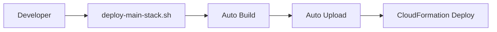
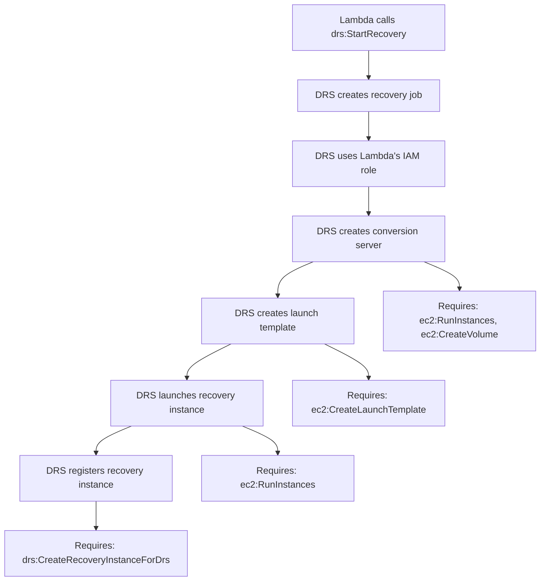

<!-- Copyright Amazon.com and Affiliates. All rights reserved.
     This deliverable is considered Developed Content as defined in the AWS Service Terms. -->

# Deployment Troubleshooting Guide

**Version**: 2.1  
**Date**: January 1, 2026  
**Status**: Production Ready - EventBridge Security Enhancements Complete

---

## Overview

This guide consolidates all deployment-related troubleshooting for AWS DRS Orchestration, covering CloudFormation deployment issues and IAM permission problems.

---

## CloudFormation Deployment Issues

### Current Deployment Architecture

**Deployment Script:** `./scripts/deploy-main-stack.sh`

```bash
# Full deployment pipeline
./scripts/deploy-main-stack.sh qa

# This runs a 5-stage pipeline:
# 1. Validation (cfn-lint, flake8, black, TypeScript type-check)
# 2. Security (cfn_nag, detect-secrets, npm audit, semgrep, pip-licenses, license-checker)
# 3. Tests (pytest tests/unit/, npm test)
# 4. Git push (git push origin HEAD)
# 5. Deploy (build Lambda zips, sync cfn/ + lambda/ to S3, deploy CloudFormation main stack)
```

**CloudFormation Integration:**
```yaml
# Functions reference packages synced to the deployment bucket
DataManagementHandlerFunction:
  Code:
    S3Bucket: !Ref SourceBucket
    S3Key: 'lambda/data-management-handler.zip'
```

### Current Solution Benefits

**The deploy script provides:**
- ✅ Frontend build via the frontend-deployer custom resource
- ✅ Lambda packaging with current code
- ✅ Automatic artifact upload to S3 (stage 5)
- ✅ CloudFormation deployment with latest artifacts
- ✅ Single command deployment

**Deploy from scratch workflow:**
```bash
# Complete deployment from current source
./scripts/deploy-main-stack.sh qa
```

### Current Deployment Flow


```mermaid
flowchart LR
    Dev[Developer] --> Script[deploy-main-stack.sh]
    Script --> Build[Auto Build]
    Build --> Upload[Auto Upload]
    Upload --> CFN[CloudFormation Deploy]
```

**Benefits:**
- ✅ Single command deployment
- ✅ Always deploys current source
- ✅ Automatic build and packaging
- ✅ No manual steps required
- ✅ Fast deployment (~5-10 minutes)
- ✅ Consistent artifact generation

### Deployment Options Available

**Fast Lambda Updates:**
```bash
# Update Lambda code only
./scripts/deploy-main-stack.sh qa --lambda-only
```

**Full Stack Deployment:**
```bash
# Deploy all infrastructure (~5-10 minutes)
./scripts/deploy-main-stack.sh qa
```

**Frontend Only:**
```bash
# Build and deploy frontend only
./scripts/deploy-main-stack.sh qa --frontend-only
```

### Common Deployment Issues

#### 1. Stale S3 Artifacts
**Problem:** CloudFormation uses old artifacts from S3

**Solution:** Run the deploy script, which syncs the latest code to S3 in stage 5 before deploying
```bash
./scripts/deploy-main-stack.sh qa
```

#### 2. Frontend Configuration Mismatch
**Problem:** Frontend can't connect to API after deployment

**Solution:** Rebuild and redeploy the frontend
```bash
./scripts/deploy-main-stack.sh qa --frontend-only
```

#### 3. Lambda Function Not Updated
**Problem:** Code changes not reflected in deployed function

**Solution:** Use a Lambda-only deploy
```bash
./scripts/deploy-main-stack.sh qa --lambda-only
```

### Deployment Best Practices

#### 1. Always Sync Before Deploy

**Recommended workflow:**
```bash
# Step 1: Deploy (validates, scans, tests, pushes, syncs to S3, deploys)
./scripts/deploy-main-stack.sh qa

# Step 2: Verify deployment
aws cloudformation describe-stacks --stack-name aws-drs-orchestration-qa
```

#### 2. Use Environment Files

**Frontend configuration:**
```bash
# Ensure .env.dev exists with correct API endpoints
cp .env.test.template .env.dev
# Edit .env.dev with your stack outputs
```

#### 3. Verify Deployment Success

**Check deployment status:**
```bash
# Verify stack status
aws cloudformation describe-stacks \
  --stack-name aws-drs-orchestration-qa \
  --query 'Stacks[0].StackStatus'

# Check S3 artifacts are current
aws s3 ls s3://aws-drs-orchestration/lambda/ --region us-east-1

# Test API endpoint
API_ENDPOINT=$(aws cloudformation describe-stacks \
  --stack-name aws-drs-orchestration-qa \
  --query 'Stacks[0].Outputs[?OutputKey==`ApiEndpoint`].OutputValue' \
  --output text)

curl "$API_ENDPOINT/protection-groups" -H "Authorization: Bearer $TOKEN"
```

#### 4. Troubleshooting Failed Deployments

**Common failure scenarios:**

| Error | Cause | Solution |
|-------|-------|----------|
| `No updates to be performed` | No changes detected | Verify S3 artifacts are updated |
| `Template validation error` | Invalid CloudFormation | Run `make validate` before deploy |
| `Insufficient permissions` | IAM role lacks permissions | Check deployment role permissions |
| `Resource already exists` | Stack name conflict | Use unique stack name or delete existing |

### Quick Deployment Commands

**Most common deployment scenarios:**

```bash
# Complete deployment from scratch
./scripts/deploy-main-stack.sh qa

# Update only Lambda code (fastest)
./scripts/deploy-main-stack.sh qa --lambda-only

# Update only frontend
./scripts/deploy-main-stack.sh qa --frontend-only

# Validation only, no deployment
./scripts/deploy-main-stack.sh qa --validate-only
```

### Advanced Deployment Options

**For enterprise environments:**

1. **GitLab CI/CD Integration** - Automated pipeline on git push
2. **Multiple Environment Support** - Dev, test, prod deployments
3. **Blue/Green Deployments** - Zero-downtime updates
4. **Rollback Capabilities** - Quick revert to previous version

**Environment-specific deployments:**
```bash
# The deploy script does not take a --profile flag; set AWS_PROFILE in the environment
AWS_PROFILE=qa-profile ./scripts/deploy-main-stack.sh qa
```

---

## IAM Role Analysis - DRS Permissions

### Current IAM Roles (CloudFormation Deployed)

All 5 deployed Lambda functions share a single **UnifiedOrchestrationRole** defined in the IAM nested stack (`cfn/iam/`). Function-specific least-privilege roles can optionally be enabled via the `--use-function-specific-roles` deploy flag.

#### UnifiedOrchestrationRole ✅ DEPLOYED

**CloudFormation Resource**: `cfn/iam/` → `UnifiedOrchestrationRole`
**Lambda Functions**: `data-management-handler`, `query-handler`, `execution-handler`, `dr-orchestration-stepfunction`, `frontend-deployer`

The role grants 16 policy-statement categories: DynamoDB, DRS (read + write), EC2, Step Functions, IAM PassRole, STS AssumeRole, KMS, CloudFormation, S3, CloudFront, Lambda invoke, EventBridge, SSM, SNS, CloudWatch, and License Manager.

The YAML snippets below are illustrative of the DRS, EC2, launch-template, and volume permissions UnifiedOrchestrationRole grants.

**DRS Permissions** (illustrative):

```yaml
# Core DRS Operations
- drs:DescribeSourceServers
- drs:DescribeRecoveryInstances
- drs:DescribeJobs
- drs:DescribeJobLogItems
- drs:DescribeRecoverySnapshots
- drs:DescribeReplicationConfigurationTemplates
- drs:DescribeLaunchConfigurationTemplates

# Recovery Operations
- drs:StartRecovery
- drs:TerminateRecoveryInstances
- drs:DisconnectRecoveryInstance
- drs:ReverseReplication
- drs:StartFailback
- drs:StopFailback

# Replication Management
- drs:StartReplication
- drs:StopReplication
- drs:PauseReplication
- drs:ResumeReplication
- drs:RetryDataReplication

# Configuration Management
- drs:GetReplicationConfiguration
- drs:UpdateReplicationConfiguration
- drs:GetLaunchConfiguration
- drs:UpdateLaunchConfiguration
- drs:CreateReplicationConfigurationTemplate
- drs:UpdateReplicationConfigurationTemplate
- drs:DeleteReplicationConfigurationTemplate
- drs:CreateLaunchConfigurationTemplate
- drs:UpdateLaunchConfigurationTemplate
- drs:DeleteLaunchConfigurationTemplate

# Source Server Management
- drs:CreateSourceServer
- drs:DeleteSourceServer
- drs:MarkAsArchived
- drs:UntagResource
- drs:TagResource
- drs:ListTagsForResource

# Extended Recovery Operations
- drs:CreateExtendedSourceServer
- drs:DeleteJob
- drs:GetFailbackReplicationConfiguration
- drs:UpdateFailbackReplicationConfiguration

# Service Management
- drs:InitializeService
- drs:GetReplicationConfiguration
- drs:DescribeSourceNetworks
- drs:CreateSourceNetwork
- drs:DeleteSourceNetwork
- drs:UpdateSourceNetwork
```

**EC2 Permissions** (illustrative):

```yaml
# Instance Management
- ec2:DescribeInstances
- ec2:DescribeInstanceStatus
- ec2:TerminateInstances
- ec2:DetachVolume
- ec2:DeleteVolume

# DRS Instance Launching (conversion phase)
- ec2:RunInstances
- ec2:CreateVolume
- ec2:AttachVolume
- ec2:CreateTags
- ec2:CreateNetworkInterface
- ec2:AttachNetworkInterface
- ec2:DescribeVolumes
- ec2:DescribeSnapshots
- ec2:ModifyInstanceAttribute
- ec2:DescribeImages
- ec2:DescribeSecurityGroups
- ec2:DescribeSubnets
- ec2:DescribeVpcs

# Snapshot/AMI Operations (drill conversion)
- ec2:CreateSnapshot
- ec2:DeleteSnapshot
- ec2:CreateImage
- ec2:DeregisterImage
- ec2:CopyImage
- ec2:RegisterImage

# IAM PassRole
- iam:PassRole
```

**EC2 Launch Template Permissions** (illustrative, CRITICAL when DRS calls start_recovery):

```yaml
- ec2:CreateLaunchTemplate
- ec2:CreateLaunchTemplateVersion
- ec2:ModifyLaunchTemplate
- ec2:DeleteLaunchTemplate
- ec2:DeleteLaunchTemplateVersions
```

**EC2 Volume Permissions** (illustrative, CRITICAL for DRS cleanup):

```yaml
- ec2:ModifyVolume
- ec2:DetachVolume
- ec2:DeleteVolume
```

**DRS Recovery Instance Registration** (illustrative, CRITICAL):

```yaml
# Required for DRS to register recovery instances
- drs:CreateRecoveryInstanceForDrs
```

**SSM, S3, and CloudFront Permissions** (illustrative):

```yaml
- ssm:StartAutomationExecution
- ssm:SendCommand
- ssm:GetCommandInvocation
- s3:GetObject
- s3:PutObject
- s3:DeleteObject
- cloudfront:CreateInvalidation
- cloudfront:GetInvalidation
```

**Cross-Account Access** (illustrative):

```yaml
- sts:AssumeRole
  Resource: 'arn:aws:iam::*:role/drs-orchestration-cross-account-role'
```

### Lambda Functions and Their Roles (Deployed)

| Function | Role | Purpose |
|----------|------|---------|
| `data-management-handler` | UnifiedOrchestrationRole | Create/update/delete data resources (protection groups, recovery plans, target accounts) |
| `query-handler` | UnifiedOrchestrationRole | Read/query API endpoints |
| `execution-handler` | UnifiedOrchestrationRole | Execution lifecycle: find, poll, and finalize operations |
| `dr-orchestration-stepfunction` | UnifiedOrchestrationRole | Step Functions orchestration |
| `frontend-deployer` | UnifiedOrchestrationRole | Frontend deployment (CloudFormation custom resource) |

Function-specific least-privilege roles are available via the `--use-function-specific-roles` deploy flag.

### Critical Permission Notes

#### DRS Recovery Flow

When Lambda calls `drs:StartRecovery`, DRS uses the **caller's IAM permissions** for subsequent operations:


```mermaid
flowchart TD
    A[Lambda calls drs:StartRecovery] --> B[DRS creates recovery job]
    B --> C[DRS uses Lambda's IAM role]
    C --> D[DRS creates conversion server]
    D --> E[DRS creates launch template]
    E --> F[DRS launches recovery instance]
    F --> G[DRS registers recovery instance]
    
    D --> D1[Requires: ec2:RunInstances, ec2:CreateVolume]
    E --> E1[Requires: ec2:CreateLaunchTemplate]
    F --> F1[Requires: ec2:RunInstances]
    G --> G1[Requires: drs:CreateRecoveryInstanceForDrs]
```

#### Volume Cleanup During Recovery

DRS uses Lambda credentials for volume operations during recovery cleanup:

- CloudTrail shows: `invokedBy=drs.amazonaws.com`, `inScopeOf=Lambda function`
- DRS staging volumes use tags: `drs.amazonaws.com-job`, `drs.amazonaws.com-source-server`
- Without `ec2:DetachVolume` and `ec2:DeleteVolume`, DRS recovery fails during cleanup phase

#### Launch Template Permissions

The `ec2:CreateLaunchTemplateVersion` permission is **CRITICAL**:

- DRS creates launch templates for recovery instances
- Without this permission, recovery fails with `UnauthorizedOperation`
- Error: `UnauthorizedOperation when calling CreateLaunchTemplateVersion operation`

### Deployment Status

| Feature | Status | CloudFormation Location |
|---------|--------|------------------------|
| Drill Cleanup | ✅ Deployed | `UnifiedOrchestrationRole` → EC2 volume permissions |
| Failback Operations | ✅ Deployed | `UnifiedOrchestrationRole` → DRS failback permissions |
| Config Management | ✅ Deployed | `UnifiedOrchestrationRole` → DRS configuration permissions |
| Launch Templates | ✅ Deployed | `UnifiedOrchestrationRole` → EC2 launch template permissions |
| Volume Cleanup | ✅ Deployed | `UnifiedOrchestrationRole` → `ec2:DetachVolume`, `ec2:DeleteVolume` |
| Cross-Account | ✅ Deployed | `UnifiedOrchestrationRole` → STS assume role |
| EventBridge Scheduling | ✅ Deployed | `UnifiedOrchestrationRole` → EventBridge scheduled rule |

### Troubleshooting Common IAM Errors

#### Error: UnauthorizedOperation on CreateLaunchTemplateVersion

**Cause**: Lambda IAM role missing EC2 launch template permissions.

**Solution**: Verify UnifiedOrchestrationRole has:

```yaml
- ec2:CreateLaunchTemplate
- ec2:CreateLaunchTemplateVersion
- ec2:ModifyLaunchTemplate
- ec2:DeleteLaunchTemplate
- ec2:DeleteLaunchTemplateVersions
```

#### Error: AccessDeniedException on CreateRecoveryInstanceForDrs

**Cause**: Lambda IAM role missing DRS permission to register recovery instances.

**Solution**: Verify UnifiedOrchestrationRole has:

```yaml
- drs:CreateRecoveryInstanceForDrs
```

#### Error: LAUNCH_FAILED with Volume Cleanup Issues

**Cause**: Lambda IAM role missing EC2 volume permissions.

**Solution**: Verify UnifiedOrchestrationRole has:

```yaml
- ec2:DetachVolume
- ec2:DeleteVolume
```

### Deployment Verification

#### Check Current Deployment

```bash
# Verify stack is deployed
aws cloudformation describe-stacks \
  --stack-name aws-drs-orchestration-qa \
  --region us-east-1

# Check Lambda functions
aws lambda list-functions \
  --query 'Functions[?starts_with(FunctionName, `drs-orchestration`)].FunctionName' \
  --region us-east-1

# Verify IAM roles
aws iam list-roles \
  --query 'Roles[?starts_with(RoleName, `drs-orchestration`)].RoleName'
```

#### Deploy

```bash
# Full deploy (validates, scans, tests, pushes, syncs to S3, deploys)
./scripts/deploy-main-stack.sh qa

# Fast Lambda code update
./scripts/deploy-main-stack.sh qa --lambda-only
```

---

## Summary

**Current state:** Automated deployment process ensures CloudFormation always deploys current source code with complete IAM permissions for DRS operations.

**Key benefits:**
- ✅ Single command deployment from source
- ✅ Automatic build and packaging
- ✅ Fast updates for development
- ✅ Reliable artifact management
- ✅ Complete DRS permissions deployed
- ✅ Multiple deployment options

**Best practice:** Always use the `deploy-main-stack.sh` script for consistent, reliable deployments.

## References

- **CloudFormation Templates**: `cfn/main-stack.yaml` with service-based nested stacks (`cfn/iam/`, `cfn/lambda/`)
- **Deployment Script**: `scripts/deploy-main-stack.sh`
- **AWS DRS Documentation**: [AWS Elastic Disaster Recovery](https://docs.aws.amazon.com/drs/)