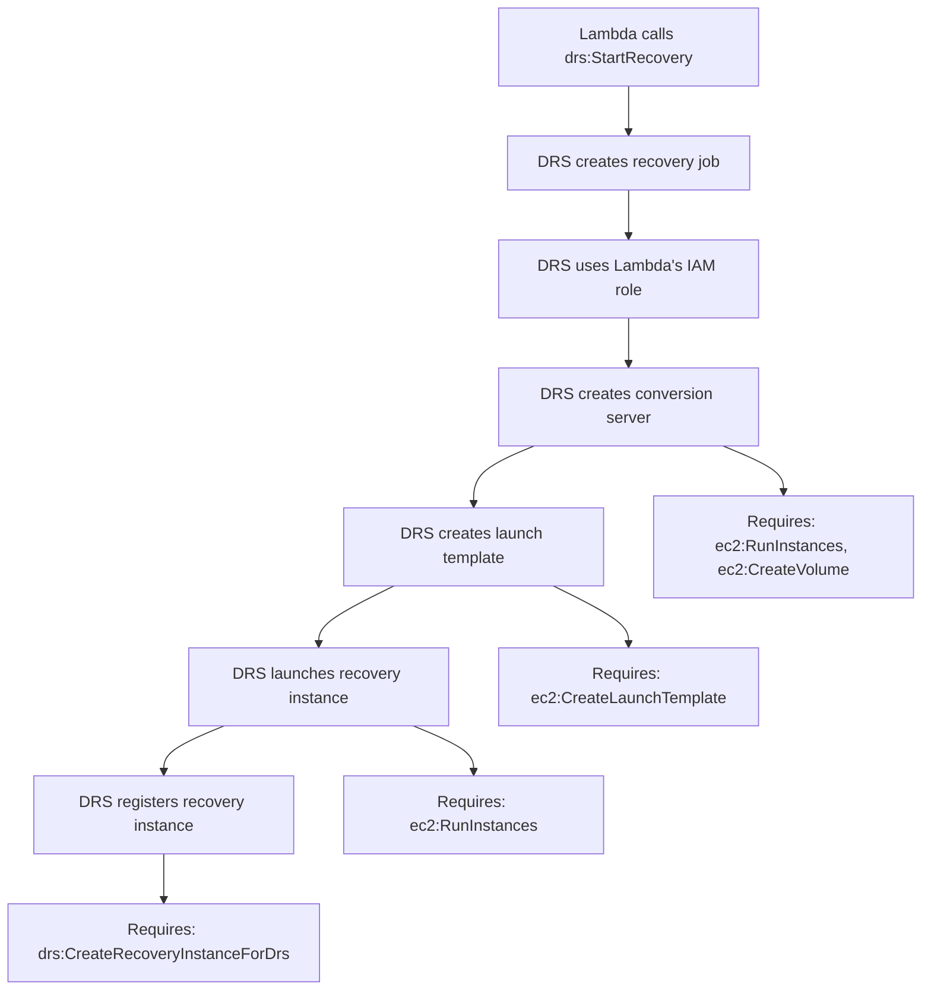

# IAM Role Analysis - DRS Permissions for Lambda Functions

**Analysis Date**: January 2025
**Purpose**: Document Lambda IAM roles and their permissions for DRS drill and recovery operations
**Status**: ✅ DEPLOYED - All critical permissions implemented in CloudFormation

---

## Executive Summary

The Lambda functions have **COMPLETE** permissions for full DRS drill and recovery operations:

- ✅ Starting recovery operations
- ✅ Terminating drill instances
- ✅ EC2 instance termination and management
- ✅ Failback operations
- ✅ Configuration management
- ✅ Replication management
- ✅ Source server management

---

## Current IAM Roles (CloudFormation Deployed)

### 1. ApiHandlerRole ✅ DEPLOYED

**CloudFormation Resource**: `cfn/lambda-stack.yaml` → `ApiHandlerRole`
**Lambda Function**: `api-handler` (REST API endpoints)

**DRS Permissions** (as deployed):

```yaml
# Core DRS Operations
- drs:DescribeSourceServers
- drs:DescribeRecoveryInstances
- drs:DescribeJobs
- drs:DescribeJobLogItems
- drs:DescribeRecoverySnapshots
- drs:DescribeReplicationConfigurationTemplates
- drs:DescribeLaunchConfigurationTemplates

# Recovery Operations
- drs:StartRecovery
- drs:TerminateRecoveryInstances
- drs:DisconnectRecoveryInstance
- drs:ReverseReplication
- drs:StartFailback
- drs:StopFailback

# Replication Management
- drs:StartReplication
- drs:StopReplication
- drs:PauseReplication
- drs:ResumeReplication
- drs:RetryDataReplication

# Configuration Management
- drs:GetReplicationConfiguration
- drs:UpdateReplicationConfiguration
- drs:GetLaunchConfiguration
- drs:UpdateLaunchConfiguration
- drs:CreateReplicationConfigurationTemplate
- drs:UpdateReplicationConfigurationTemplate
- drs:DeleteReplicationConfigurationTemplate
- drs:CreateLaunchConfigurationTemplate
- drs:UpdateLaunchConfigurationTemplate
- drs:DeleteLaunchConfigurationTemplate

# Source Server Management
- drs:CreateSourceServer
- drs:DeleteSourceServer
- drs:MarkAsArchived
- drs:UntagResource
- drs:TagResource
- drs:ListTagsForResource

# Extended Recovery Operations
- drs:CreateExtendedSourceServer
- drs:DeleteJob
- drs:GetFailbackReplicationConfiguration
- drs:UpdateFailbackReplicationConfiguration

# Service Management
- drs:InitializeService
- drs:GetReplicationConfiguration
- drs:DescribeSourceNetworks
- drs:CreateSourceNetwork
- drs:DeleteSourceNetwork
- drs:UpdateSourceNetwork
```

**EC2 Permissions** (as deployed):

```yaml
# Instance Management
- ec2:DescribeInstances
- ec2:DescribeInstanceStatus
- ec2:TerminateInstances
- ec2:DetachVolume
- ec2:DeleteVolume

# DRS Instance Launching (conversion phase)
- ec2:RunInstances
- ec2:CreateVolume
- ec2:AttachVolume
- ec2:CreateTags
- ec2:CreateNetworkInterface
- ec2:AttachNetworkInterface
- ec2:DescribeVolumes
- ec2:DescribeSnapshots
- ec2:ModifyInstanceAttribute
- ec2:DescribeImages
- ec2:DescribeSecurityGroups
- ec2:DescribeSubnets
- ec2:DescribeVpcs

# Snapshot/AMI Operations (drill conversion)
- ec2:CreateSnapshot
- ec2:DeleteSnapshot
- ec2:CreateImage
- ec2:DeregisterImage
- ec2:CopyImage
- ec2:RegisterImage

# IAM PassRole
- iam:PassRole
```

### 2. OrchestrationRole ✅ DEPLOYED

**CloudFormation Resource**: `cfn/lambda-stack.yaml` → `OrchestrationRole`
**Lambda Functions**: `orchestration` (legacy), `orchestration-stepfunctions` (active)

**DRS Permissions** (as deployed, includes all ApiHandlerRole permissions plus):

```yaml
# CRITICAL: Required for DRS to register recovery instances
- drs:CreateRecoveryInstanceForDrs
```

**EC2 Permissions** (comprehensive, as deployed):

```yaml
# Read Permissions (DRS needs all of these)
- ec2:DescribeInstances
- ec2:DescribeInstanceStatus
- ec2:DescribeInstanceTypeOfferings
- ec2:DescribeInstanceTypes
- ec2:DescribeInstanceAttribute
- ec2:DescribeAccountAttributes
- ec2:DescribeTags
- ec2:DescribeLaunchTemplates
- ec2:DescribeLaunchTemplateVersions
- ec2:DescribeAvailabilityZones
- ec2:DescribeNetworkInterfaces
- ec2:DescribeVolumeAttribute
- ec2:GetEbsDefaultKmsKeyId
- ec2:GetEbsEncryptionByDefault

# Instance Operations
- ec2:TerminateInstances
- ec2:StopInstances
- ec2:StartInstances
- ec2:CreateTags

# CRITICAL: Launch Template Operations (DRS needs when calling start_recovery)
- ec2:CreateLaunchTemplate
- ec2:CreateLaunchTemplateVersion
- ec2:ModifyLaunchTemplate
- ec2:DeleteLaunchTemplate
- ec2:DeleteLaunchTemplateVersions

# Volume Operations
- ec2:ModifyVolume
- ec2:DetachVolume  # CRITICAL for DRS cleanup
- ec2:DeleteVolume  # CRITICAL for DRS cleanup

# Network Operations
- ec2:CreateSecurityGroup
- ec2:DeleteNetworkInterface
- ec2:ModifyNetworkInterfaceAttribute

# DRS Instance Launching (conversion phase)
- ec2:RunInstances
- ec2:CreateVolume
- ec2:AttachVolume
- ec2:CreateNetworkInterface
- ec2:AttachNetworkInterface
- ec2:DescribeVolumes
- ec2:DescribeSnapshots
- ec2:ModifyInstanceAttribute
- ec2:DescribeImages
- ec2:DescribeSecurityGroups
- ec2:DescribeSubnets
- ec2:DescribeVpcs

# Snapshot/AMI Operations
- ec2:CreateSnapshot
- ec2:DeleteSnapshot
- ec2:CreateImage
- ec2:DeregisterImage
- ec2:CopyImage
- ec2:RegisterImage

# IAM PassRole
- iam:PassRole
```

**SSM Permissions** (for automation):

```yaml
- ssm:StartAutomationExecution
- ssm:DescribeAutomationExecutions
- ssm:GetAutomationExecution
- ssm:StopAutomationExecution
- ssm:SendCommand
- ssm:GetCommandInvocation
```

**Cross-Account Access**:

```yaml
- sts:AssumeRole
  Resource: 'arn:aws:iam::*:role/drs-orchestration-cross-account-role'
```

### 3. ExecutionPollerRole ✅ DEPLOYED

**CloudFormation Resource**: `cfn/lambda-stack.yaml` → `ExecutionPollerRole`
**Lambda Function**: `execution-poller` (DRS job status monitoring)

**DRS Permissions** (read-only, as deployed):

```yaml
# Job Monitoring (Essential for Poller)
- drs:DescribeJobs
- drs:DescribeJobLogItems

# Recovery Instance Status
- drs:DescribeRecoveryInstances

# Source Server Status
- drs:DescribeSourceServers
```

**CloudWatch Permissions**:

```yaml
- cloudwatch:PutMetricData
```

### 4. ExecutionFinderRole ✅ DEPLOYED

**CloudFormation Resource**: `cfn/lambda-stack.yaml` → `ExecutionFinderRole`
**Lambda Function**: `execution-finder` (queries for active executions)

**DynamoDB Permissions** (read-only, as deployed):

```yaml
- dynamodb:Query
  Resource:
    - execution-history table
    - StatusIndex GSI
```

**Lambda Permissions**:

```yaml
- lambda:InvokeFunction
  Resource: execution-poller function ARN
```

### 5. CustomResourceRole ✅ DEPLOYED

**CloudFormation Resource**: `cfn/lambda-stack.yaml` → `CustomResourceRole`
**Lambda Function**: `frontend-builder` (CloudFormation custom resource)

**S3 Permissions** (as deployed):

```yaml
- s3:ListBucket
- s3:ListBucketVersions
- s3:GetObject
- s3:PutObject
- s3:DeleteObject
- s3:DeleteObjectVersion
  Resource: frontend bucket and objects
```

**CloudFront Permissions**:

```yaml
- cloudfront:CreateInvalidation
- cloudfront:GetInvalidation
  Resource: all distributions
```

---

## Lambda Functions and Their Roles (Deployed)

| Function | Role | CloudFormation Resource | Purpose |
|----------|------|------------------------|----------|
| `api-handler` | ApiHandlerRole | `ApiHandlerFunction` | REST API endpoints |
| `orchestration` | OrchestrationRole | `OrchestrationFunction` | Legacy orchestrator (deprecated) |
| `orchestration-stepfunctions` | OrchestrationRole | `OrchestrationStepFunctionsFunction` | Step Functions orchestration (active) |
| `frontend-builder` | CustomResourceRole | `FrontendBuilderFunction` | Frontend deployment |
| `execution-finder` | ExecutionFinderRole | `ExecutionFinderFunction` | Find active executions (EventBridge scheduled) |
| `execution-poller` | ExecutionPollerRole | `ExecutionPollerFunction` | Poll DRS job status |

---

## Critical Permission Notes

### DRS Recovery Flow

When Lambda calls `drs:StartRecovery`, DRS uses the **caller's IAM permissions** for subsequent operations:



### Volume Cleanup During Recovery

DRS uses Lambda credentials for volume operations during recovery cleanup:

- CloudTrail shows: `invokedBy=drs.amazonaws.com`, `inScopeOf=Lambda function`
- DRS staging volumes use tags: `drs.amazonaws.com-job`, `drs.amazonaws.com-source-server`
- Without `ec2:DetachVolume` and `ec2:DeleteVolume`, DRS recovery fails during cleanup phase

### Launch Template Permissions

The `ec2:CreateLaunchTemplateVersion` permission is **CRITICAL**:

- DRS creates launch templates for recovery instances
- Without this permission, recovery fails with `UnauthorizedOperation`
- Error: `UnauthorizedOperation when calling CreateLaunchTemplateVersion operation`

---

## Deployment Status

| Feature | Status | CloudFormation Location |
|---------|--------|------------------------|
| Drill Cleanup | ✅ Deployed | `OrchestrationRole` → EC2 volume permissions |
| Failback Operations | ✅ Deployed | `OrchestrationRole` → DRS failback permissions |
| Config Management | ✅ Deployed | All roles → DRS configuration permissions |
| Launch Templates | ✅ Deployed | `OrchestrationRole` → EC2 launch template permissions |
| Volume Cleanup | ✅ Deployed | `OrchestrationRole` → `ec2:DetachVolume`, `ec2:DeleteVolume` |
| Cross-Account | ✅ Deployed | `OrchestrationRole` → STS assume role |
| EventBridge Scheduling | ✅ Deployed | `ExecutionFinderScheduleRule` (1 minute intervals) |

---

## Troubleshooting Common Errors

### Error: UnauthorizedOperation on CreateLaunchTemplateVersion

**Cause**: Lambda IAM role missing EC2 launch template permissions.

**Solution**: Verify OrchestrationRole has:

```yaml
- ec2:CreateLaunchTemplate
- ec2:CreateLaunchTemplateVersion
- ec2:ModifyLaunchTemplate
- ec2:DeleteLaunchTemplate
- ec2:DeleteLaunchTemplateVersions
```

### Error: AccessDeniedException on CreateRecoveryInstanceForDrs

**Cause**: Lambda IAM role missing DRS permission to register recovery instances.

**Solution**: Verify OrchestrationRole has:

```yaml
- drs:CreateRecoveryInstanceForDrs
```

### Error: LAUNCH_FAILED with Volume Cleanup Issues

**Cause**: Lambda IAM role missing EC2 volume permissions.

**Solution**: Verify OrchestrationRole has:

```yaml
- ec2:DetachVolume
- ec2:DeleteVolume
```

---

## Deployment Verification

### Check Current Deployment

```bash
# Verify stack is deployed
aws cloudformation describe-stacks \
  --stack-name aws-drs-orchestrator-dev \
  --region us-east-1

# Check Lambda functions
aws lambda list-functions \
  --query 'Functions[?starts_with(FunctionName, `drs-orchestration`)].FunctionName' \
  --region us-east-1

# Verify IAM roles
aws iam list-roles \
  --query 'Roles[?starts_with(RoleName, `drs-orchestration`)].RoleName'
```

### Sync and Deploy

```bash
# Sync to S3 and deploy
./scripts/sync-to-deployment-bucket.sh --deploy-cfn

# Fast Lambda code update
./scripts/sync-to-deployment-bucket.sh --update-lambda-code
```

## References

- **CloudFormation Template**: `cfn/lambda-stack.yaml` (IAM roles and Lambda functions)
- **Deployment Script**: `scripts/sync-to-deployment-bucket.sh`
- **CI/CD Rules**: `.amazonq/rules/cicd-iac-workflow.md`
- **AWS DRS Documentation**: [AWS Elastic Disaster Recovery](https://docs.aws.amazon.com/drs/)
